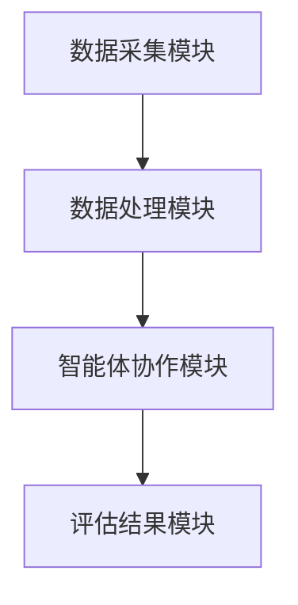
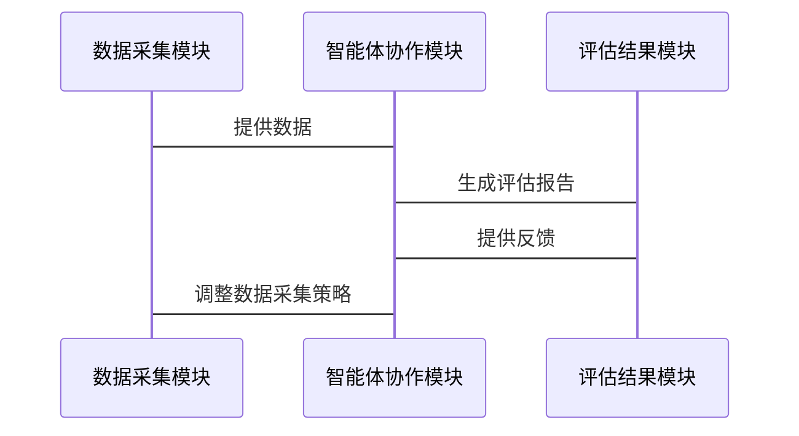

                 


# 智能体协作评估公司的数字化成熟度：把握转型机遇

> 关键词：智能体协作，数字化成熟度，企业转型，多智能体系统，数字化评估

> 摘要：本文探讨了如何利用智能体协作技术评估企业的数字化成熟度，帮助企业识别转型中的关键问题，并抓住数字化转型的机遇。文章从数字化转型的背景、智能体协作的核心原理，到数字化成熟度评估的算法与模型构建，进行了全面分析，并通过实际案例展示了如何通过智能体协作优化企业的数字化进程。

---

## 第一章: 数字化转型的背景与挑战

### 1.1 数字化转型的背景

#### 1.1.1 企业数字化转型的定义与内涵
数字化转型是指企业利用数字技术（如人工智能、大数据、云计算等）对业务流程、组织结构、运营模式等进行根本性变革，以实现业务创新和价值提升。其内涵包括技术驱动、数据驱动和用户驱动三个方面。

#### 1.1.2 数字化转型的驱动因素
- **技术进步**：人工智能、区块链、物联网等技术的快速发展为企业数字化转型提供了技术支撑。
- **市场竞争压力**：数字化转型已成为企业竞争力的重要来源，不转型可能被淘汰。
- **客户需求变化**：客户对个性化、实时化服务的需求增加，推动企业进行数字化变革。

#### 1.1.3 数字化转型的核心目标与价值
- **核心目标**：提升企业效率、优化客户体验、创造新业务模式。
- **价值**：通过数字化转型，企业可以降低成本、提高效率、增强竞争力。

### 1.2 智能体协作的概念与特点

#### 1.2.1 智能体的基本定义
智能体（Agent）是指能够感知环境、自主决策、执行任务的实体，可以是软件程序或物理设备。

#### 1.2.2 多智能体协作的定义与优势
- **定义**：多智能体协作是指多个智能体通过通信与协调，共同完成复杂任务的过程。
- **优势**：
  - 分布式计算能力：多个智能体可以并行处理任务。
  - 知识共享：智能体之间可以共享信息，提高整体决策能力。
  - 灵活性：智能体可以根据环境变化动态调整协作策略。

#### 1.2.3 智能体协作在数字化转型中的作用
智能体协作可以优化企业的业务流程、提高决策效率、增强系统的自适应能力。

### 1.3 数字化成熟度评估的意义

#### 1.3.1 评估数字化成熟度的目的
- 识别企业在数字化转型中的优势与不足。
- 为制定转型策略提供依据。

#### 1.3.2 数字化成熟度评估的指标体系
- **技术成熟度**：包括IT基础设施、数据管理能力等。
- **业务成熟度**：包括业务流程数字化程度、业务模式创新性等。
- **数据成熟度**：包括数据质量、数据分析能力等。

#### 1.3.3 数字化成熟度评估的价值与应用场景
- 价值：帮助企业明确转型方向，优化资源配置。
- 应用场景：企业自评、行业对标、政策支持等。

---

## 第二章: 智能体协作的核心原理

### 2.1 智能体协作的基本原理

#### 2.1.1 智能体的组成与功能
- **感知环境**：通过传感器或数据接口获取外部信息。
- **决策制定**：基于感知信息，智能体使用算法进行决策。
- **执行任务**：根据决策结果执行操作，如发送数据、触发事件等。

#### 2.1.2 多智能体协作的机制与流程
- **通信机制**：智能体之间通过消息传递进行通信。
- **协调机制**：通过协商或仲裁机制解决冲突，确保协作顺利进行。

#### 2.1.3 智能体协作的通信与协调方式
- **同步通信**：智能体之间实时交换信息。
- **异步通信**：智能体在需要时才进行信息交换。

### 2.2 数字化成熟度评估的核心要素

#### 2.2.1 企业数字化成熟度的评估维度
- **技术维度**：包括IT基础设施、系统集成能力等。
- **业务维度**：包括业务流程数字化、业务模式创新等。
- **数据维度**：包括数据质量管理、数据分析能力等。

#### 2.2.2 数字化成熟度评估的关键指标
- 技术成熟度：系统集成度、自动化水平。
- 业务成熟度：业务流程标准化、客户满意度。
- 数据成熟度：数据完整性、分析能力。

#### 2.2.3 数字化成熟度评估的模型与框架
- **模型**：层次分析法（AHP）构建评估模型。
- **框架**：包括数据收集、评估指标设计、评估结果分析等步骤。

### 2.3 智能体协作与数字化成熟度的关系

#### 2.3.1 智能体协作在数字化成熟度评估中的作用
- **数据收集与分析**：智能体可以实时收集企业数据，进行初步分析。
- **协作优化**：通过智能体协作，优化评估流程，提高评估结果的准确性。

#### 2.3.2 数字化成熟度评估对智能体协作的反馈与优化
- **反馈机制**：评估结果可以反馈给智能体，优化协作策略。
- **优化协作**：根据评估结果，调整智能体的通信方式、决策算法等。

#### 2.3.3 智能体协作与数字化成熟度评估的协同发展
- **协同发展**：智能体协作推动数字化成熟度评估，评估结果反过来优化智能体协作，形成良性循环。

---

## 第三章: 数字化成熟度评估的算法与模型

### 3.1 数据预处理与特征提取

#### 3.1.1 数据清洗与标准化
- **数据清洗**：去除重复数据、处理缺失值、消除噪声。
- **标准化**：将数据归一化，便于模型处理。

#### 3.1.2 特征选择与降维
- **特征选择**：通过相关性分析选择重要特征。
- **降维**：使用主成分分析（PCA）等方法降低数据维度。

#### 3.1.3 数据标注与分类
- **数据标注**：根据企业数字化成熟度的标准，对数据进行分类。
- **分类**：使用机器学习算法（如决策树、随机森林）进行分类。

### 3.2 智能体协作算法的设计与实现

#### 3.2.1 基于多智能体协作的评估模型
- **模型设计**：构建一个多智能体协作系统，每个智能体负责不同的评估任务。
- **协作机制**：智能体之间通过消息传递进行协作，共同完成评估任务。

#### 3.2.2 智能体协作算法的实现流程
1. 初始化：设置智能体的数量、目标。
2. 感知环境：智能体获取评估数据。
3. 决策制定：智能体根据数据进行决策。
4. 协作执行：智能体协作完成评估任务。
5. 反馈优化：根据评估结果优化协作策略。

#### 3.2.3 算法的优化与调优
- **优化目标**：提高评估结果的准确性和效率。
- **调优方法**：调整智能体的通信频率、决策算法参数等。

### 3.3 数字化成熟度评估的数学模型

#### 3.3.1 层次分析法（AHP）模型
- **模型描述**：AHP是一种定性与定量相结合的决策分析方法。
- **数学表达**：
  $$ A = \frac{\lambda \cdot w^T}{\sqrt{w^T w}} $$
  其中，$A$ 是一致性检验指标，$\lambda$ 是最大特征值，$w$ 是权重向量。

#### 3.3.2 智能体协作算法的数学表达
- **通信协议**：定义智能体之间的通信规则。
- **协作策略**：定义智能体如何协作完成任务。

---

## 第四章: 系统分析与架构设计

### 4.1 项目介绍
本项目旨在构建一个基于智能体协作的企业数字化成熟度评估系统。

### 4.2 系统功能设计

#### 4.2.1 系统功能模块
- **数据采集模块**：负责收集企业数字化相关数据。
- **智能体协作模块**：实现智能体之间的协作，完成评估任务。
- **评估结果模块**：展示评估结果，提供改进建议。

#### 4.2.2 系统功能流程
1. 数据采集：智能体获取企业数据。
2. 数据处理：对数据进行清洗、特征提取。
3. 评估分析：智能体协作完成评估分析。
4. 结果展示：生成评估报告，提供改进建议。

### 4.3 系统架构设计

#### 4.3.1 系统架构图


#### 4.3.2 接口设计
- **数据接口**：与企业系统对接，获取数据。
- **协作接口**：智能体之间通过API进行通信。

#### 4.3.3 交互流程


### 4.4 系统实现

#### 4.4.1 环境安装
- **工具安装**：安装Python、机器学习库（如scikit-learn、TensorFlow）。
- **环境配置**：配置虚拟环境，安装依赖包。

#### 4.4.2 核心代码实现
```python
# 智能体协作算法实现
class Agent:
    def __init__(self, id):
        self.id = id
        self.data = None
        self.result = None

    def receive_data(self, data):
        self.data = data

    def process_data(self):
        # 数据处理逻辑
        pass

    def send_result(self):
        return self.result

# 评估模型构建
from sklearn.ensemble import RandomForestClassifier

model = RandomForestClassifier()
model.fit(X_train, y_train)
```

---

## 第五章: 项目实战与案例分析

### 5.1 环境安装
- **工具安装**：安装Python、机器学习库、数据分析工具（如Pandas、NumPy）。

### 5.2 核心代码实现
```python
# 数据预处理
import pandas as pd
import numpy as np

data = pd.read_csv('data.csv')
data.dropna(inplace=True)
data = pd.get_dummies(data)
```

### 5.3 实际案例分析
- **案例背景**：某制造企业希望通过数字化转型提高生产效率。
- **评估结果**：评估结果显示企业在数据管理方面存在不足，建议优化数据采集流程。

### 5.4 项目总结
- **总结**：智能体协作评估模型能够有效识别企业数字化转型中的关键问题，为企业制定转型策略提供依据。

---

## 第六章: 最佳实践与小结

### 6.1 最佳实践 tips
- 定期更新评估模型，适应企业变化。
- 优化智能体协作算法，提高评估效率。

### 6.2 小结
智能体协作评估模型是一种有效的工具，能够帮助企业准确评估数字化成熟度，制定科学的转型策略。

### 6.3 注意事项
- 数据隐私保护：确保评估过程中数据的安全性。
- 模型维护：定期更新模型，保证评估结果的准确性。

### 6.4 拓展阅读
- 推荐阅读《企业数字化转型的策略与实践》、《多智能体协作系统的设计与实现》。

---

通过以上章节的详细阐述，我们可以看到智能体协作在评估企业数字化成熟度中的重要性，以及如何通过具体的方法和工具实现这一目标。

