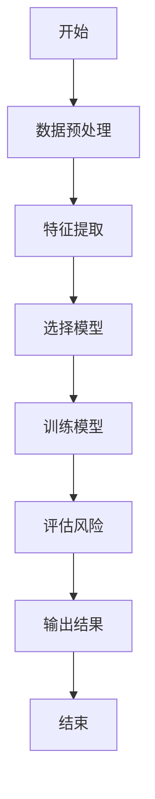
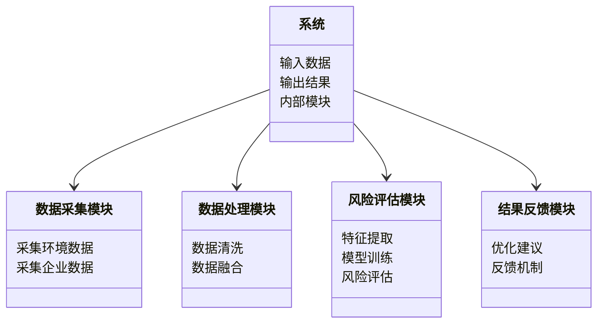

                 


# 智能体协作评估公司的环境风险：可持续发展视角

## 关键词
智能体协作、环境风险评估、可持续发展、企业风险管理、人工智能算法、系统架构设计

## 摘要
随着全球可持续发展理念的深入推进，企业环境风险管理的重要性日益凸显。智能体协作技术作为一种新兴的解决方案，能够通过多智能体的协同工作，实现对企业环境风险的高效评估和优化管理。本文从可持续发展的视角出发，系统探讨智能体协作在环境风险评估中的应用，涵盖核心概念、算法原理、系统架构设计及项目实战等重要内容，为企业实现环境风险管理的智能化和可持续化提供理论支持和实践指导。

---

## 第一部分：背景与问题概述

### 第1章：环境风险评估的背景与重要性

#### 1.1 环境风险评估的基本概念
- **环境风险的定义与特征**  
  环境风险是指企业在经营活动中可能对环境造成负面影响，进而对企业自身、社会或生态系统造成损失的可能性。其特征包括复杂性、动态性和不确定性。
- **环境风险对企业可持续发展的影响**  
  环境风险可能引发法律责任、声誉损失、运营成本增加等问题，直接影响企业的可持续发展能力。
- **环境风险评估的必要性**  
  通过评估环境风险，企业可以提前识别潜在问题，制定有效的应对策略，从而降低风险带来的负面影响。

#### 1.2 可持续发展的视角
- **可持续发展的核心理念**  
  可持续发展强调在满足当前需求的同时，不损害后代满足其需求的能力。环境风险管理是实现可持续发展的重要组成部分。
- **环境风险管理在可持续发展中的地位**  
  环境风险管理是企业实现绿色转型、履行社会责任的重要手段。
- **环境风险评估的全球实践**  
  全球范围内，越来越多的企业开始重视环境风险管理，将其纳入企业战略层面。

#### 1.3 企业环境风险评估的现状与挑战
- **当前企业环境风险管理的现状**  
  许多企业已开始采用传统方法进行环境风险管理，但存在效率低、覆盖面有限等问题。
- **环境风险评估中的主要挑战**  
  数据获取难、评估模型复杂、缺乏智能化解决方案等问题亟待解决。
- **智能体协作评估的优势与潜力**  
  智能体协作技术通过多智能体的协同工作，能够高效处理复杂问题，为企业环境风险管理提供新的解决方案。

---

## 第二部分：智能体协作评估系统的核心概念

### 第2章：智能体协作评估系统的基本原理

#### 2.1 智能体协作的基本概念
- **智能体的定义与特征**  
  智能体（Agent）是指能够感知环境、自主决策并采取行动的实体。其特征包括自主性、反应性、主动性和社会性。
- **智能体协作的基本原理**  
  多智能体协作是指多个智能体通过通信和协调，共同完成复杂任务的过程。
- **智能体协作的分类与应用场景**  
  智能体协作可分为空间协作、任务协作和目标协作，广泛应用于环境监测、资源分配等领域。

#### 2.2 智能体协作评估系统的结构与功能
- **系统的基本组成**  
  包括智能体、通信机制、协作规则和评估模块。
- **系统功能模块划分**  
  包括数据采集、协作决策、风险评估和结果反馈。
- **系统的输入输出关系**  
  系统输入包括环境数据和企业运营数据，输出包括风险评估结果和优化建议。

#### 2.3 智能体协作评估的核心要素
- **数据来源与处理**  
  数据来源包括企业内部数据、公开数据和传感器数据，需进行清洗、融合和分析。
- **协作规则与算法**  
  包括任务分配规则、决策规则和通信规则。
- **评估结果的输出与反馈**  
  包括风险等级、优化建议和反馈机制。

---

### 第3章：智能体协作评估系统的概念属性对比与ER实体关系图

#### 3.1 概念属性对比
以下是智能体协作评估系统中关键概念的属性对比：

| 概念       | 属性                     |
|------------|--------------------------|
| 智能体     | 独立性、响应性、主动性   |
| 环境风险   | 影响性、可预测性、可控性 |
| 协作机制   | 通信方式、决策方式、协调方式 |

#### 3.2 ER实体关系图
以下是环境风险评估系统的ER实体关系图：

```mermaid
erDiagram
    actor 企业管理者 {
        role "决策者"
    }
    actor 环境监测机构 {
        role "数据提供者"
    }
    actor 风险评估系统 {
        role "智能体协作平台"
    }
    actor 监管机构 {
        role "监督者"
    }
    企业管理者 --> 风险评估系统 : 提供企业数据
    环境监测机构 --> 风险评估系统 : 提供环境数据
    风险评估系统 --> 监管机构 : 提交评估报告
```

---

## 第三部分：智能体协作评估系统的算法原理

### 第4章：环境风险评估的数学模型

#### 4.1 基于机器学习的环境风险评估模型
- **模型输入**  
  包括企业运营数据、环境数据和社会责任数据。
- **模型输出**  
  包括环境风险等级和优化建议。

#### 4.2 算法流程图
以下是环境风险评估的算法流程图：



#### 4.3 算法实现代码
以下是Python代码实现：

```python
import pandas as pd
from sklearn.ensemble import RandomForestRegressor
from sklearn.metrics import mean_squared_error

# 数据加载
data = pd.read_csv('environment_risk.csv')

# 特征与目标分离
X = data.drop('risk_score', axis=1)
y = data['risk_score']

# 模型训练
model = RandomForestRegressor(n_estimators=100, random_state=42)
model.fit(X, y)

# 模型预测
y_pred = model.predict(X)

# 评估指标
 mse = mean_squared_error(y, y_pred)
 print(f"均方误差：{mse}")
```

#### 4.4 数学公式
以下是环境风险评估模型的数学公式：

$$
\text{风险评分} = \sum_{i=1}^{n} w_i \cdot x_i
$$

其中，$w_i$ 是第 $i$ 个特征的权重，$x_i$ 是第 $i$ 个特征的值。

---

## 第四部分：系统分析与架构设计方案

### 第5章：系统架构设计

#### 5.1 系统功能设计
以下是系统功能模块的Mermaid类图：



#### 5.2 系统架构设计
以下是系统架构的Mermaid架构图：

```mermaid
archiDiagram
    component 系统 {
        component 数据采集模块 {
            数据采集
        }
        component 数据处理模块 {
            数据清洗
        }
        component 风险评估模块 {
            模型训练
        }
        component 结果反馈模块 {
            优化建议
        }
    }
```

---

## 第五部分：项目实战

### 第6章：智能体协作评估系统的实现

#### 6.1 环境安装与依赖管理
- 安装Python和必要的库：
  ```bash
  pip install pandas scikit-learn
  ```

#### 6.2 核心代码实现
以下是核心代码实现：

```python
import pandas as pd
from sklearn.ensemble import RandomForestRegressor
from sklearn.metrics import mean_squared_error

# 数据加载
data = pd.read_csv('environment_risk.csv')

# 特征与目标分离
X = data.drop('risk_score', axis=1)
y = data['risk_score']

# 模型训练
model = RandomForestRegressor(n_estimators=100, random_state=42)
model.fit(X, y)

# 模型预测
y_pred = model.predict(X)

# 评估指标
 mse = mean_squared_error(y, y_pred)
 print(f"均方误差：{mse}")
```

#### 6.3 案例分析与解读
以某制造企业为例，分析其环境风险评估结果，并提出优化建议。

---

## 第六部分：总结与展望

### 第7章：总结与展望

#### 7.1 成果总结
智能体协作技术在环境风险评估中的应用取得了显著成效，提升了评估效率和准确性。

#### 7.2 问题与局限性
目前仍存在数据获取难、模型复杂度高等问题，需要进一步优化。

#### 7.3 未来展望
未来可进一步研究多智能体协作的优化算法，拓展应用场景，推动企业环境风险管理的智能化和可持续化。

---

## 第七部分：附录

### 附录A：参考文献
1. 环境风险管理相关文献
2. 智能体协作技术相关文献
3. 可持续发展相关文献

### 附录B：工具与资源
- Python代码示例
- 数据处理工具
- 模型训练工具

---

以上是《智能体协作评估公司的环境风险：可持续发展视角》的完整目录大纲和文章内容，希望对您有所帮助！

