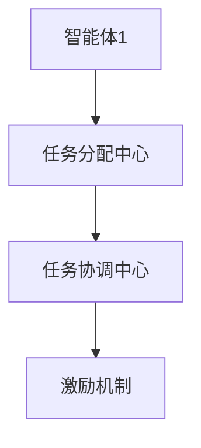
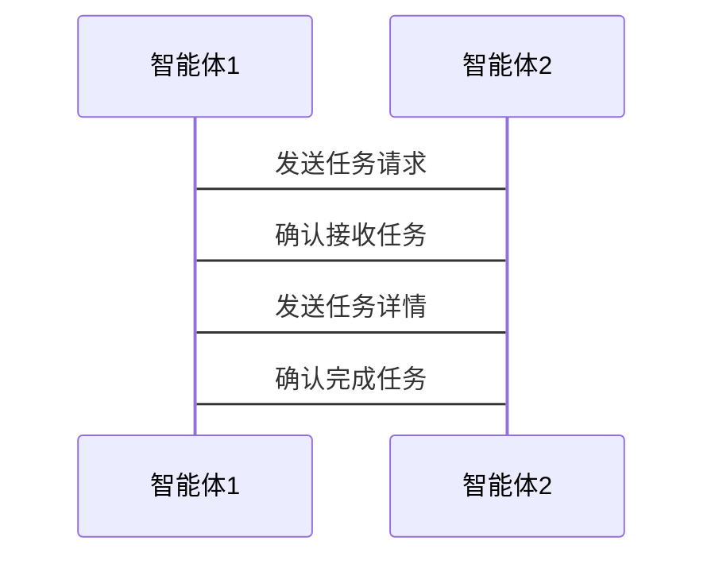
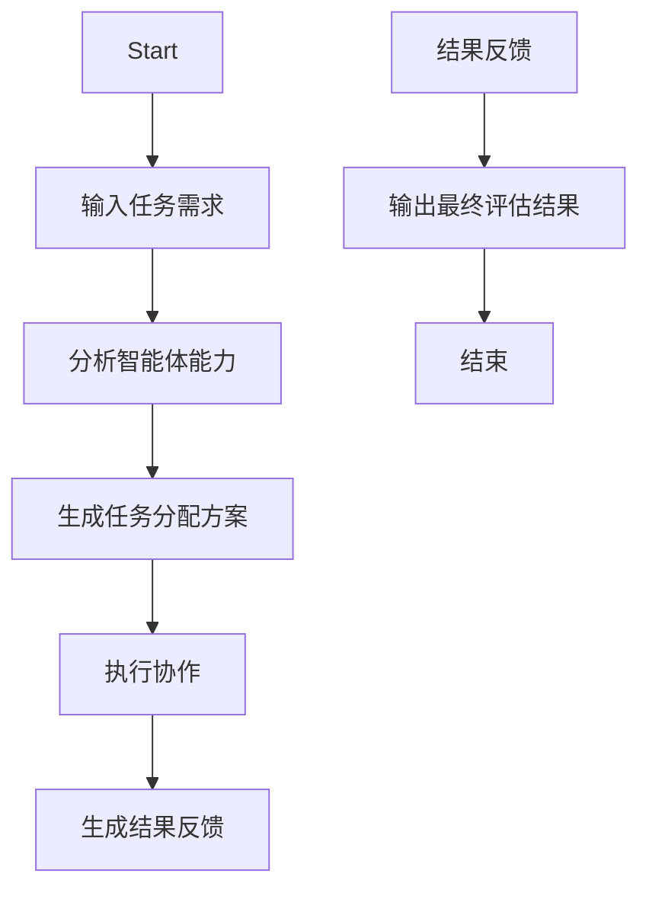

                 


# 智能体协作评估公司的研发效率：科技公司价值评估

> **关键词**: 智能体协作, 研发效率, 科技公司价值, 系统模型, 任务分配, 激励机制

> **摘要**: 本文探讨了智能体协作在评估科技公司研发效率中的应用。通过分析智能体协作的核心概念、算法原理和系统架构，展示了如何利用智能体协作优化研发效率评估，进而提升科技公司的价值。文章结合实际案例，详细讲解了智能体协作的实现过程，为科技公司价值评估提供了新的视角和方法。

---

## 第一部分: 智能体协作与研发效率评估背景

### 第1章: 智能体协作的基本概念

#### 1.1 智能体协作的定义与特点
智能体协作是指多个智能体（Agent）通过协同工作，共同完成特定任务的过程。智能体可以是软件程序、机器人或其他具备感知和决策能力的实体。以下是智能体协作的几个关键特点：

- **自主性**: 智能体能够独立决策和行动。
- **协作性**: 智能体之间通过通信和协调完成共同目标。
- **分布式性**: 协作过程分布在多个智能体之间，而非集中控制。
- **动态性**: 协作过程可能面临环境变化和任务调整。

智能体协作的核心在于如何高效地分配任务、协调行动，并确保各智能体之间的信息流畅交换。

#### 1.2 研发效率评估的背景与意义
研发效率是衡量科技公司技术创新能力的重要指标。传统的研发效率评估通常依赖于项目进度、资源投入和产出成果等指标，但这种评估方式难以全面反映团队协作效率和资源利用效率。通过智能体协作，可以实时监控团队成员的工作状态和任务完成情况，从而更准确地评估研发效率。

智能体协作在研发效率评估中的意义在于：
1. 提高任务分配的合理性。
2. 优化团队协作流程。
3. 实时监控研发进度，及时发现和解决问题。

#### 1.3 科技公司价值评估的背景
科技公司的核心价值往往体现在技术创新能力和研发效率上。然而，传统的公司价值评估方法（如财务指标）难以全面反映科技公司的潜在价值。智能体协作通过实时评估研发效率，为科技公司价值评估提供了新的维度。

### 第2章: 智能体协作与研发效率评估的核心概念

#### 2.1 智能体协作的系统模型
智能体协作的系统模型由以下几个部分组成：
- **智能体**: 具备感知、决策和执行能力的实体。
- **通信机制**: 智能体之间交换信息的渠道。
- **任务分配机制**: 根据智能体的能力和当前状态分配任务。
- **激励机制**: 通过奖励或惩罚激励智能体高效完成任务。

以下是一个简单的系统模型层次结构图：



#### 2.2 智能体协作与研发效率的关系
智能体协作直接影响研发效率的几个关键指标：
- **任务完成时间**: 合理的任务分配可以减少任务冲突，缩短完成时间。
- **资源利用率**: 通过协作优化资源分配，避免资源浪费。
- **团队协作质量**: 协作机制的优化可以提高团队的整体效率。

### 2.3 科技公司价值评估的框架
科技公司价值评估需要综合考虑以下几个方面：
- **技术创新能力**: 包括研发团队的能力、技术储备等。
- **研发效率**: 包括项目完成时间、资源利用率等。
- **市场竞争力**: 包括产品市场份额、客户满意度等。

以下是科技公司价值评估框架的ER图：

```mermaid
erDiagram
    客户
    项目
    资源
    智能体协作系统
    智能体协作系统 --> 客户: 提供服务
    智能体协作系统 --> 项目: 管理项目
    智能体协作系统 --> 资源: 分配资源
```

---

## 第二部分: 智能体协作与研发效率评估的核心概念与联系

### 第3章: 智能体协作的原理与机制

#### 3.1 智能体协作的通信协议
通信协议是智能体协作的基础，它定义了智能体之间如何交换信息。以下是一个常见的通信协议流程：



#### 3.2 智能体协作的任务分配机制
任务分配机制是智能体协作的核心，它需要根据智能体的能力和当前状态分配任务。以下是一个任务分配算法的伪代码：

```python
def assign_task(available_agents, task):
    for agent in available_agents:
        if agent.capability matches task.type:
            return agent
    return None
```

#### 3.3 智能体协作的激励机制
激励机制通过奖励或惩罚激励智能体高效完成任务。以下是一个激励机制的数学模型：

$$ reward = \sum_{i=1}^{n} \frac{task\_value_i}{completion\_time_i} $$

---

### 第4章: 智能体协作与研发效率评估的系统模型

#### 4.1 系统模型的构建
系统模型的构建需要考虑以下几个方面：
- **输入**: 任务需求、智能体能力。
- **输出**: 任务分配结果、激励机制。
- **过程**: 任务分配、协作执行、结果反馈。

以下是一个系统模型的流程图：



#### 4.2 智能体协作与研发效率评估的关系
智能体协作与研发效率评估是相互作用的关系：
- 智能体协作优化了研发效率。
- 研发效率评估为智能体协作提供了反馈。

---

## 第三部分: 项目实战与最佳实践

### 第5章: 项目实战

#### 5.1 环境安装
以下是项目实战所需的环境安装步骤：
1. 安装Python和必要的库（如`mermaid`、`numpy`）。
2. 配置开发环境（如Jupyter Notebook）。

#### 5.2 核心代码实现
以下是智能体协作算法的核心代码：

```python
class Agent:
    def __init__(self, id, capability):
        self.id = id
        self.capability = capability
        self.status = "idle"

    def assign_task(self, task):
        if self.capability matches task.type:
            self.status = "busy"
            return True
        return False

class Task:
    def __init__(self, type, value):
        self.type = type
        self.value = value

def main():
    agents = [Agent(1, "开发"), Agent(2, "测试")]
    tasks = [Task("功能开发", 100), Task("测试用例", 50)]
    
    for task in tasks:
        for agent in agents:
            if agent.assign_task(task):
                break
```

#### 5.3 案例分析
以下是一个实际案例分析：
- **背景**: 某科技公司有两个开发团队，分别负责前端和后端开发。
- **实施智能体协作**: 每个团队作为一个智能体，通过协作分配任务。
- **结果**: 任务分配效率提高，开发周期缩短。

### 第6章: 最佳实践与总结

#### 6.1 最佳实践
- **明确任务目标**: 确保智能体协作的目标清晰。
- **优化通信机制**: 提高智能体之间的信息交换效率。
- **动态调整机制**: 根据实际情况动态调整任务分配和激励机制。

#### 6.2 小结
智能体协作通过优化任务分配和团队协作，显著提高了研发效率，为科技公司价值评估提供了新的视角。

#### 6.3 注意事项
- **数据隐私**: 注意智能体协作过程中涉及的数据隐私问题。
- **系统稳定性**: 确保协作系统的稳定性和可靠性。

#### 6.4 拓展阅读
- 推荐阅读《智能体协作算法与应用》和《科技公司价值评估方法论》。

---

通过以上内容，我们详细探讨了智能体协作在评估科技公司研发效率中的应用，结合实际案例和详细代码实现，为读者提供了全面的视角和实践指南。

