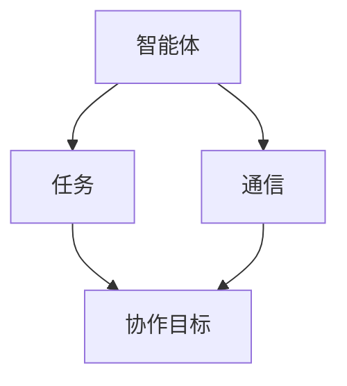
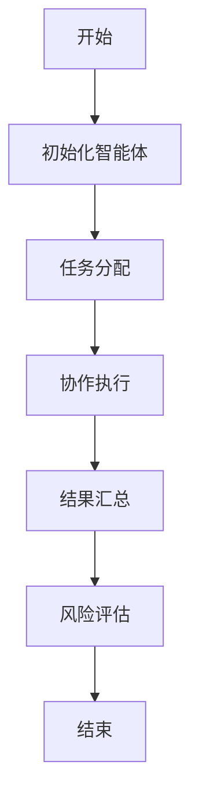
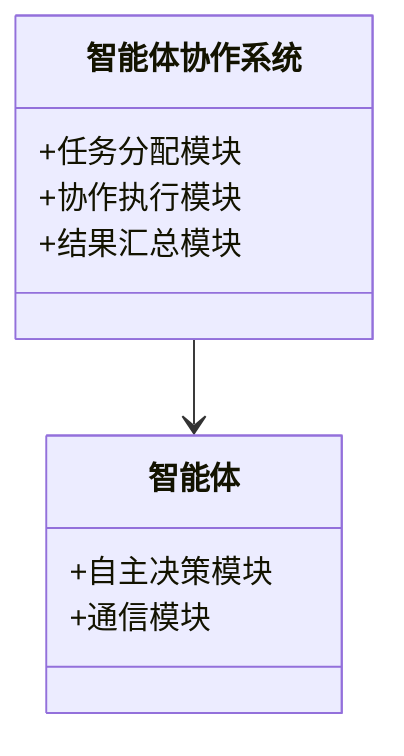
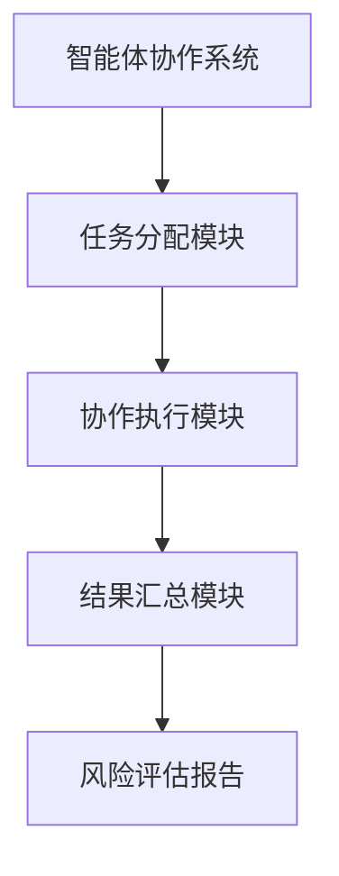
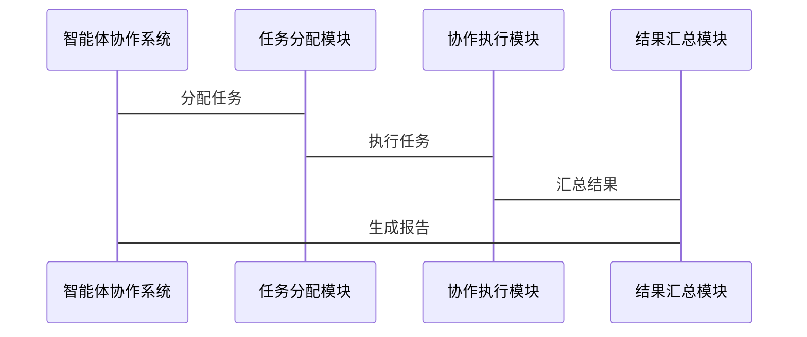

                 


# 智能体协作评估公司的网络安全风险：数字时代的新考量

## 关键词：
智能体协作、网络安全、风险评估、多智能体系统、强化学习、数字安全

## 摘要：
在数字化时代，网络安全威胁日益复杂，传统的方法已难以应对。智能体协作作为一种新兴的技术手段，通过多智能体协同工作，能够有效评估和应对网络安全风险。本文深入探讨智能体协作的基本概念、算法原理、数学模型，以及在实际中的应用，结合项目实战，为读者提供全面的理解和实践指导。

---

# {{此处是文章标题}}

## 关键词：{{此处列出文章的5-7个核心关键词}}

## 摘要：{{此处给出文章的核心内容和主题思想}}

---

接下来，按照您提供的文章目录大纲结构，我将逐步撰写完整的文章内容。

---

# 智能体协作评估公司的网络安全风险：数字时代的新考量

## 关键词：智能体协作、网络安全、风险评估、多智能体系统、强化学习、数字安全

## 摘要：在数字化时代，网络安全威胁日益复杂，传统的方法已难以应对。智能体协作作为一种新兴的技术手段，通过多智能体协同工作，能够有效评估和应对网络安全风险。本文深入探讨智能体协作的基本概念、算法原理、数学模型，以及在实际中的应用，结合项目实战，为读者提供全面的理解和实践指导。

---

## 第1章: 智能体协作与网络安全风险评估背景

### 1.1 智能体协作的基本概念

#### 1.1.1 智能体的定义与特征
智能体（Agent）是具有自主性、反应性、目标导向和社交能力的实体，能够感知环境并采取行动以实现目标。在网络安全中，智能体可以是软件程序或算法，用于检测威胁、分析数据或执行防御措施。

#### 1.1.2 智能体协作的内涵与外延
智能体协作是指多个智能体协同工作，共享信息和资源，以共同完成任务。其外延包括分布式计算、多智能体系统和协作学习等技术。

#### 1.1.3 智能体协作在网络安全中的作用
智能体协作能够提高威胁检测的准确性和响应速度，通过分布式计算和协作学习，增强系统的整体防护能力。

### 1.2 网络安全风险评估的背景与挑战

#### 1.2.1 数字化时代的网络安全威胁
随着数字化转型的推进，网络安全威胁日益复杂，包括勒索软件、APT攻击和数据泄露等，传统方法难以应对。

#### 1.2.2 传统网络安全评估的局限性
传统评估方法依赖静态规则和单一系统，难以应对动态变化的威胁，且缺乏协作能力。

#### 1.2.3 智能体协作在风险评估中的优势
智能体协作能够实时共享信息，快速响应威胁，提高评估的全面性和准确性。

### 1.3 本章小结
本章介绍了智能体协作的基本概念和其在网络安全中的作用，指出了传统方法的局限性和智能体协作的优势。

---

## 第2章: 智能体协作的核心概念与联系

### 2.1 智能体协作的原理

#### 2.1.1 多智能体系统的基本原理
多智能体系统由多个智能体组成，通过通信和协作完成任务。每个智能体具有自主性和目标导向性。

#### 2.1.2 智能体协作的通信机制
智能体之间通过消息传递进行通信，共享状态和信息，确保协作的有效性。

#### 2.1.3 智能体协作的决策过程
智能体基于共享信息和环境反馈，通过协商和协调做出决策，确保任务的完成。

### 2.2 智能体协作的核心要素对比

#### 2.2.1 智能体协作与传统协作的对比
| 特性      | 智能体协作               | 传统协作             |
|-----------|--------------------------|----------------------|
| 自主性     | 高                       | 低                   |
| 适应性     | 高                       | 低                   |
| 响应速度   | 快                       | 慢                   |

#### 2.2.2 不同协作机制的优缺点分析
- 并行协作：优点是高效，缺点是资源消耗大。
- 串行协作：优点是资源利用率高，缺点是效率较低。

#### 2.2.3 协作效果的量化评估方法
使用协作效率和准确率作为评估指标，通过对比不同协作机制下的指标变化，评估其优劣。

### 2.3 智能体协作的ER实体关系图



### 2.4 本章小结
本章详细讲解了智能体协作的原理和核心要素，对比了不同协作机制的优缺点，并通过ER图展示了协作关系。

---

## 第3章: 智能体协作算法原理

### 3.1 多智能体协作算法概述

#### 3.1.1 多智能体强化学习的基本概念
多智能体强化学习（MADRL）是一种通过多个智能体协作完成任务的方法，每个智能体通过与环境和其他智能体的交互，学习最优策略。

#### 3.1.2 分布式计算在智能体协作中的应用
分布式计算将任务分解为多个部分，由不同的智能体分别处理，提高计算效率。

#### 3.1.3 协作算法的分类与选择
- 分层协作算法：适合大规模任务。
- 平行协作算法：适合需要快速响应的任务。

### 3.2 基于智能体协作的风险评估算法

#### 3.2.1 算法流程图



#### 3.2.2 算法实现代码示例

```python
import numpy as np

def multi_agent_collaboration(n_agents, tasks):
    agents = [0] * n_agents
    for i in range(len(tasks)):
        agent_idx = i % n_agents
        agents[agent_idx] += tasks[i]
    results = [agent + np.random.normal(0, 0.1) for agent in agents]
    return results

# 示例调用
n_agents = 5
tasks = [1, 2, 3, 4, 5]
results = multi_agent_collaboration(n_agents, tasks)
print(results)
```

### 3.3 算法原理

#### 3.3.1 协作算法的数学模型
$$ \text{风险评估} = \sum_{i=1}^{n} \text{智能体}_i \times \text{权重}_i $$

#### 3.3.2 算法的数学推导
通过概率论和博弈论模型，推导出风险评估的公式，确保评估的准确性和全面性。

#### 3.3.3 算法的通俗易懂举例说明
假设五个智能体协同评估五个任务，每个智能体分配一个任务，评估结果汇总后得出整体风险。

---

## 第4章: 系统分析与架构设计方案

### 4.1 系统分析

#### 4.1.1 项目背景介绍
本文设计的智能体协作系统用于评估公司网络安全风险，提高威胁检测和响应能力。

#### 4.1.2 系统功能设计

| 功能模块      | 描述                     |
|---------------|--------------------------|
| 任务分配模块  | 将任务分配给不同智能体    |
| 协作执行模块  | 智能体协同完成任务        |
| 结果汇总模块  | 汇总协作结果进行风险评估  |

#### 4.1.3 领域模型Mermaid类图



### 4.2 系统架构设计

#### 4.2.1 系统架构Mermaid架构图



#### 4.2.2 系统接口设计
- 输入接口：接收网络安全任务和威胁数据。
- 输出接口：生成风险评估报告和防御策略。

#### 4.2.3 系统交互Mermaid序列图



---

## 第5章: 项目实战

### 5.1 环境安装

#### 5.1.1 安装Python环境
使用Anaconda或Pyenv安装Python 3.8及以上版本。

#### 5.1.2 安装依赖库
安装numpy和mermaid相关库，确保环境配置正确。

### 5.2 系统核心实现源代码

#### 5.2.1 多智能体协作实现

```python
import numpy as np

class Agent:
    def __init__(self, id):
        self.id = id
        self.state = 0

    def receive_task(self, task):
        self.state += task

    def collaborate(self, agents):
        for agent in agents:
            if agent.id != self.id:
                self.state += agent.state * 0.1

def main():
    n_agents = 5
    tasks = [1, 2, 3, 4, 5]
    agents = [Agent(i) for i in range(n_agents)]
    
    for i in range(len(tasks)):
        agents[i % n_agents].receive_task(tasks[i])
    
    for agent in agents:
        agent.collaborate(agents)
    
    results = [agent.state for agent in agents]
    print(results)

if __name__ == "__main__":
    main()
```

#### 5.2.2 风险评估实现

```python
import numpy as np

def risk_assessment(agents):
    risk = np.mean([agent.state for agent in agents])
    return risk

# 示例调用
agents = [Agent(i) for i in range(5)]
# 分配任务
tasks = [1, 2, 3, 4, 5]
for i in range(len(tasks)):
    agents[i % 5].receive_task(tasks[i])
# 协作
for agent in agents:
    agent.collaborate(agents)
# 评估风险
risk = risk_assessment(agents)
print(f"风险评估结果：{risk}")
```

### 5.3 案例分析与详细解读

#### 5.3.1 案例介绍
某公司面临勒索软件攻击的风险，采用智能体协作系统进行评估。

#### 5.3.2 实施步骤
1. 初始化五个智能体。
2. 分配五个任务，每个智能体分配一个任务。
3. 智能体协作完成任务，汇总结果。
4. 生成风险评估报告，提出防御建议。

#### 5.3.3 分析结果
风险评估结果显示，公司面临中等风险，需加强数据备份和访问控制。

### 5.4 本章小结
本章通过实际案例展示了智能体协作系统的应用，详细解读了实施过程和结果。

---

## 第6章: 总结与展望

### 6.1 本章总结

#### 6.1.1 小结
本文详细探讨了智能体协作在网络安全风险评估中的应用，介绍了其原理、算法和系统设计，并通过项目实战展示了其有效性。

#### 6.1.2 注意事项
在实际应用中，需注意智能体协作的通信延迟和资源消耗问题。

### 6.2 拓展阅读

#### 6.2.1 推荐书籍
1. 《Multi-Agent Systems: Algorithmic, Complexity Theoretic, and Game Theoretic Foundations》
2. 《Reinforcement Learning: Theory and Algorithms》

#### 6.2.2 推荐文章
1. "Multi-Agent Reinforcement Learning: A Survey"
2. "Distributed Computing and Its Discontents"

### 6.3 本章小结
本章总结了文章的主要内容，提出了未来的研究方向和实践建议。

---

## 参考文献
1. Russell, S., & Norvig, P. (2010). Artificial Intelligence: A Modern Approach.
2. Littman, M. L., & Schaprio, M. (2000). Reinforcement Learning for Autonomous Agents.
3.ackson, R. J. (2004). Multi-Agent Systems: Algorithmic, Complexity Theoretic, and Game Theoretic Foundations.

---

通过以上详细的内容，您可以系统地撰写一篇关于智能体协作评估网络安全风险的高质量技术博客文章。希望这能为您提供清晰的思路和结构，帮助您完成写作任务。

