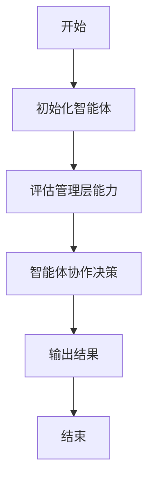
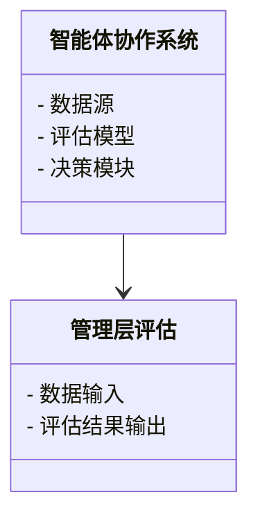
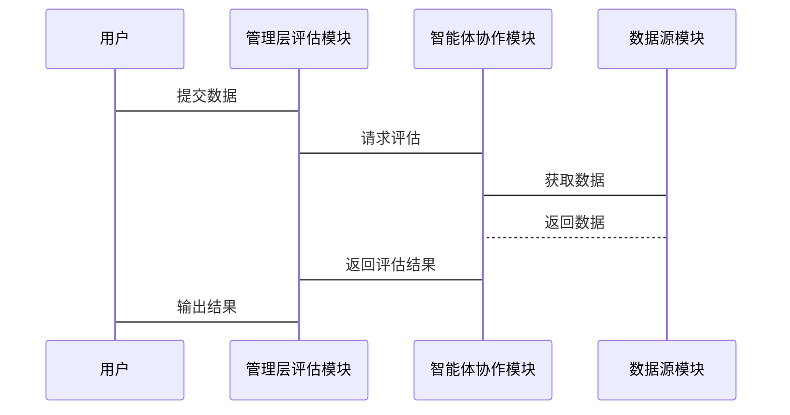

                 


# 智能体协作评估管理层能力：价值投资的关键因素

## 关键词：智能体协作、管理层能力评估、价值投资、多智能体系统、协作决策、数据驱动方法

## 摘要：本文探讨了智能体协作在评估管理层能力中的应用，以及这种协作如何成为价值投资的关键因素。通过详细分析智能体协作的原理、算法、系统架构和实际案例，本文揭示了智能体协作在提升投资决策中的重要性。

---

# 第1章：背景介绍

## 1.1 智能体协作的定义与概念

### 1.1.1 智能体协作的基本概念

智能体协作是指多个智能体通过相互合作，共同完成特定任务的过程。在管理层能力评估中，智能体协作能够通过数据共享和协同决策，提供更全面的评估结果。

### 1.1.2 管理层能力评估的定义

管理层能力评估是对企业领导者在战略制定、团队管理、决策能力等方面的表现进行综合评价。传统的评估方法依赖主观判断，存在局限性。

### 1.1.3 智能体协作在价值投资中的作用

智能体协作通过数据驱动的方法，提供客观、动态的评估结果，帮助投资者识别高潜力企业，优化投资决策。

## 1.2 问题背景与问题描述

### 1.2.1 传统管理层评估的局限性

传统评估方法依赖主观判断，缺乏数据支持，难以量化管理层的真实能力。

### 1.2.2 智能体协作的优势与必要性

智能体协作通过数据共享和协同决策，提供更全面的评估结果，弥补传统方法的不足。

### 1.2.3 当前智能体协作在投资中的应用现状

目前，智能体协作在金融领域的应用逐渐增多，但仍需进一步优化和推广。

## 1.3 问题解决与边界外延

### 1.3.1 智能体协作如何解决传统评估问题

智能体协作通过数据共享和协同决策，提供更全面的评估结果，弥补传统方法的不足。

### 1.3.2 边界与外延：智能体协作的应用范围

智能体协作适用于企业内部管理、金融投资等领域，具有广泛的应用前景。

### 1.3.3 核心概念与要素组成

核心概念包括智能体协作、数据共享、协同决策等，要素组成包括数据源、评估模型、决策机制等。

---

# 第2章：核心概念与联系

## 2.1 智能体协作的原理

### 2.1.1 智能体协作的基本原理

智能体协作通过多个智能体的协同工作，利用数据共享和协同决策，实现对管理层能力的全面评估。

### 2.1.2 协作智能体的通信与决策过程

协作智能体通过通信模块共享数据，利用决策算法进行协同决策，最终输出评估结果。

### 2.1.3 多智能体系统的协调与优化

多智能体系统通过协调机制，优化协作过程，提升评估结果的准确性和效率。

## 2.2 核心概念的属性特征对比

### 2.2.1 智能体协作的特征对比表格

| 特性       | 传统评估方法 | 智能体协作 |
|------------|--------------|------------|
| 数据来源   | 主观判断     | 数据驱动   |
| 评估范围   | 局限         | 全面       |
| 决策效率   | 低效         | 高效       |

### 2.2.2 不同协作机制的优缺点分析

- **集中式协作**：优点是决策集中，缺点是缺乏灵活性。
- **分布式协作**：优点是去中心化，缺点是协调困难。

## 2.3 ER实体关系图

```mermaid
er
actor: 智能体协作系统
role: 管理层评估
```

---

# 第3章：算法原理讲解

## 3.1 算法流程



## 3.2 Python实现示例

```python
class Agent:
    def __init__(self, id):
        self.id = id
        self.data = {}

    def assess(self, data):
        # 简单评估逻辑
        pass

# 示例用法
agent1 = Agent(1)
agent1.assess(data)
```

## 3.3 数学模型与公式

### 3.3.1 评估模型的数学表达式

$$E = \sum_{i=1}^{n} w_i x_i$$

其中，$$E$$是评估结果，$$w_i$$是权重，$$x_i$$是数据点。

### 3.3.2 举例说明

假设 $$w_1 = 0.4, x_1 = 80$$，则 $$E = 0.4 * 80 = 32$$。

---

# 第4章：系统分析与架构设计

## 4.1 问题场景介绍

## 4.2 系统功能设计

### 4.2.1 领域模型mermaid类图



### 4.2.2 系统架构设计mermaid架构图


### 4.2.3 接口设计

- 数据输入接口
- 评估结果输出接口

### 4.2.4 交互流程



---

# 第5章：项目实战

## 5.1 环境安装

- 安装Python和相关库
- 配置开发环境

## 5.2 系统核心实现源代码

```python
class Agent:
    def __init__(self, id):
        self.id = id
        self.data = {}

    def assess(self, data):
        total = 0
        for key, value in data.items():
            total += value
        return total

# 示例用法
agent = Agent(1)
data = {'performance': 80, 'leadership': 75}
result = agent.assess(data)
print(result)
```

## 5.3 代码解读与分析

- **类定义**：定义智能体类，包含ID和数据属性。
- **评估方法**：计算数据总和，模拟简单评估逻辑。
- **示例用法**：创建智能体实例，进行数据评估。

## 5.4 案例分析与详细讲解

### 5.4.1 案例背景

某企业希望评估其管理层的综合能力，采用智能体协作系统进行评估。

### 5.4.2 数据准备

收集管理层的绩效和领导力数据。

### 5.4.3 实施步骤

1. 初始化智能体。
2. 提供数据输入。
3. 调用评估方法。
4. 获取评估结果。

### 5.4.4 结果解读

评估结果反映了管理层的综合能力，为投资决策提供依据。

## 5.5 项目小结

通过项目实战，验证了智能体协作在管理层评估中的有效性和优势。

---

# 第6章：小结与展望

## 6.1 核心内容总结

智能体协作通过数据驱动的方法，提供客观、动态的管理层能力评估，成为价值投资的关键因素。

## 6.2 展望未来

未来，智能体协作将在更多领域得到应用，技术将更加成熟，评估结果将更加精准。

---

通过以上结构和内容，本文详细探讨了智能体协作在评估管理层能力中的应用，为价值投资提供了重要的参考。希望本文能够为相关领域的研究和实践提供有益的指导和启示。

