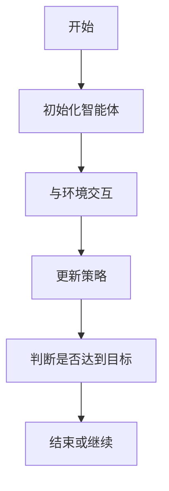
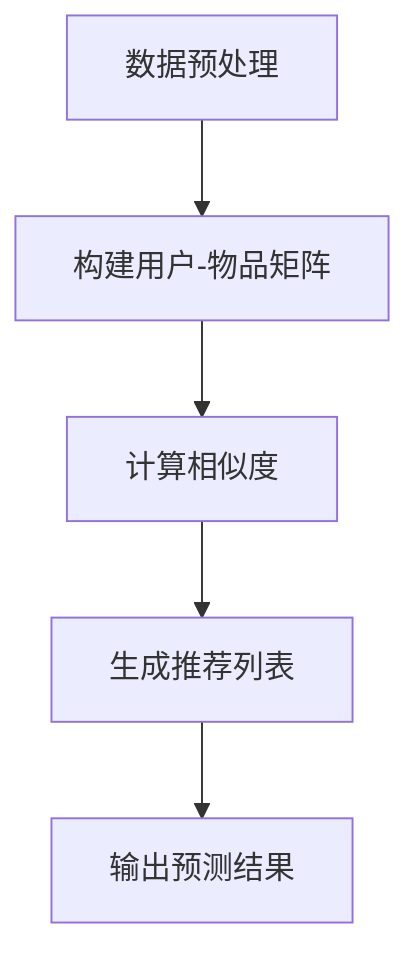
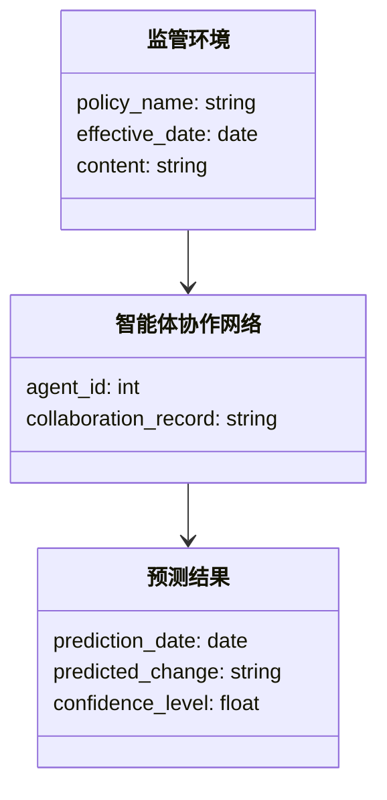
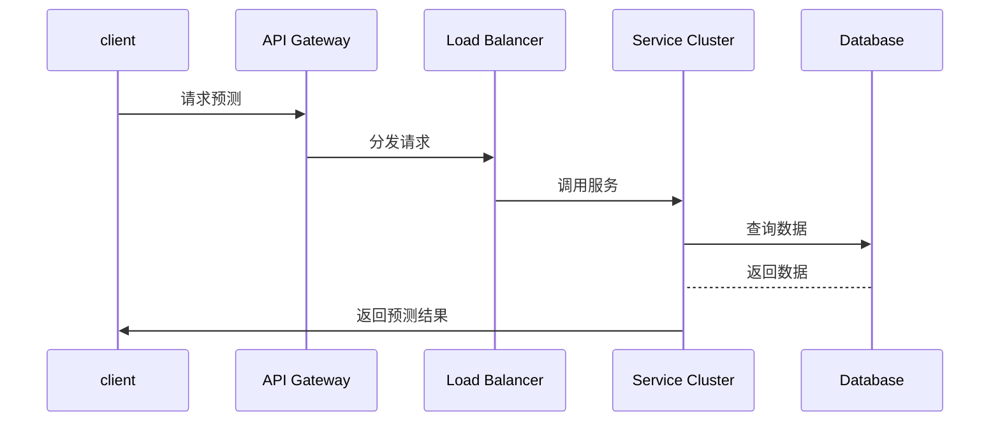

                 


# 智能体协作预测监管环境变化：提前应对政策风险

---

## 关键词
- 智能体协作  
- 监管环境变化  
- 政策风险  
- 人工智能预测  
- 系统架构设计  

---

## 摘要
随着政策法规的不断变化，企业需要能够快速适应监管环境的变化，以避免潜在的政策风险。本文介绍了一种基于智能体协作的方法，用于预测监管环境的变化，并提前制定应对策略。通过分析智能体协作的核心概念、算法原理、系统架构设计以及实际项目案例，本文为读者提供了从理论到实践的全面指导，帮助企业在复杂多变的监管环境中保持竞争优势。

---

# 第1章：智能体协作预测监管环境变化的背景与问题

## 1.1 问题背景
### 1.1.1 监管环境变化的复杂性
监管环境的变化通常具有高度的不确定性和复杂性，例如政策法规的更新、行业标准的变化等。这些变化可能对企业运营产生重大影响，例如罚款、业务调整等。

### 1.1.2 智能体协作在监管预测中的作用
智能体协作是一种分布式计算模型，通过多个智能体之间的协作，能够更高效地处理复杂问题。在监管预测中，智能体协作可以帮助企业实时监测政策变化，并快速响应。

### 1.1.3 政策风险对企业的影响
政策风险是指由于政策变化对企业运营造成的潜在风险。例如，新的环保法规可能导致企业需要投入更多资源进行技术升级，从而影响盈利能力。

## 1.2 问题描述
### 1.2.1 监管环境变化的不确定性
政策法规的变化往往具有突发性和不确定性，企业需要有一种机制能够实时监测这些变化，并提前做好准备。

### 1.2.2 智能体协作预测的必要性
通过智能体协作，企业可以利用多个智能体的协同工作，提高监管预测的准确性和效率。

### 1.2.3 政策风险的潜在影响
政策风险可能导致企业面临法律纠纷、罚款或其他经济损失，甚至可能影响企业的生存。

## 1.3 问题解决
### 1.3.1 智能体协作预测的解决方案
通过构建一个由多个智能体组成的协作网络，实时监测政策变化，并利用机器学习算法进行预测。

### 1.3.2 提前应对政策风险的策略
企业可以通过智能体协作预测模型，提前制定应对策略，例如调整业务流程、优化资源配置等。

### 1.3.3 监管环境变化预测的实现路径
实现路径包括数据收集、模型构建、预测分析和策略制定等步骤。

## 1.4 边界与外延
### 1.4.1 智能体协作预测的边界
智能体协作预测仅关注监管环境的变化，不涉及企业的内部运营。

### 1.4.2 监管环境变化预测的外延
监管环境变化预测可以应用于多个领域，例如金融、能源、制造业等。

### 1.4.3 政策风险应对的范围界定
政策风险应对策略包括短期调整和长期规划，企业需要根据具体情况制定相应的策略。

## 1.5 核心概念与结构
### 1.5.1 智能体协作预测的核心要素
包括数据源、智能体协作网络、预测模型和应对策略等。

### 1.5.2 监管环境变化的预测模型
模型需要能够处理多源异构数据，并具有较高的预测准确率。

### 1.5.3 政策风险应对的系统结构
系统结构包括数据采集模块、智能体协作模块、预测模块和策略制定模块。

## 1.6 本章小结
本章通过分析监管环境变化的复杂性，阐述了智能体协作在政策风险应对中的重要性，并提出了实现路径和系统结构。

---

# 第2章：智能体协作预测监管环境变化的核心概念

## 2.1 智能体协作的定义与特点
### 2.1.1 智能体的定义
智能体是一种能够感知环境并采取行动以实现目标的实体，可以是软件程序或物理设备。

### 2.1.2 协作智能体的核心特点
包括自主性、反应性、协作性和学习性。

### 2.1.3 智能体协作的优势
通过协作，智能体可以更高效地完成复杂任务，提高预测的准确性和实时性。

## 2.2 监管环境变化预测的原理
### 2.2.1 监管环境变化的驱动因素
包括政策制定者的意图、社会舆论、经济利益等。

### 2.2.2 预测模型的构建方法
利用机器学习算法，如强化学习和协同过滤，构建预测模型。

### 2.2.3 数据来源与处理方式
数据来源包括政策文件、媒体报道、行业报告等，需要进行清洗、特征提取和数据增强。

## 2.3 政策风险应对的机制
### 2.3.1 政策风险的识别方法
通过分析政策变化的历史数据，识别潜在的风险点。

### 2.3.2 政策风险的评估模型
利用概率论和统计学方法，评估政策变化对企业的潜在影响。

### 2.3.3 政策风险应对的策略制定
根据预测结果，制定相应的应对策略，例如调整业务模式、优化资源配置等。

## 2.4 核心概念对比表
| 智能体协作 | 传统预测方法 | 经济预测 | 政策风险应对 |
|------------|----------------|----------|--------------|
| 分布式计算 | 集中式计算     | 统计模型  | 风险评估与应对 |

### 2.4.1 智能体协作与传统预测方法对比
智能体协作具有分布式和协作性特点，而传统预测方法通常依赖中心化计算。

### 2.4.2 监管环境变化预测与经济预测对比
监管环境变化预测更关注政策因素，而经济预测更关注经济指标。

### 2.4.3 政策风险应对的机制对比
政策风险应对需要结合智能体协作和预测模型，而传统的风险应对通常依赖专家经验。

## 2.5 ER实体关系图
```mermaid
er
  %%{init: 'random'}%%

  entity 监管环境 {
    id: int
    policy_name: string
    effective_date: date
    content: string
  }

  entity 智能体协作网络 {
    id: int
    agent_id: int
    collaboration_record: string
  }

  entity 预测结果 {
    id: int
    prediction_date: date
    predicted_change: string
    confidence_level: float
  }

  监管环境 --> 智能体协作网络: 提供监管数据
  智能体协作网络 --> 预测结果: 生成预测结果
```

## 2.6 本章小结
本章详细阐述了智能体协作的核心概念，并通过对比分析和实体关系图，展示了监管环境变化预测的整体架构。

---

# 第3章：智能体协作预测监管环境变化的算法原理

## 3.1 强化学习算法
### 3.1.1 强化学习的基本原理
强化学习是一种通过试错机制，学习最优策略的算法。

### 3.1.2 在监管预测中的应用
智能体通过与环境交互，学习如何预测政策变化。

### 3.1.3 算法实现步骤


### 3.1.4 Python代码示例
```python
class Agent:
    def __init__(self, state_space, action_space):
        self.state_space = state_space
        self.action_space = action_space
        # 初始化策略参数
        self.theta = np.random.randn(state_space, action_space)
    
    def act(self, state):
        # 根据策略选择动作
        action_probs = np.exp(self.theta[state]) / np.sum(np.exp(self.theta[state]))
        return np.random.choice(self.action_space, p=action_probs)
    
    def update(self, state, action, reward):
        # 更新策略参数
        self.theta[state] += reward * self.theta[state]
```

### 3.1.5 数学模型与公式
智能体的目标是最大化累积奖励，数学模型可以表示为：
$$ Q(s, a) = Q(s, a) + \alpha (r + \gamma \max_a Q(s', a) - Q(s, a)) $$
其中，$\alpha$是学习率，$\gamma$是折扣因子。

## 3.2 协同过滤算法
### 3.2.1 协同过滤的基本原理
通过分析用户行为数据，找到相似的用户或物品，进行推荐。

### 3.2.2 在监管预测中的应用
通过协同过滤，智能体可以共享预测结果，提高预测的准确率。

### 3.2.3 算法实现步骤


### 3.2.4 Python代码示例
```python
def collaborative_filtering(user_matrix, k=5):
    # 计算相似度
    similarity = cosine_similarity(user_matrix)
    # 找到最相似的k个用户
    top_k_users = np.argsort(similarity, axis=0)[-k:]
    # 生成推荐列表
    recommendation = np.mean(user_matrix[top_k_users], axis=0)
    return recommendation
```

### 3.2.5 数学模型与公式
协同过滤的相似度计算可以使用余弦相似度：
$$ \text{similarity}(i, j) = \frac{\sum_{k=1}^n x_{ik} x_{jk}}{\sqrt{\sum_{k=1}^n x_{ik}^2} \sqrt{\sum_{k=1}^n x_{jk}^2}} } $$

## 3.3 算法优化与调优
### 3.3.1 算法优化策略
包括参数调整、模型集成等方法。

### 3.3.2 调优技巧
通过交叉验证和网格搜索，找到最优的算法参数。

### 3.3.3 性能对比分析
比较不同算法在监管预测中的表现，选择最优算法。

## 3.4 本章小结
本章详细介绍了智能体协作预测中常用的强化学习和协同过滤算法，并通过代码示例和数学公式，展示了算法的实现过程。

---

# 第4章：智能体协作预测监管环境变化的系统架构设计

## 4.1 问题场景介绍
### 4.1.1 系统目标
构建一个智能体协作网络，用于预测监管环境的变化。

### 4.1.2 系统需求
包括数据采集、预测分析、策略制定等功能。

## 4.2 系统功能设计
### 4.2.1 领域模型图


### 4.2.2 系统架构图


### 4.2.3 系统接口设计
包括数据接口、预测接口和策略接口。

### 4.2.4 系统交互序列图


## 4.3 本章小结
本章通过系统架构设计，展示了智能体协作预测监管环境变化的整体框架，并通过图表详细说明了系统的各个组成部分和交互过程。

---

# 第5章：智能体协作预测监管环境变化的项目实战

## 5.1 环境安装与配置
### 5.1.1 安装依赖
安装Python、机器学习库（如scikit-learn、TensorFlow）和mermaid工具。

### 5.1.2 配置开发环境
配置Jupyter Notebook、IDE等开发工具。

## 5.2 核心代码实现
### 5.2.1 智能体协作网络的实现
```python
class CollaborationNetwork:
    def __init__(self, agent_count):
        self.agents = [Agent() for _ in range(agent_count)]
        self.data = []
    
    def collaborate(self, data):
        for agent in self.agents:
            agent.update(data)
        self.data.append(data)
```

### 5.2.2 预测模型的实现
```python
class PredictionModel:
    def __init__(self, model_type):
        if model_type == 'rl':
            self.model = Agent()
        elif model_type == 'cf':
            self.model = CollaborativeFilter()
    
    def predict(self, input_data):
        return self.model.predict(input_data)
```

## 5.3 代码解读与分析
### 5.3.1 智能体协作网络的代码解读
协作网络通过多个智能体的协同工作，实时更新数据，提高预测的准确率。

### 5.3.2 预测模型的代码解读
预测模型可以根据不同的需求选择不同的算法，如强化学习或协同过滤。

## 5.4 案例分析
### 5.4.1 案例背景
假设某企业需要预测环保政策的变化，提前调整生产流程。

### 5.4.2 数据收集
收集过去十年的环保政策数据，包括政策内容、生效日期等。

### 5.4.3 模型训练
使用强化学习算法，训练智能体协作网络，预测政策变化的概率。

### 5.4.4 模型评估
通过历史数据验证模型的准确性，并根据评估结果进行参数调优。

## 5.5 项目小结
本章通过实际项目案例，展示了智能体协作预测监管环境变化的具体实现过程，并通过代码示例和案例分析，帮助读者更好地理解和应用相关技术。

---

# 第6章：智能体协作预测监管环境变化的最佳实践与小结

## 6.1 最佳实践 tips
### 6.1.1 数据质量的重要性
确保数据的准确性和完整性，是模型预测的基础。

### 6.1.2 模型选择的策略
根据具体场景选择合适的算法，如强化学习或协同过滤。

### 6.1.3 系统架构的优化
通过分布式架构和负载均衡，提高系统的性能和可靠性。

## 6.2 小结
智能体协作预测监管环境变化是一种高效的方法，通过多个智能体的协同工作，可以实时监测政策变化，并提前制定应对策略。

## 6.3 注意事项
### 6.3.1 数据隐私与安全
在数据收集和处理过程中，需要注意数据隐私和安全问题。

### 6.3.2 算法的可解释性
复杂的算法需要具备一定的可解释性，以便更好地理解和优化模型。

### 6.3.3 系统的可扩展性
系统的架构设计需要具备良好的可扩展性，以应对未来更多的智能体和数据量。

## 6.4 拓展阅读
推荐读者阅读相关领域的书籍和论文，例如《强化学习入门》、《分布式系统设计与实现》等。

---

# 附录：参考文献与工具列表

## 附录A：参考文献
1. Russell, S., & Norvig, P. (2010). Artificial Intelligence: A Modern Approach.
2. Goodfellow, I., Bengio, Y., & Courville, A. (2016). Deep Learning.

## 附录B：工具列表
- Python
- scikit-learn
- TensorFlow
- Mermaid

---

通过以上章节的详细讲解，读者可以全面了解智能体协作预测监管环境变化的方法和实现步骤，并能够将其应用到实际项目中，提前应对政策风险，保持企业的竞争优势。

