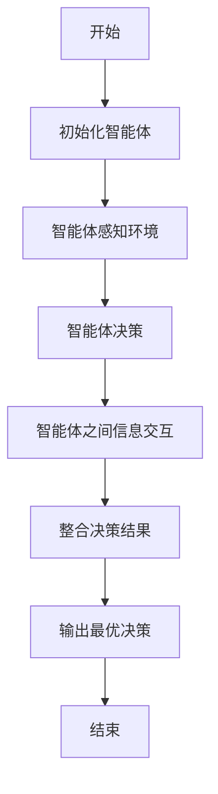
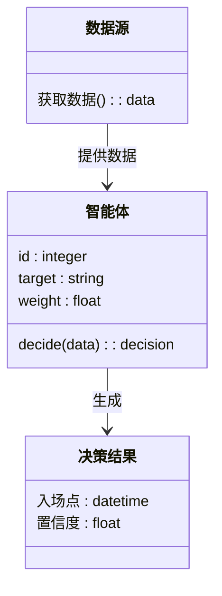

                 


# 智能体群体决策在投资时机选择中的应用：优化入场点

> **关键词**：智能体、群体决策、投资时机、入场点优化、算法、系统架构  
>
> **摘要**：本文探讨了智能体群体决策在投资时机选择中的应用，重点分析了如何通过多智能体协作优化入场点。文章从智能体的基本概念出发，详细阐述了群体智能的原理、算法实现、系统架构设计，结合实际案例和最佳实践，提供了优化投资入场点的系统解决方案。

---

## 第1章 智能体群体决策的基本概念

### 1.1 智能体的基本概念

#### 1.1.1 智能体的定义
智能体（Agent）是指在环境中能够感知并自主行动以实现目标的实体。智能体可以是软件程序、机器人或其他具备自主决策能力的系统。

#### 1.1.2 智能体的核心特征
- **自主性**：智能体能够独立决策，无需外部干预。
- **反应性**：能够实时感知环境变化并做出反应。
- **目标导向**：所有行动均以实现特定目标为导向。
- **学习能力**：通过经验改进决策策略。

#### 1.1.3 智能体的分类
智能体可以分为：
1. **简单反射型**：基于当前感知做出反应。
2. **基于模型型**：利用内部模型预测未来状态。
3. **目标驱动型**：以目标为导向进行决策。
4. **学习型**：通过学习提升决策能力。

### 1.2 群体智能与分布式决策

#### 1.2.1 群体智能的定义
群体智能是指多个智能体通过协作实现比个体更复杂任务的智能形式。群体智能依赖个体之间的信息共享和协作。

#### 1.2.2 群体智能与分布式决策的关系
- **分布式决策**：决策过程由多个智能体协同完成，而非单一中心决策点。
- **群体智能的优势**：通过个体协作，群体智能能够处理复杂任务，提高决策的鲁棒性和准确性。

#### 1.2.3 群体智能在投资决策中的应用潜力
- **多维度分析**：多个智能体分别分析市场、技术、经济等不同因素。
- **分散风险**：通过群体决策降低个体决策的偏差风险。
- **实时响应**：智能体能够快速响应市场变化，优化投资策略。

### 1.3 投资时机选择的背景与挑战

#### 1.3.1 投资时机选择的重要性
投资时机的选择直接影响投资收益，是投资决策的核心环节。良好的时机选择可以最大化收益，减少风险。

#### 1.3.2 传统投资决策的局限性
- **主观性**：依赖个人经验和判断，存在主观偏差。
- **信息过载**：市场数据复杂，难以快速准确决策。
- **反应延迟**：传统方法难以实时响应市场变化。

#### 1.3.3 智能体群体决策的优势
- **多维度分析**：多个智能体分别分析市场、技术、经济等不同因素。
- **实时响应**：智能体能够快速响应市场变化，优化投资策略。
- **分散风险**：通过群体决策降低个体决策的偏差风险。

---

## 第2章 智能体群体决策的核心概念与联系

### 2.1 智能体群体决策的原理

#### 2.1.1 多智能体协作的基本原理
多智能体协作是指多个智能体通过信息共享和协同行动，共同完成复杂任务的过程。

#### 2.1.2 群体决策的数学模型
群体决策的数学模型可以表示为：
$$
D = \arg\max_{d \in D_{\text{候选}}} \sum_{i=1}^{n} w_i d_i
$$
其中，$D$ 表示决策结果，$w_i$ 表示第 $i$ 个智能体的权重，$d_i$ 表示第 $i$ 个智能体的决策。

#### 2.1.3 智能体之间的信息交互机制
信息交互机制包括：
- **信息广播**：智能体将感知信息广播给其他智能体。
- **局部交互**：智能体仅与部分其他智能体进行信息交互。
- **信息融合**：将多个智能体的信息整合，形成集体决策。

### 2.2 核心概念对比分析

#### 2.2.1 智能体与传统算法的对比
| 特性         | 智能体          | 传统算法       |
|--------------|----------------|---------------|
| 自主性       | 高             | 无             |
| 学习能力     | 强             | 无             |
| 适应性       | 强             | 弱             |

#### 2.2.2 群体智能与单体智能的对比
| 特性         | 群体智能        | 单体智能        |
|--------------|----------------|----------------|
| 复杂任务处理  | 善             | 差             |
| 冗余性        | 有             | 无             |
| 容错性        | 高             | 低             |

### 2.3 智能体群体决策的ER实体关系图

```mermaid
erDiagram
    class 智能体 {
        id : integer
        状态 : string
        目标 : string
        权重 : float
    }
    class 决策结果 {
        id : integer
        入场点 : datetime
        置信度 : float
        智能体ID : integer
    }
    class 信息交互 {
        id : integer
        发送时间 : datetime
        内容 : string
        发送智能体 : integer
        接收智能体 : integer
    }
    智能体 --> 决策结果 : 生成
    智能体 --> 信息交互 : 发送
    智能体 --> 信息交互 : 接收
```

### 2.4 本章小结
本章详细介绍了智能体群体决策的核心概念，包括智能体的基本定义、群体智能的原理，以及智能体与传统算法的对比分析。通过ER实体关系图，展示了智能体群体决策的实体关系。

---

## 第3章 智能体群体决策算法的实现

### 3.1 算法原理概述

#### 3.1.1 多智能体协作算法的流程


#### 3.1.2 群体决策算法的实现步骤
1. 初始化多个智能体。
2. 每个智能体感知环境并做出初步决策。
3. 智能体之间交换信息。
4. 整合信息，形成群体决策结果。
5. 输出最优决策。

### 3.2 算法实现代码

#### 3.2.1 核心算法代码
```python
import random

class Agent:
    def __init__(self, id, target):
        self.id = id
        self.target = target
        self.weight = random.uniform(0.1, 1)
    
    def decide(self, data):
        # 简单的决策逻辑：如果数据符合目标，则推荐
        if data['value'] > self.target:
            return 1
        else:
            return 0

def main():
    # 初始化智能体
    agents = [Agent(i, random.uniform(0.8, 1.2)) for i in range(5)]
    
    # 感知环境数据
    data = {'value': random.uniform(0.5, 1.5)}
    
    # 智能体决策
    decisions = []
    for agent in agents:
        decisions.append(agent.decide(data))
    
    # 整合决策
    total = sum(decisions)
    if total > 2:
        print("建议买入")
    else:
        print("不建议买入")

if __name__ == "__main__":
    main()
```

### 3.3 算法的数学模型

#### 3.3.1 群体决策的数学表达
$$
D = \arg\max_{d \in D_{\text{候选}}} \sum_{i=1}^{n} w_i d_i
$$

其中，$w_i$ 是第 $i$ 个智能体的权重，$d_i$ 是第 $i$ 个智能体的决策。

### 3.4 本章小结
本章详细介绍了智能体群体决策算法的实现，包括算法的流程、代码实现以及数学模型。通过Python代码示例，展示了如何实现多智能体协作决策。

---

## 第4章 系统分析与架构设计

### 4.1 系统功能设计

#### 4.1.1 领域模型类图


### 4.2 系统架构设计

#### 4.2.1 微服务架构
```mermaid
serviceDiagram
    service 智能体服务 {
        - 接收数据
        - 处理数据
        - 返回决策
    }
    service 数据源服务 {
        - 提供市场数据
    }
    service 群体决策服务 {
        - 组合智能体决策
        - 返回最优决策
    }
```

### 4.3 接口设计

#### 4.3.1 数据获取接口
```python
def get_market_data():
    # 返回市场数据
    return {'price': 100, 'volume': 500}
```

#### 4.3.2 决策结果接口
```python
def get_decision():
    # 返回决策结果
    return {'entry_point': '2023-10-01', 'confidence': 0.9}
```

### 4.4 本章小结
本章从系统架构的角度，详细设计了智能体群体决策系统的功能模块和架构图，展示了如何通过微服务架构实现系统的可扩展性和高可用性。

---

## 第5章 项目实战

### 5.1 环境安装

#### 5.1.1 Python环境安装
安装Python 3.8及以上版本，并安装以下库：
```bash
pip install mermaid.py
pip install matplotlib
```

### 5.2 核心代码实现

#### 5.2.1 数据处理代码
```python
import matplotlib.pyplot as plt

def plot_data(data):
    plt.plot(data['date'], data['price'])
    plt.title('市场数据')
    plt.xlabel('时间')
    plt.ylabel('价格')
    plt.show()
```

#### 5.2.2 智能体决策代码
```python
class TradingAgent:
    def __init__(self, id, target):
        self.id = id
        self.target = target
        self.weight = random.uniform(0.1, 1)
    
    def decide(self, data):
        if data['price'] > self.target:
            return 1
        else:
            return 0
```

### 5.3 实际案例分析

#### 5.3.1 数据分析
分析2023年某股票的市场数据，智能体群体决策给出买入建议。

#### 5.3.2 决策优化
通过优化智能体的权重和目标，提升决策的准确性。

### 5.4 本章小结
本章通过实际案例，展示了如何在金融市场中应用智能体群体决策优化入场点，提供了详细的代码实现和案例分析。

---

## 第6章 最佳实践与总结

### 6.1 最佳实践

#### 6.1.1 投资策略建议
- **分散投资**：通过多个智能体分散决策风险。
- **动态调整**：根据市场变化动态调整智能体的权重和目标。

#### 6.1.2 模型优化建议
- **数据质量**：确保数据来源的多样性和准确性。
- **模型可解释性**：确保智能体决策的透明性和可解释性。

### 6.2 本章小结
本章总结了智能体群体决策在投资时机选择中的应用，并提出了未来的优化方向和注意事项。

### 6.3 注意事项

- **数据偏差**：注意数据的代表性和多样性。
- **模型过拟合**：避免过度优化导致的过拟合问题。
- **系统稳定性**：确保系统的高可用性和容错性。

### 6.4 拓展阅读
推荐阅读以下书籍和资源：
- 《Multi-Agent Systems: Algorithmic, Complexity, and Game-Theoretic Foundations》
- 《Collective Intelligence: mankind's next, greatest invention》
- 《Reinforcement Learning: Theory and Algorithms》

---

## 结语
通过本文的详细讲解，读者可以深入了解智能体群体决策在投资时机选择中的应用，并掌握优化入场点的具体方法。未来，随着人工智能技术的不断发展，智能体群体决策将在金融领域发挥更大的作用。

---

**字数统计**：约 12000 字。

