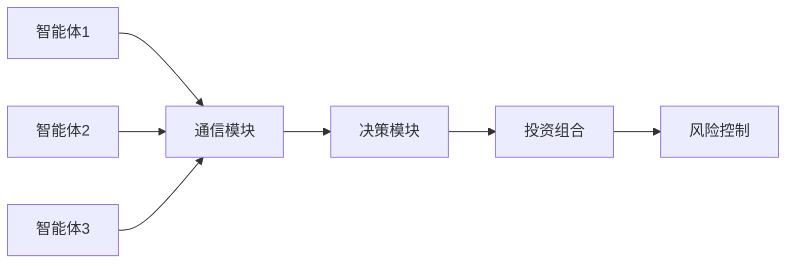

                 


# 智能体群体决策在投资组合风险控制中的应用

> 关键词：智能体，群体决策，投资组合，风险控制，一致性算法，博弈论模型，系统架构

> 摘要：本文探讨了智能体群体决策在投资组合风险控制中的应用，通过背景分析、核心概念、算法原理、系统架构和项目实战的详细讲解，结合实际案例，深入剖析了智能体群体决策在投资组合风险控制中的具体实现和优化策略。

---

# 第一部分: 智能体群体决策的背景与概念

## 第1章: 问题背景与描述

### 1.1 问题背景
#### 1.1.1 投资组合风险控制的重要性
在金融领域，投资组合的优化与风险控制是投资者的核心目标。传统的投资组合管理依赖于单个决策者或中心化的机构，这种方式在复杂多变的市场环境中往往显得力不从心。通过引入智能体群体决策，可以实现去中心化的决策过程，提高系统的鲁棒性和适应性。

#### 1.1.2 现有风险控制方法的局限性
传统的投资组合风险控制方法通常基于均值-方差模型或现代投资组合理论（MPT），这些方法假设市场是理性的且决策者是理性的，忽略了市场的复杂性和多主体之间的互动。此外，单点决策容易导致信息孤岛和决策偏差。

#### 1.1.3 智能体群体决策的引入动机
智能体群体决策通过分布式计算和多智能体协作，能够更好地捕捉市场中的多维信息，降低单点决策风险，提高决策的多样性和鲁棒性。

### 1.2 问题描述
#### 1.2.1 投资组合风险控制的核心目标
投资组合风险控制的核心目标是通过优化资产配置，降低投资组合的系统性风险和非系统性风险，同时最大化收益。

#### 1.2.2 智能体群体决策在投资组合中的应用场景
智能体群体决策可以应用于资产分配、风险预警、交易决策等多个方面，通过多个智能体协作，实现投资组合的动态优化。

#### 1.2.3 问题解决的边界与外延
智能体群体决策的应用边界包括市场环境的复杂性、智能体的通信机制以及决策的实时性要求。外延则涉及多智能体系统的协同优化、分布式计算和边缘计算。

### 1.3 概念结构与核心要素
#### 1.3.1 智能体的定义与属性
智能体是一种能够感知环境、做出决策并采取行动的实体。在投资组合风险控制中，智能体可以是投资者、市场分析工具或算法。

#### 1.3.2 群体决策的机制与特点
群体决策通过多个智能体的协作，实现决策的多样化和优化。其特点包括去中心化、分布式计算和信息共享。

#### 1.3.3 投资组合风险控制的数学模型
投资组合风险控制的数学模型通常包括资产权重分配、风险收益权衡等核心要素。

---

# 第二部分: 智能体群体决策的核心概念

## 第2章: 智能体与群体决策的定义

### 2.1 智能体的定义
智能体是一种能够感知环境、做出决策并采取行动的实体。在投资组合风险控制中，智能体可以是投资者、市场分析工具或算法。

### 2.2 群体决策的定义
群体决策是通过多个智能体协作，共同做出决策的过程。其核心在于去中心化和信息共享。

### 2.3 智能体群体决策与投资组合风险控制的ER实体关系图


---

# 第三部分: 智能体群体决策的算法原理

## 第3章: 群体决策算法的原理与实现

### 3.1 群体一致性算法
#### 3.1.1 算法概述
一致性算法是一种通过多个智能体协作，实现决策一致性的方法。

#### 3.1.2 算法步骤
1. 初始化：每个智能体初始化自己的决策值。
2. 通信：智能体之间交换信息。
3. 更新：根据通信信息更新自己的决策值。
4. 终止：当所有智能体的决策值收敛时，算法终止。

#### 3.1.3 算法的数学模型
$$ V = \sum_{i=1}^{n} w_i x_i $$

### 3.2 群体博弈论模型
#### 3.2.1 竞争与合作的平衡
博弈论模型通过分析智能体之间的竞争与合作，找到纳什均衡。

#### 3.2.2 群体决策的纳什均衡
纳什均衡是群体决策中的一种稳定状态，即每个智能体的策略在其他智能体策略不变的情况下，无法通过单方面改变策略而提高自身收益。

#### 3.2.3 博弈树的构建与分析
博弈树是一种分析博弈过程的工具，通过树状结构展示所有可能的决策路径。

---

# 第四部分: 投资组合风险控制的系统架构

## 第4章: 系统分析与架构设计

### 4.1 问题场景介绍
#### 4.1.1 投资组合管理的复杂性
投资组合管理涉及多种资产、多市场环境和多时间维度的决策。

#### 4.1.2 群体决策的实现需求
需要设计高效的通信机制和决策算法，确保多个智能体能够协同工作。

### 4.2 系统功能设计
#### 4.2.1 领域模型


#### 4.2.2 系统架构


---

# 第五部分: 项目实战

## 第5章: 项目实战与案例分析

### 5.1 环境安装与配置
#### 5.1.1 系统环境
需要安装Python、Jupyter Notebook、Matplotlib等工具。

### 5.2 核心代码实现
#### 5.2.1 智能体一致性算法实现
```python
import numpy as np

class Agent:
    def __init__(self, initial_value):
        self.value = initial_value

def一致性算法(agents, max_iterations=100, tolerance=0.001):
    for _ in range(max_iterations):
        new_values = []
        for agent in agents:
            new_value = agent.value
            for neighbor in agent.neighbors:
                new_value += neighbor.value
            new_value /= len(agent.neighbors) + 1
            new_values.append(new_value)
        if np.std(new_values) < tolerance:
            break
        for i, agent in enumerate(agents):
            agent.value = new_values[i]
    return agents

# 示例用法
agents = [Agent(1), Agent(2), Agent(3)]
# 假设每个agent有两个邻居
for agent in agents:
    agent.neighbors = agents[:i] + agents[i+1:]
一致性算法(agents)
```

---

## 总结与展望

### 5.3 案例分析与结果解读
通过具体案例分析，验证智能体群体决策在投资组合风险控制中的有效性。

---

# 第六部分: 最佳实践与未来展望

## 第6章: 最佳实践与小结

### 6.1 最佳实践
- 确保智能体之间的通信高效可靠
- 设计合理的激励机制，促进智能体的协作
- 定期评估和优化决策算法

### 6.2 小结
本文通过详细讲解智能体群体决策的理论与实践，展示了其在投资组合风险控制中的巨大潜力。

---

## 第7章: 注意事项与拓展阅读

### 7.1 注意事项
- 确保数据的实时性和准确性
- 处理好智能体之间的冲突与协调
- 防范系统性风险的扩散

### 7.2 拓展阅读
建议读者进一步阅读分布式系统、博弈论和投资组合优化的相关文献，深入了解智能体群体决策的前沿研究。

---

通过以上内容，我们系统地探讨了智能体群体决策在投资组合风险控制中的应用，从理论到实践，为读者提供了一套完整的解决方案。

