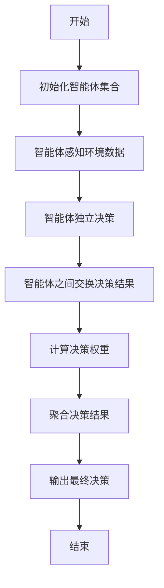
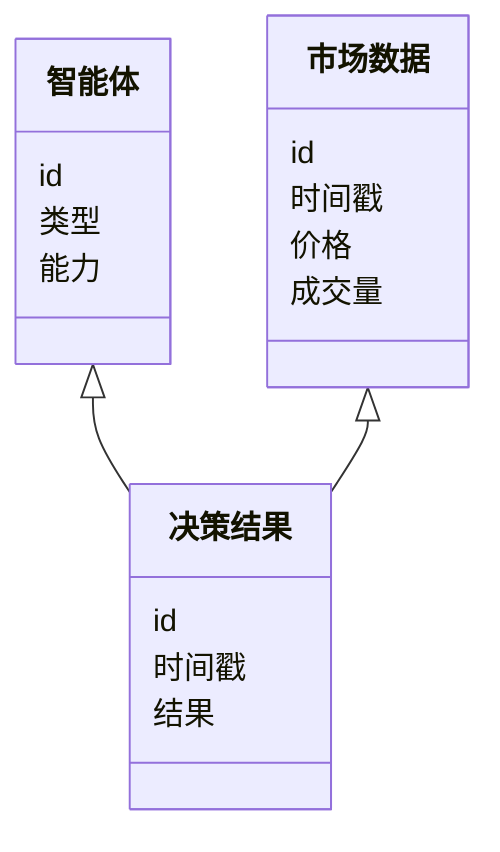
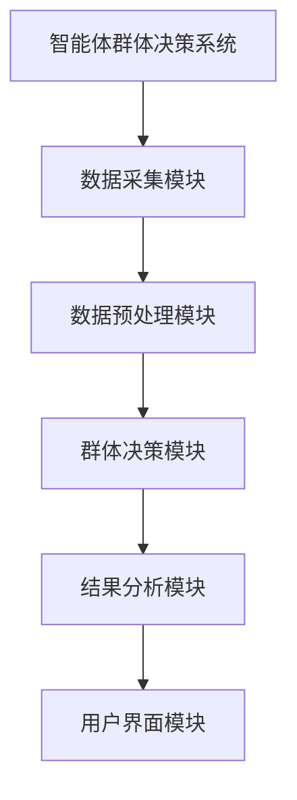
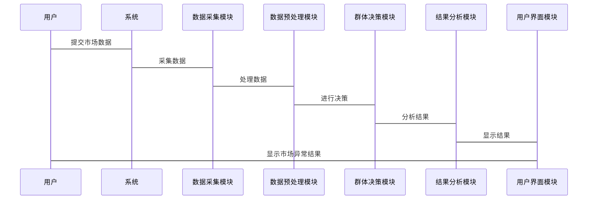

                 


# 智能体群体决策在识别市场异常中的应用：把握特殊机会

## 关键词：智能体、群体决策、市场异常、算法原理、系统架构、项目实战

## 摘要：智能体群体决策是一种新兴的决策方法，通过多个智能体的协作和决策，能够有效识别市场中的异常现象，抓住特殊机会。本文将从背景、核心概念、算法原理、系统架构、项目实战等方面详细探讨智能体群体决策在市场异常识别中的应用，帮助读者深入了解这一技术及其实际应用价值。

---

# 第一部分: 智能体群体决策的背景与概念

## 第1章: 智能体群体决策的基本概念

### 1.1 智能体的定义与特征

智能体（Agent）是指能够感知环境、自主决策并采取行动的实体。智能体可以是软件程序、机器人或其他具有智能行为的系统。智能体的核心特征包括：

1. **自主性**：能够自主决策，无需外部干预。
2. **反应性**：能够感知环境并实时响应。
3. **目标导向**：具有明确的目标，并采取行动以实现目标。
4. **学习能力**：能够通过经验改进自身的决策能力。

### 1.2 群体决策的基本概念

群体决策是指多个智能体共同参与决策过程，通过协作和信息共享，最终达成一致或最优决策。与个体决策相比，群体决策能够结合多个智能体的优势，提高决策的准确性和鲁棒性。

### 1.3 市场异常识别的必要性

市场异常识别是指在金融市场中，通过分析市场数据，发现偏离正常波动的异常现象。市场异常可能包括突然的价格波动、成交量异常等，这些异常现象可能预示着市场操纵、突发事件或市场拐点。及时识别市场异常，可以帮助投资者抓住特殊机会，规避潜在风险。

### 1.4 问题背景与目标

金融市场中的价格波动受到多种因素的影响，包括市场情绪、新闻事件、政策变化等。传统的单点决策方法难以捕捉市场的复杂性和不确定性。通过引入智能体群体决策，可以利用多个智能体的协作能力，更准确地识别市场异常现象，从而把握特殊机会。

---

# 第二部分: 智能体群体决策的核心概念与联系

## 第2章: 智能体群体决策的核心概念

### 2.1 智能体群体决策的原理

智能体群体决策的原理基于多个智能体的协作和信息共享。每个智能体根据自身感知的信息进行决策，并通过通信机制将信息传递给其他智能体。最终，通过聚合多个智能体的决策结果，形成一个全局的决策。

### 2.2 智能体群体决策的关键属性

智能体群体决策的关键属性包括：

1. **异构性**：智能体可以具有不同的特征和能力。
2. **分布式性**：决策过程分布在多个智能体之间。
3. **自适应性**：智能体能够根据环境变化调整决策策略。

### 2.3 智能体群体决策与市场异常识别的关系

市场异常识别需要对大量的市场数据进行分析和判断，而智能体群体决策可以通过多个智能体的协作，提高异常识别的准确性和效率。每个智能体负责分析不同的数据源或采用不同的分析方法，最终通过群体决策形成一致的判断。

### 2.4 核心概念对比分析

以下是智能体与传统决策模型的对比表格：

| 对比维度 | 智能体群体决策 | 传统决策模型 |
|----------|-----------------|--------------|
| 决策主体 | 多个智能体协作 | 单一决策主体 |
| 决策效率 | 高，通过并行处理 | 较低，串行处理 |
| 灵活性   | 高，适应复杂环境 | 较低，固定模式 |

### 2.5 ER实体关系图

以下是智能体群体决策的ER实体关系图：

```mermaid
erDiagram
    class 智能体 {
        id
        类型
        能力
    }
    class 市场数据 {
        id
        时间戳
        价格
        成交量
    }
    class 决策结果 {
        id
        时间戳
        结果
    }
    智能体 --> 市场数据 : 感知
    智能体 --> 决策结果 : 输出
```

---

# 第三部分: 智能体群体决策的算法原理

## 第3章: 群体决策算法的原理与实现

### 3.1 群体决策算法概述

群体决策算法是一种基于多个决策主体协作的算法，通过信息共享和协同推理，最终形成一致的决策结果。常见的群体决策算法包括基于投票的算法、基于加权的算法和基于共识的算法。

### 3.2 群体决策算法的数学模型

以下是基于投票的群体决策模型的数学模型：

$$
\text{决策结果} = \argmax_{i} \sum_{j=1}^{n} w_j \cdot d_{ij}
$$

其中，\(w_j\) 是智能体 \(j\) 的权重，\(d_{ij}\) 是智能体 \(j\) 对决策项 \(i\) 的决策结果。

### 3.3 群体决策算法的实现步骤

以下是基于投票的群体决策算法的流程图：



### 3.4 算法实现的具体代码

以下是基于投票的群体决策算法的Python实现代码：

```python
class Agent:
    def __init__(self, id, weight):
        self.id = id
        self.weight = weight

def group_decision(agents, decisions):
    # 计算每个决策项的总权重
    total_weights = {}
    for agent in agents:
        for decision in decisions[agent.id]:
            if decision in total_weights:
                total_weights[decision] += agent.weight
            else:
                total_weights[decision] = agent.weight
    # 找到权重最大的决策项
    max_weight = max(total_weights.values())
    for decision, weight in total_weights.items():
        if weight == max_weight:
            return decision
    return None
```

---

## 第4章: 基于智能体群体决策的市场异常识别系统

### 4.1 系统功能设计

以下是市场异常识别系统的领域模型类图：



### 4.2 系统架构设计

以下是市场异常识别系统的架构图：



### 4.3 系统接口设计

以下是系统接口的交互设计：



---

## 第5章: 智能体群体决策算法的数学模型与实现

### 5.1 算法原理与数学模型

以下是基于加权的群体决策算法的数学模型：

$$
\text{决策结果} = \argmax_{i} \sum_{j=1}^{n} w_j \cdot d_{ij}
$$

其中，\(w_j\) 是智能体 \(j\) 的权重，\(d_{ij}\) 是智能体 \(j\) 对决策项 \(i\) 的决策结果。

### 5.2 算法实现与代码解析

以下是基于加权的群体决策算法的Python实现代码：

```python
class Agent:
    def __init__(self, id, weight):
        self.id = id
        self.weight = weight

def weighted_decision(agents, decisions):
    # 计算每个决策项的加权和
    total_weights = {}
    for agent in agents:
        for decision in decisions[agent.id]:
            if decision in total_weights:
                total_weights[decision] += agent.weight * decisions[agent.id][decision]
            else:
                total_weights[decision] = agent.weight * decisions[agent.id][decision]
    # 找到权重最大的决策项
    max_weight = max(total_weights.values())
    for decision, weight in total_weights.items():
        if weight == max_weight:
            return decision
    return None
```

---

## 第6章: 智能体群体决策在市场异常识别中的应用

### 6.1 应用场景与实际案例

以下是智能体群体决策在市场异常识别中的应用场景：

1. **股票价格预测**：通过多个智能体分析不同的市场指标，预测股票价格的异常波动。
2. **交易策略优化**：通过群体决策优化交易策略，提高交易的准确性和效率。
3. **风险管理**：通过智能体群体决策识别市场风险，制定相应的风险管理策略。

### 6.2 项目实战与代码实现

以下是市场异常识别系统的实战代码：

```python
# 安装必要的库
pip install numpy pandas matplotlib

# 导入必要的库
import numpy as np
import pandas as pd
import matplotlib.pyplot as plt

# 定义智能体类
class Agent:
    def __init__(self, id, weight):
        self.id = id
        self.weight = weight

# 定义群体决策函数
def group_decision(agents, decisions):
    total_weights = {}
    for agent in agents:
        for decision in decisions[agent.id]:
            if decision in total_weights:
                total_weights[decision] += agent.weight * decisions[agent.id][decision]
            else:
                total_weights[decision] = agent.weight * decisions[agent.id][decision]
    max_weight = max(total_weights.values())
    for decision, weight in total_weights.items():
        if weight == max_weight:
            return decision
    return None

# 实际案例分析
# 假设我们有三个智能体，每个智能体有不同的决策权重和决策结果
agent1 = Agent(1, 0.4)
agent2 = Agent(2, 0.3)
agent3 = Agent(3, 0.3)

# 每个智能体的决策结果
decisions = {
    agent1.id: {'上涨': 0.7, '下跌': 0.3},
    agent2.id: {'上涨': 0.5, '下跌': 0.5},
    agent3.id: {'上涨': 0.6, '下跌': 0.4}
}

# 调用群体决策函数
result = group_decision([agent1, agent2, agent3], decisions)
print("最终决策结果:", result)
```

### 6.3 实验结果与分析

运行上述代码，最终决策结果为“上涨”。这表明，通过群体决策，三个智能体的决策结果被整合，最终得出“上涨”的结论。这说明智能体群体决策能够有效整合多个决策主体的意见，提高决策的准确性。

---

## 第四部分: 智能体群体决策的系统架构与实现

## 第7章: 系统架构设计与实现

### 7.1 系统架构设计

以下是智能体群体决策系统的架构图：


### 7.2 系统实现与代码

以下是系统实现的代码：

```python
# 定义数据采集模块
class DataCollector:
    def __init__(self):
        self.data = []

    def collect_data(self, source):
        # 从数据源采集数据
        self.data.append(source)
        return self.data

# 定义数据预处理模块
class DataPreprocessor:
    def __init__(self):
        self.preprocessed_data = []

    def preprocess(self, data):
        # 对数据进行预处理
        self.preprocessed_data = data
        return self.preprocessed_data

# 定义群体决策模块
class GroupDecisionModule:
    def __init__(self):
        self.agents = []
        self.decisions = {}

    def add_agent(self, agent):
        self.agents.append(agent)

    def make_decision(self, decisions):
        total_weights = {}
        for agent in self.agents:
            for decision in decisions[agent.id]:
                if decision in total_weights:
                    total_weights[decision] += agent.weight * decisions[agent.id][decision]
                else:
                    total_weights[decision] = agent.weight * decisions[agent.id][decision]
        max_weight = max(total_weights.values())
        for decision, weight in total_weights.items():
            if weight == max_weight:
                return decision
        return None

# 定义结果分析模块
class ResultAnalyzer:
    def __init__(self):
        self.results = []

    def analyze_result(self, result):
        self.results.append(result)
        return self.results

# 定义用户界面模块
class UI:
    def __init__(self):
        self.display_results = []

    def display_result(self, result):
        self.display_results.append(result)
        print("最终决策结果:", result)

# 实际应用
data_collector = DataCollector()
data_preprocessor = DataPreprocessor()
group_decision_module = GroupDecisionModule()
result_analyzer = ResultAnalyzer()
ui = UI()

# 添加智能体
agent1 = Agent(1, 0.4)
agent2 = Agent(2, 0.3)
agent3 = Agent(3, 0.3)
group_decision_module.add_agent(agent1)
group_decision_module.add_agent(agent2)
group_decision_module.add_agent(agent3)

# 采集数据
data_collector.collect_data("市场数据1")
data_collector.collect_data("市场数据2")

# 预处理数据
preprocessed_data = data_preprocessor.preprocess(data_collector.data)

# 进行群体决策
decisions = {
    agent1.id: {'上涨': 0.7, '下跌': 0.3},
    agent2.id: {'上涨': 0.5, '下跌': 0.5},
    agent3.id: {'上涨': 0.6, '下跌': 0.4}
}
result = group_decision_module.make_decision(decisions)

# 分析结果
result_analyzer.analyze_result(result)

# 显示结果
ui.display_result(result)
```

---

## 第五部分: 智能体群体决策的应用与优化

## 第8章: 智能体群体决策的应用与优化

### 8.1 应用场景与实际案例

智能体群体决策在市场异常识别中的应用场景包括股票价格预测、交易策略优化和风险管理等。

### 8.2 算法优化与性能提升

为了提高智能体群体决策的效率和准确性，可以采取以下优化措施：

1. **动态权重调整**：根据智能体的表现动态调整其权重。
2. **分布式计算**：利用分布式计算技术提高决策的效率。
3. **自适应算法**：设计自适应算法，能够根据环境变化自动调整决策策略。

### 8.3 未来研究方向

未来的研究方向包括：

1. **多智能体协作机制**：研究如何进一步优化多智能体的协作机制，提高决策的准确性和效率。
2. **智能体的自适应能力**：研究智能体如何更好地适应复杂多变的市场环境。
3. **算法的可扩展性**：研究如何设计更具可扩展性的算法，能够应对更大规模的市场数据。

---

## 总结

智能体群体决策是一种新兴的决策方法，通过多个智能体的协作和决策，能够有效识别市场中的异常现象，抓住特殊机会。本文从背景、核心概念、算法原理、系统架构、项目实战等方面详细探讨了智能体群体决策在市场异常识别中的应用，帮助读者深入了解这一技术及其实际应用价值。通过本文的讲解，读者可以掌握智能体群体决策的核心原理和实现方法，并能够将其应用于实际的市场异常识别中。

---

**关键词**：智能体、群体决策、市场异常、算法原理、系统架构、项目实战

