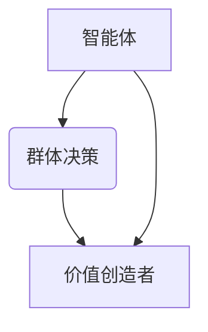
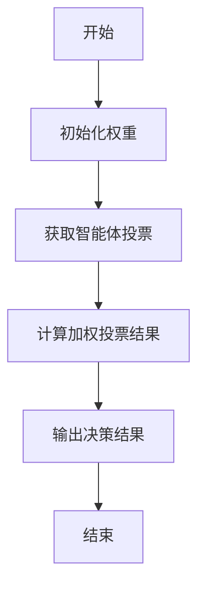
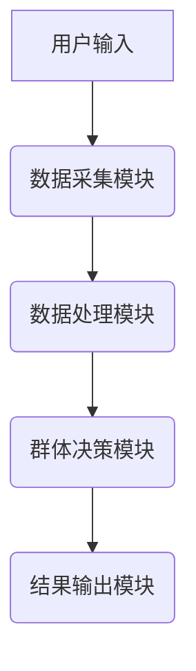

                 


# 智能体群体决策在识别长期价值创造者中的应用

## 关键词：智能体群体决策、长期价值创造者、算法原理、系统架构、项目实战

## 摘要：  
随着人工智能和群体智能技术的快速发展，智能体群体决策在识别长期价值创造者中的应用越来越广泛。本文通过分析智能体群体决策的核心概念、算法原理、系统架构以及实际项目案例，深入探讨其在识别长期价值创造者中的应用场景和实现方法。通过理论与实践相结合的方式，为读者提供一个全面理解智能体群体决策的视角。

---

## 第一部分：背景与核心概念

### 第1章：智能体群体决策的背景与问题描述

#### 1.1 智能体群体决策的定义与背景
智能体群体决策是指多个智能体通过协同工作，基于个体行为和群体智慧，共同完成决策的过程。与传统决策方法相比，智能体群体决策具有分布式、去中心化和自适应的特点，能够在复杂环境中做出更优的决策。

#### 1.2 问题背景与目标
在识别长期价值创造者的过程中，传统的决策方法往往依赖于个体的主观判断或简单的统计分析，存在信息不充分、决策不准确等问题。智能体群体决策通过结合多个智能体的决策结果，能够更全面地评估一个人或实体的长期价值。

#### 1.3 核心概念与边界
- **智能体**：具有感知环境、自主决策和学习能力的实体。
- **群体决策**：多个智能体通过交互和协作，共同完成决策的过程。
- **长期价值创造者**：能够在较长的时间周期内持续创造价值的个体或实体。

---

### 第2章：智能体、群体决策与价值创造者的关系

#### 2.1 核心概念的原理
- 智能体通过感知环境和与其他智能体交互，获取信息并做出决策。
- 群体决策通过整合多个智能体的决策结果，形成最终的决策方案。
- 价值创造者通过长期的行为表现和贡献，被智能体群体识别并推荐。

#### 2.2 概念对比分析
| 概念 | 特征 | 描述 |
|------|------|------|
| 智能体 | 主动性 | 具备自主决策能力 |
| 群体决策 | 分布式 | 基于多个个体的决策结果 |
| 价值创造者 | 长期性 | 能够持续创造价值 |

#### 2.3 实体关系图（ER图）



---

## 第二部分：算法原理讲解

### 第3章：智能体群体决策算法的原理与实现

#### 3.1 基于加权投票的决策算法
- **算法思路**：每个智能体根据自己的判断给出一个投票，投票权重基于智能体的能力和历史表现。
- **公式**：$$w_i = \frac{1}{1 + e^{-k(x_i - t)}}$$，其中，$k$ 是学习率，$t$ 是阈值，$x_i$ 是智能体 $i$ 的属性。

#### 3.2 算法实现步骤



#### 3.3 代码实现

```python
import numpy as np

def weighted_vote(weight_matrix):
    # 计算每个智能体的权重
    weights = []
    for w in weight_matrix:
        numerator = 1
        denominator = 1 + np.exp(-k * (w - t))
        weights.append(numerator / denominator)
    # 计算加权投票结果
    weighted_sum = sum(weights)
    return weighted_sum
```

---

## 第三部分：系统分析与架构设计

### 第4章：智能体群体决策系统的架构与实现

#### 4.1 问题场景介绍
- 识别长期价值创造者需要处理海量数据，包括行为数据、历史表现等。

#### 4.2 系统功能设计
- 数据采集模块：采集智能体的行为数据和决策结果。
- 数据处理模块：清洗和预处理数据，提取特征。
- 群体决策模块：基于算法对数据进行分析，生成决策结果。
- 结果输出模块：将决策结果输出，供用户或系统使用。

#### 4.3 系统架构设计



---

## 第四部分：项目实战

### 第5章：智能体群体决策系统的实现与案例分析

#### 5.1 项目环境搭建
- 安装Python和相关库（如numpy、pandas、scikit-learn）。

#### 5.2 核心代码实现

```python
import numpy as np
import pandas as pd
from sklearn.metrics import accuracy_score

# 示例数据：智能体的投票结果和权重
votes = np.array([0.8, 0.6, 0.9, 0.5])
weights = np.array([1, 2, 1, 0.5])

# 计算加权投票结果
def calculate_weighted_vote(votes, weights):
    weighted_votes = votes * weights
    total_weight = np.sum(weights)
    return np.sum(weighted_votes) / total_weight

# 执行计算
result = calculate_weighted_vote(votes, weights)
print(f"加权投票结果为：{result}")
```

#### 5.3 实际案例分析
- 通过一个实际案例，展示系统如何识别长期价值创造者。

---

## 第五部分：总结与展望

### 第6章：智能体群体决策的未来与发展

#### 6.1 本章总结
- 智能体群体决策在识别长期价值创造者中的应用具有广泛的应用前景。

#### 6.2 展望
- 随着人工智能技术的进步，智能体群体决策将在更多领域得到应用。

---

## 附录

### 附录A：术语表
- 智能体：能够感知环境并自主决策的实体。
- 群体决策：基于多个个体决策结果的决策方式。
- 长期价值创造者：能够持续创造价值的个体或实体。

### 附录B：工具安装指南
- Python安装指南。
- 相关库的安装命令。

### 附录C：参考文献
- 相关书籍和论文的参考文献。

---

## 结语
智能体群体决策在识别长期价值创造者中的应用是一个复杂而有趣的话题。通过本文的分析，读者可以深入了解其核心概念、算法原理和系统架构，并通过实际案例理解其应用价值。未来，随着人工智能技术的不断发展，智能体群体决策将在更多领域发挥重要作用。

