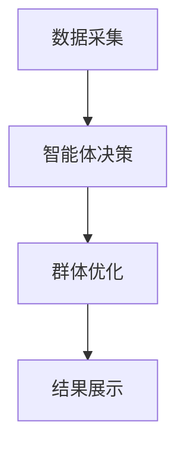

                 


# 智能体群体决策在资产配置优化中的应用：提高组合效率

> 关键词：智能体，群体决策，资产配置优化，组合效率，机器学习，金融建模

> 摘要：智能体群体决策是一种新兴的决策方法，通过多个智能体之间的协作与竞争，实现更优的决策结果。本文将探讨智能体群体决策在资产配置优化中的应用，分析其优势和挑战，结合实际案例，展示如何通过智能体群体决策提高投资组合的效率。

---

## 第1章：引言

### 1.1 智能体的基本概念
智能体（Agent）是指能够感知环境、自主决策并采取行动的实体。智能体可以是软件程序、机器人或其他能够执行特定任务的系统。

### 1.2 群体决策的定义与特点
群体决策是指多个智能体通过协作或竞争的方式，共同完成决策任务的过程。其特点包括分布式、去中心化、信息共享和自适应性。

### 1.3 资产配置优化的背景与挑战
资产配置是投资管理中的核心问题，旨在在不同资产类别之间分配资金，以实现风险和收益的最优平衡。传统方法依赖于历史数据和统计模型，但面临市场波动、数据噪声和模型风险等挑战。

---

## 第2章：智能体群体决策的理论基础

### 2.1 智能体的决策机制
智能体通过感知环境、分析信息、制定策略和执行行动来完成任务。群体决策则依赖于多个智能体之间的信息交互和协作。

### 2.2 群体决策的数学模型
群体决策可以通过以下模型描述：
$$
f(x) = \sum_{i=1}^{n} w_i x_i
$$
其中，$w_i$ 是第 $i$ 个智能体的权重，$x_i$ 是其决策。

### 2.3 智能体之间的信息交互
智能体通过共享信息或竞争资源实现协作。信息交互机制包括：
1. **信息共享**：智能体之间共享部分或全部信息。
2. **竞争机制**：智能体通过竞争优化决策结果。

---

## 第3章：资产配置优化的数学模型

### 3.1 资产配置的目标函数
资产配置的目标是在给定的约束条件下，最大化投资收益或最小化投资风险。数学表达为：
$$
\max \sum_{i=1}^{n} u_i s.t. \sum_{i=1}^{n} w_i = 1
$$
其中，$u_i$ 是第 $i$ 个资产的收益，$w_i$ 是其权重。

### 3.2 基于智能体的优化算法
智能体通过以下步骤优化资产配置：
1. **初始化**：设置智能体的初始权重。
2. **信息交互**：智能体共享或竞争信息。
3. **更新权重**：根据交互结果调整权重。
4. **收敛判断**：检查是否达到收敛条件。

### 3.3 群体决策的收敛性分析
通过数学推导可以证明，基于智能体的优化算法在一定条件下可以收敛到全局最优解。

---

## 第4章：智能体群体决策在资产配置中的应用

### 4.1 应用场景
智能体群体决策适用于多种资产配置场景，包括股票、债券、基金等多种资产类别。

### 4.2 实际案例分析
以股票投资为例，智能体通过以下步骤优化资产配置：
1. **数据采集**：获取历史价格、市场情绪等数据。
2. **智能体决策**：每个智能体基于数据生成投资策略。
3. **群体优化**：通过信息交互优化组合权重。
4. **结果评估**：计算投资组合的收益与风险。

### 4.3 与传统方法的对比
智能体群体决策相比传统方法，具有更高的灵活性和适应性，能够更好地应对市场变化。

---

## 第5章：系统架构与实现

### 5.1 系统设计
资产配置优化系统包括数据采集、智能体决策、群体优化和结果展示四个模块。

### 5.2 系统架构图


### 5.3 接口设计
系统接口包括数据输入接口、智能体交互接口和结果输出接口。

### 5.4 交互流程
1. **数据采集**：获取市场数据。
2. **智能体决策**：每个智能体生成决策。
3. **群体优化**：智能体通过交互优化组合。
4. **结果展示**：输出优化结果。

---

## 第6章：项目实战

### 6.1 环境安装
安装必要的Python库，如NumPy、Pandas、Matplotlib。

### 6.2 核心代码实现
```python
import numpy as np

class Agent:
    def __init__(self, weights):
        self.weights = weights

def optimize_portfolio(agents):
    while not converged:
        for agent in agents:
            agent.update_weights()
```

### 6.3 案例分析
以股票投资为例，展示如何通过智能体群体决策优化资产配置。

### 6.4 结果解读
分析优化结果，评估投资组合的收益与风险。

---

## 第7章：结论与展望

### 7.1 结论
智能体群体决策在资产配置优化中具有显著优势，能够提高投资组合的效率。

### 7.2 未来研究方向
1. **算法优化**：进一步提高智能体群体决策的效率。
2. **应用场景扩展**：探索更多金融领域的应用。

### 7.3 最佳实践 tips
1. **数据质量**：确保数据的准确性和完整性。
2. **算法选择**：根据具体问题选择合适的智能体算法。
3. **结果验证**：通过回测和风险评估验证优化效果。

### 7.4 小结
智能体群体决策是一种有潜力的资产配置优化方法，值得进一步研究和应用。

---

## 参考文献
1. 群体智能相关研究
2. 资产配置优化的学术论文
3. 相关技术书籍和文献

---

## 致谢
感谢读者的支持和关注，期待您的反馈与建议。

