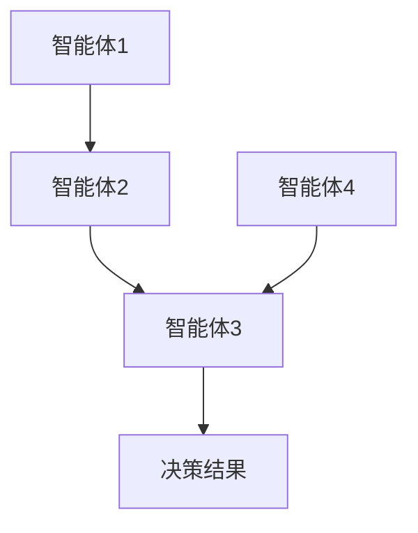
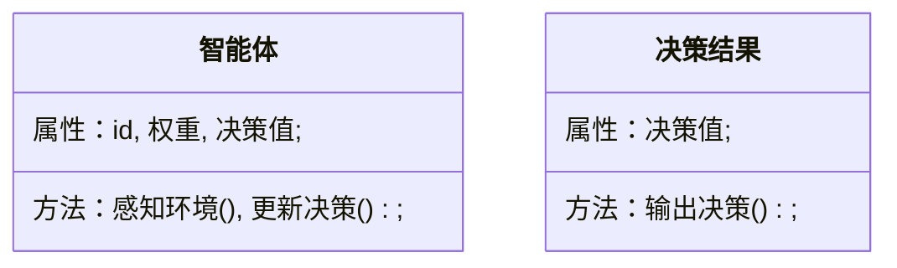
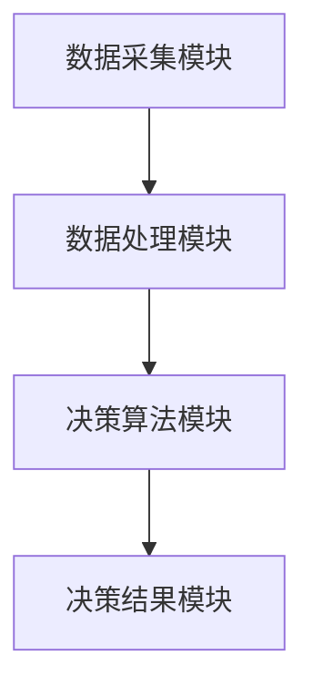
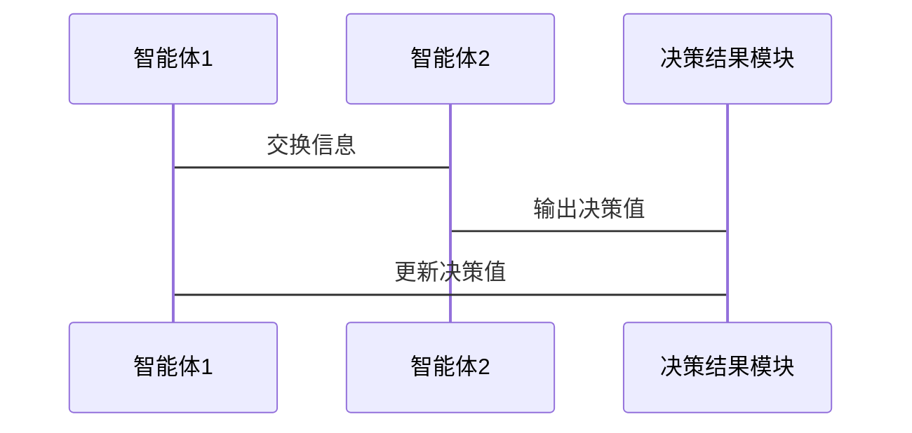

                 


# 智能体群体决策：平衡定量与定性分析在价值投资中的权重

---

## 关键词：
智能体，群体决策，定量分析，定性分析，价值投资，权重平衡，决策算法

---

## 摘要：
智能体群体决策是一种结合多个智能体协同工作的决策方式，旨在通过平衡定量分析与定性分析的权重，提高决策的准确性和鲁棒性。本文从智能体群体决策的核心概念出发，详细分析了定量与定性分析在价值投资中的平衡方法，探讨了相关算法的实现原理，并通过实际案例展示了系统架构设计与项目实现过程。最终，本文为读者提供了智能体群体决策在价值投资中的实践指导和优化建议。

---

## 第一部分：智能体群体决策的背景与核心概念

### 第1章：智能体群体决策的背景与问题描述

#### 1.1 智能体群体决策的背景
##### 1.1.1 从个体决策到群体决策的演进
- 个体决策的局限性：单个智能体的决策能力有限，容易受到信息不全和认知偏差的影响。
- 群体决策的优势：通过多个智能体的协同工作，能够整合更多信息，提高决策的全面性和准确性。

##### 1.1.2 智能体技术的发展与应用
- 智能体技术的演进：从简单的规则驱动到复杂的自主学习和自适应优化。
- 智能体在金融领域的应用：智能体用于金融数据挖掘、风险评估和投资决策。

##### 1.1.3 价值投资中的决策挑战
- 价值投资的核心：通过分析企业的基本面和市场趋势，寻找被低估的投资标的。
- 决策过程中的困难：信息不对称、市场波动和人为情绪的影响。

#### 1.2 问题背景与问题描述
##### 1.2.1 价值投资中的决策问题
- 数据驱动的决策需求：如何利用定量分析工具处理大量数据，发现投资机会。
- 主观判断的重要性：如何结合定性分析，评估企业的管理团队和市场竞争力。

##### 1.2.2 定量与定性分析的权重平衡
- 定量分析的优势：数据的客观性和可量化性，能够提供明确的决策依据。
- 定性分析的价值：帮助企业识别隐藏风险和市场趋势，提供长期战略视角。

##### 1.2.3 群体决策的必要性与优势
- 群体决策的必要性：单一智能体的决策能力有限，群体决策能够弥补个体决策的不足。
- 群体决策的优势：通过多智能体的协同工作，能够实现信息的充分共享和决策的优化。

#### 1.3 问题解决与边界条件
##### 1.3.1 群体决策的核心问题
- 如何实现多智能体之间的高效协同。
- 如何平衡定量与定性分析的权重，以提高决策的准确性和鲁棒性。

##### 1.3.2 定量与定性分析的结合
- 数据驱动的定量分析与经验驱动的定性分析的结合方式。
- 权重分配的原则：如何根据实际情况动态调整定量与定性分析的权重。

##### 1.3.3 决策过程中的边界与外延
- 决策的边界：如何在有限的时间和资源条件下，实现高效的群体决策。
- 决策的外延：群体决策在不同领域的应用潜力，以及其对社会经济的影响。

#### 1.4 核心概念与概念结构
##### 1.4.1 智能体的定义与属性
- 智能体的定义：具有感知环境、自主决策和执行能力的实体。
- 智能体的属性：自主性、反应性、目标导向性和社交能力。

##### 1.4.2 群体决策的结构与组成
- 群体决策的结构：包括决策主体、决策客体、决策环境和决策结果。
- 群体决策的组成：多个智能体通过协同工作，共同完成决策任务。

##### 1.4.3 定量与定性分析的权重分配
- 定量分析的权重：基于数据和模型的权重。
- 定性分析的权重：基于经验和专家判断的权重。
- 权重分配的动态调整：根据决策场景的变化，实时调整定量与定性分析的权重。

#### 1.5 本章小结
- 介绍了智能体群体决策的背景和发展趋势。
- 分析了价值投资中定量与定性分析的权重平衡问题。
- 提出了群体决策的核心概念和理论框架。

---

## 第2章：智能体群体决策的核心概念与联系

### 2.1 智能体的定义与分类
#### 2.1.1 智能体的基本定义
- 智能体（Agent）：具有感知环境、自主决策和执行能力的实体。
- 智能体的类型：反应式智能体、目标导向智能体、效用导向智能体。

#### 2.1.2 智能体的分类与特点
- 反应式智能体：基于当前感知做出反应，适用于动态环境。
- 目标导向智能体：具有明确的目标，通过规划和推理实现目标。
- 效用导向智能体：通过最大化效用函数，实现最优决策。

#### 2.1.3 智能体的属性对比
| 属性 | 反应式智能体 | 目标导向智能体 | 效用导向智能体 |
|------|-------------|---------------|---------------|
| 决策方式 | 基于当前感知 | 基于目标规划 | 基于效用函数优化 |
| 适用场景 | 动态环境 | 静态环境 | 综合环境 |
| 优势 | 实时性高 | 精确性高 | 综合性高 |

### 2.2 群体决策的机制与流程
#### 2.2.1 群体决策的基本机制
- 智能体之间的通信与协作：通过信息共享和协商，达成共识。
- 决策的形成过程：通过投票、协商或优化算法，确定最终决策。

#### 2.2.2 群体决策的流程图


#### 2.2.3 群体决策的关键环节
- 信息收集：智能体感知环境，获取相关信息。
- 信息处理：对收集到的信息进行分析和处理。
- 决策形成：通过群体决策算法，确定最终决策。

### 2.3 定量与定性分析的平衡
#### 2.3.1 定量分析的核心方法
- 数据驱动的分析方法：回归分析、时间序列分析和机器学习模型。
- 定量分析的优势：数据的客观性和可量化性。

#### 2.3.2 定性分析的关键要素
- 经验驱动的分析方法：行业专家判断、市场趋势分析和竞争对手分析。
- 定性分析的价值：帮助企业识别隐藏风险和市场趋势。

#### 2.3.3 定量与定性分析的对比
| 方面 | 定量分析 | 定性分析 |
|------|----------|----------|
| 数据来源 | 结构化数据 | 非结构化数据 |
| 分析方式 | 统计分析和建模 | 专家判断和案例分析 |
| 优缺点 | 客观性强，但可能忽略主观判断 | 主观性强，但能捕捉复杂因素 |

### 2.4 核心概念的ER实体关系图
```mermaid
er
actor: 智能体
role: 决策者
group: 群体
decision: 决策结果
weight: 权重
```

### 2.5 本章小结
- 分析了智能体的定义、分类及其特点。
- 探讨了群体决策的机制和流程。
- 对比了定量与定性分析的核心方法和特点。
- 绘制了核心概念的ER实体关系图，明确了各实体之间的关系。

---

## 第3章：智能体群体决策的算法原理

### 3.1 群体决策算法的核心原理
#### 3.1.1 群体决策算法的分类
- 基于一致性算法：通过协商达成一致。
- 基于加权投票法：根据权重进行投票。
- 基于优化算法：通过优化模型求解最优决策。

#### 3.1.2 群体决策算法的特点
- 分布式计算：多个智能体协同工作，避免单点故障。
- 自适应性：能够根据环境变化动态调整决策。

#### 3.1.3 群体决策算法的流程
1. 智能体感知环境，获取相关信息。
2. 智能体对信息进行分析和处理。
3. 智能体通过通信协商，达成共识。
4. 群体决策算法计算最终决策。

### 3.2 基于一致性算法的群体决策
#### 3.2.1 一致性算法的定义
- 一致性算法：通过多轮协商，使智能体的决策趋于一致。

#### 3.2.2 一致性算法的流程
1. 每个智能体初始化自己的决策值。
2. 智能体之间交换信息，更新决策值。
3. 重复交换信息，直到所有智能体的决策值趋于一致。

#### 3.2.3 一致性算法的优缺点
- 优点：能够实现决策的一致性，适合需要共识的场景。
- 缺点：计算复杂度高，可能无法在有限时间内收敛。

### 3.3 基于加权投票法的群体决策
#### 3.3.1 加权投票法的定义
- 加权投票法：根据智能体的权重，进行加权投票，确定最终决策。

#### 3.3.2 加权投票法的实现步骤
1. 确定每个智能体的权重。
2. 每个智能体根据权重进行投票。
3. 根据投票结果，计算最终决策。

#### 3.3.3 加权投票法的数学模型
$$ \text{最终决策} = \sum_{i=1}^{n} w_i \cdot v_i $$
其中，$w_i$ 是智能体i的权重，$v_i$ 是智能体i的投票结果。

### 3.4 算法实现的Python代码示例
```python
def weighted_vote(weights, votes):
    return sum(w * v for w, v in zip(weights, votes)) / sum(weights)

weights = [0.4, 0.3, 0.2]
votes = [1, 0, 1]
result = weighted_vote(weights, votes)
print(result)  # 输出：0.7333333333333333
```

### 3.5 本章小结
- 介绍了群体决策算法的核心原理和分类。
- 探讨了一致性算法和加权投票法的实现细节。
- 通过Python代码示例，展示了加权投票法的实现过程。

---

## 第4章：智能体群体决策的数学模型与公式推导

### 4.1 定量分析的数学模型
#### 4.1.1 回归分析模型
$$ y = \beta_0 + \beta_1 x + \epsilon $$
其中，y 是因变量，x 是自变量，$\beta_0$ 和 $\beta_1$ 是回归系数，$\epsilon$ 是误差项。

#### 4.1.2 时间序列分析模型
$$ ARIMA(p, d, q) $$
其中，p 是自回归阶数，d 是差分阶数，q 是移动平均阶数。

### 4.2 定性分析的数学模型
#### 4.2.1 模糊综合评价模型
$$ \text{综合评价} = \sum_{i=1}^{n} w_i \cdot r_i $$
其中，$w_i$ 是权重，$r_i$ 是评价结果。

#### 4.2.2 专家评估模型
$$ \text{专家评估} = \sum_{i=1}^{m} w_{i} \cdot e_i $$
其中，$w_i$ 是专家权重，$e_i$ 是专家评估结果。

### 4.3 定量与定性分析的权重分配模型
#### 4.3.1 权重分配的原则
- 数据的可获得性：权重应根据数据的可获得性进行调整。
- 业务的重要性：权重应反映业务目标的重要性。

#### 4.3.2 权重分配的数学公式
$$ \text{权重分配} = \frac{\text{指标的重要性}}{\sum \text{指标的重要性}} $$
其中，指标的重要性是根据业务目标和数据特性确定的。

### 4.4 本章小结
- 推导了定量分析和定性分析的核心数学模型。
- 提出了定量与定性分析的权重分配公式。
- 通过数学公式，明确了权重分配的原则和实现方法。

---

## 第5章：智能体群体决策的系统架构设计

### 5.1 问题场景介绍
- 系统目标：实现智能体群体决策，平衡定量与定性分析的权重。
- 业务场景：价值投资中的决策支持系统。

### 5.2 系统功能设计
#### 5.2.1 领域模型设计


#### 5.2.2 功能模块设计
- 数据采集模块：负责采集市场数据和企业信息。
- 数据处理模块：对数据进行清洗和转换。
- 决策算法模块：实现群体决策算法。
- 决策结果显示模块：输出最终决策结果。

### 5.3 系统架构设计
#### 5.3.1 系统架构图


#### 5.3.2 关键接口设计
- 数据采集接口：负责接收外部数据源的数据。
- 决策算法接口：提供群体决策算法的调用接口。
- 决策结果接口：输出最终决策结果。

### 5.4 系统交互流程
#### 5.4.1 系统交互序列图


### 5.5 本章小结
- 设计了智能体群体决策系统的架构和功能模块。
- 绘制了系统的架构图和交互序列图。
- 明确了系统各部分之间的接口关系。

---

## 第6章：智能体群体决策的项目实战

### 6.1 项目背景与目标
- 项目目标：实现智能体群体决策系统，应用于价值投资中的决策支持。
- 项目背景：当前市场环境下，投资者需要更高效的决策支持工具。

### 6.2 项目环境安装
#### 6.2.1 系统要求
- 操作系统：Linux/Windows/MacOS
- Python版本：3.6+
- 依赖库：numpy, pandas, scikit-learn, matplotlib

#### 6.2.2 安装步骤
```bash
pip install numpy pandas scikit-learn matplotlib
```

### 6.3 系统核心实现
#### 6.3.1 智能体类实现
```python
class Agent:
    def __init__(self, id, weight):
        self.id = id
        self.weight = weight
        self.decision = 0

    def感知环境(self, environment):
        # 根据环境信息更新决策
        self.decision = self.weight * environment + (1 - self.weight) * self.decision
```

#### 6.3.2 群体决策算法实现
```python
class GroupDecision:
    def __init__(self, agents):
        self.agents = agents

    def compute_decision(self):
        total_weight = sum(agent.weight for agent in self.agents)
        decision = 0
        for agent in self.agents:
            decision += agent.weight * agent.decision
        return decision / total_weight
```

### 6.4 代码应用解读与分析
- 智能体类：负责感知环境，更新决策值。
- 群体决策算法：根据智能体的权重和决策值，计算最终决策。

### 6.5 实际案例分析
#### 6.5.1 案例背景
- 投资标的：某科技公司股票。
- 数据来源：历史股价、财务数据和行业报告。

#### 6.5.2 案例分析步骤
1. 数据采集：收集相关数据。
2. 数据处理：清洗和转换数据。
3. 群体决策：智能体协同工作，计算最终决策。
4. 结果展示：输出最终决策结果。

### 6.6 本章小结
- 展示了智能体群体决策系统的实现过程。
- 通过实际案例，验证了系统的可行性和有效性。
- 分析了系统实现的关键点和注意事项。

---

## 第7章：智能体群体决策的最佳实践与优化建议

### 7.1 小结
- 本文从智能体群体决策的核心概念出发，详细分析了定量与定性分析的平衡方法。
- 探讨了群体决策算法的实现原理，提出了数学模型和公式推导。
- 通过系统架构设计和项目实战，验证了智能体群体决策的可行性和有效性。

### 7.2 注意事项
- 数据质量：确保数据的准确性和完整性。
- 权重分配：根据实际场景动态调整定量与定性分析的权重。
- 算法优化：根据实际需求，优化群体决策算法的效率和准确性。

### 7.3 拓展阅读
- 推荐阅读《群体智能》（Swarm Intelligence）。
- 推荐学习分布式系统和多智能体协同的相关知识。
- 关注人工智能领域最新的研究成果和应用案例。

---

## 附录：智能体群体决策的Python代码实现

```python
# 智能体类实现
class Agent:
    def __init__(self, id, weight):
        self.id = id
        self.weight = weight
        self.decision = 0

    def感知环境(self, environment):
        self.decision = self.weight * environment + (1 - self.weight) * self.decision

# 群体决策算法实现
class GroupDecision:
    def __init__(self, agents):
        self.agents = agents

    def compute_decision(self):
        total_weight = sum(agent.weight for agent in self.agents)
        decision = 0
        for agent in self.agents:
            decision += agent.weight * agent.decision
        return decision / total_weight

# 示例代码
if __name__ == "__main__":
    agent1 = Agent(1, 0.5)
    agent2 = Agent(2, 0.3)
    agent3 = Agent(3, 0.2)
    agents = [agent1, agent2, agent3]
    
    environment = 0.8  # 示例环境信息
    agent1.感知环境(environment)
    agent2.感知环境(environment)
    agent3.感知环境(environment)
    
    decision_maker = GroupDecision(agents)
    result = decision_maker.compute_decision()
    print("最终决策结果：", result)
```

---

## 总结
智能体群体决策是一种结合定量与定性分析的决策方式，能够提高决策的准确性和鲁棒性。本文通过理论分析和实际案例，展示了智能体群体决策在价值投资中的应用潜力。未来，随着人工智能技术的不断发展，智能体群体决策将在更多领域发挥重要作用。

