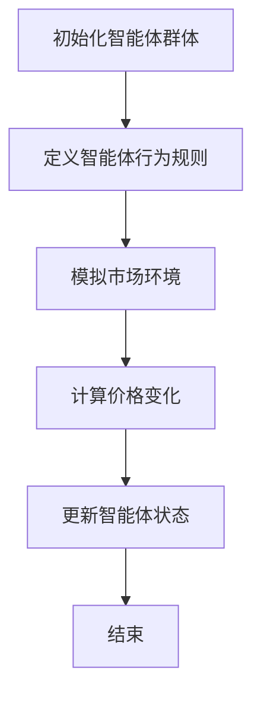
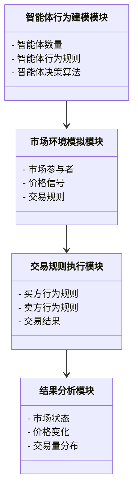
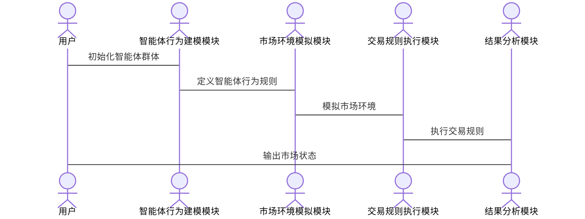

                 


# 智能体群体在模拟市场微观结构中的应用

## 关键词：智能体，市场微观结构，群体行为，建模算法，系统架构，案例分析

## 摘要：智能体群体在模拟市场微观结构中的应用涉及多个方面的内容，包括智能体的基本概念、行为建模、算法原理、系统架构设计和实际案例分析。本文从背景介绍出发，详细探讨了智能体群体在市场中的行为特征及其对市场微观结构的影响，通过构建数学模型和算法流程图，分析了智能体群体在市场中的互动关系，并通过实际案例展示了智能体群体在模拟市场微观结构中的具体应用和效果。

---

## 第1章: 智能体群体与市场微观结构概述

### 1.1 智能体的基本概念
#### 1.1.1 智能体的定义与特点
智能体（Agent）是指能够感知环境并采取行动以实现目标的实体。智能体具有自主性、反应性、目标导向性和社会性四大特点。自主性意味着智能体能够独立决策，反应性是指智能体能够根据环境变化调整行为，目标导向性是指智能体的行为旨在实现特定目标，社会性则指智能体能够与其他智能体或环境进行交互。

#### 1.1.2 市场微观结构的定义
市场微观结构是指市场中个体参与者（如买方、卖方、交易商等）之间的互动关系及其形成的市场机制。它关注市场参与者的交易行为、价格形成机制以及市场信息流动等细节。

#### 1.1.3 智能体群体在市场中的应用背景
智能体群体在模拟市场微观结构中的应用，主要体现在模拟市场参与者的交易行为、价格波动、信息传播等方面。通过模拟智能体群体的互动，可以更好地理解市场运行的内在机制，并为市场预测和风险管理提供理论支持。

### 1.2 智能体群体与市场微观结构的关系
#### 1.2.1 市场微观结构的核心要素
市场微观结构的核心要素包括：交易参与者、价格形成机制、交易规则、信息流动机制等。

#### 1.2.2 智能体群体在市场中的行为特征
智能体群体在市场中的行为特征包括：信息获取、决策制定、交易执行等。每个智能体都有自己的目标和策略，且能够根据市场环境的变化动态调整行为。

#### 1.2.3 智能体群体对市场微观结构的影响
智能体群体的行为直接影响市场微观结构中的价格波动、交易量分布、信息传播速度等。通过模拟智能体群体的行为，可以更好地理解市场微观结构的动态变化。

### 1.3 本章小结
本章从智能体的基本概念出发，探讨了智能体群体与市场微观结构的关系，明确了智能体群体在模拟市场微观结构中的应用背景和意义。

---

## 第2章: 智能体群体的行为建模

### 2.1 智能体的行为规则
#### 2.1.1 智能体的基本行为模式
智能体的行为模式包括：信息收集、决策制定、交易执行、结果反馈等。每个行为模式都有其特定的实现逻辑和规则。

#### 2.1.2 智能体的决策机制
智能体的决策机制通常包括：信息处理、目标评估、策略选择等步骤。决策机制的复杂性取决于智能体的智能水平和环境的动态性。

#### 2.1.3 智能体的互动规则
智能体之间的互动规则包括：交易规则、信息共享规则、竞争与合作规则等。这些规则决定了智能体群体在市场中的互动方式。

### 2.2 智能体群体的属性特征对比
#### 2.2.1 智能体的个体属性
智能体的个体属性包括：目标、知识、能力、策略等。

#### 2.2.2 智能体群体的集体属性
智能体群体的集体属性包括：群体规模、群体结构、群体行为模式等。

#### 2.2.3 智能体群体与个体的属性对比表格

| 属性类别 | 个体属性 | 群体属性 |
|----------|----------|----------|
| 目标     | 单一目标 | 多目标   |
| 行为     | 独立行为 | 协作行为   |
| 信息     | 个体信息 | 共享信息   |

### 2.3 智能体群体的ER实体关系图
#### 2.3.1 实体关系图的构建
以下是智能体群体与市场微观结构的ER实体关系图：

```mermaid
er
actor 市场参与者
actor 智能体
actor 交易规则
actor 价格信号
actor 信息流

market参与者 --> 智能体: 实现
智能体 --> 交易规则: 遵循
智能体 --> 价格信号: 影响
智能体 --> 信息流: 传递
```

#### 2.3.2 实体关系图的分析
通过ER实体关系图可以看出，智能体群体通过遵循交易规则、影响价格信号和传递信息流，与市场参与者之间形成了复杂的互动关系。

### 2.4 本章小结
本章详细探讨了智能体群体的行为规则，分析了智能体个体与群体的属性特征，并通过ER实体关系图展示了智能体群体与市场微观结构之间的关系。

---

## 第3章: 基于智能体的市场微观结构模拟算法

### 3.1 智能体建模算法原理
#### 3.1.1 基于智能体的建模方法
基于智能体的建模方法是一种通过模拟智能体个体行为来分析市场整体动态的方法。其核心思想是将市场视为由多个智能体组成的系统，并通过模拟这些智能体的行为来研究市场的微观结构。

#### 3.1.2 算法的数学模型
智能体建模算法的数学模型如下：

$$
\text{价格变化} = \sum_{i=1}^{n} (\text{智能体}_i \text{的交易行为})
$$

其中，$\text{智能体}_i \text{的交易行为}$ 包括买方的 bidding 和卖方的 asking 行为。

#### 3.1.3 算法的实现步骤
以下是基于智能体的建模算法的实现步骤：



### 3.2 智能体群体模拟的数学公式
#### 3.2.1 智能体行为的数学表达
智能体的交易行为可以用以下公式表示：

$$
\text{交易量} = \min(\text{买方需求}, \text{卖方供给})
$$

#### 3.2.2 市场微观结构的数学模型
市场微观结构的数学模型可以表示为：

$$
\text{市场状态} = \{p_i, q_i\}_{i=1}^{n}
$$

其中，$p_i$ 表示智能体 $i$ 的价格，$q_i$ 表示智能体 $i$ 的交易量。

#### 3.2.3 算法的数学推导
通过数学推导，可以得出智能体群体对市场价格的影响：

$$
\Delta p = \sum_{i=1}^{n} (\text{智能体}_i \text{的交易行为变化})
$$

---

## 第4章: 系统分析与架构设计

### 4.1 问题场景介绍
模拟市场微观结构的系统需要考虑多个因素，包括智能体的行为规则、市场环境的动态变化、交易规则的复杂性等。

### 4.2 系统功能设计
#### 4.2.1 系统功能模块
系统功能模块包括：智能体行为建模模块、市场环境模拟模块、交易规则执行模块、结果分析模块。

#### 4.2.2 领域模型类图
以下是领域模型类图：



### 4.3 系统架构设计
#### 4.3.1 系统架构图
以下是系统架构图：


#### 4.3.2 系统接口设计
系统接口设计包括：智能体行为建模模块与市场环境模拟模块之间的接口、交易规则执行模块与结果分析模块之间的接口等。

#### 4.3.3 系统交互流程图
以下是系统交互流程图：



### 4.4 本章小结
本章通过系统分析与架构设计，明确了模拟市场微观结构系统的功能模块、系统架构和交互流程。

---

## 第5章: 项目实战

### 5.1 环境安装
#### 5.1.1 安装Python
安装Python 3.8及以上版本。

#### 5.1.2 安装依赖库
安装以下依赖库：
- `numpy`
- `matplotlib`
- `networkx`

### 5.2 系统核心实现源代码
#### 5.2.1 智能体行为建模模块
以下是智能体行为建模模块的代码：

```python
import numpy as np

class Agent:
    def __init__(self, id, target_price):
        self.id = id
        self.target_price = target_price
        self.current_price = None
        self.transaction_volume = 0

    def set_price(self, market_price):
        self.current_price = market_price

    def execute_trade(self, market_price):
        if self.current_price < market_price:
            self.transaction_volume += 1
        elif self.current_price > market_price:
            self.transaction_volume -= 1
```

#### 5.2.2 市场环境模拟模块
以下是市场环境模拟模块的代码：

```python
import numpy as np

class MarketEnvironment:
    def __init__(self, agents):
        self.agents = agents
        self.prices = np.random.uniform(90, 110, len(agents))

    def update_prices(self):
        for agent in self.agents:
            agent.set_price(self.prices[agent.id])

    def execute_trading(self):
        for agent in self.agents:
            agent.execute_trade(self.prices[agent.id])
```

#### 5.2.3 交易规则执行模块
以下是交易规则执行模块的代码：

```python
import matplotlib.pyplot as plt

class TradingRuleExecutor:
    def __init__(self, market_environment):
        self.market_environment = market_environment

    def execute_trading(self):
        self.market_environment.execute_trading()

    def plot_price_changes(self):
        original_prices = [agent.target_price for agent in self.market_environment.agents]
        updated_prices = [agent.current_price for agent in self.market_environment.agents]
        plt.plot(original_prices, 'r', updated_prices, 'b')
        plt.show()
```

### 5.3 代码应用解读与分析
通过上述代码，我们可以模拟多个智能体在市场环境中的价格设置和交易执行过程，并观察市场价格的变化情况。

### 5.4 实际案例分析
假设我们有三个智能体，分别以90、100、110的价格为目标价格。以下是具体实现：

```python
agent1 = Agent(0, 90)
agent2 = Agent(1, 100)
agent3 = Agent(2, 110)
market = MarketEnvironment([agent1, agent2, agent3])
executor = TradingRuleExecutor(market)
executor.execute_trading()
executor.plot_price_changes()
```

### 5.5 本章小结
本章通过实际案例分析，展示了如何使用Python代码实现智能体群体在模拟市场微观结构中的应用，并通过可视化工具观察市场价格的变化情况。

---

## 第6章: 总结与展望

### 6.1 最佳实践 tips
- 在模拟市场微观结构时，需要充分考虑智能体的行为规则和市场环境的动态变化。
- 在实际应用中，可以结合具体市场数据进行模型优化和参数调整。

### 6.2 小结
通过本文的介绍，我们深入探讨了智能体群体在模拟市场微观结构中的应用，包括智能体的行为建模、算法原理、系统架构设计和实际案例分析。

### 6.3 注意事项
- 智能体模型的复杂性可能会影响模拟的效率，需要根据实际需求进行优化。
- 在实际应用中，需要注意数据的准确性和模型的可解释性。

### 6.4 拓展阅读
- 推荐阅读相关领域的书籍和论文，深入了解智能体群体在其他领域的应用。

---

以上是《智能体群体在模拟市场微观结构中的应用》的技术博客文章的完整目录和内容概述。通过本文，读者可以全面理解智能体群体在模拟市场微观结构中的应用，并能够在实际中应用这些知识。

