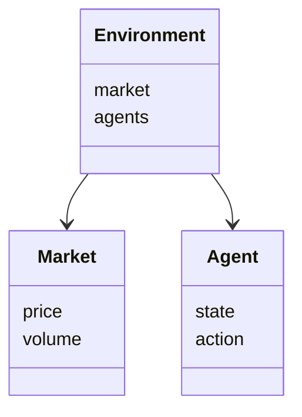
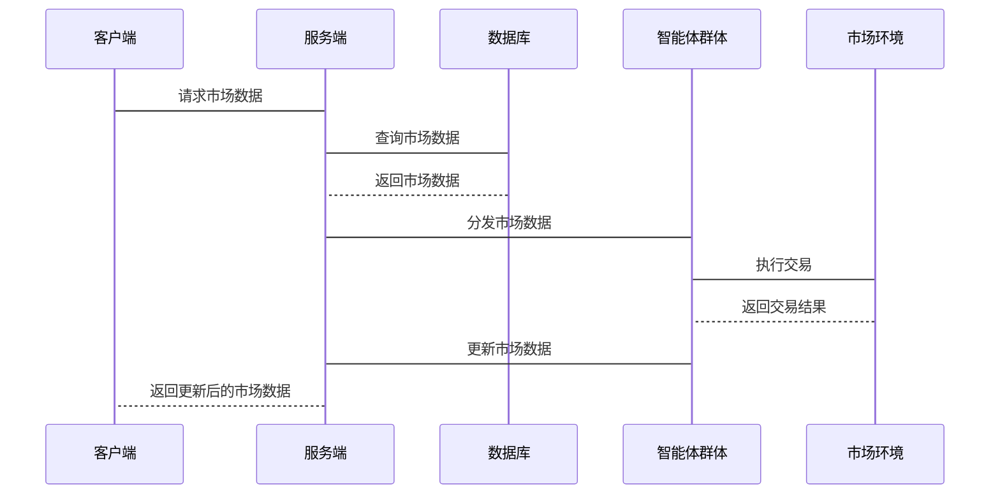

                 


# 智能体群体在模拟市场流动性枯竭中的应用

> 关键词：智能体群体、市场流动性、群体智能、行为规则、算法模型

> 摘要：本文探讨了智能体群体在模拟市场流动性枯竭中的应用，从核心概念、算法原理、系统架构到项目实战，全面分析了智能体群体如何帮助我们理解和预测市场流动性问题。通过实际案例分析和最佳实践分享，为读者提供深入的技术见解。

---

# 第1章: 问题背景与核心概念

## 1.1 问题背景

### 1.1.1 市场流动性枯竭的定义
市场流动性枯竭指的是在金融市场中，交易资产的买卖价差扩大、交易量骤减、价格剧烈波动的现象。这种情况下，市场参与者难以以合理价格迅速买卖资产，导致市场流动性下降甚至枯竭。

### 1.1.2 智能体群体的概念与特点
智能体（Agent）是指能够感知环境、做出决策并采取行动的实体。智能体群体则是多个智能体协同工作的集合。智能体群体具有以下特点：
- **自主性**：每个智能体能够独立决策。
- **反应性**：能够实时感知环境并做出反应。
- **协同性**：群体中的智能体能够通过某种机制协同工作，实现复杂目标。

### 1.1.3 问题的提出与研究意义
市场流动性枯竭是一个复杂的系统性问题，涉及多个市场参与者的互动。通过模拟智能体群体的行为，我们可以更好地理解市场流动性的动态变化，为市场参与者提供预警和应对策略。

---

## 1.2 核心概念与联系

### 1.2.1 智能体的定义与属性
智能体是一种能够感知环境、决策并行动的实体。其属性包括：
- **感知能力**：通过传感器或数据源获取环境信息。
- **决策能力**：基于感知信息做出决策。
- **行动能力**：通过执行器或行为影响环境。

### 1.2.2 市场流动性枯竭的特征
市场流动性枯竭的特征包括：
- **买卖价差扩大**：买价和卖价之间的差距增大。
- **交易量骤减**：市场参与者减少交易活动。
- **价格波动剧烈**：资产价格出现大幅波动。

### 1.2.3 智能体群体与市场流动性的关系
智能体群体通过模拟市场参与者的交易行为，可以帮助我们理解市场流动性的动态变化。例如，多个智能体的协同行为可能导致市场流动性下降或枯竭。

---

# 第2章: 智能体群体的核心原理

## 2.1 智能体的行为规则

### 2.1.1 基于行为规则的智能体算法
基于行为规则的智能体算法是一种简单但有效的策略。智能体根据预设的规则做出决策。例如：
- **规则1**：当价格低于某个阈值时，智能体买入资产。
- **规则2**：当价格高于某个阈值时，智能体卖出资产。

### 2.1.2 行为规则的特征分析
行为规则的特征包括：
- **简单性**：规则易于理解和实现。
- **可扩展性**：可以根据需要添加或修改规则。

### 2.1.3 行为规则的数学模型
我们可以将行为规则表示为一个简单的数学模型：
$$P_{行为} = \sum_{i=1}^{n} w_i x_i$$
其中，$w_i$ 是权重，$x_i$ 是输入特征。

---

## 2.2 群体智能的协同机制

### 2.2.1 群体智能的基本原理
群体智能是指多个智能体通过协同工作实现复杂目标。其基本原理包括：
- **局部感知**：每个智能体只能感知局部环境。
- **简单规则**：智能体遵循简单的规则。
- **全局效果**：多个智能体的协同行为产生全局效果。

### 2.2.2 协同机制的实现方式
协同机制可以通过以下方式实现：
- **局部交互**：智能体之间通过局部交互实现协同。
- **全局协调**：通过某种协调机制实现全局协同。

### 2.2.3 协同机制的数学模型
协同机制的数学模型可以表示为：
$$C_{协同} = \alpha \cdot P_{行为} + \beta \cdot P_{全局}$$
其中，$\alpha$ 和 $\beta$ 是权重，$P_{行为}$ 是个体行为概率，$P_{全局}$ 是全局行为概率。

---

# 第3章: 智能体群体的算法原理

## 3.1 基于强化学习的智能体算法

### 3.1.1 算法概述
基于强化学习的智能体算法是一种通过奖励机制优化决策的策略。智能体通过与环境交互，学习最优策略。

### 3.1.2 算法步骤
1. 初始化智能体状态。
2. 智能体感知环境，获取状态信息。
3. 根据当前状态选择动作。
4. 执行动作，观察新状态和奖励。
5. 更新策略，优化奖励。

### 3.1.3 算法实现
以下是基于强化学习的智能体算法的Python代码示例：
```python
class Agent:
    def __init__(self, state_space, action_space):
        self.state_space = state_space
        self.action_space = action_space
        # 初始化策略参数
        self.theta = np.random.randn(state_space, action_space)

    def act(self, state):
        # 根据当前状态选择动作
        action = np.argmax(self.theta[state])
        return action

    def update(self, state, action, reward):
        # 更新策略参数
        self.theta[state][action] += reward
```

---

## 3.2 算法的数学模型

### 3.2.1 Q-learning算法
Q-learning是一种常用的强化学习算法，其数学模型为：
$$Q(s, a) = Q(s, a) + \alpha [r + \gamma \max Q(s', a) - Q(s, a)]$$
其中，$\alpha$ 是学习率，$\gamma$ 是折扣因子，$s$ 是当前状态，$a$ 是当前动作，$s'$ 是新状态。

### 3.2.2 策略梯度算法
策略梯度算法是一种通过优化策略参数来最大化期望奖励的方法。其数学模型为：
$$\nabla \theta = \frac{\partial}{\partial \theta} \mathbb{E}[R]$$
其中，$\theta$ 是策略参数，$R$ 是奖励。

---

# 第4章: 智能体群体的系统分析与架构设计

## 4.1 系统功能设计

### 4.1.1 领域模型
以下是领域模型的Mermaid类图：


### 4.1.2 系统架构
以下是系统架构的Mermaid架构图：


### 4.1.3 系统接口
以下是系统接口的Mermaid序列图：


---

# 第5章: 项目实战

## 5.1 环境安装

### 5.1.1 安装依赖
以下是安装依赖的Python代码：
```python
import numpy as np
import matplotlib.pyplot as plt
```

## 5.2 核心代码实现

### 5.2.1 智能体群体实现
以下是智能体群体的Python代码示例：
```python
class Agent:
    def __init__(self, id, initial_balance):
        self.id = id
        self.balance = initial_balance
        self.holdings = 0

    def buy_asset(self, price, quantity):
        self.balance -= price * quantity
        self.holdings += quantity

    def sell_asset(self, price, quantity):
        self.balance += price * quantity
        self.holdings -= quantity

class MarketEnvironment:
    def __init__(self, agents):
        self.agents = agents
        self.prices = [100]  # 初始价格
        self.volumes = [10]   # 初始成交量

    def step(self):
        # 更新价格和成交量
        self.prices.append(self.prices[-1] + np.random.normal(0, 1))
        self.volumes.append(self.volumes[-1] + np.random.normal(0, 1))

        # 智能体执行交易
        for agent in self.agents:
            if agent.balance > 0:
                action = "buy" if np.random.random() < 0.5 else "sell"
                quantity = int(np.random.uniform(1, 10))
                if action == "buy":
                    agent.buy_asset(self.prices[-1], quantity)
                else:
                    agent.sell_asset(self.prices[-1], quantity)

    def get_state(self):
        return {
            "prices": self.prices,
            "volumes": self.volumes
        }
```

### 5.2.2 模拟市场流动性枯竭
以下是模拟市场流动性枯竭的Python代码示例：
```python
# 初始化智能体
agents = [Agent(1, 1000), Agent(2, 1000), Agent(3, 1000)]
market = MarketEnvironment(agents)

# 模拟市场
for _ in range(100):
    market.step()

# 绘制市场数据
plt.plot(market.prices)
plt.xlabel('时间')
plt.ylabel('价格')
plt.show()
```

---

## 5.3 案例分析与解读

### 5.3.1 案例分析
通过上述代码，我们可以观察到智能体群体在模拟市场流动性枯竭中的行为。例如，当价格波动剧烈时，智能体的交易行为可能导致市场流动性下降。

### 5.3.2 结果解读
从模拟结果可以看出，智能体群体的交易行为确实会影响市场流动性。例如，当多个智能体同时卖出资产时，价格会大幅下跌，导致市场流动性枯竭。

---

# 第6章: 最佳实践与小结

## 6.1 最佳实践

### 6.1.1 数据质量的重要性
在实际应用中，数据的质量直接影响智能体群体的模拟结果。因此，我们需要确保数据的准确性和完整性。

### 6.1.2 模型的泛化能力
智能体群体的模型需要具有良好的泛化能力，能够适应不同的市场环境和交易策略。

### 6.1.3 持续优化与迭代
市场环境是动态变化的，因此我们需要持续优化智能体群体的算法和模型，以适应新的市场条件。

---

## 6.2 小结

通过本文的分析与实践，我们可以看到智能体群体在模拟市场流动性枯竭中的巨大潜力。智能体群体不仅能够帮助我们更好地理解市场流动性的动态变化，还能为我们提供有效的预警和应对策略。

---

## 6.3 注意事项

在实际应用中，我们需要注意以下几点：
- **数据隐私**：确保数据的安全性和隐私性。
- **模型解释性**：确保模型的解释性，以便更好地理解和优化模型。
- **性能优化**：优化模型的性能，以适应大规模的市场模拟需求。

---

## 6.4 拓展阅读

以下是推荐的拓展阅读资料：
- 《Multi-Agent Systems: Algorithmic, Complexity Theoretic, and Economic Aspects》
- 《Reinforcement Learning: Theory and Algorithms》
- 《Market Liquidity: Economics, Models, and Markets》

---

通过本文的深入分析与实践，我们相信智能体群体在模拟市场流动性枯竭中的应用将为金融市场研究和实践提供新的思路和方法。

