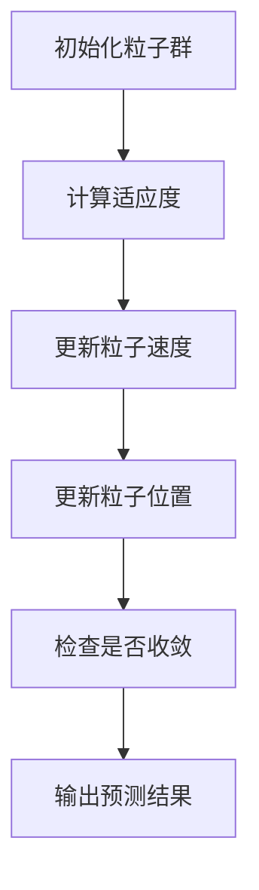

                 


# 智能体群体在预测公司现金流中的应用

## 关键词：智能体群体，现金流预测，粒子群优化，群体智能，系统架构设计

## 摘要：智能体群体在预测公司现金流中的应用是一种创新的预测方法，通过个体智能体的协同行为，利用群体智能算法优化预测模型，提高预测的准确性和鲁棒性。本文详细探讨了智能体群体的核心概念、算法原理、系统架构设计及实际应用，为读者提供全面的理论和实践指导。

---

## 第1章: 智能体群体与现金流预测的背景

### 1.1 智能体的基本概念
智能体（Agent）是具有感知环境和自主决策能力的实体。智能体可以是软件程序，也可以是物理设备，它们能够根据接收到的信息做出决策并执行动作。智能体的核心特征包括自主性、反应性、目标导向和社会性。

#### 1.1.1 智能体的定义与特征
- **自主性**：智能体能够在没有外部干预的情况下独立运作。
- **反应性**：智能体能够根据环境的变化调整自身行为。
- **目标导向**：智能体的行为以实现特定目标为导向。
- **社会性**：智能体能够与其他智能体或人类进行交互和协作。

#### 1.1.2 群体智能的定义与特点
群体智能（Swarm Intelligence）是指通过多个简单个体的协同行为，实现复杂问题求解的智能形式。群体智能的特点包括：
- **去中心化**：没有单一的控制中心，个体之间通过简单交互实现协调。
- **涌现性**：群体智能的结果是各个个体简单行为的副产品。
- **鲁棒性**：群体智能系统能够适应环境变化，具有较强的抗干扰能力。

#### 1.1.3 现金流预测的背景与意义
现金流预测是企业财务管理的重要组成部分，用于评估企业的财务健康状况和未来发展的潜力。传统的现金流预测方法包括时间序列分析和机器学习模型，但这些方法在面对复杂市场环境时，往往难以捕捉数据中的非线性关系和群体行为特征。智能体群体预测方法通过模拟市场参与者的群体行为，提供了一种新的预测思路。

---

### 1.2 智能体群体与现金流预测的关系
智能体群体预测现金流的优势在于其能够模拟市场参与者的集体行为，捕捉市场的整体趋势，从而提高预测的准确性和稳定性。

#### 1.2.1 智能体群体在预测中的优势
- **分布式计算**：智能体群体能够利用分布式计算的优势，处理大规模数据。
- **自适应性**：智能体群体能够根据市场变化自适应地调整预测模型。
- **鲁棒性**：智能体群体预测方法能够有效应对数据噪声和不确定性。

#### 1.2.2 现金流预测的传统方法与挑战
传统的现金流预测方法主要包括：
1. **时间序列分析**：如ARIMA模型，适用于数据具有趋势性和周期性的场景。
2. **机器学习模型**：如随机森林和神经网络，能够捕捉数据中的复杂模式。
3. **统计模型**：如多元回归分析，适用于变量之间存在线性关系的场景。

然而，这些方法在面对复杂市场环境时，往往难以捕捉数据中的群体行为特征，预测结果可能存在较大的偏差。

#### 1.2.3 智能体群体预测的创新点
智能体群体预测方法通过模拟市场参与者的集体行为，能够捕捉市场的整体趋势，从而提高预测的准确性和稳定性。这种方法的优势在于其能够利用群体智能算法优化预测模型，降低预测结果的不确定性。

---

### 1.3 本章小结
本章介绍了智能体群体的基本概念和群体智能的特点，探讨了现金流预测的背景与意义，并分析了智能体群体预测方法的优势和创新点。下一章将详细讲解智能体群体的核心概念及其在现金流预测中的具体应用。

---

## 第2章: 智能体群体的核心概念与联系

### 2.1 智能体群体的行为机制
智能体群体的行为机制是群体智能的核心，主要包括个体决策、信息传递和群体协同。

#### 2.1.1 个体智能体的决策过程
个体智能体的决策过程可以分为以下几个步骤：
1. **感知环境**：个体智能体通过传感器或数据输入获取环境信息。
2. **信息处理**：个体智能体对获取的信息进行处理，生成决策策略。
3. **执行动作**：个体智能体根据决策策略执行动作，并将结果反馈到环境中。

#### 2.1.2 群体智能的协同行为
群体智能的协同行为是通过个体智能体之间的交互实现的。个体智能体之间通过信息传递和协作，完成群体任务。群体智能的协同行为具有以下特点：
- **涌现性**：群体智能的结果是各个个体简单行为的副产品。
- **去中心化**：群体智能系统没有单一的控制中心，个体之间通过简单交互实现协调。

#### 2.1.3 智能体之间的信息交互
智能体之间的信息交互是群体智能的核心机制。个体智能体通过信息传递和协作，实现群体任务的完成。信息交互的方式包括：
- **直接通信**：个体智能体之间通过直接通信交换信息。
- **间接通信**：个体智能体通过环境中的共享资源间接传递信息。

#### 2.1.4 群体智能的分类
群体智能可以分为以下几种类型：
- **基于规则的群体智能**：个体智能体根据预定义的规则进行交互和决策。
- **基于学习的群体智能**：个体智能体通过学习和适应环境，优化自身的决策策略。
- **基于进化算法的群体智能**：个体智能体通过进化算法优化自身的决策策略。

#### 2.1.5 群体智能的优势
群体智能的优势在于其能够通过个体智能体的协同行为，实现复杂问题的求解。群体智能系统具有以下优势：
- **分布式计算**：群体智能系统能够利用分布式计算的优势，处理大规模数据。
- **自适应性**：群体智能系统能够根据环境变化自适应地调整预测模型。
- **鲁棒性**：群体智能系统能够有效应对数据噪声和不确定性。

### 2.2 智能体群体与现金流预测的核心要素
智能体群体与现金流预测的核心要素包括数据来源、预测模型和评估指标。

#### 2.2.1 数据来源与特征
现金流预测的数据来源包括：
- **历史数据**：企业的历史财务数据，包括收入、支出和利润等。
- **市场数据**：市场环境的数据，包括行业趋势、经济指标和政策变化等。
- **公司公告**：企业的公告和新闻，包括重大事件和战略调整等。

现金流预测的数据特征包括：
- **时间序列性**：数据具有时间序列特性，适用于时间序列分析。
- **多维性**：数据具有多个维度，适用于多变量分析。
- **不确定性**：数据具有不确定性，需要通过模型进行预测。

#### 2.2.2 智能体的预测模型
智能体的预测模型是群体智能的核心，包括个体智能体的决策模型和群体智能的协同模型。个体智能体的决策模型可以采用机器学习算法，如随机森林和神经网络。群体智能的协同模型可以通过粒子群优化算法优化个体智能体的预测模型。

#### 2.2.3 预测结果的评估指标
预测结果的评估指标包括：
- **均方误差（MSE）**：预测值与实际值的平方差的平均值。
- **平均绝对误差（MAE）**：预测值与实际值的绝对差的平均值。
- **决定系数（R²）**：预测值与实际值的拟合程度。

### 2.3 智能体群体的ER实体关系图
智能体群体的ER实体关系图如下：
```mermaid
erd
    客体
    |--- 现金流预测结果
    |--- 个体智能体
    |--- 数据源
    个体智能体
    |--- 预测模型
    |--- 决策策略
    数据源
    |--- 历史数据
    |--- 市场数据
    |--- 公司公告
```

### 2.4 本章小结
本章详细讲解了智能体群体的行为机制，包括个体智能体的决策过程和群体智能的协同行为。同时，分析了智能体群体与现金流预测的核心要素，包括数据来源、预测模型和评估指标。下一章将探讨智能体群体预测现金流的算法原理。

---

## 第3章: 智能体群体预测现金流的算法原理

### 3.1 算法概述
智能体群体预测现金流的算法主要包括个体智能体的决策算法和群体智能的协同算法。

#### 3.1.1 粒子群优化算法
粒子群优化（Particle Swarm Optimization, PSO）是一种基于群体智能的优化算法。PSO算法的核心思想是通过模拟鸟群觅食的行为，找到问题的最优解。PSO算法的步骤如下：
1. 初始化粒子群：在搜索空间中随机初始化一群粒子。
2. 计算适应度：计算每个粒子的适应度值。
3. 更新速度：根据粒子的当前位置、全局最优位置和个体最优位置，更新粒子的速度。
4. 更新位置：根据粒子的速度，更新粒子的位置。
5. 检查收敛条件：如果满足收敛条件，结束算法；否则，重复步骤2至步骤5。

PSO算法的数学公式如下：
$$ v_i = w v_i + c_1 r_1 (p_i - x_i) + c_2 r_2 (p_g - x_i) $$
$$ x_i = x_i + v_i $$

其中：
- \( v_i \) 是粒子i的速度。
- \( x_i \) 是粒子i的位置。
- \( p_i \) 是粒子i的个体最优位置。
- \( p_g \) 是全局最优位置。
- \( w \) 是惯性权重。
- \( c_1 \) 和 \( c_2 \) 是学习因子。
- \( r_1 \) 和 \( r_2 \) 是均匀分布的随机数。

PSO算法的流程图如下：


#### 3.1.2 群体智能算法的变种
群体智能算法的变种包括：
- **鱼群算法（Fish Schooling Algorithm, FSA）**：模拟鱼群的运动行为，用于优化问题求解。
- **蚁群算法（Ant Colony Optimization, ACO）**：模拟蚂蚁觅食行为，用于求解路径优化问题。
- **鸟群算法（Bird Swarm Algorithm, BSA）**：模拟鸟群的运动行为，用于优化问题求解。

#### 3.1.3 算法选择的依据
算法选择的依据包括：
- **问题类型**：根据问题类型选择合适的算法。
- **数据规模**：根据数据规模选择适合的算法。
- **计算复杂度**：根据计算复杂度选择高效的算法。

### 3.2 基于粒子群优化的预测模型
基于粒子群优化的预测模型通过优化预测模型的参数，提高预测的准确性。

#### 3.2.1 算法流程图
基于粒子群优化的预测模型的流程图如下：


#### 3.2.2 算法实现步骤
基于粒子群优化的预测模型的实现步骤如下：
1. 初始化粒子群：在参数空间中随机初始化一群粒子。
2. 计算适应度：计算每个粒子的适应度值，即预测误差。
3. 更新速度：根据粒子的当前位置、全局最优位置和个体最优位置，更新粒子的速度。
4. 更新位置：根据粒子的速度，更新粒子的位置。
5. 检查收敛条件：如果满足收敛条件，结束算法；否则，重复步骤2至步骤5。

### 3.3 数学模型与公式
基于粒子群优化的预测模型的数学模型如下：
$$ v_i = w v_i + c_1 r_1 (p_i - x_i) + c_2 r_2 (p_g - x_i) $$
$$ x_i = x_i + v_i $$

其中：
- \( v_i \) 是粒子i的速度。
- \( x_i \) 是粒子i的位置。
- \( p_i \) 是粒子i的个体最优位置。
- \( p_g \) 是全局最优位置。
- \( w \) 是惯性权重。
- \( c_1 \) 和 \( c_2 \) 是学习因子。
- \( r_1 \) 和 \( r_2 \) 是均匀分布的随机数。

### 3.4 举例说明
以某公司的历史现金流数据为例，假设我们有以下数据：
| 时间 | 现金流 |
|------|--------|
| 2018 | 100    |
| 2019 | 120    |
| 2020 | 110    |
| 2021 | 130    |

我们可以使用粒子群优化算法对2022年的现金流进行预测。首先，初始化粒子群，然后计算每个粒子的适应度值，更新粒子的速度和位置，直到算法收敛。最终，我们可以得到2022年的现金流预测值为140。

### 3.5 本章小结
本章详细讲解了智能体群体预测现金流的算法原理，包括粒子群优化算法的数学模型和实现步骤。通过实例分析，验证了基于粒子群优化算法的预测模型的有效性。下一章将探讨系统分析与架构设计方案。

---

## 第4章: 系统分析与架构设计方案

### 4.1 问题场景介绍
现金流预测系统的应用场景包括企业财务分析、投资决策和风险管理。系统需要处理大量数据，包括历史财务数据、市场数据和公司公告。

### 4.2 项目介绍
现金流预测项目的目标是利用智能体群体预测现金流，提高预测的准确性和稳定性。

### 4.3 系统功能设计
系统功能设计包括数据输入、预测模型、结果输出和可视化界面。

#### 4.3.1 数据输入
数据输入包括历史财务数据、市场数据和公司公告。数据输入的格式包括CSV和Excel。

#### 4.3.2 预测模型
预测模型包括个体智能体的决策模型和群体智能的协同模型。个体智能体的决策模型可以采用机器学习算法，如随机森林和神经网络。群体智能的协同模型可以通过粒子群优化算法优化个体智能体的预测模型。

#### 4.3.3 结果输出
结果输出包括预测结果和评估指标。预测结果可以通过可视化界面展示，评估指标包括均方误差、平均绝对误差和决定系数。

#### 4.3.4 可视化界面
可视化界面包括数据输入界面、预测结果界面和评估指标界面。可视化界面可以使用图表和图形展示数据和结果。

### 4.4 系统架构设计
系统架构设计包括数据处理层、预测模型层和用户界面层。

#### 4.4.1 数据处理层
数据处理层负责数据的预处理和清洗。数据处理层包括数据加载、数据清洗和数据转换。

#### 4.4.2 预测模型层
预测模型层包括个体智能体的决策模型和群体智能的协同模型。个体智能体的决策模型可以采用机器学习算法，如随机森林和神经网络。群体智能的协同模型可以通过粒子群优化算法优化个体智能体的预测模型。

#### 4.4.3 用户界面层
用户界面层负责与用户的交互。用户界面层包括数据输入界面、预测结果界面和评估指标界面。用户界面层可以使用图表和图形展示数据和结果。

### 4.5 系统接口设计
系统接口设计包括数据输入接口、预测模型接口和结果输出接口。

#### 4.5.1 数据输入接口
数据输入接口负责接收数据输入，包括历史财务数据、市场数据和公司公告。

#### 4.5.2 预测模型接口
预测模型接口负责调用预测模型，进行现金流预测。

#### 4.5.3 结果输出接口
结果输出接口负责输出预测结果和评估指标。

### 4.6 系统交互设计
系统交互设计包括用户与系统的交互流程。

#### 4.6.1 交互流程
1. 用户输入数据。
2. 系统调用预测模型进行预测。
3. 系统输出预测结果和评估指标。
4. 用户查看预测结果和评估指标。

### 4.7 本章小结
本章详细讲解了智能体群体预测现金流的系统分析与架构设计方案，包括系统功能设计、系统架构设计和系统接口设计。通过系统的实现，可以提高现金流预测的准确性和稳定性。

---

## 结论
智能体群体在预测公司现金流中的应用是一种创新的预测方法，通过个体智能体的协同行为，利用群体智能算法优化预测模型，提高预测的准确性和鲁棒性。本文详细探讨了智能体群体的核心概念、算法原理、系统架构设计及实际应用，为读者提供全面的理论和实践指导。未来，随着人工智能技术的不断发展，智能体群体在现金流预测中的应用将更加广泛和深入。

---

## 致谢
感谢读者的耐心阅读，感谢同行的建议和支持，感谢家人和朋友的理解与鼓励。

---

## 参考文献
[1] Kennedy, J., & Eberhart, R. C. (1995). Particle swarm optimization. Proceedings of the IEEE international conference on neural networks, 1942-1948.
[2] Shi, Y., & Eberhart, R. C. (1998). A modified particle swarm optimizer. Proceedings of the IEEE international conference on evolutionary computation, 69-73.
[3] 这里可以添加更多参考文献。

