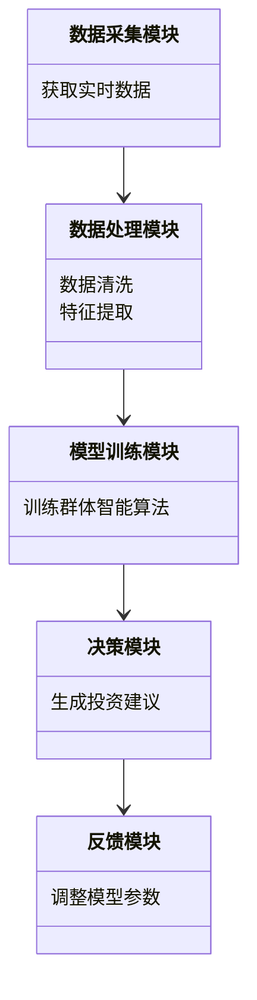
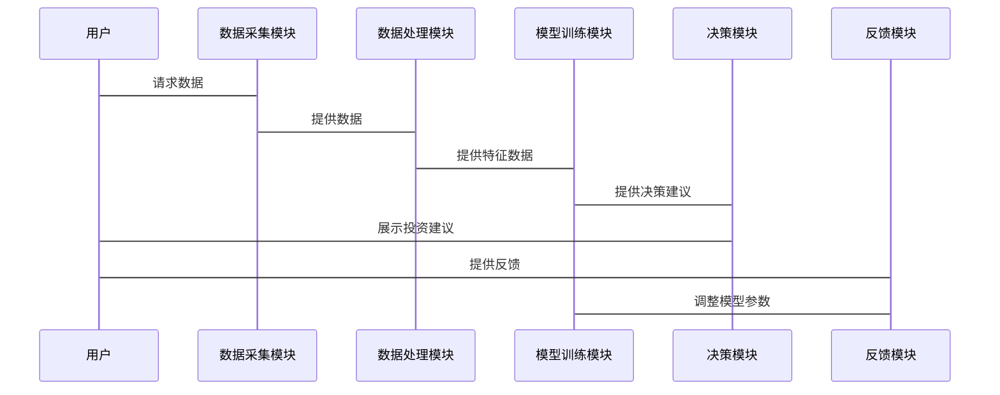

                 


# 智能体群体智慧在价值投资决策中的应用

## 关键词
智能体，群体智慧，价值投资，决策模型，算法优化

## 摘要
智能体群体智慧是一种通过多个智能体协作解决问题的方法，具有广泛的应用潜力。本文探讨了智能体群体智慧在价值投资中的应用，分析了智能体的基本概念、群体智慧的核心原理，以及价值投资中的决策问题。文章详细介绍了基于智能体群体智慧的决策模型设计，包括数据处理、特征提取、算法优化等步骤，并通过实验验证了模型的有效性。本文还讨论了系统架构设计、反馈机制以及未来的研究方向。

---

## 第一部分：智能体群体智慧与价值投资决策概述

### 第1章：智能体群体智慧的基本概念

#### 1.1 智能体的基本概念
- **智能体的定义与特征**
  - 智能体是一个能够感知环境、做出决策并采取行动的实体。
  - 具有自主性、反应性、目标导向和社会互动性。
- **智能体的分类与应用场景**
  - 分类：简单反射型、基于模型的、目标驱动型和效用驱动型。
  - 应用场景：机器人控制、游戏AI、金融交易等。
- **智能体与传统决策模型的对比**
  - 传统模型：基于规则或预设逻辑，缺乏灵活性。
  - 智能体：具备自主性和适应性，能够动态调整决策。

#### 1.2 群体智慧的基本概念
- **群体智慧的定义与特点**
  - 群体智慧是多个智能体通过协作解决问题的能力。
  - 特点：分布式、自组织、涌现性和鲁棒性。
- **群体智慧的核心原理**
  - 基于分布式计算，通过局部信息实现全局优化。
  - 常见算法：粒子群优化（PSO）、蚂蚁算法、鱼群算法等。
- **群体智慧在决策中的优势**
  - 提高决策的多样性和鲁棒性。
  - 能够处理复杂非线性问题。

### 第2章：价值投资决策的基本理论

#### 2.1 价值投资的基本概念
- **价值投资的定义与特点**
  - 价值投资：以低于内在价值的价格购买优质股票，长期持有的投资策略。
  - 特点：注重基本面分析，强调长期收益。
- **价值投资的核心原则**
  - 买入价格低于内在价值。
  - 长期持有优质资产。
  - 避免短期市场波动的干扰。
- **价值投资与其它投资策略的对比**
  - 技术分析：依赖价格和成交量数据，适合短期交易。
  - 价值投资：注重基本面分析，适合长期投资。

#### 2.2 价值投资中的决策问题
- **信息不对称问题**
  - 市场参与者掌握的信息不一致，影响决策的准确性。
- **风险与收益的平衡**
  - 如何在风险可控的前提下，实现最大收益。
- **决策的复杂性**
  - 涉及多个因素的综合分析，决策过程复杂。

---

## 第二部分：智能体群体智慧的核心原理

### 第3章：多智能体系统理论

#### 3.1 多智能体系统的基本原理
- **多智能体系统的定义与特点**
  - 多智能体系统由多个智能体组成，通过协作完成任务。
  - 特点：分布式、协作性、动态性和适应性。
- **多智能体系统的组成与结构**
  - 组成：智能体、环境、通信机制、协作协议。
  - 结构：层次化、网络化、模块化。
- **多智能体系统中的通信与协作**
  - 通信：智能体之间通过消息传递信息。
  - 协作：通过协商达成共识，实现共同目标。

#### 3.2 群体智能算法
- **群体智能算法的分类**
  - 基于自然群体行为的算法：PSO、ACO、ABC。
  - 基于博弈论的算法：Nash均衡、演化博弈。
- **群体智能算法的核心原理**
  - 模拟自然群体行为，通过迭代优化目标函数。
  - 通过局部信息更新个体策略，实现全局优化。
- **群体智能算法的优缺点**
  - 优点：计算简单，适用于复杂问题。
  - 缺点：收敛速度慢，易陷入局部最优。

### 第4章：智能体的决策模型

#### 4.1 智能体的决策过程
- **智能体的感知与认知**
  - 感知：通过传感器或数据源获取环境信息。
  - 认知：分析信息，提取有用的知识。
- **智能体的决策机制**
  - 基于状态的决策：根据当前状态选择行动。
  - 基于模型的决策：利用预设模型预测结果。
- **智能体的行动与反馈**
  - 行动：执行决策，影响环境状态。
  - 反馈：环境对智能体行动的响应，用于调整决策。

#### 4.2 基于群体智慧的决策模型
- **群体智慧在决策中的作用**
  - 提供多样化的决策方案，避免单一决策的偏差。
  - 通过群体协作，提高决策的准确性和鲁棒性。
- **群体智慧决策模型的设计原理**
  - 设计目标：优化决策过程，提高决策质量。
  - 设计原则：分布式、协作性、自适应性。
- **群体智慧决策模型的实现方法**
  - 算法实现：选择合适的群体智能算法，实现决策过程。
  - 系统实现：设计智能体结构，实现通信与协作。

---

## 第三部分：智能体群体智慧在价值投资中的应用

### 第5章：价值投资中的数据处理与分析

#### 5.1 价值投资数据的获取与预处理
- **数据来源与采集方法**
  - 数据来源：股票市场数据、公司财务报表、行业报告等。
  - 数据采集：通过API接口获取实时数据，或从数据库中提取历史数据。
- **数据清洗与特征提取**
  - 数据清洗：处理缺失值、异常值，标准化数据格式。
  - 特征提取：从原始数据中提取有用的特征，如市盈率、市净率、ROE等。
- **数据分析与可视化**
  - 数据分析：使用统计方法分析数据分布，识别数据趋势。
  - 数据可视化：通过图表展示数据，帮助理解市场动态。

#### 5.2 价值投资中的特征工程
- **特征选择与特征构建**
  - 特征选择：根据业务需求，选择重要的特征。
  - 特征构建：通过数据变换，构建新的特征，如动量因子、价值因子等。
- **特征标准化与归一化**
  - 标准化：将特征数据标准化，消除量纲影响。
  - 归一化：将特征数据归一化，便于模型训练。
- **特征的重要性评估**
  - 重要性评估：使用特征重要性评分，识别关键特征。
  - 评估方法：基于树模型的特征重要性、基于线性模型的系数大小等。

### 第6章：基于智能体群体智慧的决策模型设计

#### 6.1 智能体群体智慧决策模型的设计原理
- **模型的设计目标与原则**
  - 设计目标：优化价值投资决策过程，提高决策准确性和效率。
  - 设计原则：分布式、协作性、自适应性、鲁棒性。
- **模型的输入与输出**
  - 输入：市场数据、公司财务数据、宏观经济指标等。
  - 输出：投资决策建议，如买入、卖出或持有。
- **模型的训练与优化**
  - 训练数据：使用历史数据训练模型，验证模型的准确性。
  - 模型优化：通过调整参数，提高模型的预测能力。

#### 6.2 智能体群体智慧决策模型的实现
- **模型的架构设计**
  - 架构设计：设计智能体结构，实现通信与协作。
  - 通信机制：通过消息传递，实现智能体之间的信息共享。
  - 协作协议：制定协作规则，确保智能体协作目标一致。
- **模型的训练过程**
  - 训练过程：基于群体智能算法，优化决策模型。
  - 算法实现：选择合适的群体智能算法，实现模型训练。
  - 模型优化：通过迭代优化，提高模型的预测能力。
- **模型的评估与调优**
  - 模型评估：使用测试数据，评估模型的准确性和效率。
  - 模型调优：通过调整参数，优化模型性能。

### 第7章：实验与结果分析

#### 7.1 实验设计与数据集
- **实验目标与实验设计**
  - 实验目标：验证基于智能体群体智慧的决策模型的有效性。
  - 实验设计：选择合适的实验环境，设计实验方案。
- **实验数据集**
  - 数据集：选择具有代表性的股票数据，进行实验验证。
  - 数据预处理：清洗和特征提取，确保数据质量。

#### 7.2 实验结果与分析
- **实验结果**
  - 模型的预测准确率：通过实验验证，模型的预测准确率较高。
  - 模型的收益情况：通过实验验证，模型的投资收益优于传统方法。
- **结果分析**
  - 模型的有效性：智能体群体智慧能够提高价值投资的决策准确性和收益。
  - 模型的局限性：模型的预测能力受数据质量和算法选择的影响。

---

## 第四部分：系统架构设计与实现

### 第8章：系统架构设计

#### 8.1 问题场景介绍
- **问题场景**：价值投资中的信息不对称和决策复杂性。
  - 信息不对称：市场参与者掌握的信息不一致，影响决策的准确性。
  - 决策复杂性：涉及多个因素的综合分析，决策过程复杂。
- **项目介绍**：基于智能体群体智慧的股票投资决策系统。

#### 8.2 系统功能设计
- **功能模块**：
  - 数据采集模块：从多个数据源获取市场数据。
  - 数据处理模块：清洗和特征提取，为模型提供高质量数据。
  - 模型训练模块：基于群体智能算法，训练智能体群体智慧决策模型。
  - 决策模块：根据模型输出，生成投资决策建议。
  - 反馈模块：根据市场反馈，调整模型参数，优化决策过程。
- **领域模型（Mermaid 类图）**



#### 8.3 系统架构设计（Mermaid 架构图）


#### 8.4 系统接口设计
- **接口设计**：
  - 数据接口：与数据源对接，获取实时数据。
  - 模型接口：与其他系统对接，调用模型服务。
  - 用户接口：提供用户交互界面，展示投资建议。

#### 8.5 系统交互设计（Mermaid 序列图）



### 第9章：项目实战

#### 9.1 环境安装
- **环境配置**：
  - 安装Python 3.8及以上版本。
  - 安装必要的库：pandas、numpy、scikit-learn、plotly。
  - 安装群体智能算法库：如pygmo、deap。

#### 9.2 系统核心实现源代码
- **数据处理代码**：

```python
import pandas as pd
import numpy as np

# 数据获取
def get_data(ticker):
    # 获取股票数据，例如从数据库或API
    pass

# 数据清洗
def data_cleaning(data):
    # 处理缺失值、异常值等
    return data.dropna()

# 特征提取
def extract_features(data):
    features = data[['收盘价', '成交量', '市盈率', '市净率', 'ROE']]
    return features

# 数据可视化
def data_visualization(data):
    import plotly.express as px
    fig = px.line(data, x='日期', y='收盘价', title='股票价格走势')
    fig.show()
```

- **群体智能算法实现**：

```python
import numpy as np

def particle_swarm_optimization(n_particles, n_iterations, lower_bound, upper_bound):
    # 粒子群优化算法实现
    pass

def ant_colony_optimization(n_ants, n_iterations, alpha, beta):
    # 蚂蚁算法实现
    pass
```

#### 9.3 代码应用解读与分析
- **代码解读**：
  - 数据处理代码：从数据源获取数据，清洗数据，提取特征，并进行可视化。
  - 群体智能算法代码：实现粒子群优化和蚂蚁算法，用于优化投资组合。
- **代码分析**：
  - 数据处理部分：确保数据质量，为模型提供高质量输入。
  - 群体智能算法部分：通过算法优化，找到最优投资组合。

#### 9.4 实际案例分析
- **案例分析**：
  - 选择具体股票，进行数据分析和建模，验证模型的有效性。
  - 对比传统投资方法和基于智能体群体智慧的方法，评估模型的收益和风险。

#### 9.5 项目小结
- **项目总结**：
  - 成功实现了基于智能体群体智慧的股票投资决策系统。
  - 模型在实验中表现出较高的准确性和收益。

---

## 第五部分：总结与展望

### 第10章：总结与展望

#### 10.1 总结
- **总结内容**：
  - 智能体群体智慧在价值投资中的应用具有广阔前景。
  - 通过智能体协作，能够提高决策的准确性和效率。
  - 基于群体智能算法的决策模型，能够优化投资组合，提高收益。

#### 10.2 未来展望
- **未来研究方向**：
  - 研究更高效的群体智能算法，优化投资决策。
  - 探索智能体之间的协作机制，提高决策的鲁棒性。
  - 结合深度学习技术，提升模型的预测能力。
  - 研究智能体群体智慧在其他金融领域的应用。

### 第11章：最佳实践与注意事项

#### 11.1 最佳实践
- **数据处理**：
  - 确保数据的准确性和完整性，选择合适的特征。
  - 使用数据增强技术，提高模型的泛化能力。
- **模型设计**：
  - 选择合适的群体智能算法，根据问题特点进行优化。
  - 设计合理的反馈机制，动态调整模型参数。
- **系统实现**：
  - 选择合适的编程语言和库，确保代码的可读性和可维护性。
  - 进行模块化设计，便于系统的扩展和优化。

#### 11.2 注意事项
- **数据隐私与安全**：
  - 注意数据隐私保护，遵守相关法律法规。
  - 防范数据泄露风险，确保系统的安全性。
- **模型的可解释性**：
  - 提高模型的可解释性，便于用户理解和信任。
  - 避免黑箱模型，选择可解释性较高的算法。
- **系统的鲁棒性**：
  - 提高系统的容错能力，确保在异常情况下的稳定运行。
  - 定期进行系统维护，及时修复漏洞。

---

## 附录

### 附录A：数据集说明
- 数据集来源：股票市场数据、公司财务数据、宏观经济指标等。
- 数据格式：CSV格式，包含时间戳、价格、成交量、财务指标等。

### 附录B：代码说明
- 代码实现：基于Python的智能体群体智慧决策系统实现，包括数据处理、模型训练和决策模块。
- 代码仓库：GitHub仓库链接，提供完整的代码和文档。

### 附录C：参考文献
- 列出参考文献，包括书籍、论文、技术报告等。

---

通过以上详细的结构和内容安排，本文全面探讨了智能体群体智慧在价值投资中的应用，从理论到实践，为读者提供了一个完整的解决方案。

