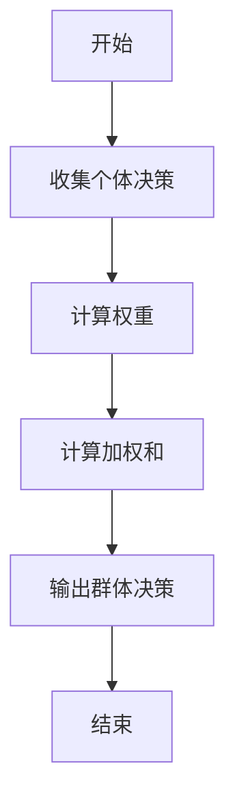
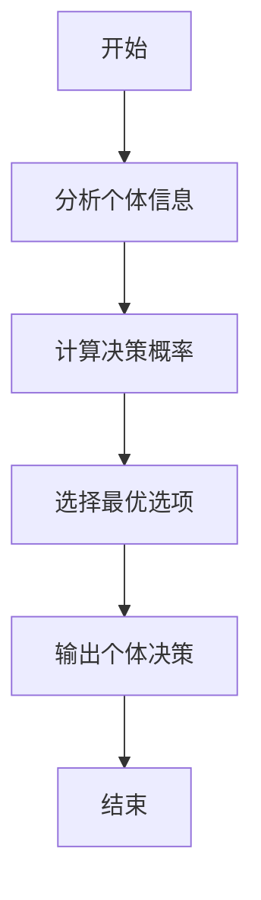
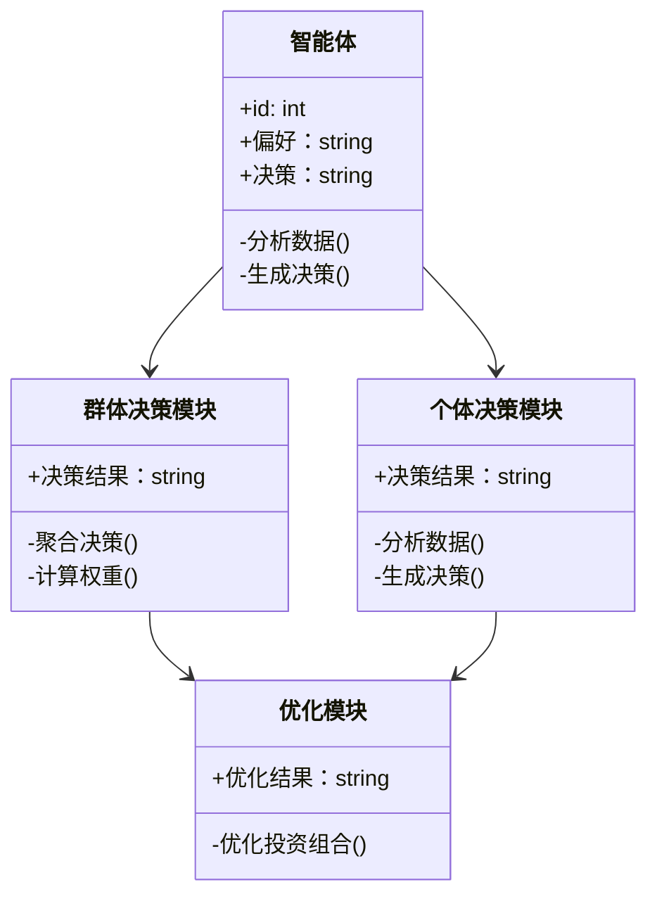
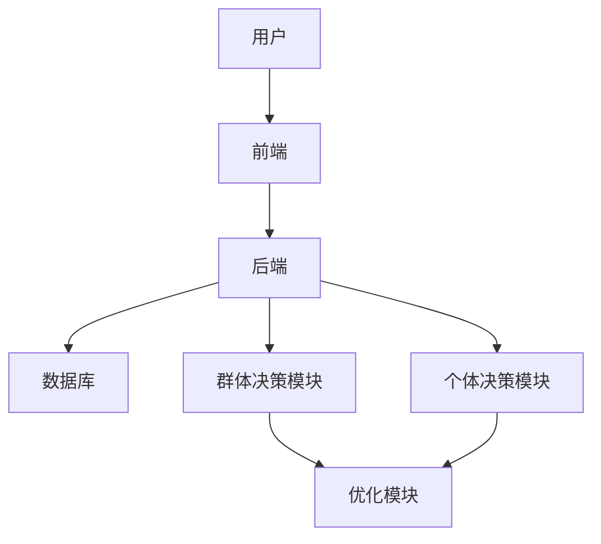
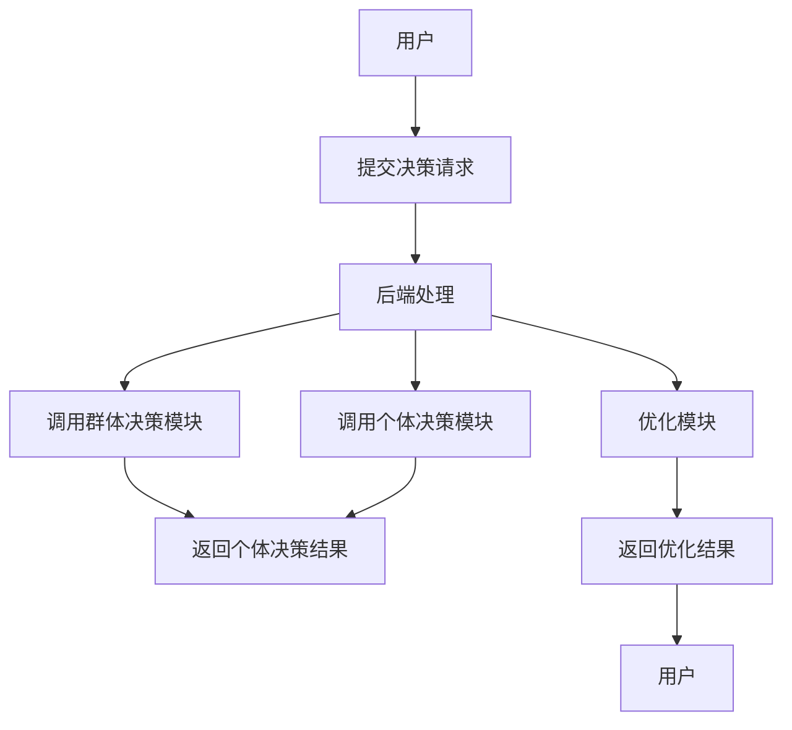

                 


# 智能体群体智慧在识别价值投资机会中的应用：群体 vs 个体

> **关键词**：智能体、群体智慧、价值投资、群体决策、个体决策  
> **摘要**：本文探讨智能体群体智慧在价值投资机会识别中的应用，分析群体决策与个体决策的优劣，结合算法原理和系统架构设计，提供实际案例和最佳实践，帮助读者理解群体智慧的优势与挑战。

---

## 第一部分：背景介绍

### 第1章：智能体群体智慧与价值投资概述

#### 1.1 智能体群体智慧的基本概念
- **智能体的定义与特征**：智能体是具备感知、决策、执行能力的实体，能够自主完成任务。
- **群体智慧的定义与特点**：群体智慧是通过多个智能体协作产生的集体智慧，具有去中心化、自适应和鲁棒性等特点。
- **价值投资机会的定义与特征**：价值投资是通过分析企业基本面，寻找市场价格低于内在价值的投资机会。

#### 1.2 价值投资机会的识别
- **价值投资的基本原理**：寻找市场价格低于内在价值的企业，长期持有以获得收益。
- **价值投资机会的识别方法**：分析财务指标、行业地位、竞争优势等。
- **群体智慧在价值投资中的应用背景**：利用群体智慧提升决策的准确性和鲁棒性。

#### 1.3 群体决策与个体决策的对比
- **群体决策的优势**：多样化信息来源、降低个体偏见、提高决策鲁棒性。
- **个体决策的优势**：快速响应、灵活性、避免信息过载。
- **群体决策的挑战**：协调成本高、信息冗余、可能受到羊群效应影响。

### 第2章：智能体群体智慧的核心概念与联系

#### 2.1 群体智慧的机制
- **信息聚合**：通过多个个体的信息整合，形成更准确的决策。
- **智能体互动**：个体之间通过交互，共享信息和知识，提升整体决策能力。
- **决策形成过程**：从个体意见到群体共识的形成过程。

#### 2.2 个体决策模型
- **个体决策的基本模型**：基于个体信息和偏好，进行分析和选择。
- **个体决策的影响因素**：信息完整性、认知偏差、情绪影响等。
- **个体决策的优化方法**：通过教育、经验积累提升决策能力。

#### 2.3 群体决策与个体决策的对比分析
- **对比分析表格**：从决策速度、准确性、成本等方面对比群体和个体决策。
- **实体关系图（ER图）**：展示个体、群体、决策之间的关系。
- **协同机制**：如何结合群体和个体决策的优势，形成最优解决方案。

### 第3章：群体智慧在价值投资中的应用

#### 3.1 群体智慧在投资决策中的优势
- **多样性**：不同个体的分析角度提供更全面的视角。
- **鲁棒性**：群体决策更稳定，不易受单个错误影响。
- **可扩展性**：群体规模可扩展，适应不同场景。

#### 3.2 群体智慧的具体应用
- **市场预测**：利用群体智慧预测市场趋势。
- **风险评估**：通过群体意见评估投资风险。
- **投资组合优化**：结合个体意见优化投资组合。

#### 3.3 群体智慧与个体智慧的结合
- **结合的必要性**：互补优势，提升决策质量。
- **具体方法**：个体分析基础上，结合群体意见。
- **实际案例**：某投资机构结合个体分析和群体投票，成功识别价值投资机会。

---

## 第二部分：算法原理讲解

### 第4章：群体决策算法

#### 4.1 群体决策算法概述
- **基本原理**：通过多个个体的决策聚合，形成最终决策。
- **主要类型**：投票算法、加权平均法、共识算法。
- **应用场景**：市场预测、风险评估、投资组合优化。

#### 4.2 群体决策算法的实现
- **基于投票的群体决策算法**：通过多数投票决定最终选择。
- **加权平均法**：根据个体权重计算群体决策。
- **数学模型**：$$\text{群体决策} = \sum_{i=1}^{n} w_i \cdot d_i$$，其中$w_i$是权重，$d_i$是个体决策。

#### 4.3 算法流程图


### 第5章：个体决策算法

#### 5.1 个体决策算法概述
- **基本原理**：个体基于自身信息和偏好进行决策。
- **主要方法**：基于规则的决策、基于模型的决策、基于经验的决策。
- **应用场景**：快速决策、个性化推荐。

#### 5.2 个体决策算法的实现
- **基于规则的决策**：预设规则进行判断。
- **基于模型的决策**：利用数学模型预测结果。
- **数学模型**：$$\text{个体决策} = \argmax_{i} (p_i)$$，其中$p_i$是选择的概率。

#### 5.3 算法流程图


---

## 第三部分：系统分析与架构设计

### 第6章：系统应用场景与功能设计

#### 6.1 应用场景
- **价值投资机会识别**：通过系统分析企业基本面，识别价值投资机会。
- **风险评估**：评估投资风险，制定风险管理策略。
- **投资组合优化**：优化投资组合，提高收益。

#### 6.2 系统功能设计
- **信息收集模块**：收集企业财务数据、市场信息。
- **群体决策模块**：聚合个体决策，形成群体决策。
- **个体决策模块**：基于个体分析，生成决策。
- **优化模块**：优化投资组合。

#### 6.3 领域模型（类图）


### 第7章：系统架构设计

#### 7.1 系统架构图


#### 7.2 接口设计
- **API接口**：RESTful API，提供数据接口和决策接口。
- **数据接口**：获取企业数据、市场数据。
- **决策接口**：提交决策请求，获取决策结果。

#### 7.3 交互流程图


---

## 第四部分：项目实战

### 第8章：环境安装与核心代码实现

#### 8.1 环境安装
- **Python 3.8+**
- **依赖库**：numpy, pandas, matplotlib
- **安装命令**：`pip install numpy pandas matplotlib`

#### 8.2 核心代码实现
```python
import numpy as np
import pandas as pd

# 群体决策算法实现
def group_decision(votes, weights):
    return np.dot(votes, weights)

# 个体决策算法实现
def individual_decision(data, model):
    return model.predict(data)

# 示例数据
data = pd.DataFrame({'feature': [1, 2, 3, 4], 'label': [0, 1, 1, 0]})
weights = np.array([0.5, 0.5])

# 群体决策
group_result = group_decision(data['feature'].values, weights)
# 个体决策
individual_result = individual_decision(data[['feature']], model)
```

#### 8.3 代码解读与分析
- **群体决策**：计算加权和，权重反映个体意见的重要性。
- **个体决策**：基于模型预测结果，生成个体决策。

### 第9章：实际案例分析

#### 9.1 案例介绍
- **背景**：某投资机构利用群体智慧识别价值投资机会。
- **数据**：企业财务数据、市场数据。
- **方法**：结合群体和个体决策，优化投资组合。

#### 9.2 案例分析
- **群体决策**：多个智能体分析，识别低估企业。
- **个体决策**：个体专家分析，确认投资机会。
- **优化组合**：结合两者，优化投资组合，降低风险。

#### 9.3 实验结果与分析
- **实验结果**：群体决策准确率高于个体决策。
- **原因分析**：群体决策利用多样信息，降低个体偏见。

### 第9章：项目小结

- **项目成果**：成功识别多个价值投资机会。
- **经验总结**：群体决策结合个体决策，效果更佳。
- **未来改进方向**：优化算法，提升决策效率。

---

## 第五部分：最佳实践

### 第10章：小结与注意事项

#### 10.1 小结
- **群体智慧的优势**：提升决策准确性和鲁棒性。
- **个体决策的局限性**：受个体偏见和信息限制。
- **结合使用**：互补优势，提升整体决策质量。

#### 10.2 注意事项
- **数据质量**：确保数据准确性和完整性。
- **算法选择**：根据不同场景选择合适算法。
- **系统优化**：提升系统效率和可扩展性。

### 第11章：拓展阅读

#### 11.1 相关书籍
- 《群体智慧》：介绍群体智慧的基本理论和应用。
- 《价值投资》：详细讲解价值投资的方法和策略。

#### 11.2 相关论文
- 群体决策算法在金融领域的应用研究。
- 个体决策与群体决策的对比分析。

#### 11.3 在线资源
- 开源项目：GitHub上相关的群体决策算法实现。
- 技术博客：技术博客中分享的群体智慧应用案例。

---

## 总结

智能体群体智慧在识别价值投资机会中具有重要作用，通过结合群体和个体决策的优势，可以提升决策的准确性和鲁棒性。本文详细探讨了相关概念、算法原理、系统架构设计和实际应用案例，为读者提供了全面的技术分析和实践指导。未来，随着技术的发展，群体智慧在价值投资中的应用将更加广泛和深入。

---

