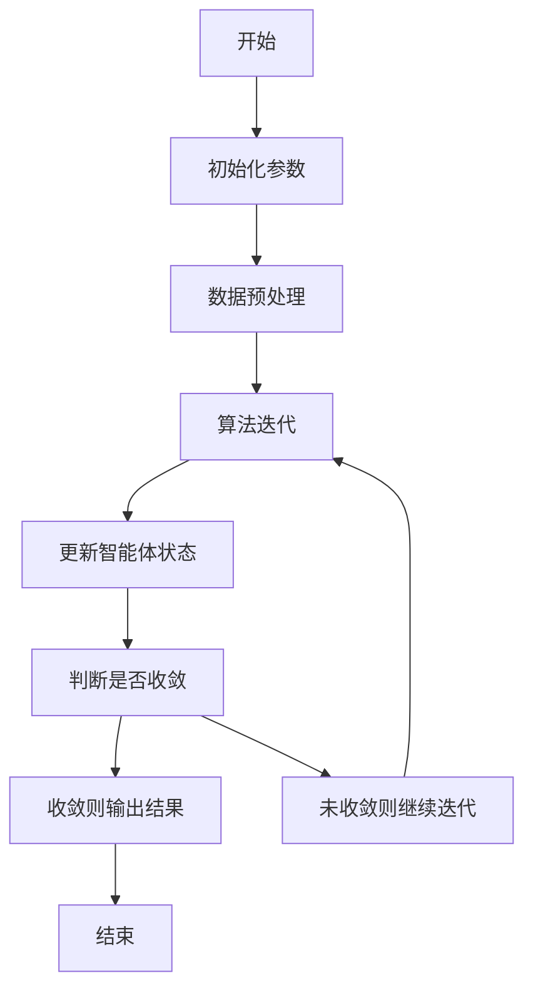
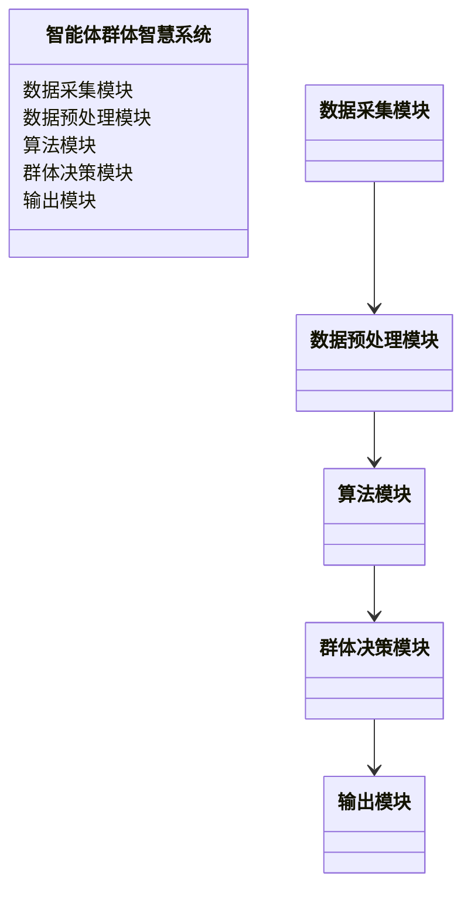
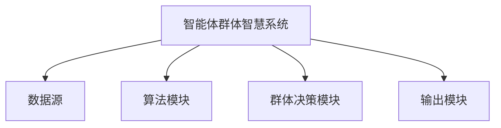

                 


# 智能体群体智慧在识别价值陷阱中的应用：避免投资误区

**关键词**：智能体群体智慧、价值陷阱、投资误区、算法原理、系统架构

**摘要**：  
本文探讨智能体群体智慧在投资领域中的应用，特别是如何通过群体智慧识别价值陷阱，避免投资误区。文章从背景介绍、核心概念、算法原理到系统架构、项目实战，逐步分析智能体群体智慧在投资决策中的优势和实现方式。通过实际案例和代码实现，展示了如何利用群体智慧提高投资分析的准确性和效率。

---

## 第一部分：智能体群体智慧的背景与核心概念

### 第1章：智能体群体智慧的背景介绍

#### 1.1 问题背景
##### 1.1.1 投资中的价值陷阱
价值陷阱是指某些公司或资产看似估值低廉，但实际上由于基本面问题或市场结构限制，其价值无法真正提升。传统投资分析方法（如基本面分析和市盈率法）可能无法及时发现这些陷阱，导致投资者蒙受损失。

##### 1.1.2 传统投资分析的局限性
- 数据依赖性：传统分析依赖于历史数据和财务指标，可能无法捕捉市场中的动态变化。
- 个体决策偏差：投资者的主观判断可能导致误判，尤其是在市场波动加剧时。
- 信息不对称：市场中的信息分布不均，个体投资者难以获取全面数据。

##### 1.1.3 智能体群体智慧的引入
智能体群体智慧通过集合多个智能体的分析和决策，利用群体的智慧来提高识别准确性和鲁棒性。每个智能体可以基于不同的数据源和算法进行分析，群体的决策结果是多个智能体结果的综合。

---

#### 1.2 问题描述
##### 1.2.1 价值陷阱的定义与特征
价值陷阱通常表现为以下特征：
- 低估值但高负债。
- 营收增长放缓，但成本持续上升。
- 市场份额萎缩，行业竞争加剧。

##### 1.2.2 投资者如何识别价值陷阱
传统方法包括：
- 基于财务指标的筛选（如ROE、ROA等）。
- 技术分析（如趋势线和成交量分析）。
- 专家意见（如行业分析师报告）。

##### 1.2.3 智能体群体智慧在投资中的应用潜力
智能体群体智慧可以通过以下方式提高价值陷阱识别的准确性：
- 多维度数据融合：整合市场数据、新闻、社交媒体等多源信息。
- 群体决策优化：通过多个智能体的协同工作，减少个体决策偏差。
- 动态适应性：智能体可以根据市场变化实时调整分析策略。

---

#### 1.3 问题解决
##### 1.3.1 智能体群体智慧的核心优势
- **数据处理能力**：智能体可以并行处理大量数据，提高分析效率。
- **群体智慧效应**：通过多个智能体的协同工作，群体决策往往优于个体决策。
- **动态适应性**：智能体可以根据市场变化实时调整分析策略。

##### 1.3.2 群体智慧如何辅助投资决策
- **多源数据整合**：智能体可以从多个数据源获取信息，如市场数据、社交媒体、新闻等。
- **实时分析**：智能体可以实时监控市场变化，快速识别潜在的价值陷阱。
- **群体决策优化**：通过多个智能体的协同工作，群体决策更加全面和准确。

##### 1.3.3 价值陷阱识别的算法框架
- 数据采集与预处理。
- 智能体分析与决策。
- 群体决策整合与优化。

---

#### 1.4 边界与外延
##### 1.4.1 智能体群体智慧的适用范围
- 适用于需要多维度数据分析的投资领域。
- 适用于需要动态调整投资策略的场景。
- 适用于需要群体决策优化的复杂投资问题。

##### 1.4.2 与其他投资策略的对比
- **传统基本面分析**：依赖财务指标，忽视市场动态。
- **技术分析**：依赖价格和成交量数据，忽视基本面因素。
- **智能体群体智慧**：综合多源数据，利用群体智慧优化决策。

##### 1.4.3 价值陷阱识别的边界条件
- 数据质量和完整性：智能体分析依赖于高质量的数据。
- 智能体数量与多样性：群体智慧的效果依赖于智能体的多样性和数量。
- 计算资源：智能体分析需要大量的计算资源支持。

---

#### 1.5 核心概念结构与要素
##### 1.5.1 智能体群体智慧的组成要素
- **智能体**：具有独立决策能力的个体。
- **数据源**：包括市场数据、新闻、社交媒体等。
- **算法模块**：智能体的分析和决策算法。
- **群体决策机制**：群体决策的整合与优化方法。

##### 1.5.2 价值陷阱识别的关键特征
- **低估值**：市盈率、市净率等估值指标低于行业平均水平。
- **高负债**：资产负债率过高，财务风险较大。
- **营收增长放缓**：收入增长停滞或下降，盈利能力减弱。

##### 1.5.3 群体智慧与个体智慧的协同作用
- 群体智慧可以弥补个体智慧的不足，如信息不全、决策偏差等。
- 个体智慧的多样性可以提高群体智慧的鲁棒性。
- 群体智慧的动态调整能力可以适应市场的快速变化。

---

## 第2章：智能体群体智慧的核心概念与联系

### 2.1 智能体群体智慧的原理
#### 2.1.1 智能体的定义与特征
- **智能体**：具有感知环境、做出决策和执行动作能力的实体。
- **特征**：自主性、反应性、社会性、适应性。

#### 2.1.2 群体智慧的形成机制
- **信息共享**：智能体之间共享数据和信息。
- **协同决策**：通过协同工作，群体决策优于个体决策。
- **动态调整**：群体可以根据环境变化实时调整决策策略。

#### 2.1.3 群体智慧在投资中的应用
- **多源数据整合**：智能体可以从多个数据源获取信息，如市场数据、新闻、社交媒体等。
- **实时分析**：智能体可以实时监控市场变化，快速识别潜在的价值陷阱。
- **群体决策优化**：通过多个智能体的协同工作，群体决策更加全面和准确。

---

### 2.2 概念属性特征对比
以下表格对比了智能体群体智慧与其他投资策略的核心特征：

| **特征维度**         | **智能体群体智慧**                | **传统基本面分析**                | **技术分析**                   |
|-----------------------|------------------------------------|------------------------------------|--------------------------------|
| 数据来源              | 多源数据（市场数据、新闻、社交媒体） | 财务数据、行业数据               | 价格和成交量数据               |
| 分析方法              | 群体智慧算法、机器学习          | 财务指标分析、比率分析          | 技术指标（如均线、MACD）       |
| 决策主体              | 智能体群体                        | 个体投资者或分析师               | 个体投资者或技术分析师         |
| 适应性                | 高，可以实时调整策略             | 中，依赖于定期更新的财务数据     | 中，依赖于价格和成交量的变化   |
| 精准度                | 高，群体智慧可以提高识别准确率   | 中，依赖于财务数据的完整性       | 中，依赖于技术指标的有效性     |

---

### 2.3 ER实体关系图架构
以下是智能体群体智慧系统的实体关系图：

```mermaid
er
actor(投资者) --> 智能体系统
智能体系统 --> 数据源(市场数据、新闻、社交媒体)
智能体系统 --> 算法模块(群体智慧算法)
算法模块 --> 识别结果(价值陷阱标识)
识别结果 --> 投资决策
```

---

## 第3章：智能体群体智慧的算法原理

### 3.1 群体智能算法
#### 3.1.1 群体智能算法的概述
群体智能算法是一种模拟自然群体行为的算法，如鸟群飞行、鱼群游动等。这些算法通常用于优化问题，如路径规划、资源分配等。

#### 3.1.2 群体智能算法的数学模型
以下是一个简单的群体智能算法数学模型：

$$f(x) = \sum_{i=1}^{n} w_i x_i$$

其中，$w_i$ 是权重，$x_i$ 是输入变量。

#### 3.1.3 群体智能算法的流程图
以下是群体智能算法的流程图：



---

### 3.2 算法流程
以下是智能体群体智慧算法的详细流程：

1. **数据采集**：从多个数据源采集数据，如市场数据、新闻、社交媒体等。
2. **数据预处理**：清洗数据，去除噪声，提取有用特征。
3. **算法迭代**：智能体基于预处理后的数据进行分析和决策。
4. **群体决策**：将多个智能体的决策结果进行整合和优化。
5. **结果输出**：输出最终的群体决策结果，如价值陷阱标识。

---

### 3.3 群体智慧算法的Python代码实现
以下是基于群体智慧算法的Python代码示例：

```python
import numpy as np

class Agent:
    def __init__(self, weights):
        self.weights = weights

    def decide(self, inputs):
        return np.dot(self.weights, inputs)

class Swarm:
    def __init__(self, num_agents, input_dim):
        self.agents = [Agent(np.random.rand(input_dim, 1)) for _ in range(num_agents)]

    def aggregate_decisions(self, inputs):
        decisions = []
        for agent in self.agents:
            decision = agent.decide(inputs)
            decisions.append(decision)
        return np.mean(decisions, axis=0)

# 示例用法
if __name__ == "__main__":
    input_dim = 5
    num_agents = 10
    swarm = Swarm(num_agents, input_dim)
    inputs = np.random.rand(input_dim, 1)
    result = swarm.aggregate_decisions(inputs)
    print("群体决策结果：", result)
```

---

## 第4章：智能体群体智慧的系统分析与架构设计

### 4.1 系统应用场景
智能体群体智慧系统可以应用于以下场景：
- **股票投资**：识别价值陷阱，避免投资误区。
- **风险控制**：实时监控市场风险，优化投资组合。
- **量化交易**：基于群体智慧算法进行量化交易。

---

### 4.2 系统功能设计
以下是系统功能设计的类图：



---

### 4.3 系统架构设计
以下是系统的架构图：



---

## 第5章：智能体群体智慧的项目实战

### 5.1 环境安装与配置
以下是项目所需的环境配置：

```bash
pip install numpy
pip install matplotlib
pip install pandas
```

---

### 5.2 系统核心代码实现
以下是系统的Python代码实现：

```python
import numpy as np
import matplotlib.pyplot as plt

def main():
    # 生成示例数据
    inputs = np.random.rand(5, 1)
    num_agents = 10
    swarm = [Agent(np.random.rand(5, 1)) for _ in range(num_agents)]

    # 智能体决策
    decisions = []
    for agent in swarm:
        decision = np.dot(agent.weights.T, inputs)
        decisions.append(decision)

    # 群体决策
    aggregated_decision = np.mean(decisions, axis=0)
    print("群体决策结果：", aggregated_decision)

    # 可视化结果
    plt.plot(aggregated_decision)
    plt.xlabel('Input dimension')
    plt.ylabel('Decision value')
    plt.show()

if __name__ == "__main__":
    main()
```

---

## 第6章：智能体群体智慧的最佳实践

### 6.1 最佳实践
- **数据质量**：确保数据来源多样且高质量。
- **智能体多样性**：智能体的设计应具有多样性，以提高群体智慧的效果。
- **计算资源**：确保系统有足够的计算资源支持智能体的分析和决策。

### 6.2 小结
智能体群体智慧是一种有效的投资分析方法，通过多源数据整合和群体决策优化，可以提高价值陷阱识别的准确性和效率。

### 6.3 注意事项
- **数据隐私**：在数据采集和处理过程中，需注意数据隐私保护。
- **算法优化**：根据实际需求，不断优化算法和系统架构。
- **风险管理**：智能体群体智慧系统应具备风险控制机制，以应对市场的不确定性。

### 6.4 拓展阅读
- **《群体智慧：算法与应用》**
- **《智能体与多智能体系统》**
- **《投资学原理》**

---

## 第7章：总结与展望

### 7.1 总结
智能体群体智慧通过多源数据整合和群体决策优化，可以有效识别投资中的价值陷阱，避免投资误区。本文详细介绍了智能体群体智慧的核心概念、算法原理、系统架构和项目实现。

### 7.2 展望
未来，随着人工智能和大数据技术的不断发展，智能体群体智慧在投资领域的应用将更加广泛和深入。可以通过以下方式进一步优化和扩展：
- **多智能体协同优化**：进一步研究多智能体协同优化的方法。
- **动态自适应算法**：开发动态自适应算法，以应对市场的快速变化。
- **跨领域应用**：将智能体群体智慧应用于更多领域，如金融、医疗、交通等。

---

**感谢您的阅读！**  
如果本文对您有所帮助，请点赞、分享，您的支持是我持续创作的动力！

