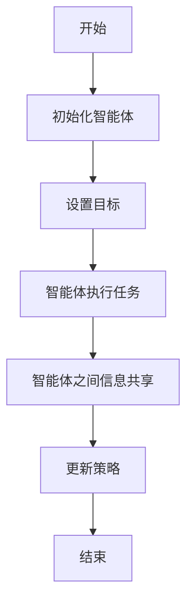
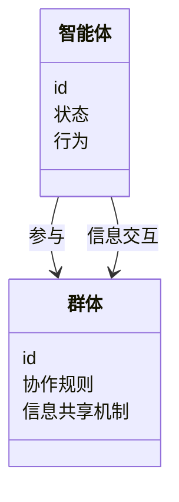
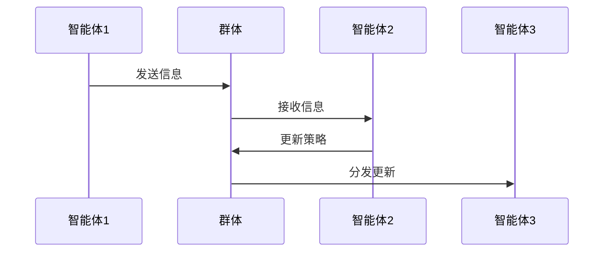

                 


# 智能体群体智慧在识别市场异常中的应用：捕捉特殊机会

## 关键词：智能体，群体智慧，市场异常识别，协同学习，分布式计算

## 摘要：  
智能体群体智慧是一种通过多个智能体协作来解决复杂问题的方法，尤其在识别市场异常方面具有独特优势。本文从智能体群体智慧的基本概念出发，分析其在市场异常识别中的应用场景，详细阐述相关算法原理和实现流程，并通过实际案例展示其在捕捉特殊机会中的应用价值。通过本文，读者可以全面了解智能体群体智慧的核心思想和技术实现，为市场异常识别提供新的思路和解决方案。

---

## 目录大纲

### 第一章：智能体群体智慧的定义与背景

#### 1.1 智能体群体智慧的定义
- 1.1.1 智能体的基本概念
- 1.1.2 群体智慧的定义与特征
- 1.1.3 智能体群体智慧的核心要素

#### 1.2 市场异常识别的背景与挑战
- 1.2.1 市场异常的定义与类型
- 1.2.2 市场异常识别的重要性
- 1.2.3 传统方法的局限性与挑战

#### 1.3 智能体群体智慧在市场异常识别中的应用前景
- 1.3.1 智能体群体智慧的优势
- 1.3.2 智能体群体智慧的潜在应用场景
- 1.3.3 技术发展的趋势与未来展望

### 第二章：智能体群体智慧的核心概念与联系

#### 2.1 智能体群体智慧的核心原理
- 2.1.1 协作学习与分布式计算
- 2.1.2 自适应行为与动态调整
- 2.1.3 多智能体之间的信息交互

#### 2.2 智能体与群体智慧的属性特征对比
- 2.2.1 智能体的属性特征
- 2.2.2 群体智慧的属性特征
- 2.2.3 两者对比分析

#### 2.3 ER实体关系图架构
```mermaid
erDiagram
    actor 智能体 {
        <属性> id
        <属性> 状态
        <属性> 行为
    }
    actor 群体 {
        <属性> id
        <属性> 协作规则
        <属性> 信息共享机制
    }
    智能体 --> 群体 : 参与
    智能体 --> 群体 : 信息交互
```

### 第三章：智能体群体智慧的算法原理

#### 3.1 算法原理概述
- 3.1.1 协作学习算法
- 3.1.2 分布式计算与并行处理
- 3.1.3 自适应调整机制

#### 3.2 算法实现流程


#### 3.3 协作学习算法实现
- 3.3.1 协作学习算法的数学模型
  $$ y = f(x) $$
- 3.3.2 算法实现的Python代码示例
  ```python
  def collaborative_learning_agents(agents):
      for agent in agents:
          agent.receive_information()
          agent.update_strategy()
      return agents
  ```

### 第四章：智能体群体智慧在市场异常识别中的应用

#### 4.1 问题场景介绍
- 4.1.1 市场异常识别的核心问题
- 4.1.2 智能体群体智慧的应用场景

#### 4.2 系统功能设计
- 4.2.1 领域模型Mermaid类图


#### 4.3 系统架构设计
- 4.3.1 系统架构Mermaid架构图


#### 4.4 系统接口设计
- 4.4.1 系统接口设计
- 4.4.2 系统交互Mermaid序列图


### 第五章：项目实战

#### 5.1 环境安装
- 5.1.1 安装Python环境
- 5.1.2 安装必要的库（如numpy、pandas、scikit-learn）

#### 5.2 系统核心实现源代码
- 5.2.1 协作学习算法实现
  ```python
  class Agent:
      def __init__(self, id):
          self.id = id
          self.strategy = None
          self.state = None

      def receive_information(self, information):
          self.strategy = information

      def update_strategy(self):
          self.state = self.strategy

  def collaborative_learning_agents(agents):
      for agent in agents:
          agent.receive_information(agent.strategy)
          agent.update_strategy()
      return agents
  ```

#### 5.3 代码应用解读与分析
- 5.3.1 代码功能分析
- 5.3.2 代码实现细节

#### 5.4 实际案例分析
- 5.4.1 案例背景介绍
- 5.4.2 案例实施步骤
- 5.4.3 案例结果与分析

#### 5.5 项目小结
- 5.5.1 项目实现总结
- 5.5.2 项目经验与教训

### 第六章：最佳实践与小结

#### 6.1 最佳实践
- 6.1.1 系统设计的注意事项
- 6.1.2 算法实现的优化建议

#### 6.2 小结
- 6.2.1 本文的核心内容回顾
- 6.2.2 智能体群体智慧的未来发展方向

#### 6.3 注意事项
- 6.3.1 系统实施中的常见问题
- 6.3.2 使用中的注意事项

#### 6.4 拓展阅读
- 6.4.1 相关领域的推荐书籍
- 6.4.2 相关领域的推荐论文

---

通过以上目录大纲，您可以逐步展开每个部分，详细撰写每章节的内容，确保文章逻辑清晰、结构紧凑、内容丰富。

