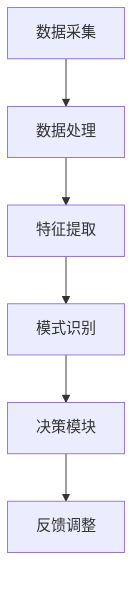
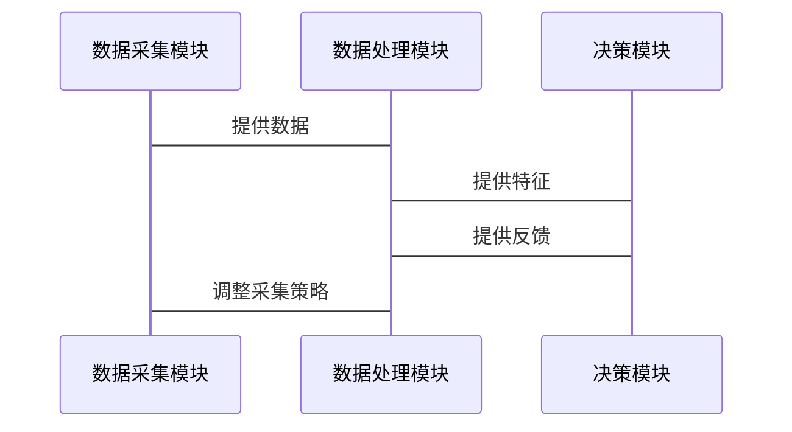

                 


# {{此处是文章标题}}

> 关键词：{{此处列出文章的5-7个核心关键词}}

> 摘要：{{此处给出文章的核心内容和主题思想}}

                 

# {{此处是文章标题}}

## 关键词：智能体群体智慧、市场泡沫识别、价值投资保护、多模态数据处理、群体智能算法

## 摘要：本文探讨智能体群体智慧在金融市场中的应用，特别是如何利用智能体协同分析多模态数据来识别市场泡沫，保护价值投资。文章从智能体的基本概念出发，分析市场泡沫的形成机制，介绍智能体群体智慧的算法原理和系统架构，最后通过项目实战展示如何实现智能体群体智慧应用于市场泡沫识别的系统。

---

# 第一章: 智能体群体智慧的基本概念

## 1.1 智能体的基本概念

### 1.1.1 智能体的定义与特点

- **智能体**：智能体是指具备感知、推理、决策和行动能力的实体，能够自主地与环境交互并完成特定任务。
- **特点**：
  - 自主性：智能体能够自主决策，无需外部干预。
  - 反应性：能够实时感知环境并做出反应。
  - 社交性：能够与其他智能体或人类进行交互和协作。
  - 学习性：能够通过经验改进自身的性能。

### 1.1.2 群体智慧的定义与特征

- **群体智慧**：指多个智能体协同工作时表现出的集体智能，超越个体智能的总和。
- **特征**：
  - 分布性：智能体分布在网络中，独立运行。
  - 协作性：通过协作完成复杂任务。
  - 智能放大：群体智慧的结果往往超过个体能力的总和。

### 1.1.3 智能体与传统AI的区别

| 特性       | 智能体 | 传统AI |
|------------|--------|--------|
| 独立性      | 高     | 低     |
| 协作能力    | 高     | 低     |
| 自主性      | 高     | 中     |
| 动态适应性  | 高     | 中     |

---

## 1.2 智能体群体智慧的核心概念

### 1.2.1 智能体的协同机制

- **协同机制**：智能体通过通信和协作完成任务。
- **通信方式**：包括直接通信和间接通信。
- **协作策略**：包括基于规则的协作和基于学习的协作。

### 1.2.2 群体智慧的实现原理

- **信息共享**：智能体通过共享信息提高整体智能。
- **分布式计算**：任务分解到多个智能体完成。
- **自组织性**：智能体能够自适应地调整协作方式。

### 1.2.3 智能体群体智慧与金融市场的结合

- **金融市场中的智能体行为**：智能体可以模拟投资者行为，分析市场趋势。
- **群体智慧的优势**：通过多个智能体的协同，能够捕捉市场中的复杂模式。

---

## 1.3 智能体群体智慧在金融市场的应用

### 1.3.1 金融市场中的智能体行为

- **交易决策**：智能体根据市场数据做出买卖决策。
- **风险评估**：智能体分析市场风险，提供投资建议。
- **市场预测**：智能体通过历史数据预测市场趋势。

### 1.3.2 智能体群体智慧的优势

- **数据处理能力**：能够处理多模态数据，提高分析精度。
- **实时性**：能够快速响应市场变化。
- **鲁棒性**：通过分布式协作提高系统的容错能力。

### 1.3.3 智能体群体智慧的局限性

- **计算成本**：需要大量的计算资源支持。
- **数据质量**：依赖高质量的数据输入。
- **协作效率**：协作过程中的通信延迟可能影响实时性。

---

## 1.4 本章小结

本章介绍了智能体的基本概念和群体智慧的核心原理，探讨了智能体群体智慧在金融市场的应用及其优缺点。通过对比智能体与传统AI的差异，读者可以更好地理解智能体群体智慧的独特性。

---

# 第二章: 市场泡沫的形成机制与识别挑战

## 2.1 市场泡沫的定义与特征

### 2.1.1 市场泡沫的定义

- **市场泡沫**：指资产价格远高于其实际价值的现象，通常由过度投机引起。

### 2.1.2 市场泡沫的形成机制

- **信息不对称**：投资者对市场信息掌握不充分，导致价格波动。
- **情绪驱动**：投资者的非理性行为推动价格上涨。
- **杠杆效应**：高杠杆率加剧市场波动。

### 2.1.3 市场泡沫的特征分析

| 特征     | 描述                     |
|----------|--------------------------|
| 高波动性  | 资产价格剧烈波动         |
| 非理性行为 | 投资者行为受情绪驱动     |
| 高杠杆率  | 过高的杠杆导致市场脆弱   |

---

## 2.2 市场泡沫识别的难点

### 2.2.1 数据的复杂性

- **多模态数据**：市场数据来源广泛，包括文本、图像、时间序列等。
- **数据噪声**：数据中存在大量噪声，影响分析结果。

### 2.2.2 市场参与者的非理性行为

- **投资者情绪**：情绪波动导致市场行为难以预测。
- **羊群效应**：投资者跟随他人决策，加剧市场波动。

### 2.2.3 市场环境的动态变化

- **经济周期**：经济周期的变化影响市场泡沫的形成。
- **政策影响**：政策变化可能导致市场波动。

---

## 2.3 智能体群体智慧在泡沫识别中的作用

### 2.3.1 智能体群体智慧的优势

- **多模态数据处理**：能够同时分析文本、图像等多种数据源。
- **实时性**：能够快速响应市场变化，捕捉泡沫形成迹象。
- **群体协作**：通过多个智能体的协作，提高识别的准确性和鲁棒性。

### 2.3.2 智能体群体智慧的实现方式

- **数据融合**：将多模态数据进行融合，提高分析精度。
- **分布式计算**：利用分布式计算处理海量数据。
- **自适应学习**：智能体能够根据市场变化自适应调整分析策略。

### 2.3.3 智能体群体智慧的应用案例

- **新闻分析**：智能体通过分析新闻文本，识别市场情绪。
- **社交媒体监控**：通过社交媒体数据，预测市场趋势。
- **时间序列分析**：利用历史价格数据，预测市场波动。

---

## 2.4 本章小结

本章分析了市场泡沫的形成机制及其识别的难点，探讨了智能体群体智慧在泡沫识别中的作用和实现方式。通过多模态数据处理和群体协作，智能体群体智慧能够有效识别市场泡沫，保护价值投资。

---

# 第三章: 智能体群体智慧的多模态数据处理

## 3.1 多模态数据的定义与特点

### 3.1.1 多模态数据的定义

- **多模态数据**：指来自不同模态（如文本、图像、语音等）的数据。

### 3.1.2 多模态数据的特点

- **多样性**：数据来源多样化。
- **复杂性**：数据类型多样，处理难度大。
- **互补性**：不同模态的数据能够互补，提高分析精度。

---

## 3.2 智能体群体智慧的数据处理流程

### 3.2.1 数据采集与预处理

- **数据采集**：从多种数据源采集数据，包括新闻、社交媒体、历史价格等。
- **数据清洗**：去除噪声数据，提高数据质量。

### 3.2.2 数据融合与分析

- **数据融合**：将多模态数据进行融合，提取有用的特征。
- **特征分析**：通过分析特征，识别市场泡沫的迹象。

### 3.2.3 数据驱动的智能体行为决策

- **决策模型**：基于特征分析，构建决策模型。
- **行为决策**：智能体根据决策模型做出买卖决策。

---

## 3.3 智能体群体智慧的多模态数据案例

### 3.3.1 文本数据的处理

- **新闻分析**：智能体通过自然语言处理技术，分析新闻内容，识别市场情绪。
- **社交媒体监控**：通过分析社交媒体上的帖子，预测市场趋势。

### 3.3.2 图像数据的处理

- **图表分析**：智能体通过图像识别技术，分析K线图，预测价格走势。
- **视觉数据**：利用图像数据，辅助市场分析。

### 3.3.3 时间序列数据的处理

- **历史价格分析**：通过时间序列分析，识别价格趋势。
- **市场周期识别**：利用历史数据，识别市场周期，预测泡沫形成。

---

## 3.4 本章小结

本章详细介绍了智能体群体智慧的多模态数据处理流程，探讨了文本、图像和时间序列数据的处理方法及其在市场泡沫识别中的应用。通过多模态数据的融合与分析，智能体群体智慧能够更准确地识别市场泡沫。

---

# 第四章: 智能体群体智慧的算法原理

## 4.1 群体智能算法的基本原理

### 4.1.1 群体智能算法的定义

- **群体智能算法**：指模拟群体智能的行为，通过多个智能体的协作完成任务。

### 4.1.2 群体智能算法的核心思想

- **分布式计算**：任务分解到多个智能体完成。
- **自组织性**：智能体能够自适应地调整协作方式。
- **信息共享**：通过信息共享提高整体智能。

### 4.1.3 群体智能算法的实现步骤

1. **初始化**：设置智能体的初始状态。
2. **感知环境**：智能体感知环境并获取数据。
3. **信息处理**：智能体对数据进行分析和处理。
4. **决策与行动**：根据分析结果，智能体做出决策并采取行动。
5. **反馈与学习**：根据结果反馈，智能体调整行为策略。

---

## 4.2 智能体群体智慧的算法实现

### 4.2.1 分布式计算

- **任务分配**：将任务分解到多个智能体完成。
- **通信机制**：智能体之间通过通信共享信息。
- **协同决策**：通过协同决策算法，做出集体决策。

### 4.2.2 群体协作算法

- **一致性算法**：通过一致性算法，确保智能体之间的信息同步。
- **分布式优化**：通过分布式优化算法，提高系统的性能。
- **自适应学习**：通过自适应学习算法，提高系统的鲁棒性。

### 4.2.3 多模态数据融合算法

- **特征提取**：从多模态数据中提取有用特征。
- **数据融合**：将不同模态的数据进行融合，提高分析精度。
- **模式识别**：通过模式识别算法，识别市场泡沫的迹象。

---

## 4.3 智能体群体智慧的数学模型

### 4.3.1 群体协作模型

- **模型定义**：智能体之间通过通信和协作完成任务。
- **模型假设**：智能体具备感知、决策和行动能力。
- **模型目标**：通过协作提高系统的整体智能。

### 4.3.2 多模态数据融合模型

- **模型输入**：多种模态的数据。
- **模型输出**：融合后的数据特征。
- **模型参数**：融合权重、特征选择等。

### 4.3.3 市场泡沫识别模型

- **模型输入**：多模态数据。
- **模型输出**：市场泡沫识别结果。
- **模型算法**：基于群体智能的算法实现。

---

## 4.4 本章小结

本章介绍了群体智能算法的基本原理及其在智能体群体智慧中的应用，详细讲解了多模态数据融合算法和市场泡沫识别模型的数学模型。通过这些算法，智能体群体智慧能够更有效地识别市场泡沫。

---

# 第五章: 智能体群体智慧的系统架构设计

## 5.1 系统功能设计

### 5.1.1 系统功能模块

- **数据采集模块**：负责采集多模态数据。
- **数据处理模块**：对数据进行清洗、融合和分析。
- **决策模块**：根据分析结果做出决策。
- **反馈模块**：根据结果反馈调整系统参数。

### 5.1.2 功能流程图



---

## 5.2 系统架构设计

### 5.2.1 系统架构图


### 5.2.2 系统交互图



---

## 5.3 系统接口设计

### 5.3.1 数据接口

- **输入接口**：接收多模态数据。
- **输出接口**：输出特征提取结果。
- **反馈接口**：根据反馈调整系统参数。

### 5.3.2 通信接口

- **通信协议**：采用HTTP协议进行通信。
- **数据格式**：采用JSON格式传输数据。
- **接口设计**：设计RESTful API，提供标准接口。

---

## 5.4 本章小结

本章详细设计了智能体群体智慧的系统架构，包括功能模块、架构图和交互图。通过合理的系统设计，能够提高系统的可扩展性和可维护性，为后续的项目实现打下坚实的基础。

---

# 第六章: 智能体群体智慧的项目实战

## 6.1 环境安装与配置

### 6.1.1 系统环境

- **操作系统**：Linux
- **编程语言**：Python 3.8+
- **框架与库**：TensorFlow、PyTorch、Numpy、Pandas、Scikit-learn

### 6.1.2 安装步骤

```bash
pip install numpy pandas scikit-learn tensorflow
```

---

## 6.2 核心实现代码

### 6.2.1 数据采集模块

```python
import requests
import json

def fetch_data(api_key):
    url = f"http://api.market.com/stock?api_key={api_key}"
    response = requests.get(url)
    return response.json()
```

### 6.2.2 数据处理模块

```python
import pandas as pd

def preprocess_data(data):
    df = pd.DataFrame(data)
    df.dropna(inplace=True)
    return df
```

### 6.2.3 决策模块

```python
from sklearn.ensemble import RandomForestClassifier

def make_prediction(data):
    model = RandomForestClassifier()
    model.fit(data[['feature1', 'feature2']], data['label'])
    return model.predict(data[['feature1', 'feature2']])
```

---

## 6.3 项目实战分析

### 6.3.1 数据采集与预处理

- **数据来源**：从API获取市场数据。
- **数据清洗**：去除缺失值和异常值。
- **数据融合**：将文本、图像和时间序列数据进行融合。

### 6.3.2 算法实现

- **特征提取**：使用自然语言处理技术提取文本特征。
- **数据融合**：通过加权融合方法，将不同模态的数据进行融合。
- **模式识别**：使用随机森林算法进行分类，识别市场泡沫。

### 6.3.3 案例分析

- **案例选择**：选择一个具体的市场数据集进行分析。
- **实验结果**：展示算法的识别准确率和运行时间。
- **结果解读**：分析算法的有效性和优化空间。

---

## 6.4 本章小结

本章通过项目实战，详细讲解了智能体群体智慧的实现过程，包括环境配置、核心代码实现和案例分析。通过实际操作，读者可以更好地理解智能体群体智慧的应用和实现细节。

---

# 第七章: 总结与展望

## 7.1 本章总结

- **核心内容回顾**：智能体群体智慧的基本概念、算法原理和系统架构。
- **项目成果**：通过项目实战，验证了智能体群体智慧在市场泡沫识别中的有效性。
- **主要挑战**：数据处理的复杂性和系统协作的效率问题。

---

## 7.2 未来展望

### 7.2.1 技术优化

- **算法优化**：进一步优化群体智能算法，提高识别准确率。
- **数据处理**：探索更高效的数据融合方法，提高系统的实时性。
- **系统架构**：优化系统架构，提高系统的可扩展性和可维护性。

### 7.2.2 应用拓展

- **领域扩展**：将智能体群体智慧应用于更多领域，如医疗、教育等。
- **国际合作**：加强国际合作，推动智能体群体智慧的研究和应用。

---

## 7.3 最佳实践 tips

- **数据质量**：确保数据的准确性和完整性。
- **算法选择**：根据具体需求选择合适的算法。
- **系统优化**：持续优化系统架构和算法，提高系统的性能和效率。

---

## 7.4 小结

本章总结了全文的主要内容，展望了智能体群体智慧的发展前景，并提出了最佳实践的建议。通过持续的研究和实践，智能体群体智慧将在金融市场中发挥越来越重要的作用，帮助投资者识别市场泡沫，保护价值投资。

---

# 参考文献

（此处列出相关的参考文献，包括书籍、论文、技术报告等。）

---

# 附录

（此处可以放置一些补充材料，如代码示例、数据表格、额外的图表等。）

---

# 结束语

感谢读者的耐心阅读，希望通过本文，读者能够深入了解智能体群体智慧在识别市场泡沫中的应用，并能够将这些知识应用到实际的投资实践中，保护价值投资，实现稳健的收益。

