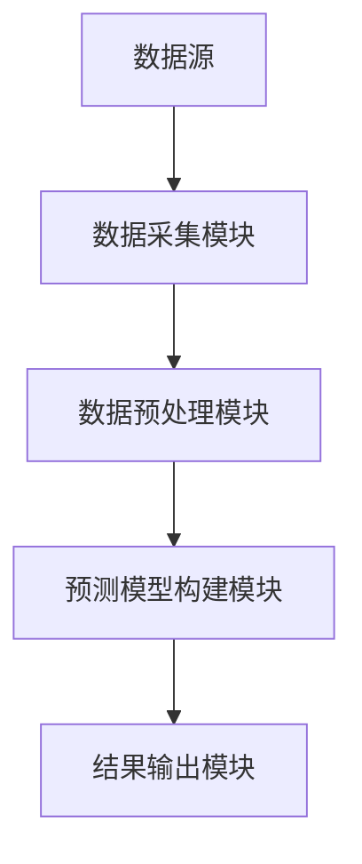

                 


# 智能体群体智慧在识别市场转折点中的应用：把握大机会

## 关键词：智能体群体智慧，市场转折点，人工智能，金融投资，算法，群体协作

## 摘要：  
智能体群体智慧是一种通过多个智能体协作来解决复杂问题的方法，其在金融市场中的应用尤为引人注目。本文深入探讨了智能体群体智慧在识别市场转折点中的应用，分析了其核心原理、算法模型以及系统架构，并通过实际案例展示了其在金融投资中的巨大潜力。文章不仅提供了理论支持，还通过代码实现和案例分析，帮助读者理解如何利用智能体群体智慧把握市场机会。

---

# 第1章：智能体群体智慧与市场转折点概述

## 1.1 智能体群体智慧的定义与背景  
智能体（Agent）是指具有感知环境、自主决策和执行任务能力的实体，可以是软件程序或物理设备。群体智慧则指通过多个智能体协作，利用个体的局部信息共同解决复杂问题的能力。  

### 1.1.1 智能体的基本概念  
智能体的核心特征包括：  
1. **自主性**：能够独立决策和行动。  
2. **反应性**：能感知环境并实时调整行为。  
3. **协作性**：通过信息共享和协作完成任务。  

### 1.1.2 群体智慧的定义与特征  
群体智慧是多个智能体通过协作完成任务的能力，其主要特征包括：  
1. **分布式计算**：任务分布在多个智能体中完成。  
2. **自适应性**：能够根据环境变化动态调整策略。  
3. **鲁棒性**：单个智能体的故障不会导致整体崩溃。  

### 1.1.3 市场转折点的定义与重要性  
市场转折点是指市场趋势发生重大变化的临界点，通常是价格、成交量或市场情绪的突然变化。识别市场转折点对投资者来说至关重要，因为它意味着潜在的收益或风险。

---

## 1.2 智能体群体智慧在金融市场中的应用前景  
### 1.2.1 金融市场中的复杂性与不确定性  
金融市场是一个高度动态和复杂的系统，受多种因素影响，包括经济指标、政策变化和市场情绪等。传统的单一预测模型往往难以捕捉市场的复杂性。

### 1.2.2 智能体群体智慧的优势与挑战  
智能体群体智慧的优势在于其分布式计算和自适应性，能够更好地应对市场的不确定性。然而，其挑战包括算法复杂性和数据处理的高效性。

### 1.2.3 未来发展趋势与研究方向  
随着人工智能和大数据技术的进步，智能体群体智慧在金融领域的应用将更加广泛，未来的研究方向包括算法优化和应用场景扩展。

---

# 第2章：智能体群体智慧的核心原理

## 2.1 智能体的行为模型与决策机制  
### 2.1.1 基于博弈论的智能体决策  
博弈论通过分析不同参与者之间的策略互动，帮助智能体做出最优决策。

### 2.1.2 基于强化学习的智能体行为  
强化学习通过奖励机制训练智能体，使其在与环境的交互中不断优化行为。

### 2.1.3 智能体之间的信息交互与协作  
智能体通过信息共享和协作，能够更全面地感知市场变化。

## 2.2 市场转折点的识别与群体智慧的关系  
### 2.2.1 市场转折点的多维度特征分析  
市场转折点通常伴随着价格波动、成交量变化和市场情绪转变。通过多维度数据分析，可以更准确地识别转折点。

### 2.2.2 群体智慧在市场预测中的优势  
群体智慧通过多个智能体的协作，能够捕捉市场的多维度信息，提高预测的准确性。

### 2.2.3 群体智慧与传统市场分析方法的对比  
与传统方法相比，群体智慧具有更高的自适应性和鲁棒性。

---

# 第3章：智能体群体智慧的算法原理

## 3.1 基于群体智慧的预测算法  
### 3.1.1 基于遗传算法的市场预测模型  
遗传算法通过模拟自然选择，优化预测模型的参数。

### 3.1.2 基于粒子群优化的预测算法  
粒子群优化算法通过模拟鸟群觅食行为，寻找最优解。

### 3.1.3 基于蚁群算法的市场分析方法  
蚁群算法通过模拟蚂蚁觅食行为，寻找市场的最优路径。

## 3.2 群体智慧算法的数学模型与实现  
### 3.2.1 群体智慧算法的数学表达式  
例如，粒子群优化算法的目标函数可以表示为：  
$$ f(x) = x^2 + 2x + 1 $$

### 3.2.2 算法实现的步骤与流程  
粒子群优化算法的实现步骤包括：初始化种群、计算适应度、更新粒子位置和速度等。

---

# 第4章：智能体群体智慧的系统架构与设计

## 4.1 系统功能模块设计  
### 4.1.1 数据采集与预处理模块  
数据采集模块负责收集市场数据，预处理模块对数据进行清洗和标准化。

### 4.1.2 预测模型构建模块  
基于群体智慧算法构建预测模型，对市场转折点进行预测。

## 4.2 系统架构设计  
### 4.2.1 系统架构图  


### 4.2.2 系统交互流程  
```mermaid
sequenceDiagram
    智能体群体 --> 数据采集模块
    数据采集模块 --> 数据预处理模块
    数据预处理模块 --> 预测模型构建模块
    预测模型构建模块 --> 结果输出模块
```

---

# 第5章：项目实战——股票价格预测

## 5.1 环境安装与配置  
需要安装Python、相关库（如NumPy、Pandas、Scikit-learn）和绘图工具（如Matplotlib）。

## 5.2 系统核心实现源代码  
以下是基于粒子群优化算法的股票价格预测代码示例：

```python
import numpy as np
import matplotlib.pyplot as plt

class Particle:
    def __init__(self, position, velocity):
        self.position = position
        self.velocity = velocity
        self.best_position = position
        self.global_best_position = None

def fitness(position):
    # 定义适应度函数，此处简化为计算价格波动
    return np.sum(position**2)

def optimize(positions, velocities, best_positions, global_best_position):
    for i in range(len(positions)):
        if fitness(positions[i]) < fitness(global_best_position):
            global_best_position[i] = positions[i]
    return global_best_position

# 初始化粒子群
n_particles = 10
n_features = 5
positions = np.random.rand(n_particles, n_features)
velocities = np.random.rand(n_particles, n_features)
best_positions = np.copy(positions)
global_best_position = np.min(positions, axis=0)

# 优化过程
for _ in range(100):
    positions += velocities
    fitness_values = np.array([fitness(pos) for pos in positions])
    velocities = velocities * 0.9 + (np.random.rand(n_particles, n_features) * 2 - 1) * 1.2
    global_best_position = optimize(positions, velocities, best_positions, global_best_position)

print("优化后的全局最优位置：", global_best_position)
```

## 5.3 案例分析与结果解读  
通过实际数据运行代码，分析预测结果与实际市场的吻合度，评估模型的准确性。

## 5.4 项目小结  
总结项目实现的过程，指出可能的改进方向，如算法优化和数据源扩展。

---

# 第6章：总结与展望

## 6.1 最佳实践 tips  
- 数据质量是关键，需确保数据的准确性和完整性。  
- 算法选择应根据具体问题调整，避免盲目使用流行算法。

## 6.2 小结  
智能体群体智慧通过群体协作，能够有效识别市场转折点，为投资者提供决策支持。

## 6.3 注意事项  
- 模型的泛化能力需通过大量数据验证。  
- 算法的参数设置会影响预测结果，需谨慎调整。

## 6.4 拓展阅读  
推荐阅读《群体智慧入门》和《金融市场预测算法精选》等书籍。

---

通过以上章节的详细讲解，本文系统地阐述了智能体群体智慧在识别市场转折点中的应用，从理论到实践，为读者提供了全面的指导。

