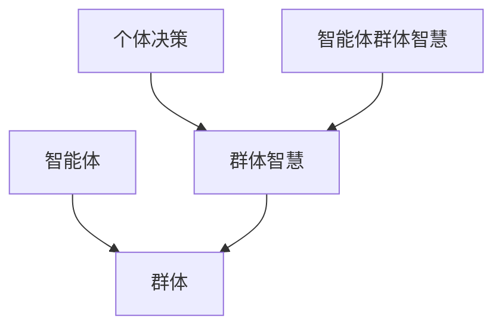
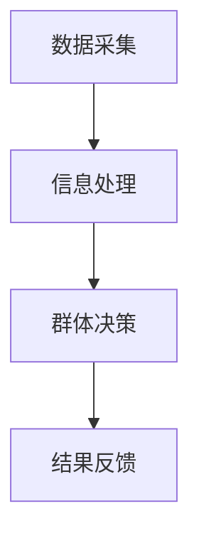

                 


# 智能体群体智慧：克服个体投资者的认知偏差

## 关键词：智能体，群体智慧，认知偏差，投资决策，算法原理

## 摘要：  
个体投资者在决策过程中常常受到认知偏差的影响，导致决策失误。通过引入智能体群体智慧，可以有效克服这些认知偏差，提升投资决策的科学性和准确性。本文从理论到实践，详细探讨了智能体群体智慧的实现原理、算法设计以及实际应用，为个体投资者提供了一种全新的决策支持方案。

---

## 第一章 背景介绍

### 1.1 问题背景  
#### 1.1.1 个体投资者的认知偏差  
个体投资者在面对复杂市场环境时，往往受到 confirmation bias、availability bias 等认知偏差的影响，导致决策失误。例如，投资者可能过度依赖已有的信息，忽视其他关键因素。  

#### 1.1.2 群体智慧的定义与特点  
群体智慧是指通过多个个体的协同合作，形成比个体更优的决策结果。其特点包括去中心化、多样性、可扩展性和鲁棒性。  

#### 1.1.3 智能体的概念与作用  
智能体（Agent）是指能够感知环境、自主决策并采取行动的实体。在投资领域，智能体可以用于数据采集、分析和决策支持。  

### 1.2 问题描述  
#### 1.2.1 个体投资者的决策局限性  
个体投资者由于信息不全、经验不足等因素，难以做出最优决策。  

#### 1.2.2 群体智慧在投资决策中的潜力  
通过聚合多个个体的决策信息，群体智慧能够有效降低个体认知偏差的影响，提升整体决策的准确性。  

#### 1.2.3 智能体群体智慧的核心问题  
如何通过智能体实现群体智慧，并克服个体投资者的认知偏差，是本章的核心问题。  

### 1.3 问题解决  
#### 1.3.1 群体智慧与智能体的结合  
通过智能体的协同工作，实现群体智慧的聚合效应。  

#### 1.3.2 智能体群体智慧的实现路径  
包括数据采集、信息处理、群体决策和结果反馈等步骤。  

#### 1.3.3 群体智慧在投资决策中的应用  
通过智能体聚合多个投资者的决策信息，形成更优的投资策略。  

### 1.4 边界与外延  
#### 1.4.1 智能体群体智慧的边界  
智能体群体智慧的应用范围和限制条件，例如数据质量和算法的准确性。  

#### 1.4.2 与传统群体决策的区别  
传统群体决策依赖于个体意见的汇总，而智能体群体智慧引入了智能化的处理和优化。  

#### 1.4.3 与个体决策的融合  
智能体群体智慧不仅能够替代个体决策，还能与个体决策形成互补。  

### 1.5 核心要素组成  
#### 1.5.1 智能体的属性  
包括感知能力、决策能力和执行能力。  

#### 1.5.2 群体智慧的结构  
包括个体决策层、协同层和优化层。  

#### 1.5.3 智能体群体智慧的系统架构  
包括数据采集、信息处理、群体决策和结果反馈四个模块。  

---

## 第二章 核心概念与联系

### 2.1 智能体与群体智慧的原理  
#### 2.1.1 智能体的定义与分类  
智能体可以分为简单反射型智能体和复杂推理型智能体。  

#### 2.1.2 群体智慧的形成机制  
群体智慧通过个体间的信息交互和协同合作形成。  

#### 2.1.3 智能体群体智慧的协同效应  
通过智能体的协同，群体智慧能够实现更优的决策结果。  

### 2.2 核心概念对比  
#### 2.2.1 智能体与传统决策模型的对比  
| 对比维度 | 智能体决策 | 传统决策 |
|----------|------------|-----------|
| 决策主体 | 多个智能体 | 单个个体 |
| 决策方式 | 协同决策 | 独立决策 |
| 决策效果 | 更优 | 一般 |

#### 2.2.2 群体智慧与个体决策的对比  
群体智慧通过多个个体的协同，能够有效降低认知偏差的影响。  

#### 2.2.3 智能体群体智慧与传统群体决策的对比  
智能体群体智慧引入了智能化的处理和优化，相比传统群体决策更具优势。  

### 2.3 实体关系图  


---

## 第三章 算法原理讲解

### 3.1 群体决策算法  
#### 3.1.1 基于投票的群体决策  
通过投票机制，聚合多个个体的决策信息。  

#### 3.1.2 加权群体决策  
根据个体的可信度或贡献度进行加权聚合。  

#### 3.1.3 融合个体差异的群体决策  
通过分析个体差异，优化群体决策的结果。  

### 3.2 智能体协同算法  
#### 3.2.1 分布式协同算法  
通过分布式通信，实现智能体间的协同决策。  

#### 3.2.2 基于博弈论的协同算法  
通过博弈论模型，优化智能体的决策策略。  

#### 3.2.3 基于强化学习的协同算法  
通过强化学习，提升智能体的协同能力。  

### 3.3 算法实现代码  
```python
def group_decision(votes, weights):
    total_weight = sum(weights)
    weighted_votes = [vote * weight for vote, weight in zip(votes, weights)]
    return sum(weighted_votes) / total_weight
```

### 3.4 数学模型与公式  
群体决策的结果可以表示为：  
$$ D = \frac{\sum_{i=1}^{n} w_i v_i}{\sum_{i=1}^{n} w_i} $$  
其中，$D$ 为群体决策结果，$w_i$ 为个体 $i$ 的权重，$v_i$ 为个体 $i$ 的决策值。  

---

## 第四章 系统分析与架构设计

### 4.1 问题场景介绍  
智能体群体智慧系统需要在复杂市场环境下，聚合多个智能体的决策信息，形成更优的投资策略。  

### 4.2 系统功能设计  
#### 4.2.1 数据采集模块  
负责采集个体投资者的决策信息。  

#### 4.2.2 信息处理模块  
对采集到的决策信息进行清洗和预处理。  

#### 4.2.3 群体决策模块  
通过算法聚合个体决策，形成群体决策结果。  

#### 4.2.4 结果反馈模块  
将群体决策结果反馈给个体投资者，供其参考。  

### 4.3 系统架构设计  


### 4.4 接口设计  
系统需要定义清晰的接口，确保各模块之间的通信顺畅。  

### 4.5 交互流程  
系统交互流程包括数据采集、信息处理、群体决策和结果反馈四个步骤。  

---

## 第五章 项目实战

### 5.1 环境安装  
需要安装Python、机器学习库（如Scikit-learn）和Mermaid工具。  

### 5.2 核心代码实现  
```python
import numpy as np
from sklearn import metrics

def weighted_majority_vote(votes, weights):
    return np.sum(votes * weights) / np.sum(weights)

# 示例数据
votes = [1, 0, 1, 1, 0]
weights = [0.4, 0.3, 0.2, 0.1, 0.0]

result = weighted_majority_vote(votes, weights)
print(result)
```

### 5.3 案例分析  
通过实际案例分析，展示智能体群体智慧在投资决策中的应用效果。  

---

## 第六章 最佳实践与总结

### 6.1 最佳实践 tips  
- 确保数据质量和多样性  
- 合理设置权重和算法参数  
- 定期更新模型和策略  

### 6.2 小结  
智能体群体智慧通过聚合多个个体的决策信息，有效克服了个体投资者的认知偏差，提升了投资决策的科学性和准确性。  

### 6.3 注意事项  
- 数据隐私和安全问题  
- 算法的可解释性和透明度  
- 系统的实时性和稳定性  

### 6.4 拓展阅读  
推荐相关领域的书籍和论文，供读者深入学习。  

---

## 参考文献  
（此处列出相关文献和资料）

