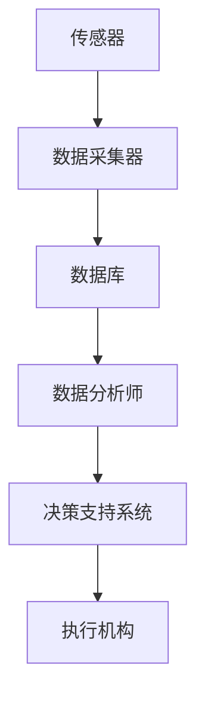

                 


# 智能农业技术的进步与农业现代化投资

> 关键词：智能农业，农业现代化，投资，物联网，大数据，人工智能

> 摘要：智能农业技术的快速发展正在推动农业现代化进程，本文将深入分析智能农业技术的核心概念、算法原理、系统架构，以及农业现代化投资的重要性与策略。通过实际案例分析，探讨如何利用智能技术提升农业效率，降低生产成本，并为投资者提供科学的决策依据。

---

# 第1章: 智能农业技术的背景与现状

## 1.1 智能农业技术的定义与核心概念

### 1.1.1 智能农业技术的定义
智能农业技术是结合物联网、大数据、人工智能等现代信息技术，用于优化农业生产、管理和服务的新型农业模式。其核心在于通过数据采集、分析和决策支持，实现农业的智能化、精准化和高效化。

### 1.1.2 智能农业的核心要素与属性特征

| 核心要素 | 属性特征 |
|----------|----------|
| 数据采集 | 实时性、准确性 |
| 数据分析 | 智能化、高效性 |
| 决策支持 | 精准性、可扩展性 |
| 执行控制 | 自动化、可靠性 |

### 1.1.3 智能农业与传统农业的对比分析
- **传统农业**：依赖人工经验，资源利用率低，生产效率不高。
- **智能农业**：通过数据驱动，实现精准管理，提高资源利用率和生产效率。

## 1.2 智能农业技术的发展背景

### 1.2.1 全球农业面临的挑战
- 人口增长导致粮食需求增加。
- 自然资源短缺和环境污染问题日益严重。
- 农业劳动力不足，老龄化严重。

### 1.2.2 智能农业技术的兴起
- 技术进步：物联网、大数据、人工智能等技术的成熟。
- 政策支持：全球范围内对农业现代化的政策推动。
- 市场需求：消费者对高质量农产品的需求增加。

### 1.2.3 中国农业现代化的现状与痛点
- **现状**：中国农业正在逐步实现现代化，物联网、大数据等技术得到广泛应用。
- **痛点**：部分地区技术应用水平低，资源浪费严重，农业生产效率有待提升。

## 1.3 智能农业技术的应用现状

### 1.3.1 农业物联网的应用场景
- **环境监测**：实时监测温湿度、光照强度等环境参数。
- **设备控制**：自动调节灌溉、温室通风等设备。
- **数据记录**：记录作物生长过程中的各项数据，便于分析和优化。

### 1.3.2 农业大数据的现状
- 数据采集：通过传感器、无人机等设备采集农田数据。
- 数据分析：利用大数据技术进行作物生长预测、病虫害预警。
- 数据应用：指导精准种植、优化资源配置。

### 1.3.3 人工智能在农业中的应用
- **图像识别**：用于作物病虫害识别。
- **自然语言处理**：用于农业知识问答和信息提取。
- **机器学习**：用于预测作物产量、优化种植方案。

## 1.4 农业现代化投资的重要性

### 1.4.1 投资农业现代化的必要性
- 提高农业生产效率，满足人口需求。
- 优化资源配置，减少浪费。
- 提升农产品质量，适应市场变化。

### 1.4.2 智能农业技术的投资价值
- **技术驱动**：智能农业技术能够显著降低成本，提高产量。
- **市场前景**：随着消费者对高质量农产品的需求增加，智能农业技术的投资回报率高。
- **政策支持**：政府对农业现代化的政策支持力度大，为投资者提供了良好的环境。

### 1.4.3 农业现代化投资的未来趋势
- **技术融合**：物联网、大数据、人工智能等技术的深度融合。
- **智能化设备普及**：智能农业设备的广泛应用。
- **数据驱动决策**：基于数据的精准农业将成为主流。

## 1.5 本章小结
本章介绍了智能农业技术的定义、核心要素以及与传统农业的区别，分析了智能农业技术的发展背景和应用现状，最后探讨了农业现代化投资的重要性及未来趋势。

---

# 第2章: 智能农业技术的核心概念与联系

## 2.1 智能农业技术的核心原理

### 2.1.1 物联网技术在农业中的应用
- **数据采集**：通过传感器实时采集农田环境数据。
- **数据传输**：通过网络将数据传输到云端进行处理。
- **远程监控**：通过移动端或电脑端实时监控农田情况。

### 2.1.2 大数据技术在农业中的应用
- **数据存储**：将采集到的农田数据存储在数据库中。
- **数据分析**：利用大数据技术对数据进行分析，提取有价值的信息。
- **数据可视化**：通过图表等形式展示数据，帮助农民和投资者做出决策。

### 2.1.3 人工智能技术在农业中的应用
- **图像识别**：用于作物病虫害识别和田间杂草识别。
- **自然语言处理**：用于农业知识问答和信息提取。
- **预测建模**：用于作物产量预测和市场价格预测。

## 2.2 智能农业技术的系统架构

### 2.2.1 系统架构的组成与功能
- **传感器网络**：负责采集农田环境数据。
- **数据处理中心**：负责数据的存储、分析和处理。
- **决策支持系统**：基于分析结果提供种植建议和优化方案。
- **执行机构**：根据决策结果自动执行灌溉、施肥等操作。

### 2.2.2 系统架构的实体关系图


## 2.3 智能农业技术的核心算法

### 2.3.1 数据采集与处理算法
- **数据清洗**：去除噪声数据，确保数据准确性。
- **数据融合**：将多源数据进行融合，提高数据的全面性。

### 2.3.2 数据分析与预测算法
- **时间序列分析**：用于预测作物生长周期和市场价格。
- **机器学习算法**：用于分类、回归和聚类分析。
- **深度学习算法**：用于图像识别和自然语言处理。

## 2.4 本章小结
本章详细讲解了智能农业技术的核心原理，分析了物联网、大数据和人工智能在农业中的具体应用，并通过实体关系图展示了系统架构。

---

# 第3章: 智能农业技术的算法原理与数学模型

## 3.1 数据采集与处理算法

### 3.1.1 数据采集算法
- **传感器数据采集**：通过传感器获取农田环境数据。
- **数据预处理**：去除噪声数据，确保数据准确性。

### 3.1.2 数据融合算法
- **数据融合**：将多源数据进行融合，提高数据的全面性。
- **数据加权**：根据数据来源和重要性进行加权处理。

## 3.2 数据分析与预测算法

### 3.2.1 时间序列分析
- **ARIMA模型**：用于预测作物生长周期和市场价格。
$$ARIMA(p, d, q)$$

### 3.2.2 机器学习算法
- **线性回归**：用于预测作物产量。
$$y = \beta_0 + \beta_1x + \epsilon$$

- **支持向量机（SVM）**：用于分类问题，如作物病虫害识别。

### 3.2.3 深度学习算法
- **卷积神经网络（CNN）**：用于图像识别，如田间杂草识别。
- **循环神经网络（RNN）**：用于时间序列预测，如作物生长周期预测。

## 3.3 决策优化算法

### 3.3.1 基于机器学习的决策优化
- **随机森林**：用于种植方案优化。
- **梯度提升树（GBDT）**：用于精准种植决策。

### 3.3.2 基于遗传算法的优化
- **遗传算法**：用于优化种植计划，如作物轮作安排。

### 3.3.3 基于强化学习的决策
- **Q-learning算法**：用于动态环境下的决策优化。

## 3.4 数学模型与公式

### 3.4.1 时间序列模型
$$ARIMA(p, d, q)$$

### 3.4.2 机器学习模型
$$y = f(x)$$

### 3.4.3 深度学习模型
$$y = \sigma(Wx + b)$$

## 3.5 本章小结
本章详细讲解了智能农业技术中的算法原理，包括数据采集与处理、数据分析与预测以及决策优化算法，并通过数学公式和图表展示了相关模型和流程。

---

# 第4章: 智能农业技术的系统分析与架构设计

## 4.1 系统分析

### 4.1.1 问题场景介绍
- **问题背景**：传统农业中，资源浪费严重，生产效率低。
- **问题描述**：如何通过智能技术优化农业生产过程。
- **问题解决**：利用物联网、大数据和人工智能技术实现精准农业。

### 4.1.2 项目介绍与目标
- **项目名称**：智能农业管理系统。
- **项目目标**：实现农田环境的实时监测和精准管理。

### 4.1.3 系统功能设计
- **环境监测**：实时监测温湿度、光照强度等环境参数。
- **数据分析**：分析历史数据，提供种植建议。
- **远程控制**：通过移动端或电脑端远程控制农业设备。

## 4.2 系统架构设计

### 4.2.1 系统架构的组成与功能
- **传感器网络**：负责采集农田环境数据。
- **数据处理中心**：负责数据的存储、分析和处理。
- **决策支持系统**：基于分析结果提供种植建议和优化方案。
- **执行机构**：根据决策结果自动执行灌溉、施肥等操作。

### 4.2.2 系统架构的交互流程


## 4.3 本章小结
本章通过系统分析和架构设计，详细讲解了智能农业管理系统的组成与功能，并通过交互流程图展示了系统的运行逻辑。

---

# 第5章: 智能农业技术的项目实战

## 5.1 项目介绍

### 5.1.1 项目背景
- **项目名称**：智能精准农业管理系统。
- **项目目标**：实现农田环境的实时监测和精准管理。

### 5.1.2 环境配置
- **硬件设备**：传感器、数据采集器、农业设备。
- **软件工具**：Python、数据库、数据分析工具。

## 5.2 核心代码实现

### 5.2.1 数据采集模块
```python
import serial

ser = serial.Serial('COM1', 9600)
data = ser.readline().decode().strip()
print(data)
```

### 5.2.2 数据分析模块
```python
import pandas as pd
from sklearn.linear_model import LinearRegression

data = pd.read_csv('agriculture_data.csv')
model = LinearRegression()
model.fit(data[['temperature', 'humidity']], data['yield'])
```

### 5.2.3 决策支持模块
```python
def decision_support():
    temperature = 25
    humidity = 60
    prediction = model.predict([[temperature, humidity]])
    print(f'预测产量：{prediction[0]}')
```

## 5.3 代码应用解读与分析

### 5.3.1 数据采集模块
- **功能**：通过串口读取传感器数据，实现数据的实时采集。

### 5.3.2 数据分析模块
- **功能**：利用机器学习模型，基于温度和湿度预测作物产量。

### 5.3.3 决策支持模块
- **功能**：根据预测结果，提供种植建议和优化方案。

## 5.4 项目小结
本章通过实际案例分析，详细讲解了智能农业管理系统的实现过程，包括环境配置、核心代码实现以及功能解读。

---

# 第6章: 智能农业技术的扩展阅读

## 6.1 最佳实践 tips
- **技术融合**：物联网、大数据和人工智能技术的深度融合是未来发展的趋势。
- **数据安全**：高度重视农业数据的安全性，防止数据泄露。
- **用户体验**：注重用户界面设计，提升用户体验。

## 6.2 注意事项
- **技术选型**：根据实际需求选择合适的技术方案。
- **数据质量**：确保数据的准确性和完整性。
- **系统维护**：定期维护系统，确保设备正常运行。

## 6.3 拓展阅读
- **推荐书籍**：《智能农业技术与应用》。
- **推荐网站**：农业农村部官网、科技部官网。

## 6.4 本章小结
本章总结了智能农业技术的最佳实践和注意事项，并推荐了相关的拓展阅读资料。

---

# 附录

## 附录A: 术语解释
- **物联网（IoT）**：通过传感器和网络实现物体的连接和数据传输。
- **大数据（Big Data）**：数据量大、类型多样、处理速度快的海量数据。

## 附录B: 工具安装与配置
- **Python安装**：从官网下载安装包，按照提示完成安装。
- **数据库安装**：安装MySQL或MongoDB等数据库软件。

---

# 结语

智能农业技术的进步正在推动农业现代化的快速发展，而农业现代化投资的重要性也不容忽视。通过本文的分析，我们可以看到智能农业技术在提升农业生产效率、优化资源配置以及降低生产成本方面的重要作用。未来，随着技术的进一步发展和投资的增加，智能农业技术将在全球范围内发挥更大的作用。

--- 

**End of Document**

