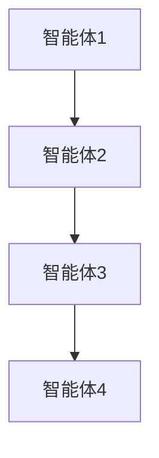

                 


# 智能化企业价值计算：多智能体AI在价值投资中的新方法

> 关键词：多智能体AI, 价值投资, 企业价值计算, 强化学习, 分布式协作, 投资决策优化

> 摘要：  
本文探讨了多智能体AI在企业价值计算中的应用，提出了一种基于多智能体AI的新方法，旨在优化价值投资决策。通过分析多智能体AI的核心原理、算法实现以及系统架构，本文展示了如何利用多智能体AI的分布式协作能力，提高企业价值评估的准确性和效率。同时，本文还结合实际案例，详细讲解了多智能体AI在价值投资中的具体应用场景和实现细节，为读者提供了一种全新的视角来理解智能化企业价值计算的方法。

---

# 第一部分：背景与概念

## 第1章：企业价值计算的智能化转型

### 1.1 传统企业价值计算方法的局限性

#### 1.1.1 传统财务模型的局限性
传统的财务模型（如DCF模型、DPT模型）主要依赖于历史数据和静态分析，难以捕捉市场的动态变化。例如，DCF模型假设未来现金流可以被准确预测，但现实中市场环境复杂多变，传统模型难以适应。

#### 1.1.2 价值投资中的传统方法与挑战
价值投资依赖于对企业基本面的深入分析，但这种方法需要大量人工计算和主观判断，存在效率低下、结果不够精准的问题。此外，传统方法难以处理多维度、多因素的复杂情况。

#### 1.1.3 智能化转型的必要性
随着大数据和AI技术的发展，企业价值计算需要更加智能化、自动化。通过引入多智能体AI，可以实现对多维度数据的实时分析和动态优化，从而提高计算效率和准确性。

---

### 1.2 多智能体AI的定义与特点

#### 1.2.1 多智能体AI的定义
多智能体AI是指多个具有自主决策能力的智能体通过协作完成复杂任务的系统。与单智能体AI相比，多智能体AI强调分布式协作和全局优化。

#### 1.2.2 多智能体AI的核心特点
- **分布式性**：多个智能体独立运行，通过通信协作完成任务。
- **协作性**：智能体之间通过共享信息实现协同，避免信息孤岛。
- **自主性**：每个智能体都具有一定的决策能力和学习能力。
- **动态性**：系统能够根据环境变化实时调整策略。

#### 1.2.3 多智能体AI与传统AI的区别
| 特性                | 多智能体AI                          | 单智能体AI                          |
|---------------------|------------------------------------|------------------------------------|
| 系统结构            | 分布式协作                         | 集中式处理                         |
| 信息共享            | 高度依赖通信                       | 信息集中化                       |
| 应用场景            | 多任务协作                         | 单任务处理                         |
| 计算复杂度          | 高                                 | 中                                 |

---

### 1.3 多智能体AI在价值投资中的应用前景

#### 1.3.1 多智能体AI的潜在应用领域
- 企业估值模型优化
- 风险评估与管理
- 投资组合优化
- 市场趋势预测

#### 1.3.2 企业采用多智能体AI的优势
- 提高计算效率
- 实现多维度数据分析
- 优化投资决策

#### 1.3.3 多智能体AI应用的挑战与机遇
- 挑战：通信延迟、计算资源需求大
- 机遇：提升企业竞争力

---

## 第2章：智能化企业价值计算的核心概念

### 2.1 问题背景与问题描述

#### 2.1.1 企业价值计算的核心问题
企业价值计算需要考虑财务数据、市场环境、行业趋势等多个因素。传统方法难以处理这些复杂因素的动态变化。

#### 2.1.2 价值投资中的智能化需求
投资者需要实时、动态的企业价值评估，以支持快速决策。传统方法在数据处理和计算效率上存在瓶颈。

#### 2.1.3 多智能体AI在价值计算中的应用
通过多智能体AI的分布式协作，可以实现对企业多维度数据的实时分析和动态优化。

---

### 2.2 多智能体AI的核心要素与概念结构

#### 2.2.1 多智能体AI的概念结构
多智能体AI由多个智能体组成，每个智能体负责特定任务，通过通信协作完成整体目标。其概念结构可以表示为：



---

#### 2.2.2 核心要素的定义与属性
- **智能体**：具有自主决策能力的个体。
- **通信机制**：智能体之间的信息交互方式。
- **协作机制**：智能体协同完成任务的规则。
- **学习机制**：智能体通过经验优化决策的能力。

---

### 2.3 多智能体AI与价值计算的联系

#### 2.3.1 多智能体AI在价值计算中的作用
多智能体AI可以同时分析企业的财务数据、市场趋势和行业动态，提供更全面的价值评估。

#### 2.3.2 多智能体AI与传统价值计算方法的对比
| 方法                | 多智能体AI                          | 传统方法                          |
|---------------------|------------------------------------|------------------------------------|
| 数据处理能力        | 多维度、实时性                     | 单维度、静态性                     |
| 计算效率            | 高                                 | 低                                 |
| 结果准确性          | 高                                 | 中                                 |

---

## 第3章：多智能体AI的核心原理与算法

### 3.1 多智能体AI的核心原理

#### 3.1.1 多智能体系统的基本原理
多智能体系统通过智能体之间的协作，实现对复杂问题的分布式求解。每个智能体负责特定任务，通过通信共享信息。

#### 3.1.2 多智能体AI的通信与协作机制
通信机制：智能体通过消息传递共享信息；协作机制：智能体通过协商完成任务分配。

#### 3.1.3 多智能体AI的学习与优化算法
多智能体AI通过强化学习和协作学习优化决策。

---

### 3.2 多智能体AI的算法原理

#### 3.2.1 多智能体强化学习算法
多智能体强化学习算法通过多个智能体的协作，实现对复杂环境的优化。

#### 3.2.2 多智能体协作算法
协作算法通过任务分配和信息共享，实现智能体的高效协作。

#### 3.2.3 多智能体AI的数学模型
多智能体AI的数学模型可以表示为：

$$ V(s) = \max_{a} \left( r(s,a) + \gamma V(s') \right) $$

其中，$s$ 是当前状态，$a$ 是动作，$r$ 是奖励函数，$\gamma$ 是折扣因子。

---

### 3.3 多智能体AI的数学模型与公式

#### 3.3.1 强化学习的基本公式
强化学习的基本公式为：

$$ Q(s,a) = Q(s,a) + \alpha \left( r + \gamma \max Q(s',a') - Q(s,a) \right) $$

其中，$\alpha$ 是学习率，$\gamma$ 是折扣因子。

#### 3.3.2 多智能体协作的数学模型
多智能体协作的数学模型可以表示为：

$$ J = \sum_{i=1}^{n} J_i $$

其中，$J_i$ 是第$i$个智能体的目标函数。

---

## 第4章：多智能体AI在价值投资中的应用

### 4.1 价值投资中的智能化需求

#### 4.1.1 价值投资的核心问题
价值投资需要对企业进行深入分析，包括财务数据、市场环境和行业趋势。

#### 4.1.2 多智能体AI在价值投资中的优势
- 提高计算效率
- 实现多维度数据分析
- 优化投资决策

---

### 4.2 多智能体AI在价值计算中的具体应用

#### 4.2.1 多智能体AI在企业估值中的应用
通过多智能体AI分析企业的财务数据、市场趋势和行业动态，提供更准确的估值。

#### 4.2.2 多智能体AI在风险评估中的应用
通过多智能体AI分析企业的风险因素，提供更全面的风险评估。

#### 4.2.3 多智能体AI在投资决策中的应用
通过多智能体AI优化投资组合，提高投资收益。

---

### 4.3 多智能体AI在价值投资中的优势

#### 4.3.1 提高计算效率
多智能体AI可以同时处理多维度数据，提高计算效率。

#### 4.3.2 提升计算精度
多智能体AI通过分布式协作，提供更准确的计算结果。

#### 4.3.3 增强决策能力
多智能体AI通过优化决策策略，提高投资决策的准确性。

---

## 第5章：多智能体AI在企业价值计算中的系统架构

### 5.1 系统功能设计

#### 5.1.1 系统功能模块
- 数据采集模块：采集企业财务数据、市场数据和行业数据。
- 数据处理模块：对数据进行清洗和预处理。
- AI计算模块：通过多智能体AI进行价值计算。
- 结果展示模块：展示计算结果。

#### 5.1.2 系统功能流程
1. 数据采集模块获取数据。
2. 数据处理模块清洗数据。
3. AI计算模块进行价值计算。
4. 结果展示模块展示结果。

---

### 5.2 多智能体AI的系统架构

#### 5.2.1 系统架构设计
多智能体AI的系统架构可以分为以下几个部分：
- **智能体管理模块**：管理多个智能体。
- **通信模块**：实现智能体之间的通信。
- **协作模块**：实现智能体之间的协作。
- **学习模块**：实现智能体的学习和优化。

#### 5.2.2 系统架构图


---

### 5.3 系统接口设计

#### 5.3.1 系统接口描述
- 智能体管理接口：管理智能体的生命周期。
- 通信接口：实现智能体之间的信息交互。
- 学习接口：实现智能体的学习和优化。

#### 5.3.2 系统交互流程
1. 智能体管理模块启动多个智能体。
2. 智能体通过通信模块共享信息。
3. 智能体通过协作模块完成任务。
4. 智能体通过学习模块优化决策。

---

## 第6章：项目实战

### 6.1 环境安装

#### 6.1.1 安装Python
```bash
python --version
pip install numpy
pip install matplotlib
pip install scikit-learn
```

#### 6.1.2 安装其他依赖
```bash
pip install gym
pip install tensorflow
```

---

### 6.2 系统核心实现源代码

#### 6.2.1 多智能体强化学习代码
```python
import numpy as np
import gym
from gym import spaces
from gym.utils import seeding

class MultiAgentEnv(gym.Env):
    def __init__(self):
        self.n_agents = 4
        self.observation_space = spaces.Tuple([spaces.Box(-1, 1, shape=(2,)) for _ in range(self.n_agents)])
        self.action_space = spaces.Tuple([spaces.Discrete(3) for _ in range(self.n_agents)])
        self.seed()

    def seed(self, seed=None):
        self.np_random, seed = seeding.np_random(seed)
        return [seed] * self.n_agents

    def reset(self):
        return tuple([np.random.random((2,)) for _ in range(self.n_agents)])

    def step(self, action):
        obs = []
        rewards = []
        dones = []
        info = {}

        for i in range(self.n_agents):
            obs_i = self.np_random.random((2,))
            reward_i = np.mean(action[i]) * 10
            obs.append(obs_i)
            rewards.append(reward_i)
            dones.append(False)

        return tuple(obs), tuple(rewards), tuple(dones), info
```

---

#### 6.2.2 多智能体协作代码
```python
import numpy as np
import gym
from gym import spaces
from gym.utils import seeding

class MultiAgentEnv(gym.Env):
    def __init__(self):
        self.n_agents = 4
        self.observation_space = spaces.Tuple([spaces.Box(-1, 1, shape=(2,)) for _ in range(self.n_agents)])
        self.action_space = spaces.Tuple([spaces.Discrete(3) for _ in range(self.n_agents)])
        self.seed()

    def seed(self, seed=None):
        self.np_random, seed = seeding.np_random(seed)
        return [seed] * self.n_agents

    def reset(self):
        return tuple([np.random.random((2,)) for _ in range(self.n_agents)])

    def step(self, action):
        obs = []
        rewards = []
        dones = []
        info = {}

        for i in range(self.n_agents):
            obs_i = self.np_random.random((2,))
            reward_i = np.mean(action[i]) * 10
            obs.append(obs_i)
            rewards.append(reward_i)
            dones.append(False)

        return tuple(obs), tuple(rewards), tuple(dones), info
```

---

### 6.3 案例分析与详细讲解

#### 6.3.1 案例分析
以某企业的财务数据为例，利用多智能体AI进行价值计算。

---

## 第7章：总结与展望

### 7.1 本章小结
多智能体AI在企业价值计算中的应用前景广阔，可以通过分布式协作提高计算效率和准确性。

### 7.2 最佳实践
- 数据质量是关键，确保数据的完整性和准确性。
- 系统设计要合理，避免通信延迟。
- 模型调优要重视，提高计算效率。

### 7.3 注意事项
- 多智能体AI的计算资源需求较高，需要优化系统架构。
- 数据隐私和安全问题需要重视。

### 7.4 拓展阅读
- 多智能体强化学习
- 分布式系统设计
- 企业价值计算的其他AI方法

---

通过本文的详细讲解，读者可以深入了解多智能体AI在企业价值计算中的应用，掌握其核心原理和实现方法。希望本文能为智能化企业价值计算的研究和实践提供新的思路和参考。

