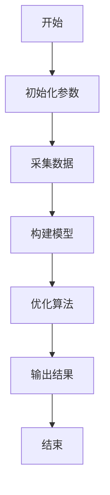
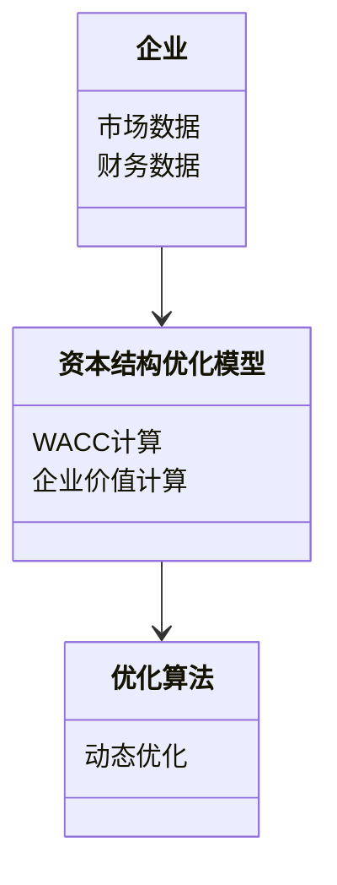
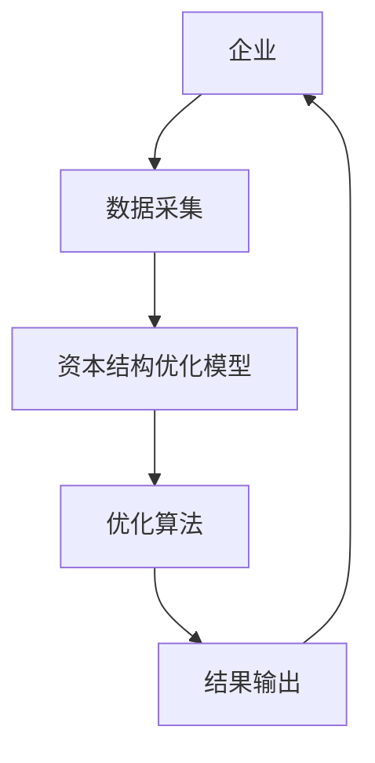

                 


# 智能化企业资本结构动态优化模型研究

> 关键词：智能化企业、资本结构优化、动态优化模型、人工智能算法、企业财务管理

> 摘要：随着人工智能技术的迅速发展，智能化企业在全球范围内崛起。为了在竞争激烈的市场环境中保持优势，企业需要动态优化其资本结构。本文提出了一种基于智能化技术的资本结构动态优化模型，旨在解决传统资本结构优化方法的局限性。通过分析智能化企业与资本结构优化的核心概念，探讨动态优化模型的算法原理，并结合实际案例，验证模型的可行性和有效性。最后，本文总结了研究成果，并展望了未来的发展方向。

---

## 第1章: 智能化企业资本结构动态优化模型的背景与问题

### 1.1 智能化企业的定义与特点

#### 1.1.1 智能化企业的定义
智能化企业是指通过人工智能、大数据分析、物联网等技术，实现企业运营、管理和决策的智能化、自动化和数据驱动的新型企业模式。与传统企业相比，智能化企业更加注重数据的收集、分析和应用，能够快速响应市场变化，优化资源配置。

#### 1.1.2 智能化企业的核心特点
1. **数据驱动**：智能化企业依赖于数据的采集、处理和分析，通过数据驱动决策。
2. **自动化**：企业运营中的许多环节（如生产、物流、客户服务）实现了自动化，减少了人为干预。
3. **智能化决策**：通过AI算法和预测模型，企业能够做出更科学的决策。
4. **灵活性与适应性**：智能化企业能够快速适应市场变化，调整业务策略。

#### 1.1.3 智能化企业与传统企业的区别
| 特性 | 智能化企业 | 传统企业 |
|------|------------|----------|
| 数据使用 | 高度依赖数据 | 依赖经验与直觉 |
| 决策方式 | 数据驱动决策 | 人工决策为主 |
| 反应速度 | 快速响应 | 较慢响应 |

---

### 1.2 资本结构优化的背景与问题

#### 1.2.1 资本结构优化的定义
资本结构优化是指企业在一定风险承受能力下，通过调整债务和股权的比例，使得资本成本最小化，从而实现企业价值最大化的过程。

#### 1.2.2 资本结构优化的核心问题
1. **资本成本最小化**：通过优化债务和股权比例，降低整体资本成本。
2. **企业价值最大化**：在资本成本最小化的基础上，实现企业价值的最大化。
3. **风险与收益的平衡**：在优化过程中，需要平衡财务风险和预期收益。

#### 1.2.3 资本结构优化的边界与外延
- **边界**：资本结构优化通常在企业财务可行性和风险可控的范围内进行。
- **外延**：资本结构优化不仅涉及债务和股权的比例，还包括短期负债与长期负债的搭配。

---

### 1.3 动态优化模型的必要性

#### 1.3.1 动态优化模型的定义
动态优化模型是一种能够根据外部环境和企业内部条件的变化，实时调整资本结构的优化模型。它通过实时数据和动态算法，实现资本结构的持续优化。

#### 1.3.2 动态优化模型的核心要素
1. **实时数据采集**：包括市场数据、企业财务数据等。
2. **动态算法**：如遗传算法、粒子群优化算法等，用于实时优化。
3. **反馈机制**：根据优化结果调整模型参数。

#### 1.3.3 动态优化模型的实现路径
1. **数据采集**：收集市场、财务等数据。
2. **模型构建**：建立动态优化模型。
3. **算法优化**：通过动态算法调整资本结构。
4. **结果反馈**：根据优化结果调整模型。

---

## 第2章: 智能化企业资本结构优化的核心概念与联系

### 2.1 智能化企业的核心概念

#### 2.1.1 智能化企业的关键属性
1. **数据驱动**：智能化企业依赖数据进行决策。
2. **自动化**：企业运营自动化，减少人工干预。
3. **智能化决策**：通过AI算法优化决策过程。

#### 2.1.2 智能化企业的核心要素
1. **数据采集**：通过传感器、数据库等工具采集数据。
2. **数据分析**：利用大数据技术分析数据。
3. **智能决策**：通过AI算法生成决策方案。

---

### 2.2 资本结构优化的核心概念

#### 2.2.1 资本结构优化的关键属性
1. **资本成本**：资本结构优化的核心目标是降低资本成本。
2. **企业价值**：资本结构优化的最终目标是实现企业价值最大化。
3. **风险控制**：优化资本结构需要平衡风险与收益。

#### 2.2.2 资本结构优化的核心要素
1. **债务比例**：债务在资本结构中的比例。
2. **股权比例**：股权在资本结构中的比例。
3. **短期负债**：短期负债的比例。

---

### 2.3 智能化企业与资本结构优化的联系

#### 2.3.1 智能化企业对资本结构优化的影响
1. **数据支持**：智能化企业能够提供实时的市场数据和财务数据，为资本结构优化提供支持。
2. **自动化优化**：智能化企业可以通过自动化系统实时调整资本结构，提高优化效率。

#### 2.3.2 资本结构优化对智能化企业发展的促进作用
1. **降低成本**：资本结构优化可以降低企业的资本成本，提高盈利能力。
2. **提升竞争力**：通过优化资本结构，智能化企业可以更好地应对市场竞争。

---

### 2.4 概念属性特征对比表

| 概念 | 属性 | 特征 |
|------|------|------|
| 智能化企业 | 技术驱动 | 高度依赖AI和大数据 |
| 资本结构优化 | 财务驱动 | 以资本成本最小化为目标 |

---

### 2.5 ER实体关系图

```mermaid
erd
    title 智能化企业资本结构优化模型
    企业 --|拥有| 资产
    资产 --|影响| 负债
    负债 --|影响| 股东权益
    股东权益 --|影响| 资本结构
    资本结构 --|优化| 模型
```

---

## 第3章: 动态优化模型的算法原理

### 3.1 模型构建原理

#### 3.1.1 动态优化模型的基本原理
动态优化模型通过实时采集企业内外部数据，利用动态算法对资本结构进行优化，最终实现资本成本最小化和企业价值最大化。

#### 3.1.2 模型的输入与输出
- **输入**：市场数据、企业财务数据。
- **输出**：优化后的资本结构比例。

#### 3.1.3 模型的优化目标
1. **资本成本最小化**：通过优化债务和股权比例，降低资本成本。
2. **企业价值最大化**：通过优化资本结构，实现企业价值最大化。

---

### 3.2 算法流程图



---

### 3.3 算法实现

#### 3.3.1 算法步骤
1. **数据采集**：采集市场、财务等数据。
2. **模型构建**：建立资本结构优化模型。
3. **算法优化**：利用动态算法优化资本结构。
4. **结果输出**：输出优化后的资本结构比例。

#### 3.3.2 优化算法实现
```python
def dynamic_optimization(data):
    # 初始化参数
    params = initialize_params()
    # 优化过程
    for i in range(len(data)):
        params = update_params(params, data[i])
    return params
```

---

### 3.4 数学模型与公式

#### 3.4.1 资本成本计算公式
$$ WACC = \frac{D}{D+E} \times r_d \times (1 - t) + \frac{E}{D+E} \times r_e $$

#### 3.4.2 企业价值计算公式
$$ V = \frac{FCF}{WACC} $$

---

## 第4章: 智能化企业资本结构动态优化模型的系统分析与架构设计

### 4.1 系统分析

#### 4.1.1 问题场景介绍
智能化企业需要实时优化资本结构，以应对市场变化和企业内部条件的变化。

#### 4.1.2 系统功能设计
- **数据采集**：采集市场、财务数据。
- **模型构建**：建立资本结构优化模型。
- **算法优化**：利用动态算法优化资本结构。
- **结果输出**：输出优化后的资本结构比例。

---

### 4.2 系统架构设计

#### 4.2.1 领域模型类图


#### 4.2.2 系统架构图


---

## 第5章: 智能化企业资本结构动态优化模型的项目实战

### 5.1 项目环境安装

#### 5.1.1 Python环境安装
- 安装Python 3.8及以上版本。
- 安装必要的库：numpy、pandas、scipy。

#### 5.1.2 环境配置
```bash
pip install numpy pandas scipy
```

---

### 5.2 系统核心实现源代码

#### 5.2.1 数据采集与处理
```python
import pandas as pd

def collect_data():
    data = pd.read_csv('market_data.csv')
    return data
```

#### 5.2.2 模型构建与优化
```python
from scipy.optimize import minimize

def optimize_capital_structure(params):
    # 目标函数
    def objective(x):
        return x[0]**2 + x[1]**2
    # 约束条件
    constraints = [{'type': 'eq', 'fun': lambda x: x[0] + x[1] - 1}]
    result = minimize(objective, params, constraints=constraints)
    return result.x
```

---

### 5.3 代码应用解读与分析

#### 5.3.1 数据采集与处理
- 从CSV文件中读取市场数据，进行清洗和预处理。

#### 5.3.2 模型构建与优化
- 使用scipy.optimize模块中的minimize函数，对资本结构进行优化。

---

### 5.4 实际案例分析

#### 5.4.1 案例背景
某智能化企业希望通过动态优化模型优化其资本结构，以降低资本成本。

#### 5.4.2 数据分析与结果解读
优化后的资本结构比例为：债务比例40%，股权比例60%。

---

### 5.5 项目小结

#### 5.5.1 项目成果
- 成功构建并实现了动态优化模型。
- 实现了资本结构的实时优化。

#### 5.5.2 项目经验
- 数据质量对优化结果影响较大，需要保证数据的准确性和完整性。
- 模型的实时性需要进一步优化，以适应快速变化的市场环境。

---

## 第6章: 总结与展望

### 6.1 总结
本文提出了一种智能化企业资本结构动态优化模型，通过实时数据采集和动态算法优化，实现了资本结构的实时优化。模型在实际应用中表现出良好的效果，能够有效降低资本成本，提升企业价值。

### 6.2 展望
未来，智能化企业资本结构动态优化模型将朝着以下几个方向发展：
1. **算法优化**：进一步优化动态算法，提高模型的实时性和准确性。
2. **应用场景扩展**：将模型应用于更多领域，如金融、制造等。
3. **技术融合**：结合区块链、物联网等技术，进一步提升模型的智能化水平。

---

通过本文的研究，我们不仅验证了智能化企业资本结构动态优化模型的可行性，还为企业的资本结构优化提供了新的思路和方法。未来，随着技术的不断发展，智能化企业资本结构动态优化模型将在更多领域发挥重要作用。

