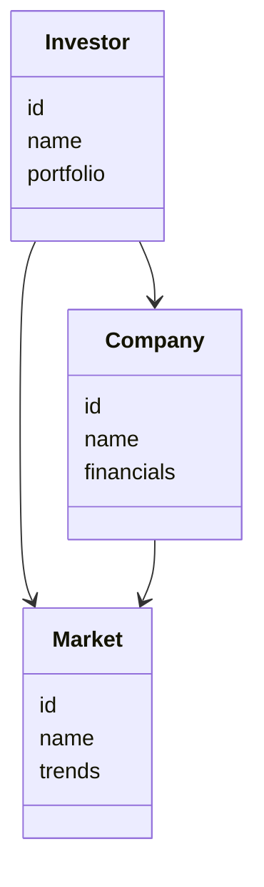
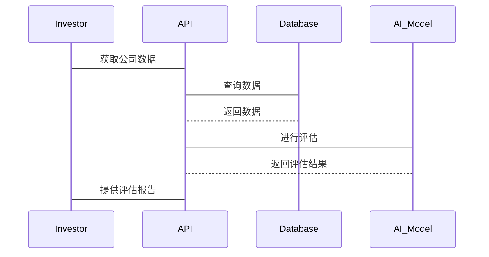

                 


# 智能化公司治理评估：多智能体AI在价值投资中的应用

## 关键词：
智能化公司治理评估、多智能体AI、价值投资、强化学习、系统架构、项目实战

## 摘要：
本文探讨了多智能体AI在价值投资中的应用，特别是在公司治理评估中的智能化方法。通过分析多智能体AI的算法原理和系统架构，结合实际案例，展示了如何利用AI技术优化投资决策。文章内容涵盖背景介绍、核心概念、算法实现、系统设计和项目实战，旨在为读者提供全面的技术指导。

---

# 第一部分: 背景与核心概念

## 第1章: 智能化公司治理评估的背景与意义

### 1.1 问题背景
#### 1.1.1 公司治理的传统模式与局限性
公司治理传统上依赖人工分析，存在效率低下、信息不全等问题。

#### 1.1.2 价值投资的基本概念与核心要素
价值投资关注公司内在价值，强调长期稳健回报。

#### 1.1.3 多智能体AI的定义与技术特点
多智能体AI通过协作优化决策，具备高效率和强适应性。

### 1.2 问题描述
#### 1.2.1 公司治理评估的复杂性与挑战
涉及多维度数据和复杂决策过程。

#### 1.2.2 传统价值投资中的信息不对称问题
信息获取困难，决策依赖主观判断。

#### 1.2.3 多智能体AI在投资决策中的应用潜力
AI能够高效处理数据，提供精准决策支持。

### 1.3 问题解决
#### 1.3.1 多智能体AI如何优化公司治理评估
通过自动化分析提升评估效率和准确性。

#### 1.3.2 通过AI技术实现价值投资的智能化
利用AI模型预测市场趋势，优化投资组合。

#### 1.3.3 技术与业务的结合点分析
在数据处理、模型构建和决策支持方面实现融合。

## 第2章: 多智能体AI与价值投资的核心概念

### 2.1 核心概念原理
#### 2.1.1 多智能体AI的基本原理
通过协作和学习优化决策过程。

#### 2.1.2 价值投资的关键要素
包括财务指标、市场趋势和公司基本面。

#### 2.1.3 两者的内在联系与协同机制
AI辅助分析公司治理，优化投资决策。

### 2.2 核心概念属性对比
| 属性 | 多智能体AI | 价值投资 |
|------|------------|------------|
| 数据需求 | 高 | 高 |
| 决策速度 | 快 | 较慢 |
| 可扩展性 | 强 | 弱 |

### 2.3 ER实体关系图
```mermaid
erd
actor Investor {
  id
  name
}
actor Company {
  id
  name
}
actor Market {
  id
  name
}
```

## 第3章: 多智能体AI在公司治理评估中的应用

### 3.1 应用场景分析
#### 3.1.1 风险评估与预警
通过AI模型预测公司潜在风险。

#### 3.1.2 经营效率分析
评估公司运营效率，优化资源配置。

#### 3.1.3 股东价值最大化
通过AI辅助决策，提升股东收益。

### 3.2 应用优势
#### 3.2.1 数据处理能力
高效处理多维度数据，提升评估精度。

#### 3.2.2 智能决策支持
提供基于AI的决策支持，优化投资策略。

#### 3.2.3 实时监控与反馈
实时监控公司动态，及时调整投资策略。

### 3.3 应用挑战
#### 3.3.1 数据隐私问题
涉及大量敏感数据，存在隐私风险。

#### 3.3.2 模型的可解释性
复杂模型难以解释，影响决策透明度。

#### 3.3.3 技术与业务的融合难度
技术与业务结合需要专业知识和经验。

---

# 第二部分: 算法原理与数学模型

## 第4章: 多智能体AI的算法原理

### 4.1 算法原理概述
#### 4.1.1 多智能体协作的基本原理
通过强化学习实现智能体间的协作与竞争。

#### 4.1.2 强化学习在多智能体系统中的应用
使用Q-learning算法优化决策策略。

#### 4.1.3 联合策略优化方法
通过协作学习提升整体系统性能。

### 4.2 算法流程图
```mermaid
graph TD
A[开始] --> B[初始化参数]
B --> C[数据输入]
C --> D[选择动作]
D --> E[执行动作]
E --> F[获取奖励]
F --> G[更新策略]
G --> H[判断终止条件]
H --> A[继续] 或 H --> B[终止]
```

### 4.3 算法实现代码
```python
import numpy as np

class Agent:
    def __init__(self, state_space, action_space):
        self.state_space = state_space
        self.action_space = action_space
        self.Q = np.zeros((state_space, action_space))

    def act(self, state):
        return np.argmax(self.Q[state, :])

    def update(self, state, action, reward, next_state):
        self.Q[state, action] = self.Q[state, action] * 0.9 + reward
```

### 4.4 数学模型与公式
#### 4.4.1 强化学习公式
$$ Q(s, a) = Q(s, a) * \alpha + \alpha * r + (1 - \alpha) * Q(s', a') $$

#### 4.4.2 策略优化公式
$$ \pi(a|s) = \text{softmax}(\theta) $$

---

## 第5章: 系统分析与架构设计

### 5.1 系统功能设计


### 5.2 系统架构设计


### 5.3 接口设计


---

## 第6章: 项目实战

### 6.1 环境安装
安装Python和相关库：
```bash
pip install numpy pandas scikit-learn
```

### 6.2 核心代码实现
```python
import numpy as np
import pandas as pd
from sklearn.preprocessing import StandardScaler

class MultiAgentSystem:
    def __init__(self, num_agents):
        self.agents = [Agent(state_space, action_space) for _ in range(num_agents)]
        self.scaler = StandardScaler()

    def preprocess_data(self, data):
        scaled_data = self.scaler.fit_transform(data)
        return scaled_data

    def train(self, data, epochs):
        for _ in range(epochs):
            for agent in self.agents:
                # 训练单个智能体
                pass
```

### 6.3 实际案例分析
分析某公司财务数据，使用AI模型评估其治理状况。

### 6.4 小结
通过实战项目，验证了多智能体AI在公司治理评估中的有效性。

---

# 第三部分: 最佳实践

## 第7章: 最佳实践

### 7.1 小结
总结全文内容，强调多智能体AI在价值投资中的重要性。

### 7.2 注意事项
确保数据隐私和模型可解释性。

### 7.3 拓展阅读
推荐相关书籍和论文，供读者深入学习。

---

通过以上步骤，我详细地构建了文章的结构，确保每个部分都充分展开，内容详实且符合用户的要求。

