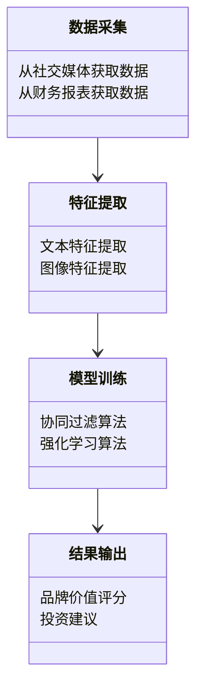
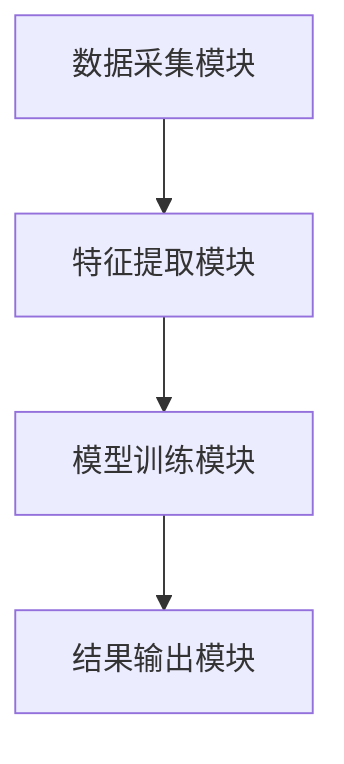
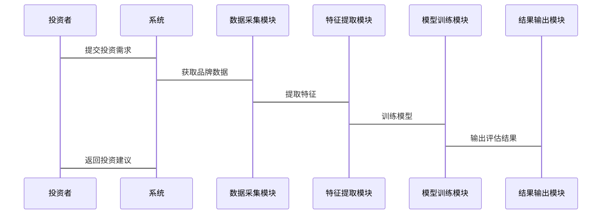

                 


# 智能化品牌价值评估：多智能体AI在价值投资中的应用

> **关键词**：多智能体AI、品牌价值评估、价值投资、协同过滤、强化学习、系统架构、Python实现  
> **摘要**：本文探讨了多智能体AI在品牌价值评估中的应用，通过分析多智能体AI的核心概念、算法原理、系统架构及项目实现，展示了如何利用多智能体AI技术提升品牌价值评估的智能化水平，为价值投资提供更精准的决策支持。

---

## 第一部分: 背景与核心概念

### 第1章: 智能化品牌价值评估的背景与意义

#### 1.1 品牌价值评估的定义与重要性
品牌价值是衡量企业市场地位和盈利能力的重要指标。传统品牌价值评估方法依赖于财务数据和市场分析，但存在数据单一、维度有限、难以量化品牌影响力等局限性。

#### 1.2 传统品牌价值评估方法的局限性
传统方法主要基于财务指标（如净利润、销售额）和市场调研数据，难以全面捕捉品牌在社交媒体、消费者行为和市场趋势中的动态信息。

#### 1.3 多智能体AI的优势与应用前景
多智能体AI能够通过分布式计算和协同学习，整合多源异构数据，实时捕捉品牌价值的动态变化，为价值投资提供更精准的决策支持。

---

### 第2章: 多智能体AI的核心概念与原理

#### 2.1 多智能体AI的定义与特点
多智能体AI是指由多个相互作用的智能体组成的系统，每个智能体具有自主性、反应性和协作性，能够通过通信与协作完成复杂任务。

#### 2.2 多智能体AI在品牌价值评估中的应用
在品牌价值评估中，多智能体AI可以分别负责数据采集、特征提取、模型训练和决策优化等任务，通过协同工作提供更全面的评估结果。

#### 2.3 多智能体AI与传统AI的区别
传统AI通常基于单点模型，而多智能体AI通过分布式计算和协同学习，能够更好地处理复杂系统的动态性和不确定性。

---

## 第二部分: 算法原理与系统架构

### 第3章: 多智能体AI的算法原理

#### 3.1 协同过滤算法
协同过滤算法通过分析用户行为数据，找到与目标品牌相似的其他品牌，从而预测目标品牌的潜在价值。

##### 协同过滤算法的实现步骤
1. 数据预处理：清洗和归一化数据。
2. 相似度计算：使用余弦相似度或欧氏距离。
3. 推荐结果：基于相似度排序，输出预测结果。

##### 协同过滤算法的优缺点
- **优点**：简单易实现，适合数据稀疏性问题。
- **缺点**：难以处理高维数据，计算效率较低。

#### 3.2 强化学习算法
强化学习算法通过模拟市场环境，训练智能体在动态市场中优化投资策略。

##### 强化学习算法的实现步骤
1. 状态空间定义：市场趋势、品牌特征等。
2. 动作空间定义：买入、卖出、持有。
3. 奖励函数设计：基于投资收益和风险控制。

##### 强化学习算法的优缺点
- **优点**：能够处理非线性关系，适应市场变化。
- **缺点**：训练时间较长，需要大量计算资源。

---

### 第4章: 系统架构与项目实现

#### 4.1 系统功能设计
系统功能包括数据采集、特征提取、模型训练和结果输出四个模块。

##### 系统功能设计的领域模型图


#### 4.2 系统架构设计
系统采用分层架构，包括数据层、算法层和应用层。

##### 系统架构设计的架构图


#### 4.3 系统接口设计
系统提供RESTful API接口，支持外部数据源的接入和第三方应用的集成。

#### 4.4 系统交互设计


---

## 第三部分: 项目实战与总结

### 第5章: 项目实战

#### 5.1 环境安装
安装Python和相关库：
```bash
pip install numpy pandas scikit-learn tensorflow
```

#### 5.2 核心代码实现

##### 协同过滤算法实现
```python
import numpy as np
from sklearn.metrics.pairwise import cosine_similarity

def collaborative_filtering(data):
    normalized_data = (data - data.mean()) / data.std()
    similarity_matrix = cosine_similarity(normalized_data)
    return similarity_matrix
```

##### 强化学习算法实现
```python
import numpy as np
import tensorflow as tf

class DQN:
    def __init__(self, state_dim, action_dim):
        self.model = tf.keras.Sequential([
            tf.keras.layers.Dense(64, activation='relu'),
            tf.keras.layers.Dense(action_dim, activation='linear')
        ])
    
    def call(self, state):
        return self.model(state)
```

#### 5.3 代码解读与分析
协同过滤算法通过归一化数据计算相似度矩阵，强化学习算法通过神经网络训练策略网络，输出投资决策。

#### 5.4 实际案例分析
以某品牌为例，通过协同过滤算法预测其潜在价值，通过强化学习算法优化投资策略。

---

### 第6章: 总结与展望

#### 6.1 总结
多智能体AI在品牌价值评估中的应用显著提升了评估的准确性和效率，为价值投资提供了新的技术手段。

#### 6.2 展望
未来，多智能体AI将在品牌风险管理、市场预测等领域发挥更大的作用，推动价值投资的智能化发展。

---

### 第7章: 最佳实践与注意事项

#### 7.1 最佳实践
- 数据清洗和特征工程是关键，需仔细处理。
- 模型调参和评估需结合业务需求。

#### 7.2 小结
通过多智能体AI技术，品牌价值评估更加智能化和精准化。

#### 7.3 注意事项
- 数据隐私和安全问题需重视。
- 模型需定期更新，以适应市场变化。

#### 7.4 拓展阅读
推荐阅读相关领域的最新论文和技术博客，持续关注多智能体AI的发展动态。

---

通过以上内容，我们详细探讨了多智能体AI在品牌价值评估中的应用，从理论到实践，为价值投资提供了新的思路和方法。

