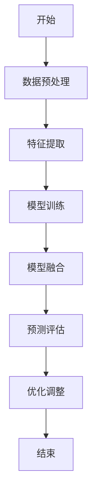

                 


## 第3章: 多智能体AI预测算法的原理与流程

### 3.1 多智能体协同学习的算法原理

#### 3.1.1 分布式智能体的定义与特点

多智能体系统（Multi-Agent System, MAS）是由多个相互作用的智能体组成的分布式系统，每个智能体都是一个独立的实体，能够感知环境、自主决策并协同完成任务。在并购整合预测中，每个智能体可以代表不同的业务部门、子公司或关键绩效指标（KPIs），它们通过协同工作，共同预测整合后的整体效果。

**特点：**

- **独立性**：每个智能体独立决策，处理特定的数据或任务。
- **协作性**：智能体之间通过通信模块共享信息，协同完成预测任务。
- **分布式计算**：计算资源分布在多个智能体中，避免单点故障，提高系统的容错性和效率。
- **动态性**：智能体能够适应环境变化，实时更新预测模型。

#### 3.1.2 协作学习机制

多智能体协同学习是通过多个智能体的协作来提高整体学习效果的过程。在并购整合预测中，每个智能体负责处理不同的数据源或预测任务，通过通信模块共享信息，共同优化预测模型。

**协作学习机制的三个主要步骤：**

1. **数据分割与特征提取**：每个智能体负责处理原始数据的不同部分，提取相关的特征，例如财务数据、市场表现、管理团队稳定性等。
2. **局部模型训练**：每个智能体基于自己的数据和特征，训练局部预测模型。
3. **模型融合与优化**：通过通信模块，智能体之间共享模型权重和特征重要性，利用共识算法（如联邦学习）融合多个局部模型，形成一个全局最优预测模型。

### 3.2 算法流程与实现细节

为了实现多智能体协同学习预测并购整合效果，我们需要遵循以下算法流程：

#### 1. 数据预处理

首先，需要将原始数据进行清洗、标准化和分割，分配给不同的智能体。例如，将企业的财务数据、市场数据和管理团队数据分别分配给不同的智能体。

**代码示例：**

```python
import pandas as pd
from sklearn.preprocessing import StandardScaler

# 假设我们有一个包含多个数据集的数据框
data = pd.DataFrame({
    'revenue': [100, 200, 300, 400],
    'employees': [10, 20, 30, 40],
    'market_share': [0.1, 0.2, 0.3, 0.4],
    'profit_margin': [0.1, 0.15, 0.2, 0.25]
})

# 标准化处理
scaler = StandardScaler()
data_scaled = scaler.fit_transform(data)

# 将数据分配给不同的智能体
# 每个智能体处理不同的特征
# 例如：
# 智能体1处理 revenue 和 employees
# 智能体2处理 market_share 和 profit_margin

# 分割数据
# 这里仅作为示例，实际应用中可能需要更复杂的分割方法
# 使用前两行数据作为训练集，后两行作为测试集
train_data = data_scaled[:2]
test_data = data_scaled[2:]
```

#### 2. 特征提取与模型训练

每个智能体根据分配的数据进行特征提取，并训练局部预测模型。可以使用不同的机器学习算法，如随机森林、梯度提升树等。

**代码示例：**

```python
from sklearn.ensemble import RandomForestRegressor

# 智能体1处理 revenue 和 employees
agent1_features = train_data[:, [0, 1]]
agent1_model = RandomForestRegressor(n_estimators=100, random_state=42)
agent1_model.fit(agent1_features, target_values)

# 智能体2处理 market_share 和 profit_margin
agent2_features = train_data[:, [2, 3]]
agent2_model = RandomForestRegressor(n_estimators=100, random_state=42)
agent2_model.fit(agent2_features, target_values)
```

#### 3. 模型融合与优化

通过通信模块，智能体之间共享模型权重和特征重要性，利用共识算法融合多个局部模型，形成一个全局最优预测模型。这里可以使用联邦学习（Federated Learning）的方法，保护数据隐私，同时共享模型参数。

**代码示例：**

```python
# 通信模块汇总各个智能体的模型参数
from sklearn.metrics import mean_squared_error

# 假设我们有两个智能体
agents = [agent1_model, agent2_model]

# 联邦学习：通过共享模型权重进行融合
# 这里简化处理，假设我们对每个模型的预测结果进行加权平均
weights = [1, 1]  # 可以根据模型性能调整权重

# 对测试数据进行预测
test_predictions = []
for agent in agents:
    agent_prediction = agent.predict(test_data[:, [0, 1] if agent == agent1 else [2, 3]])
    test_predictions.append(agent_prediction)

# 融合预测结果
import numpy as np
combined_prediction = np.mean(test_predictions, axis=0)

# 计算融合后的预测结果与实际值的误差
error = mean_squared_error(target_values_test, combined_prediction)
print(f'融合模型的均方误差为: {error}')
```

#### 4. 预测评估与优化

对融合后的预测模型进行评估，计算均方误差（MSE）、R平方值等指标，根据评估结果优化模型参数或调整智能体的协作策略。

**数学模型：**

损失函数用于衡量预测值与实际值之间的差距，常用的有均方误差（MSE）和均方根误差（RMSE）。目标是最小化损失函数。

$$
\text{MSE} = \frac{1}{n}\sum_{i=1}^{n}(y_i - \hat{y_i})^2
$$

其中：
- \( y_i \) 是实际值
- \( \hat{y_i} \) 是预测值
- \( n \) 是样本数量

优化过程可以使用梯度下降等优化算法，更新模型参数以最小化损失函数。

### 3.3 算法流程图

以下是多智能体AI预测算法的流程图：



### 3.4 本章小结

本章详细讲解了多智能体AI预测算法的原理与流程，包括数据预处理、特征提取、模型训练、模型融合与优化等步骤。通过使用Mermaid流程图和Python代码示例，我们展示了如何实现多智能体协同学习，并利用联邦学习方法保护数据隐私。数学模型部分解释了损失函数和优化目标，为读者提供了理论基础。通过这些步骤，我们可以有效地预测并购后的整合效果，为企业的决策提供支持。

---

接下来，我们可以继续撰写第4章，即数学模型与公式推导。

