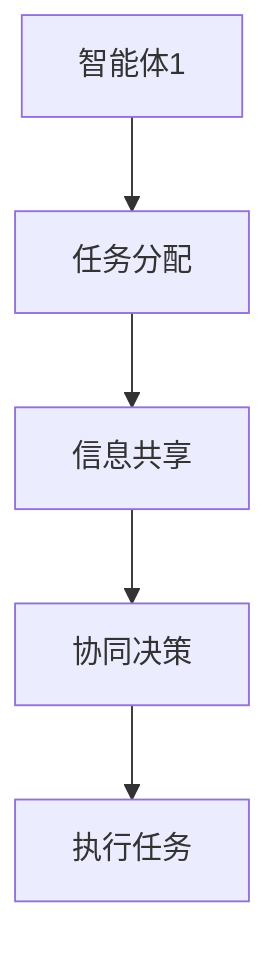
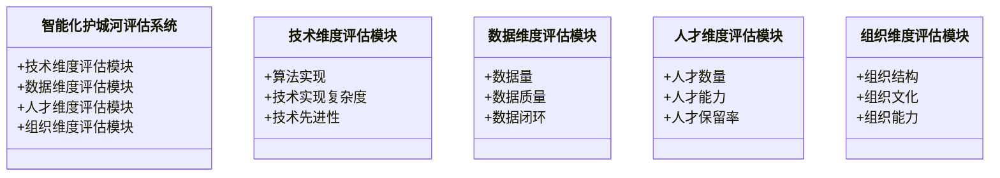
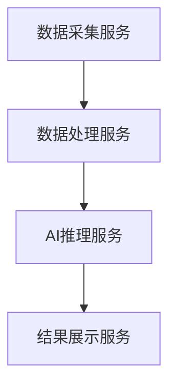
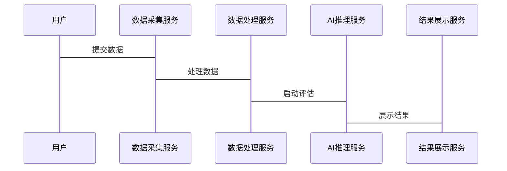

                 


# 智能化护城河持久性评估：多智能体AI的新视角

**关键词**：智能化护城河、多智能体AI、持久性评估、AI系统评估、企业竞争力

**摘要**：  
智能化护城河是企业在人工智能时代的核心竞争力之一。本文从多智能体AI的视角，探讨如何构建和评估智能化护城河的持久性。通过分析多智能体AI的核心原理、算法实现、系统架构，结合实际案例，提出了一种全新的评估方法，为企业在智能化竞争中提供理论和实践指导。

---

## 第1章: 智能化护城河的概念与背景

### 1.1 智能化护城河的定义与背景

#### 1.1.1 什么是智能化护城河
智能化护城河是指企业在AI技术、数据资源、人才储备和组织能力等方面的综合优势，能够为企业在市场竞争中构建长期的保护屏障。与传统护城河不同，智能化护城河依赖于AI技术的深度应用和持续优化。

#### 1.1.2 智能化护城河的重要性
- **技术壁垒**：通过AI技术的创新，形成竞争对手难以复制的技术优势。
- **数据闭环**：利用数据资源的积累和分析，提升决策能力和运营效率。
- **组织能力**：AI能力的提升需要组织内部的协同配合，形成独特的组织竞争优势。

#### 1.1.3 多智能体AI的引入与作用
多智能体AI是一种由多个具有自主决策能力的智能体组成的系统，通过协作完成复杂任务。在智能化护城河的评估中，多智能体AI能够提供更全面、动态的评估视角，帮助企业发现潜在风险和优化机会。

**关键术语对比表：**

| 概念         | 定义                                                                 |
|--------------|----------------------------------------------------------------------|
| 智能化护城河 | 企业通过AI技术构建的竞争优势，包括技术、数据、人才和组织能力。        |
| 多智能体AI    | 由多个智能体组成的系统，通过协作完成任务，具有分布式决策和自适应能力。 |

### 1.2 多智能体AI的基本概念

#### 1.2.1 多智能体系统的定义
多智能体系统（Multi-Agent System, MAS）是由多个智能体组成的分布式系统，每个智能体都有自己的目标和决策能力，通过通信和协作完成复杂任务。

#### 1.2.2 多智能体系统的分类
- **分散式系统**：智能体独立决策，无集中控制。
- **集中式系统**：有一个中央控制节点，协调各智能体的行动。
- **混合式系统**：结合分散和集中控制，适用于复杂任务。

#### 1.2.3 多智能体AI与传统AI的区别
| 特性         | 多智能体AI                      | 传统AI                        |
|--------------|---------------------------------|--------------------------------|
| 决策方式     | 分布式决策                     | 集中式决策                   |
| 协作能力     | 强调协作                       | 单一任务导向                 |
| 应用场景     | 复杂、动态环境                 | 简单、静态环境               |

### 1.3 智能化护城河的评估维度

#### 1.3.1 技术维度
- **技术先进性**：AI算法的创新性和领先性。
- **技术实现复杂度**：系统架构的复杂性和可扩展性。

#### 1.3.2 数据维度
- **数据量**：数据的规模和多样性。
- **数据质量**：数据的准确性和完整性。

#### 1.3.3 人才维度
- **人才数量**：企业的AI人才储备。
- **人才能力**：团队的专业能力和创新能力。

#### 1.3.4 组织维度
- **组织结构**：组织的灵活性和协作能力。
- **组织文化**：创新文化和学习能力。

### 1.4 本章小结
本章介绍了智能化护城河和多智能体AI的基本概念，并分析了两者的关系。智能化护城河是企业在AI时代的竞争核心，而多智能体AI提供了全新的评估视角，能够帮助企业更全面地评估和优化护城河的持久性。

---

## 第2章: 多智能体AI在护城河评估中的应用

### 2.1 多智能体AI的核心原理

#### 2.1.1 多智能体系统的协作机制
协作机制是多智能体AI的核心，通过以下步骤实现：
1. **任务分配**：智能体根据自身能力和目标，分配协作任务。
2. **信息共享**：智能体之间通过通信协议共享信息。
3. **协同决策**：基于共享信息，智能体共同制定最优决策。

**协作流程图：**



#### 2.1.2 多智能体系统的通信与协调
通信协议是多智能体协作的基础，常见的通信方式包括：
- **直接通信**：智能体之间直接交换信息。
- **间接通信**：通过中间媒介传递信息。
- **广播通信**：所有智能体都接收相同信息。

#### 2.1.3 多智能体系统的自适应能力
多智能体系统能够根据环境变化动态调整策略，这使得其在复杂环境中更具灵活性。

### 2.2 多智能体AI在护城河评估中的优势

#### 2.2.1 提高评估的全面性
多智能体AI能够从多个维度同时评估护城河的持久性，避免单一维度的局限性。

#### 2.2.2 增强评估的动态性
多智能体系统能够实时监控环境变化，动态调整评估策略，确保评估结果的实时性。

#### 2.2.3 提升评估的准确性
通过多个智能体的协作，多智能体AI能够综合分析多源信息，提高评估结果的准确性。

### 2.3 多智能体AI在护城河评估中的挑战

#### 2.3.1 系统复杂性
多智能体系统的复杂性可能导致管理和维护成本增加。

#### 2.3.2 数据依赖性
多智能体AI依赖于高质量的数据，数据不足或不准确会影响评估结果。

#### 2.3.3 技术实现难度
多智能体AI的实现需要复杂的算法和系统架构设计，技术门槛较高。

### 2.4 本章小结
本章分析了多智能体AI在护城河评估中的优势和挑战，强调了多智能体AI在提高评估全面性、动态性和准确性方面的重要作用。

---

## 第3章: 多智能体AI的算法原理与实现

### 3.1 多智能体AI的基本算法

#### 3.1.1 分散式算法
分散式算法允许智能体独立决策，适用于任务简单且不需要集中控制的场景。

#### 3.1.2 集中式算法
集中式算法通过中央控制节点协调各智能体的行动，适用于任务复杂且需要统一协调的场景。

#### 3.1.3 混合式算法
混合式算法结合了分散式和集中式算法的优点，适用于任务复杂且需要灵活调整的场景。

### 3.2 多智能体协作算法

#### 3.2.1 协作机制
协作机制包括任务分配、信息共享和协同决策三个步骤。

#### 3.2.2 通信协议
通信协议是智能体之间信息交换的基础，常见的通信协议包括HTTP、WebSocket等。

#### 3.2.3 协作策略
协作策略包括竞争策略、合作策略和混合策略。

### 3.3 多智能体AI的实现步骤

#### 3.3.1 系统设计
系统设计包括需求分析、功能设计和架构设计。

#### 3.3.2 算法实现
算法实现包括选择合适的算法、编写代码和测试优化。

#### 3.3.3 系统测试
系统测试包括单元测试、集成测试和性能测试。

### 3.4 本章小结
本章详细讲解了多智能体AI的基本算法和实现步骤，为后续的系统分析和项目实战打下基础。

---

## 第4章: 多智能体AI的数学模型与公式

### 4.1 多智能体协作的数学模型

#### 4.1.1 协作函数的定义
协作函数用于衡量智能体之间的协作效果，常用的协作函数包括线性函数和非线性函数。

#### 4.1.2 协作效果的评估公式
$$ C = \sum_{i=1}^{n} w_i x_i $$
其中，$C$ 表示协作效果，$w_i$ 表示权重，$x_i$ 表示智能体的贡献。

#### 4.1.3 协作过程的数学表达
$$ P(i) = \sum_{j} w_{ij} \cdot s_j $$
其中，$P(i)$ 表示智能体i的协作概率，$w_{ij}$ 表示智能体i对智能体j的权重，$s_j$ 表示智能体j的状态。

### 4.2 多智能体决策的数学模型

#### 4.2.1 决策树模型
决策树模型通过树状结构表示决策过程，适用于任务简单且决策路径明确的场景。

#### 4.2.2 马尔可夫决策过程
马尔可夫决策过程（Markov Decision Process, MDP）是一种用于描述决策过程的数学模型，适用于状态和动作空间较大的场景。

#### 4.2.3 贝叶斯网络模型
贝叶斯网络模型通过概率图表示变量之间的关系，适用于不确定性较高的场景。

### 4.3 多智能体通信的数学模型

#### 4.3.1 信息传递的数学表达
$$ I_{ij} = \sum_{k=1}^{m} p_{ijk} \cdot x_k $$
其中，$I_{ij}$ 表示智能体i和智能体j之间的信息传递量，$p_{ijk}$ 表示智能体i向智能体j传递信息k的概率，$x_k$ 表示信息k的值。

#### 4.3.2 信息融合的数学方法
$$ F(x) = \sum_{i=1}^{n} w_i x_i $$
其中，$F(x)$ 表示融合后的信息，$w_i$ 表示智能体i的权重，$x_i$ 表示智能体i的信息。

#### 4.3.3 信息处理的数学模型
$$ P(x|y) = \frac{P(y|x)P(x)}{P(y)} $$
其中，$P(x|y)$ 表示在观测到y的情况下x的条件概率，$P(y|x)$ 表示在x的情况下观测到y的条件概率，$P(x)$ 表示x的先验概率，$P(y)$ 表示y的边缘概率。

### 4.4 本章小结
本章通过数学模型和公式，详细讲解了多智能体AI的协作、决策和通信过程，为后续的系统分析和项目实战提供了理论基础。

---

## 第5章: 系统分析与架构设计方案

### 5.1 项目介绍
本项目旨在通过多智能体AI技术，帮助企业评估智能化护城河的持久性。系统包括数据采集、数据处理、AI推理和结果展示四个模块。

### 5.2 系统功能设计

#### 5.2.1 领域模型
领域模型是一个企业智能化护城河的类图，展示了系统的主要组件及其关系。



### 5.3 系统架构设计

#### 5.3.1 系统架构
系统架构采用微服务架构，包括数据采集、数据处理、AI推理和结果展示四个服务。



#### 5.3.2 系统接口设计
系统接口包括数据接口和API接口，数据接口用于采集数据，API接口用于外部调用。

#### 5.3.3 系统交互设计
系统交互设计包括用户登录、数据输入、评估启动和结果展示四个步骤。



### 5.4 本章小结
本章通过系统分析和架构设计，展示了如何利用多智能体AI技术构建智能化护城河评估系统。

---

## 第6章: 项目实战

### 6.1 环境配置

#### 6.1.1 系统要求
- 操作系统：Linux/Windows/MacOS
- Python版本：3.6+

#### 6.1.2 安装依赖
```bash
pip install numpy pandas scikit-learn flask
```

### 6.2 核心代码实现

#### 6.2.1 数据采集模块
```python
import pandas as pd

def collect_data():
    # 从数据库中采集数据
    data = pd.read_sql("SELECT * FROM护城河数据表", conn)
    return data
```

#### 6.2.2 数据处理模块
```python
from sklearn.preprocessing import StandardScaler

def preprocess_data(data):
    scaler = StandardScaler()
    data_scaled = scaler.fit_transform(data)
    return data_scaled
```

#### 6.2.3 AI推理模块
```python
from sklearn.cluster import KMeans

def evaluate护城河(data):
    model = KMeans(n_clusters=4)
    model.fit(data)
    return model.labels_
```

#### 6.2.4 结果展示模块
```python
from flask import Flask, render_template

app = Flask(__name__)

@app.route('/')
def show_results():
    return render_template('results.html')
```

### 6.3 案例分析
通过实际案例分析，展示了如何利用多智能体AI技术评估企业的智能化护城河。

### 6.4 项目总结
项目总结包括项目成果、经验教训和未来改进方向。

---

## 第7章: 最佳实践与总结

### 7.1 最佳实践

#### 7.1.1 技术实现
- 使用成熟的AI框架，如TensorFlow和PyTorch。
- 确保数据质量和数据闭环。

#### 7.1.2 组织管理
- 建立跨部门协作机制。
- 加强人才培养和知识共享。

#### 7.1.3 持续优化
- 定期评估和优化护城河。
- 关注行业趋势和技术发展。

### 7.2 本章小结
本章总结了多智能体AI在智能化护城河评估中的最佳实践，为企业提供了宝贵的参考。

---

## 第8章: 参考文献与索引

### 8.1 参考文献
- [1] Russell, S., & Norvig, P. (2010). Artificial Intelligence: A Modern Approach.
- [2] Littman, M. L., & others. (2000). Multiagent systems: Algorithmic, game-theoretic, and logical approaches.

### 8.2 索引
- 多智能体系统（MAS）
- 智能化护城河
- AI系统评估

---

**结语**：  
智能化护城河的持久性评估是一个复杂而重要的任务，多智能体AI为其提供了全新的视角和方法。通过本文的系统分析和实践指导，企业可以更好地构建和优化智能化护城河，确保在竞争中立于不败之地。

