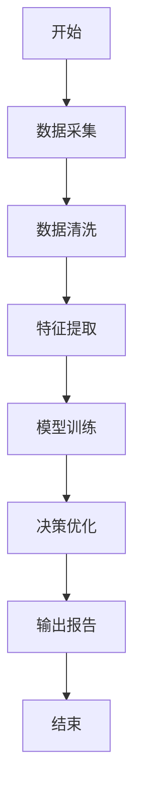

                 


# {{此处是文章标题}}

> 关键词：{{此处列出文章的5-7个核心关键词}}

> 摘要：{{此处给出文章的核心内容和主题思想}}

                 

# {{此处是文章标题}}

> 关键词：多智能体AI，智能化投资，并购机会识别，AI算法，系统架构

> 摘要：本文探讨了在投资领域，特别是并购机会识别中，多智能体AI的应用。通过详细分析多智能体系统的核心原理、算法实现、系统架构，并结合实际案例，展示了如何利用AI技术提高并购机会识别的效率和准确性。文章还总结了最佳实践和未来研究方向，为投资者和AI开发者提供了有价值的参考。

---

## 第1章: 多智能体AI在投资领域的背景与应用

### 1.1 投资领域的智能化转型

#### 1.1.1 投资领域的传统模式与挑战

传统的投资模式依赖于人工分析和经验判断，存在效率低、主观性强、覆盖面有限等问题。随着数据量的爆炸式增长和算法的进步，智能化投资成为趋势。

#### 1.1.2 智能化投资的定义与目标

智能化投资利用AI技术，通过自动化分析和决策优化，提高投资效率和准确性。目标是帮助投资者发现潜在机会，降低风险。

#### 1.1.3 多智能体AI在投资中的应用前景

多智能体AI能够模拟多个角色的协作与博弈，适用于复杂的并购场景，如市场分析、风险评估和决策优化。

### 1.2 并购机会识别的特殊性

#### 1.2.1 并购的基本概念与流程

并购是指一家企业购买另一家企业部分或全部股权，以实现战略目标。流程包括尽职调查、估值、谈判等。

#### 1.2.2 特殊情况并购的特征

特殊情况并购涉及复杂情况，如企业困境、资产重组等，对分析能力要求更高。

#### 1.2.3 AI在并购机会识别中的优势

AI能够快速处理大量数据，识别潜在机会，优化决策过程。

---

## 第2章: 多智能体AI的核心原理

### 2.1 多智能体系统的基本概念

#### 2.1.1 多智能体系统的定义

多智能体系统由多个相互作用的智能体组成，每个智能体能够独立决策并协作完成任务。

#### 2.1.2 多智能体系统的特点

- 分布式计算
- 协作性
- 自适应性

#### 2.1.3 多智能体系统与传统AI的区别

传统AI依赖中央决策，多智能体系统强调分布式协作。

### 2.2 多智能体系统的组成与架构

#### 2.2.1 实体与角色的定义

在并购场景中，智能体可以代表投资者、市场分析师、企业等。

#### 2.2.2 通信与协作机制

智能体之间通过消息传递协作，实现信息共享和决策优化。

#### 2.2.3 分布式计算与决策

每个智能体负责部分任务，协同完成整体目标。

### 2.3 多智能体系统的算法基础

#### 2.3.1 分布式计算算法

如分布式一致性算法（Paxos、Raft）。

#### 2.3.2 协作与博弈论算法

如纳什均衡、拍卖机制。

#### 2.3.3 自适应学习算法

如强化学习、迁移学习。

---

## 第3章: 多智能体AI在并购机会识别中的应用

### 3.1 并购机会识别的关键要素

#### 3.1.1 企业基本面分析

包括财务状况、市场地位等。

#### 3.1.2 市场环境分析

包括行业趋势、政策影响等。

#### 3.1.3 并购风险评估

识别潜在风险，如法律风险、财务风险。

### 3.2 多智能体AI在并购中的具体应用

#### 3.2.1 数据采集与处理

从多个数据源获取信息，清洗和预处理。

#### 3.2.2 并购机会预测模型

利用机器学习算法预测潜在并购机会。

#### 3.2.3 并购风险评估与优化

通过多智能体协作，优化风险控制策略。

---

## 第4章: 系统架构与算法实现

### 4.1 系统整体架构

#### 4.1.1 数据层

存储企业数据、市场数据等。

#### 4.1.2 计算层

实现数据处理、模型训练。

#### 4.1.3 应用层

提供用户界面和决策支持。

### 4.2 数据流与实体关系图

```mermaid
erDiagram
    actor 投资者
    actor 并购方
    actor 被并购方
    actor 市场分析师
    class 数据源
    class 数据处理模块
    class 多智能体AI引擎
    class 并购机会报告
    投资者 --> 数据源: 提供
    并购方 --> 数据源: 提供
    被并购方 --> 数据源: 提供
    数据处理模块 --> 多智能体AI引擎: 输入
    多智能体AI引擎 --> 并购机会报告: 输出
    市场分析师 --> 多智能体AI引擎: 输入
```

### 4.3 算法流程图



---

## 第5章: 项目实战与案例分析

### 5.1 环境安装与配置

安装Python、TensorFlow、Keras等工具。

### 5.2 核心实现代码

```python
import numpy as np
import tensorflow as tf

# 示例：简单多智能体协作模型
class Agent:
    def __init__(self, input_dim):
        self.model = tf.keras.Sequential([
            tf.keras.layers.Dense(64, activation='relu', input_dim=input_dim),
            tf.keras.layers.Dense(1, activation='sigmoid')
        ])
        self.model.compile(optimizer='adam', loss='binary_crossentropy')

    def predict(self, state):
        return self.model.predict(state)

    def train(self, states, targets):
        self.model.fit(states, targets, epochs=10, batch_size=32)
```

### 5.3 案例分析

分析某公司并购案例，展示模型的应用效果。

---

## 第6章: 最佳实践与总结

### 6.1 小结

多智能体AI在并购机会识别中具有显著优势。

### 6.2 注意事项

数据质量、模型优化、系统维护等。

### 6.3 未来研究方向

更复杂场景下的多智能体协作优化。

---

## 参考文献

- TensorFlow官方文档
- 《多智能体系统与博弈论》
- 相关学术论文

---

## {{此处是文章标题}}

> 关键词：多智能体AI，智能化投资，并购机会识别，AI算法，系统架构

> 摘要：本文探讨了在投资领域，特别是并购机会识别中，多智能体AI的应用。通过详细分析多智能体系统的核心原理、算法实现、系统架构，并结合实际案例，展示了如何利用AI技术提高并购机会识别的效率和准确性。文章还总结了最佳实践和未来研究方向，为投资者和AI开发者提供了有价值的参考。

