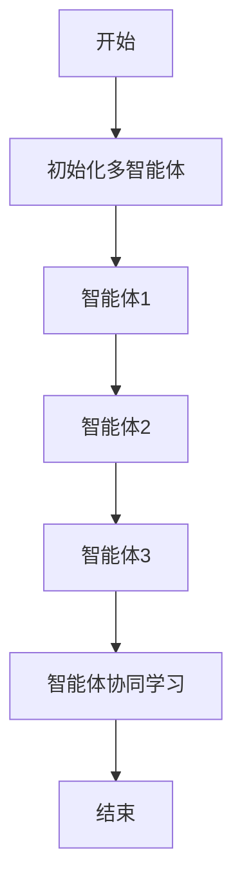
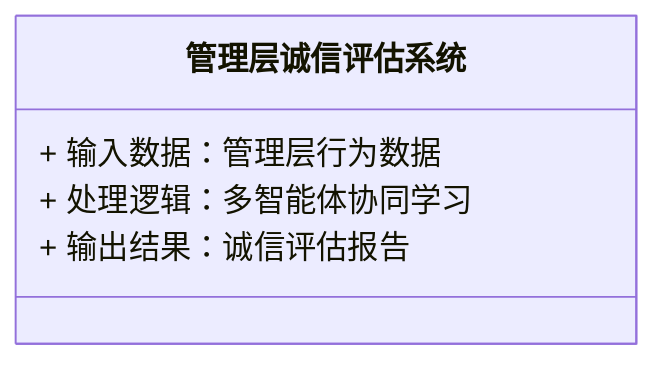
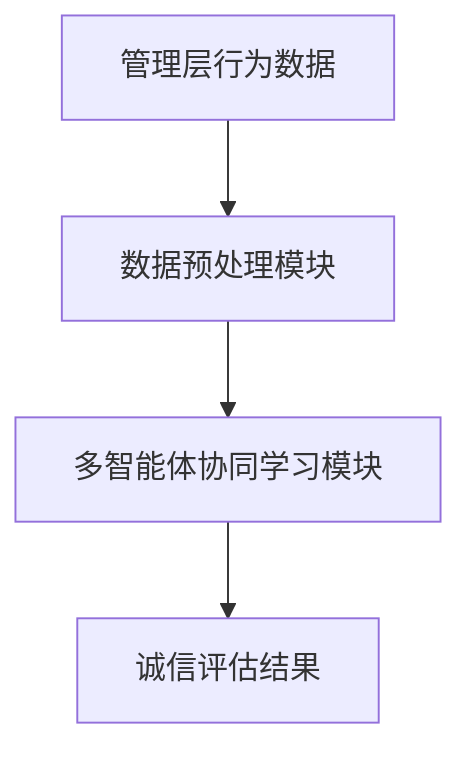
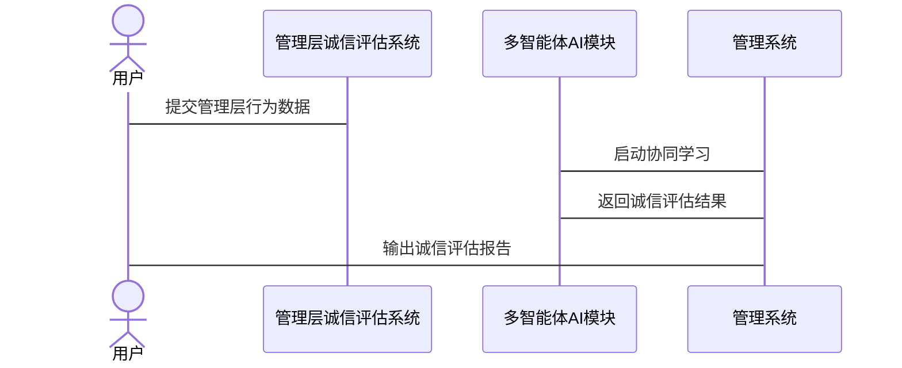

                 


# 智能化管理层诚信评估：多智能体AI的新approach

## 关键词：
- 智能化管理层
- 诚信评估
- 多智能体AI
- 协同学习
- 系统架构

## 摘要：
本文探讨了如何利用多智能体AI技术进行智能化管理层诚信评估的新方法。通过分析管理层诚信评估的核心要素，提出了一种基于多智能体协同学习的创新性解决方案。文章详细介绍了多智能体AI的核心原理、算法实现、系统架构设计以及实际案例分析，为读者提供了一套完整的技术实现方案和最佳实践。

---

## 目录大纲

### 第一部分：背景介绍

#### 第1章：智能化管理层诚信评估的背景与问题

##### 1.1 问题背景
- 企业诚信管理的重要性
- 现有诚信评估方法的局限性
- 多智能体AI技术的引入

##### 1.2 问题描述
- 管理层诚信评估的核心要素
- 多智能体协同的必要性
- 问题解决的边界与外延

##### 1.3 核心概念与联系
- 核心概念的定义与属性
- 核心概念之间的关系
- ER实体关系图

```mermaid
er
actor: 管理层诚信评估系统
role: 多智能体AI
```

### 第二部分：核心概念与联系

#### 第2章：多智能体AI的核心原理

##### 2.1 多智能体AI的定义与特点
- 多智能体AI的定义
- 多智能体AI的核心特点
- 多智能体AI与传统AI的区别

##### 2.2 多智能体AI的协同机制
- 协同学习的基本原理
- 协同学习的实现方法
- 协同学习的优缺点

##### 2.3 多智能体AI在诚信评估中的应用
- 多智能体AI在诚信评估中的优势
- 多智能体AI在诚信评估中的挑战
- 多智能体AI在诚信评估中的未来发展方向

### 第三部分：算法原理讲解

#### 第3章：多智能体协同学习算法

##### 3.1 算法原理
- 多智能体协同学习的基本原理
- 多智能体协同学习的实现步骤
- 多智能体协同学习的数学模型

##### 3.2 算法流程图



##### 3.3 算法实现代码

```python
def multi_agent_collaborative_learning(agents):
    for agent in agents:
        agent.train()
        agent协同学习()
    return 最终结果
```

##### 3.4 数学模型与公式

$$ \text{可信度} = \sum_{i=1}^{n} w_i \times \text{特征}_i $$

其中，$w_i$ 是第 $i$ 个特征的权重，$\text{特征}_i$ 是具体的特征值。

### 第四部分：系统分析与架构设计

#### 第4章：系统分析与架构设计方案

##### 4.1 问题场景介绍
- 管理层诚信评估的场景描述
- 系统目标与功能需求

##### 4.2 系统功能设计



##### 4.3 系统架构设计



##### 4.4 系统接口设计
- 输入接口：管理层行为数据接口
- 输出接口：诚信评估报告接口

##### 4.5 系统交互流程图



### 第五部分：项目实战

#### 第5章：项目实战

##### 5.1 环境安装
- 安装Python
- 安装多智能体AI框架（如Ray、Multi-Agent）

##### 5.2 系统核心实现源代码

```python
class 管理层诚信评估系统:
    def __init__(self):
        self.agents = []
        self.数据预处理()

    def 数据预处理(self):
        # 数据清洗与特征提取
        pass

    def 启动协同学习(self):
        for agent in self.agents:
            agent.训练()
            agent.协同学习()

    def 输出评估报告(self):
        # 生成报告
        pass
```

##### 5.3 代码应用解读与分析
- 代码功能模块的详细解读
- 代码实现的关键点分析

##### 5.4 实际案例分析
- 案例背景介绍
- 案例分析过程
- 分析结果解读

##### 5.5 项目总结
- 项目实现的主要成果
- 项目中的经验与教训
- 未来改进方向

### 第六部分：最佳实践

#### 第6章：最佳实践

##### 6.1 小结
- 本章内容的总结
- 关键点回顾

##### 6.2 注意事项
- 实际应用中的注意事项
- 系统维护与优化建议

##### 6.3 拓展阅读
- 相关技术领域的拓展阅读建议
- 进一步学习的资源推荐

---

## 总结：
本文通过详细的背景介绍、核心概念解析、算法原理讲解、系统架构设计、项目实战分析以及最佳实践总结，全面阐述了智能化管理层诚信评估的多智能体AI新方法。希望读者通过本文能够深入了解该技术的核心原理和实际应用，并能够在此基础上进行进一步的创新和实践。

