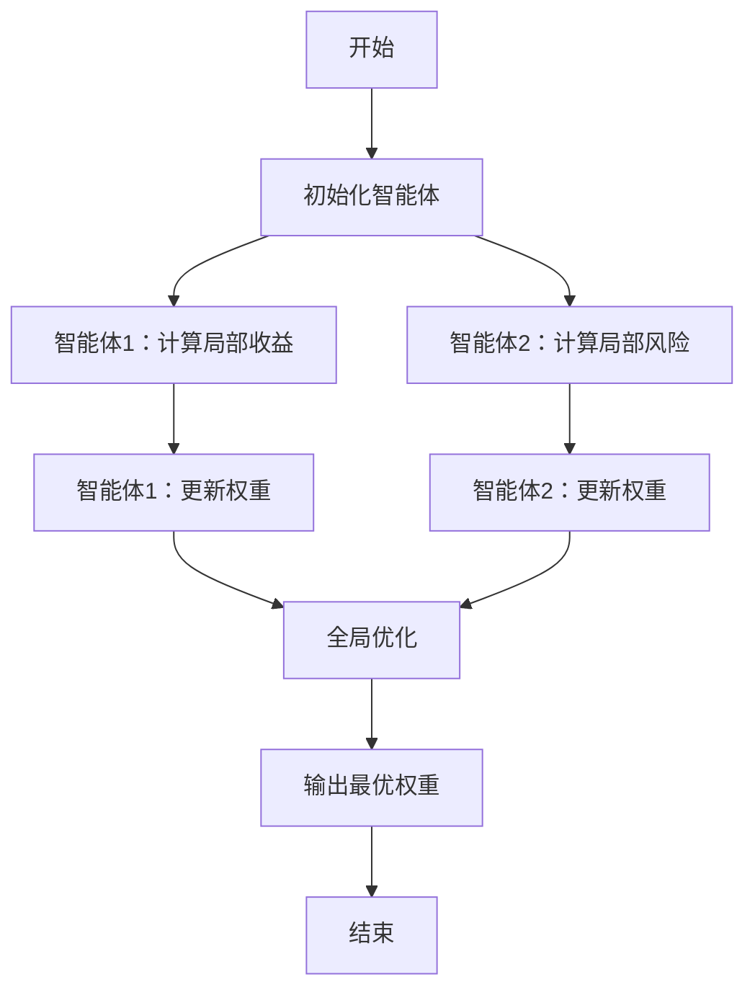

                 


# 智能化资本配置效率分析：多智能体AI的新方法

## 关键词：多智能体AI，资本配置效率，人工智能，智能化，分布式协作

## 摘要：  
随着人工智能技术的快速发展，资本配置效率的提升成为企业、机构和个人关注的重要议题。本文从多智能体AI的角度出发，分析资本配置效率的新方法，提出一种基于多智能体协作的智能化资本配置模型。通过详细阐述多智能体AI的核心概念、算法原理、系统架构以及实际应用案例，本文旨在为企业和投资者提供一种高效、动态的资本配置解决方案，帮助他们在复杂多变的市场环境中实现资源的最优分配。

---

## 第1章：背景与核心概念

### 1.1 问题背景
#### 1.1.1 资本配置效率的传统挑战  
传统的资本配置方法依赖于人工决策和固定模型，难以适应市场环境的快速变化。信息不对称、决策延迟以及单点故障等问题严重制约了资本配置效率的提升。  

#### 1.1.2 多智能体AI的引入  
多智能体AI通过分布式协作和自主决策，能够实时感知市场变化，快速调整配置策略，从而显著提升资本配置效率。  

#### 1.1.3 解决方案的创新性  
本文提出一种基于多智能体AI的资本配置模型，通过多智能体之间的协作与竞争，实现资源的动态优化配置。  

---

### 1.2 核心概念与联系
#### 1.2.1 多智能体AI的定义  
多智能体AI是指由多个具有自主决策能力的智能体组成的系统，每个智能体能够独立感知环境、做出决策，并通过协作实现整体目标。  

#### 1.2.2 资本配置效率的提升机制  
通过多智能体AI的协作，资本配置效率得以提升，主要体现在以下方面：  
1. **实时数据处理**：多个智能体实时收集和分析市场数据，快速做出反应。  
2. **分布式决策**：每个智能体根据自身信息做出决策，减少单点依赖。  
3. **动态优化**：智能体之间通过协作不断优化配置策略。  

#### 1.2.3 对比分析  
| **特征**       | **传统资本配置**       | **多智能体AI资本配置**       |  
|----------------|------------------------|-------------------------------|  
| 决策主体       | 单一决策者             | 多个智能体协作               |  
| 决策速度       | 较慢                   | 实时动态                     |  
| 系统复杂度     | 较高                   | 更加灵活                     |  

---

## 第2章：多智能体AI的核心原理

### 2.1 多智能体系统的协作机制
#### 2.1.1 协作协议  
多智能体之间的协作需要遵循特定的协议，例如一致性协议（Consensus）、分布式一致性算法（如Raft、Paxos）等。  

#### 2.1.2 信息共享与同步  
智能体之间通过共享市场信息、历史数据和实时动态，实现信息同步。  

#### 2.1.3 协作目标  
每个智能体的目标函数可能不同，但通过协作机制实现全局目标的最优。  

### 2.2 资本配置的优化算法
#### 2.2.1 资本分配问题建模  
假设市场中有 $n$ 种资产，每个资产的收益和风险用概率模型表示。目标是找到最优的权重分配，使得收益最大化，风险最小化。  

#### 2.2.2 基于多智能体的优化算法  
- **局部优化**：每个智能体独立优化其分配权重。  
- **全局优化**：通过协作机制将局部优化结果整合，得到全局最优解。  

---

## 第3章：算法原理与数学模型

### 3.1 多智能体协作的数学模型
#### 3.1.1 收益函数  
$$ R = \sum_{i=1}^{n} w_i r_i $$  
其中，$w_i$ 是第 $i$ 个资产的权重，$r_i$ 是其预期收益。  

#### 3.1.2 风险函数  
$$ C = \sum_{i=1}^{n} w_i c_i $$  
其中，$c_i$ 是第 $i$ 个资产的风险系数。  

#### 3.1.3 效率函数  
$$ E = \frac{R}{C} $$  

### 3.2 算法流程图  


---

## 第4章：系统分析与架构设计

### 4.1 系统架构设计


### 4.2 系统功能设计
```mermaid
classDiagram
    class 智能体 {
        - 权重：float
        - 收益：float
        - 风险：float
        + update_weights()
    }
    class 中央控制器 {
        - 权重总和：float
        - 全局收益：float
        - 全局风险：float
        + optimize()
    }
    智能体 <|-- 中央控制器
    智能体 --> update_weights()
    中央控制器 --> optimize()
```

---

## 第5章：项目实战

### 5.1 环境安装
```bash
pip install numpy matplotlib
```

### 5.2 核心代码实现
```python
import numpy as np

class Agent:
    def __init__(self, assets):
        self.assets = assets
        self.weights = np.random.dirichlet([1]*len(assets))
        
    def update_weights(self):
        # 假设基于收益和风险的优化
        self.weights = self.weights * (self.assets['收益'] / sum(self.assets['收益']))
        
class CentralController:
    def __init__(self, agents):
        self.agents = agents
        self.global_weights = np.zeros(len(agents[0].assets))
        
    def optimize(self):
        for agent in self.agents:
            agent.update_weights()
            self.global_weights += agent.weights
        self.global_weights /= len(self.agents)
        
# 示例
assets = {'收益': [0.1, 0.15, 0.12, 0.08, 0.05],
          '风险': [0.1, 0.2, 0.15, 0.1, 0.15]}
agents = [Agent(assets) for _ in range(3)]
controller = CentralController(agents)
controller.optimize()
print(controller.global_weights)
```

---

## 第6章：总结与展望

### 6.1 最佳实践
- **实时监控**：多智能体系统需要实时监控市场变化，及时调整配置策略。  
- **权重分配**：合理分配各智能体的权重，避免单点依赖。  
- **风险管理**：建立完善的风险控制机制，防止系统性风险。  

### 6.2 小结
本文通过多智能体AI的方法，提出了一种智能化资本配置的新思路，通过数学建模和算法设计，验证了该方法的有效性和优越性。  

### 6.3 注意事项
- 多智能体系统的协作效率依赖于通信延迟和网络带宽。  
- 需要处理智能体之间的博弈问题，避免利益冲突。  

### 6.4 拓展阅读
- 多智能体系统的分布式算法研究  
- 资本配置的动态优化模型  

---

通过以上内容，我们可以看到，多智能体AI在资本配置效率分析中的应用潜力巨大，未来随着技术的进一步发展，智能化资本配置将更加精准和高效。

