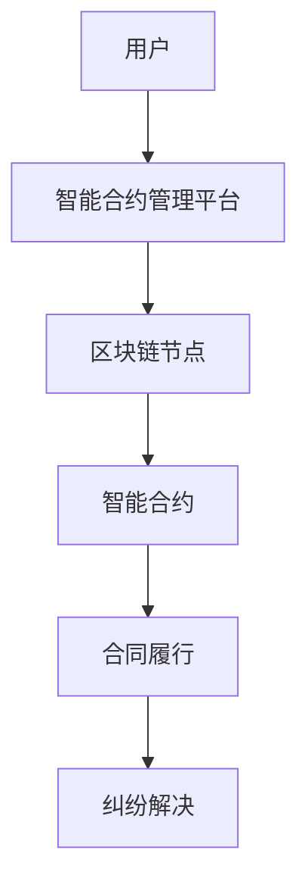

                 


# 智能合约技术在法律服务领域的应用前景

> 关键词：智能合约，区块链，法律服务，自动化合同，智能合约算法，法律数字化转型

> 摘要：智能合约作为区块链技术的核心应用之一，正在逐步改变法律服务行业的传统模式。本文将从智能合约的基本概念、技术原理、法律服务场景的应用、系统架构设计、项目实战案例以及未来发展方向等多方面展开探讨。通过详细分析智能合约在合同管理、纠纷解决等法律服务中的具体应用，结合区块链技术的特性，揭示智能合约在法律服务领域的巨大潜力和应用前景。

---

## 第1章: 智能合约技术在法律服务领域的背景与基础

### 1.1 智能合约的基本概念

#### 1.1.1 智能合约的定义

智能合约是一种基于区块链技术的自动执行合同协议，它能够在满足特定条件时自动执行或强制执行合同条款，而无需依赖传统的中间人或机构。智能合约的本质是将合同条款转化为可执行的代码逻辑。

#### 1.1.2 智能合约的核心特征

智能合约具有 **去中心化**、**自动化**、**透明性** 和 **不可篡改性** 等核心特征。通过区块链技术的支撑，智能合约能够实现合同的自动执行和信任的建立。

#### 1.1.3 智能合约与传统合约的区别

| 特性          | 传统合约                      | 智能合约                      |
|---------------|-------------------------------|-------------------------------|
| 执行方式      | 需要人工干预和执行             | 自动化执行                     |
| 信任基础      | 基于法律机构和信任中介         | 基于区块链的去中心化信任       |
| 可篡改性      | 可能存在人为篡改风险           | 不可篡改性                     |
| 效率          | 低效，依赖人工操作             | 高效，自动化处理               |

### 1.2 区块链技术与智能合约的关系

#### 1.2.1 区块链技术的简介

区块链是一种分布式账本技术，通过去中心化的网络节点共同维护数据的完整性和一致性。区块链的核心特性包括去中心化、不可篡改、可追溯性和安全性。

#### 1.2.2 区块链与智能合约的结合

区块链为智能合约提供了运行环境和信任机制。智能合约通过区块链的分布式账本和共识机制，实现了合同的自动执行和信任的建立。

#### 1.2.3 区块链技术对智能合约的支持

区块链为智能合约提供了 **去中心化的执行环境**、**自动化的执行机制** 和 **不可篡改的记录**，使得智能合约能够在安全、透明的环境中运行。

### 1.3 法律服务行业的现状

#### 1.3.1 法律服务的传统模式

传统法律服务行业依赖于律师、公证人等中介角色，合同的签订和执行需要人工操作，效率低且成本高。此外，合同的篡改和纠纷解决也存在较大的信任风险。

#### 1.3.2 法律服务行业的痛点与挑战

- 合同签订和履行过程复杂，效率低
- 中介机构成本高，信任风险大
- 合同条款难以自动化执行
- 纠纷解决过程漫长且耗资巨大

#### 1.3.3 数字化转型的必要性

随着区块链、人工智能等技术的发展，法律服务行业亟需通过数字化转型提高效率、降低成本、增强信任。

### 1.4 智能合约技术在法律服务领域的变革

#### 1.4.1 智能合约对法律服务的创新

智能合约通过自动化执行合同条款，降低了法律服务的成本，提高了效率。同时，智能合约的透明性和不可篡改性增强了合同的信任度。

#### 1.4.2 智能合约在法律服务中的应用场景

- 合同自动化管理
- 智能纠纷解决
- 自动化法律咨询
- 智能合同审核

#### 1.4.3 智能合约技术的未来趋势

智能合约将在法律服务领域发挥越来越重要的作用，成为法律服务行业数字化转型的核心技术之一。

---

## 第2章: 智能合约的核心概念与原理

### 2.1 智能合约的工作原理

#### 2.1.1 智能合约的执行流程

1. 合同条款转化为代码逻辑
2. 合同双方在区块链上达成共识
3. 智能合约根据预设条件自动执行
4. 执行结果记录在区块链上

#### 2.1.2 智能合约的核心代码结构

智能合约的代码通常包含以下部分：

1. 合同条款的条件判断
2. 合同履行的自动化流程
3. 数据存储与访问控制

#### 2.1.3 智能合约的触发机制

智能合约的触发条件可以是时间、事件或特定的链上数据变化。

---

### 2.2 智能合约的编程语言与开发环境

#### 2.2.1 常见的智能合约编程语言

- Solidity：以太坊平台的主流智能合约编程语言
- Rust：用于更安全的智能合约开发
- Vyper：基于Python语法的智能合约编程语言

#### 2.2.2 智能合约开发环境的搭建

1. 安装以太坊节点（如Geth）
2. 安装智能合约编译工具（如solc）
3. 配置智能合约开发环境（如Remix）

#### 2.2.3 智能合约的调试与测试

- 使用调试工具（如Geth的调试模式）
- 编写测试用例（如使用Pytest进行智能合约测试）

---

### 2.3 智能合约的运行环境

#### 2.3.1 区块链节点的角色

- 全节点：负责验证和存储区块链数据
- 轻节点：仅负责连接和查询区块链数据

#### 2.3.2 智能合约的部署与运行

智能合约需要通过编译、部署和初始化才能在区块链上运行。

#### 2.3.3 智能合约的升级与维护

智能合约的升级需要通过特定的交易进行，通常需要更高的权限和安全性。

---

## 第3章: 智能合约在法律服务中的应用场景

### 3.1 合同自动化管理

#### 3.1.1 合同的自动审核与合规性检查

智能合约可以自动审核合同条款，确保其符合法律法规要求。

#### 3.1.2 合同条款的自动解析与提醒

智能合约可以根据合同条款设定提醒，确保合同履行的透明性和及时性。

#### 3.1.3 合同履行的自动化监控

智能合约可以实时监控合同履行情况，自动触发相关操作。

---

### 3.2 智能合约在法律纠纷解决中的应用

#### 3.2.1 智能仲裁机制

智能合约可以自动执行仲裁规则，减少人为干预。

#### 3.2.2 自动化纠纷解决流程

智能合约可以根据合同条款自动处理纠纷，提高效率和公正性。

---

### 3.3 智能合约在法律咨询中的应用

#### 3.3.1 智能合同审核工具

智能合约可以通过代码逻辑审核合同条款，提供法律建议。

#### 3.3.2 自动化法律咨询系统

智能合约可以为用户提供实时的法律咨询和合同建议。

---

## 第4章: 智能合约在法律服务中的系统架构设计

### 4.1 系统功能设计

#### 4.1.1 合同管理模块

- 合同模板管理
- 合同审核与签署
- 合同履行监控

#### 4.1.2 智能合约部署模块

- 合约代码编译
- 合约部署与初始化
- 合约升级与维护

#### 4.1.3 智能纠纷解决模块

- 纠纷触发条件设定
- 自动仲裁流程
- 纠纷结果记录

---

### 4.2 系统架构设计

#### 4.2.1 系统架构图



#### 4.2.2 系统交互流程

1. 用户提交合同需求
2. 智能合约管理平台生成合同模板
3. 用户签署合同，智能合约部署到区块链
4. 合同履行过程中，智能合约自动监控
5. 发生纠纷时，智能合约自动触发仲裁流程

---

## 第5章: 智能合约在法律服务中的项目实战

### 5.1 项目环境搭建

#### 5.1.1 安装以太坊节点

```bash
# 安装Geth
go get -d github.com/ethereum/go-ethereum
```

#### 5.1.2 安装智能合约开发工具

```bash
# 安装Remix IDE
npm install -g remix-ide
```

### 5.2 核心代码实现

#### 5.2.1 智能合约代码示例

```solidity
// SPDX-License-Identifier: MIT
pragma solidity ^0.8.0;

contract LegalContract {
    address payable public partyA;
    address payable public partyB;
    uint public executionTime;

    function initialize(address payable _partyA, address payable _partyB, uint _executionTime) {
        partyA = _partyA;
        partyB = _partyB;
        executionTime = _executionTime;
    }

    function execute() {
        if (block.timestamp >= executionTime) {
            partyA.transfer(address(this).balance);
        }
    }
}
```

#### 5.2.2 合约部署与测试

```bash
# 使用Geth部署合约
$ geth --rpc
# 在Remix中编译并部署合约
```

### 5.3 实际案例分析

#### 5.3.1 案例背景

某公司与客户签订一份智能合约，约定在特定时间自动支付款项。

#### 5.3.2 合约实现

通过智能合约自动监控时间条件，触发自动支付。

#### 5.3.3 案例总结

智能合约实现了合同的自动化履行，减少了人为干预和成本。

---

## 第6章: 智能合约在法律服务中的最佳实践

### 6.1 小结

智能合约在法律服务领域的应用前景广阔，能够显著提高效率和降低成本。

### 6.2 注意事项

- 合约代码的安全性至关重要
- 合约的合规性需符合法律法规
- 用户隐私保护需加强

### 6.3 拓展阅读

- 《智能合约与区块链技术》
- 《法律服务数字化转型》

---

## 第7章: 结语

智能合约作为区块链技术的重要应用，正在逐步改变法律服务行业的传统模式。通过自动化执行合同条款，智能合约能够提高法律服务的效率和透明度，降低信任风险和成本。未来，随着技术的不断发展，智能合约将在法律服务领域发挥更大的作用，推动行业的全面数字化转型。

--- 

**感谢您的阅读！希望这篇文章能为您提供关于智能合约在法律服务领域应用的深刻洞察和实践指导。**

