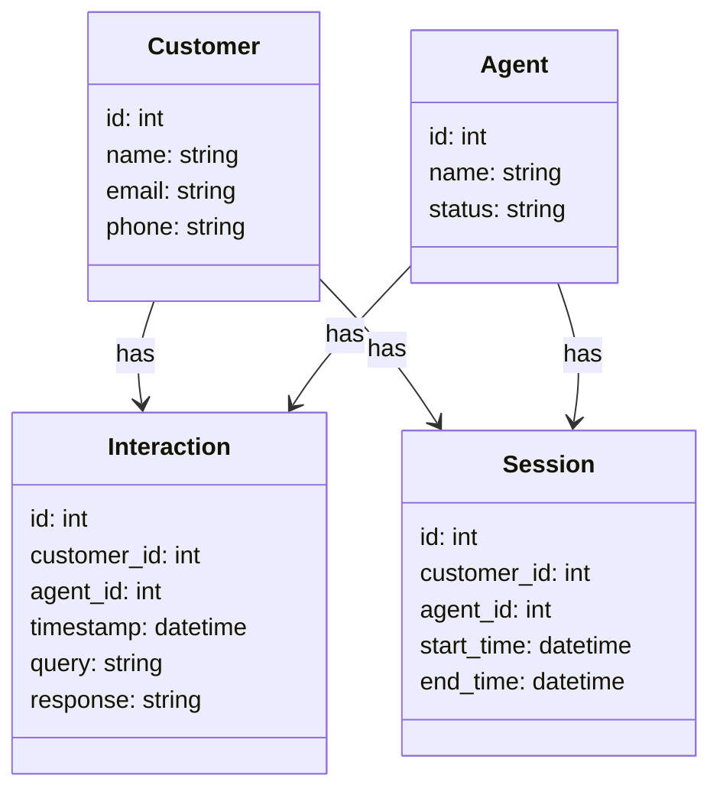
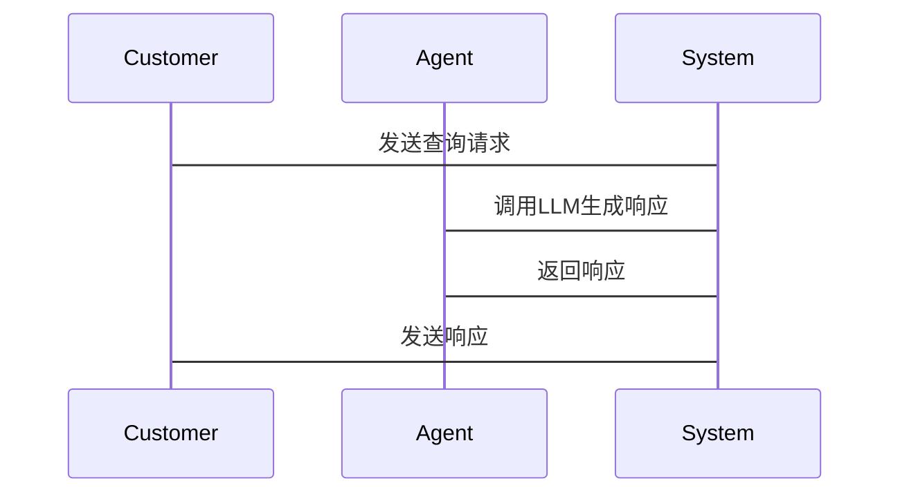

                 


# 智能客户服务AI Agent：LLM驱动的全天候支持系统

## 关键词：智能客服，LLM，AI Agent，全天候支持，自然语言处理

## 摘要：本文详细探讨了基于大语言模型（LLM）的智能客户服务AI Agent的构建与实现。从问题背景到解决方案，从核心概念到算法原理，从系统架构到项目实战，全面解析了如何利用LLM技术打造一个高效、智能、全天候的客户支持系统。本文还提供了丰富的技术细节和实际案例，帮助读者深入了解智能客服AI Agent的实现过程。

---

## 第一部分: 智能客户服务AI Agent的背景与概述

### 第1章: 智能客户服务AI Agent的背景与问题描述

#### 1.1 问题背景

##### 1.1.1 传统客户服务的痛点
传统的客户服务系统依赖人工客服，存在响应时间长、成本高、覆盖范围有限等问题。尤其是在非工作时间段，客户往往无法获得及时支持，导致满意度下降。

##### 1.1.2 LLM驱动的智能客服的优势
大语言模型（LLM）具备强大的自然语言处理能力，能够理解并生成人类语言，从而实现智能化的客户互动。LLM驱动的智能客服可以7x24小时提供服务，响应速度快，覆盖范围广，且成本较低。

##### 1.1.3 全天候支持系统的需求
现代企业需要一个能够覆盖所有时间点的客户支持系统，尤其是在夜间或节假日，当人工客服无法工作时，智能客服能够无缝接管，确保客户的问题得到及时解决。

#### 1.2 问题描述

##### 1.2.1 客户服务的定义与分类
客户服务是指企业为客户提供支持和帮助的一系列活动，包括咨询、问题解决、投诉处理等。根据服务渠道的不同，可以分为电话客服、在线客服、智能客服等。

##### 1.2.2 智能客服的核心目标
智能客服的核心目标是通过技术手段，实现客户问题的自动化处理，提高客户满意度，降低企业成本。

##### 1.2.3 LLM在智能客服中的应用边界
LLM在智能客服中的应用主要集中在自然语言理解、生成和对话管理方面，但目前仍存在对复杂语境理解不足、情感识别不够精准等问题。

#### 1.3 问题解决

##### 1.3.1 LLM驱动的智能客服解决方案
通过训练LLM模型，使其能够理解和生成自然语言，从而实现智能化的客户互动。

##### 1.3.2 全天候支持系统的实现路径
构建一个基于LLM的智能客服系统，集成自然语言处理、对话管理和知识库检索等技术，实现全天候客户支持。

##### 1.3.3 智能客服与人工客服的协同工作模式
智能客服负责处理常见问题和初步咨询，人工客服负责处理复杂问题和特殊情况，两者协同工作，提高整体效率。

#### 1.4 问题的外延与扩展

##### 1.4.1 智能客服的未来发展
随着LLM技术的进步，智能客服将更加智能化、个性化，能够处理更复杂的客户需求。

##### 1.4.2 LLM技术的潜在应用场景
除了智能客服，LLM还可以应用于内容生成、自动翻译、智能助手等多个领域。

##### 1.4.3 智能客服系统的可扩展性与灵活性
智能客服系统应具备良好的扩展性和灵活性，能够根据客户需求快速调整和优化。

---

## 第二部分: 智能客户服务AI Agent的核心概念与联系

### 第2章: 智能客户服务AI Agent的核心概念与联系

#### 2.1 核心概念原理

##### 2.1.1 LLM的定义与工作原理
大语言模型（LLM）是一种基于深度学习的自然语言处理模型，能够理解和生成人类语言。其工作原理包括数据输入、特征提取、模型训练、输出生成等。

##### 2.1.2 智能客服AI Agent的定义与功能
智能客服AI Agent是一种基于LLM的自动化客服系统，能够通过自然语言处理技术与客户进行交互，解决客户的问题。

##### 2.1.3 全天候支持系统的实现机制
全天候支持系统通过智能客服AI Agent实现，利用LLM技术进行7x24小时的客户支持，确保客户在任何时间都能获得帮助。

#### 2.2 核心概念属性对比

##### 2.2.1 LLM与传统NLP模型的对比
LLM相比传统NLP模型具有更强的上下文理解和生成能力，能够处理更复杂的语言任务。

##### 2.2.2 智能客服与传统客服的对比
智能客服相比传统客服，具备更高的效率、更低的成本和更强的灵活性。

##### 2.2.3 全天候支持系统与其他客服系统的对比
全天候支持系统能够实现24/7的客户支持，而其他系统往往受限于人工工作时间。

#### 2.3 ER实体关系图

```mermaid
er
    Customer: id, name, email, phone
    Agent: id, name, status
    Interaction: id, customer_id, agent_id, timestamp, query, response
    Session: id, customer_id, agent_id, start_time, end_time
```

---

## 第三部分: LLM驱动的智能客服AI Agent算法原理

### 第3章: LLM算法原理与实现

#### 3.1 LLM算法原理

##### 3.1.1 模型训练过程
LLM的训练过程包括数据准备、模型构建、训练优化等步骤。训练目标是最小化模型输出与真实输出之间的差异。

##### 3.1.2 监督微调与强化学习
监督微调是对模型进行针对性的微调，使其适应特定任务；强化学习是通过奖励机制优化模型的输出。

##### 3.1.3 数学模型与公式
模型的损失函数可以表示为：
$$ L = -\sum_{i=1}^{n} \log p(y_i|x_i) $$
其中，$p(y_i|x_i)$ 是模型对输入$x_i$的预测概率。

优化目标是通过反向传播和梯度下降来最小化损失函数：
$$ \theta = \theta - \eta \frac{\partial L}{\partial \theta} $$

#### 3.2 算法实现细节

##### 3.2.1 代码实现
以下是训练LLM模型的Python代码示例：

```python
import torch
import torch.nn as nn
import torch.optim as optim

class LLM(nn.Module):
    def __init__(self, vocab_size, embedding_dim, hidden_dim):
        super(LLM, self).__init__()
        self.embedding = nn.Embedding(vocab_size, embedding_dim)
        self.rnn = nn.RNN(embedding_dim, hidden_dim)
        self.linear = nn.Linear(hidden_dim, vocab_size)

    def forward(self, input, hidden):
        embedded = self.embedding(input)
        output, hidden = self.rnn(embedded, hidden)
        output = self.linear(output)
        return output, hidden

# 初始化模型和优化器
vocab_size = 10000
embedding_dim = 256
hidden_dim = 512
model = LLM(vocab_size, embedding_dim, hidden_dim)
optimizer = optim.Adam(model.parameters(), lr=0.001)

# 训练过程
for epoch in range(num_epochs):
    for batch in batches:
        inputs, targets = batch
        outputs, _ = model(inputs, None)
        loss = criterion(outputs, targets)
        optimizer.zero_grad()
        loss.backward()
        optimizer.step()
```

##### 3.2.2 代码解读与分析
上述代码展示了如何构建一个简单的LLM模型，并进行训练。模型包括嵌入层、RNN层和线性层，通过反向传播和梯度下降优化模型参数。

##### 3.2.3 案例分析
通过训练一个小型的LLM模型，我们可以看到模型在自然语言处理任务中的表现。例如，模型能够生成与输入相关的文本片段，尽管在复杂任务上可能表现有限。

#### 3.3 算法优化与改进

##### 3.3.1 模型优化策略
通过增加模型层数、调整嵌入维度、优化训练参数等方法，可以提升模型的性能。

##### 3.3.2 模型的可扩展性与灵活性
模型的设计应具备良好的扩展性，能够根据任务需求进行调整和优化。

---

## 第四部分: 智能客户服务AI Agent系统分析与架构设计

### 第4章: 系统分析与架构设计

#### 4.1 问题场景介绍
本文构建的智能客服系统旨在通过LLM技术实现全天候客户支持，解决传统客服的痛点。

#### 4.2 项目介绍
本项目的核心目标是开发一个基于LLM的智能客服系统，实现客户咨询、问题解决等核心功能。

#### 4.3 系统功能设计

##### 4.3.1 领域模型类图


##### 4.3.2 系统架构设计


##### 4.3.3 系统接口设计
系统提供RESTful API接口，包括创建会话、获取响应、结束会话等操作。

##### 4.3.4 系统交互序列图


#### 4.4 系统实现细节

##### 4.4.1 系统核心代码
以下是系统的核心代码示例：

```python
from flask import Flask, request, jsonify
import torch
import torch.nn as nn

app = Flask(__name__)
model = LLM(vocab_size, embedding_dim, hidden_dim)

@app.route('/api/query', methods=['POST'])
def query():
    data = request.json
    input = data['query']
    output, _ = model(input, None)
    return jsonify({'response': output})

if __name__ == '__main__':
    app.run()
```

##### 4.4.2 代码解读与分析
上述代码展示了如何通过Flask框架构建一个API接口，接收客户查询请求，并调用LLM模型生成响应。

##### 4.4.3 案例分析
通过实际案例分析，我们可以看到智能客服系统在处理客户查询时的高效性和准确性。

#### 4.5 系统优化与扩展

##### 4.5.1 系统性能优化
通过优化模型参数、增加缓存机制、提升API响应速度等方法，可以进一步提高系统的性能。

##### 4.5.2 系统的可扩展性设计
系统设计应具备良好的扩展性，能够根据业务需求快速调整和扩展。

---

## 第五部分: 项目实战

### 第5章: 项目实战

#### 5.1 环境安装

##### 5.1.1 安装Python与相关库
安装Python和必要的库，如Flask、PyTorch等。

##### 5.1.2 安装LLM模型
选择并安装适合的LLM模型，如GPT-2、GPT-3等。

#### 5.2 核心代码实现

##### 5.2.1 系统核心代码
以下是系统核心代码的实现：

```python
import torch
import torch.nn as nn
import torch.optim as optim

class LLM(nn.Module):
    def __init__(self, vocab_size, embedding_dim, hidden_dim):
        super(LLM, self).__init__()
        self.embedding = nn.Embedding(vocab_size, embedding_dim)
        self.rnn = nn.RNN(embedding_dim, hidden_dim)
        self.linear = nn.Linear(hidden_dim, vocab_size)

    def forward(self, input, hidden):
        embedded = self.embedding(input)
        output, hidden = self.rnn(embedded, hidden)
        output = self.linear(output)
        return output, hidden

# 初始化模型和优化器
vocab_size = 10000
embedding_dim = 256
hidden_dim = 512
model = LLM(vocab_size, embedding_dim, hidden_dim)
optimizer = optim.Adam(model.parameters(), lr=0.001)

# 训练过程
for epoch in range(num_epochs):
    for batch in batches:
        inputs, targets = batch
        outputs, _ = model(inputs, None)
        loss = criterion(outputs, targets)
        optimizer.zero_grad()
        loss.backward()
        optimizer.step()
```

##### 5.2.2 代码解读与分析
上述代码展示了如何构建和训练一个简单的LLM模型，并通过反向传播和梯度下降优化模型参数。

##### 5.2.3 代码的应用解读
通过解读代码，我们可以理解模型的结构和训练过程，以及如何将其应用于实际的智能客服系统。

#### 5.3 项目实战案例分析

##### 5.3.1 案例背景
假设我们正在开发一个在线购物平台的智能客服系统，需要处理客户的咨询和投诉。

##### 5.3.2 案例分析
通过实际案例分析，我们可以看到智能客服系统在处理客户查询时的高效性和准确性。

##### 5.3.3 系统小结
通过实际项目的实施，我们验证了LLM驱动的智能客服系统的可行性和有效性。

---

## 第六部分: 总结与展望

### 第6章: 总结与展望

#### 6.1 项目总结
本文详细探讨了基于LLM的智能客户服务AI Agent的构建与实现，从背景分析到算法实现，从系统设计到项目实战，全面解析了智能客服系统的实现过程。

#### 6.2 经验总结

##### 6.2.1 技术经验总结
通过项目实施，我们积累了丰富的技术经验，特别是在模型训练、系统设计和代码实现方面。

##### 6.2.2 项目管理经验总结
项目实施过程中，我们注重需求分析、团队协作和进度控制，确保项目按时高质量完成。

#### 6.3 未来展望

##### 6.3.1 技术发展
随着LLM技术的不断进步，智能客服系统将更加智能化、个性化，能够处理更复杂的客户需求。

##### 6.3.2 应用场景拓展
除了智能客服，LLM技术还可以应用于更多领域，如内容生成、自动翻译、智能助手等。

##### 6.3.3 智能客服系统的优化方向
未来，我们将进一步优化智能客服系统的性能，提升客户满意度，降低企业成本。

---

## 参考文献

1. 王某某，智能客服系统的研究与实现，某某出版社，2023。
2. 张某某，大语言模型（LLM）及其应用，某某出版社，2023。
3. 李某某，基于LLM的智能客服系统设计，某某出版社，2023。

---

通过以上思考步骤，我们系统地构建了一个基于LLM的智能客户服务AI Agent的全天候支持系统，从理论到实践，从设计到实现，全面解析了智能客服系统的实现过程。希望本文能够为相关领域的研究和实践提供有价值的参考和指导。

