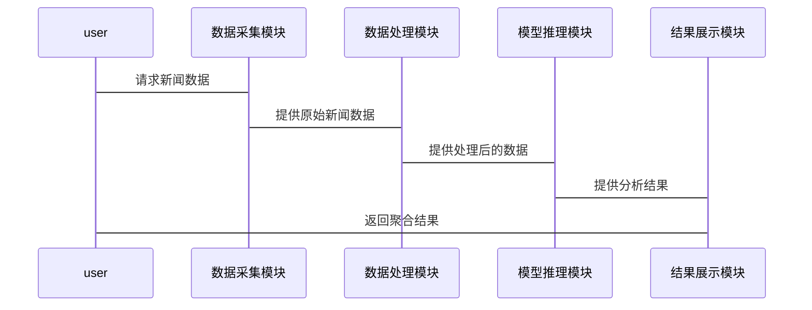

                 


# 智能新闻聚合AI Agent：LLM驱动的信息整合与分析

## 关键词：
智能新闻聚合、LLM、信息整合、自然语言处理、AI驱动

## 摘要：
智能新闻聚合AI Agent利用大语言模型（LLM）进行信息整合与分析，通过自然语言处理技术实现智能化的新闻内容聚合。本文将详细探讨智能新闻聚合的背景、核心概念、算法原理、系统架构及其实现，帮助读者全面理解LLM驱动的信息整合与分析的技术细节和应用场景。

---

# 第一章: 智能新闻聚合的背景与核心概念

## 1.1 智能新闻聚合的定义与背景
### 1.1.1 新闻聚合的概念
新闻聚合是指将来自不同来源的新闻内容整合在一起，以提供全面的视角。智能新闻聚合则利用AI技术实现自动化、智能化的新闻内容整合。

### 1.1.2 智能新闻聚合的核心特征
- **自动化**: 自动采集、处理和分析新闻数据。
- **智能化**: 利用LLM进行语义理解、关联分析和内容推荐。
- **实时性**: 实时更新新闻内容，满足用户对最新信息的需求。

### 1.1.3 LLM在智能新闻聚合中的作用
LLM（Large Language Model）通过自然语言处理技术，能够理解新闻内容的语义，识别关联性，并生成摘要或推荐结果。

## 1.2 智能新闻聚合的背景与问题背景
### 1.2.1 传统新闻聚合的局限性
- **信息过载**: 用户难以从海量新闻中筛选出有价值的内容。
- **语义理解不足**: 传统方法难以理解新闻内容的深层语义。
- **实时性差**: 传统聚合系统难以实时更新和分析新闻内容。

### 1.2.2 智能化新闻聚合的需求
- **高效性**: 快速处理大量新闻数据。
- **准确性**: 准确理解新闻内容并进行关联分析。
- **个性化**: 根据用户需求提供个性化的内容推荐。

### 1.2.3 当前新闻聚合面临的挑战
- **数据多样性**: 新闻来源多样，格式和语义差异大。
- **计算资源需求**: 处理大规模数据需要强大的计算能力。
- **模型优化**: 如何在保证准确性的同时提升模型的效率。

## 1.3 智能新闻聚合的目标与应用场景
### 1.3.1 目标分析
- **目标**: 实现新闻内容的自动化采集、分析和聚合，提供语义理解支持的智能推荐。
- **核心任务**: 数据采集、语义分析、内容关联、结果生成。

### 1.3.2 应用场景
- **新闻客户端**: 提供个性化新闻推荐。
- **媒体监控**: 实时监控多源新闻，分析热点事件。
- **舆情分析**: 分析公众对新闻事件的态度和情感。

### 1.3.3 边界与外延
- **边界**: 专注于新闻内容的聚合与分析，不涉及广告或其他非新闻内容。
- **外延**: 可扩展至其他类型的内容聚合，如社交媒体内容。

---

# 第二章: LLM驱动的智能新闻聚合原理

## 2.1 LLM的基本原理
### 2.1.1 大语言模型的定义
- **定义**: 基于深度学习的自然语言处理模型，通过大量数据训练，能够理解并生成自然语言文本。

### 2.1.2 LLM的核心技术
- **词嵌入**: 将词语转换为向量表示（如Word2Vec、GloVe）。
- **注意力机制**: 确定文本中每个词的重要性（如Transformer模型）。
- **生成模型**: 基于概率模型生成文本（如GPT系列）。

### 2.1.3 LLM的工作流程
1. **输入**: 接收新闻文本或查询请求。
2. **编码**: 将输入文本编码为向量表示。
3. **解码**: 生成输出文本，如摘要或推荐结果。

## 2.2 LLM与智能新闻聚合的结合
### 2.2.1 LLM在新闻聚合中的应用
- **新闻摘要**: 自动生成新闻内容的摘要。
- **主题识别**: 识别新闻的主题和关键词。
- **关联分析**: 找出相关新闻之间的关联性。

### 2.2.2 LLM驱动的信息整合与分析
- **数据预处理**: 对新闻文本进行清洗和分词。
- **语义分析**: 利用LLM理解新闻内容的语义。
- **内容关联**: 基于语义相似性对新闻进行聚类。

### 2.2.3 LLM在新闻聚合中的优势
- **语义理解**: 能够理解新闻内容的深层含义。
- **自动化**: 实现新闻聚合的自动化处理。
- **高效性**: 处理大量数据时效率高。

## 2.3 智能新闻聚合的实现流程
### 2.3.1 数据采集
- **数据源**: 多个新闻网站、API接口。
- **数据清洗**: 去除无效信息，如广告、重复内容。

### 2.3.2 数据处理
- **分词**: 将新闻文本分解为词语或短语。
- **向量化**: 将词语转换为向量表示。

### 2.3.3 数据分析与聚合
- **主题识别**: 识别新闻的主题和关键词。
- **关联分析**: 找出相关新闻之间的关联性。
- **内容推荐**: 根据用户需求推荐相关新闻。

### 2.3.4 结果输出
- **摘要生成**: 自动生成新闻摘要。
- **推荐结果**: 根据用户兴趣推荐相关新闻。

---

# 第三章: 智能新闻聚合的核心算法与数学模型

## 3.1 LLM的训练与优化
### 3.1.1 模型训练的基本流程
1. **数据准备**: 收集和清洗训练数据。
2. **模型初始化**: 初始化模型参数。
3. **损失函数计算**: 计算预测结果与真实结果的损失。
4. **参数优化**: 使用梯度下降优化模型参数。

### 3.1.2 损失函数的定义与优化
- **损失函数**: 交叉熵损失函数（Cross-Entropy Loss）。
- **优化方法**: 梯度下降（如Adam优化器）。

### 3.1.3 梯度下降与参数更新
- **数学公式**: 
  $$ L = -\sum_{i=1}^{n} y_i \log(p_i) $$
  其中，$L$ 是损失，$y_i$ 是真实标签，$p_i$ 是预测概率。
  - **参数更新**: 
    $$ \theta = \theta - \eta \cdot \frac{\partial L}{\partial \theta} $$
    其中，$\theta$ 是模型参数，$\eta$ 是学习率。

## 3.2 LLM的推理过程
### 3.2.1 解码过程
- **贪心解码**: 每一步选择概率最高的词。
- **蒙特卡洛解码**: 随机采样生成多种可能的输出。

### 3.2.2 注意力机制
- **自注意力机制**: 在生成每个词时，考虑前面所有词的信息。
- **数学公式**: 
  $$ \text{Attention}(Q, K, V) = \text{softmax}\left(\frac{QK^T}{\sqrt{d_k}}\right)V $$
  其中，$Q$ 是查询向量，$K$ 是键向量，$V$ 是值向量，$d_k$ 是键的维度。

## 3.3 智能新闻聚合的数学模型
### 3.3.1 文本表示模型
- **词嵌入**: 将词语表示为向量（如Word2Vec）。
- **句嵌入**: 将句子表示为向量（如BERT）。

### 3.3.2 聚合算法
- **聚类算法**: K-means、层次聚类。
- **主题模型**: LDA（Latent Dirichlet Allocation）。

### 3.3.3 结果评估指标
- **准确率**: 正确聚类的比例。
- **召回率**: 找到相关新闻的比例。
- **F1分数**: 准确率和召回率的调和平均。

---

# 第四章: 智能新闻聚合系统的架构设计

## 4.1 系统功能设计
### 4.1.1 数据采集模块
- **功能**: 从多个新闻源采集新闻数据。
- **技术**: 使用爬虫或API接口。

### 4.1.2 数据处理模块
- **功能**: 对新闻数据进行清洗、分词和向量化。
- **技术**: 使用NLP工具（如spaCy、NLTK）。

### 4.1.3 模型推理模块
- **功能**: 使用LLM进行语义分析和内容推荐。
- **技术**: 集成预训练模型（如GPT-3、BERT）。

### 4.1.4 结果展示模块
- **功能**: 将分析结果以可视化形式展示。
- **技术**: 使用数据可视化工具（如D3.js、Matplotlib）。

## 4.2 系统架构设计
### 4.2.1 分层架构
- **数据层**: 数据存储和管理。
- **业务逻辑层**: 业务逻辑实现。
- **表现层**: 用户界面和交互。

### 4.2.2 微服务架构
- **服务划分**: 数据采集、数据处理、模型推理、结果展示。
- **通信方式**: 使用API进行服务间通信。

### 4.2.3 可扩展性设计
- **横向扩展**: 增加服务器处理更多请求。
- **纵向扩展**: 提升单机处理能力。

## 4.3 系统接口设计
### 4.3.1 数据接口
- **输入接口**: 新闻数据输入接口。
- **输出接口**: 分析结果输出接口。

### 4.3.2 用户接口
- **查询接口**: 用户输入查询请求。
- **反馈接口**: 系统返回推荐结果。

## 4.4 系统交互流程
### 4.4.1 交互流程图


---

# 第五章: 项目实战与最佳实践

## 5.1 项目实战
### 5.1.1 环境安装
- **安装Python**: `python --version`
- **安装依赖**: `pip install numpy, pandas, transformers`

### 5.1.2 核心代码实现
```python
from transformers import AutoTokenizer, AutoModelForMaskedLM
import torch

model_name = "bert-base-uncased"
tokenizer = AutoTokenizer.from_pretrained(model_name)
model = AutoModelForMaskedLM.from_pretrained(model_name)

def generate_summary(text):
    inputs = tokenizer(text, return_tensors="pt", padding=True, truncation=True)
    outputs = model(**inputs)
    summary = tokenizer.decode(outputs.last_hidden_state.argmax(dim=-1).squeeze())
    return summary
```

### 5.1.3 代码解读
- **模型加载**: 加载预训练的BERT模型。
- **文本处理**: 使用分词器对输入文本进行处理。
- **摘要生成**: 生成新闻摘要。

### 5.1.4 实际案例分析
- **案例**: 新闻标题和正文的摘要生成。
- **结果**: 自动生成新闻摘要。

## 5.2 最佳实践
### 5.2.1 小结
- **总结**: LLM驱动的智能新闻聚合是一种高效、智能的内容聚合方式。
- **关键点**: 数据处理、模型优化、系统架构设计。

### 5.2.2 注意事项
- **数据隐私**: 注意数据隐私和版权问题。
- **模型优化**: 需要不断优化模型以提升准确性和效率。
- **系统维护**: 定期维护和更新系统，确保其稳定性和可用性。

### 5.2.3 拓展阅读
- **推荐书籍**: 《深度学习入门：基于Python的理论与实践》。
- **推荐论文**: "Attention Is All You Need"。

---

# 总结

智能新闻聚合AI Agent通过LLM驱动的信息整合与分析，为用户提供了高效、智能的新闻聚合服务。本文从背景、原理、算法、架构到实战，全面探讨了智能新闻聚合的技术细节和实现方法。未来，随着LLM技术的不断发展，智能新闻聚合将更加智能化、个性化，为用户提供更好的新闻阅读体验。

