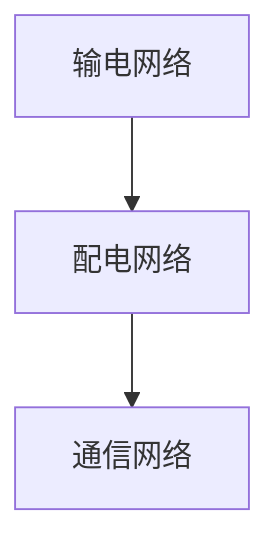
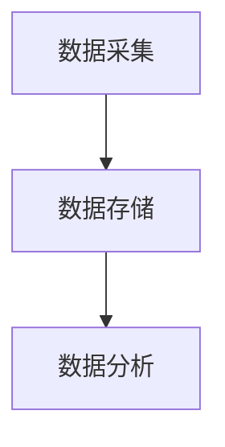
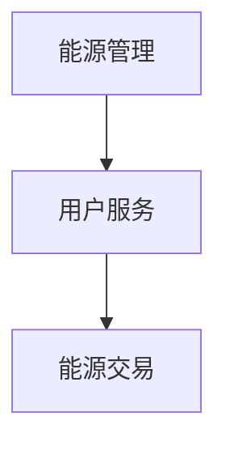
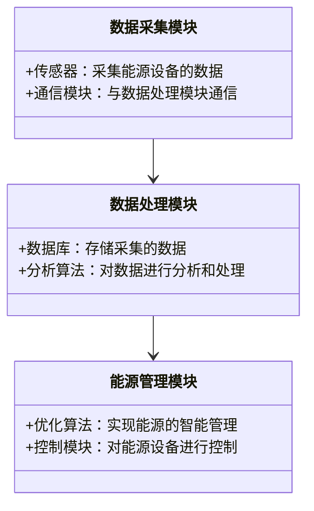
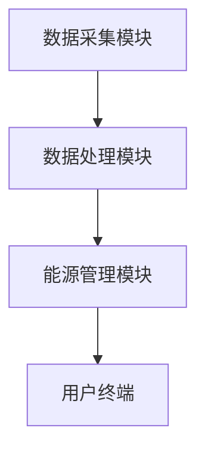
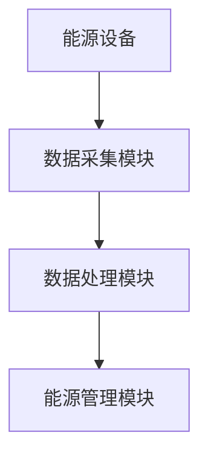
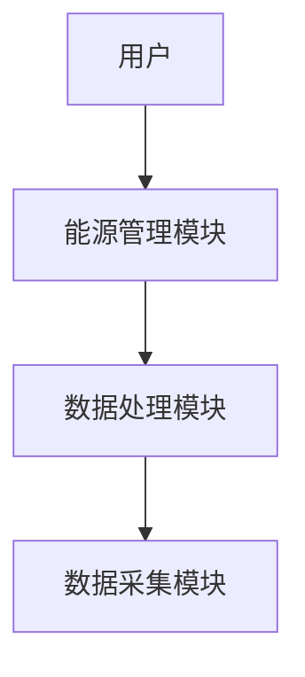

                 

# 智能电网技术的发展与能源互联网投资

> 关键词：智能电网，能源互联网，投资分析，系统架构，技术发展

> 摘要：智能电网技术作为现代能源系统的重要组成部分，正在经历快速的发展和变革。能源互联网的出现，进一步推动了智能电网的智能化和互联化。本文将从智能电网技术的核心概念、能源互联网的体系架构、投资分析、商业模式创新、系统架构设计等方面进行详细探讨，结合实际案例分析，帮助读者全面理解智能电网技术的发展与能源互联网投资的机遇与挑战。

---

## 第1章: 智能电网技术的发展概述

### 1.1 智能电网的定义与特点

#### 1.1.1 智能电网的定义
智能电网（Smart Grid）是指通过智能化的感知、控制和决策技术，实现电力系统中发电、输电、配电和用电等环节的高效、可靠和经济运行的现代化电力系统。

#### 1.1.2 智能电网的核心特点
智能电网具有以下核心特点：
- **智能化**：通过先进的信息通信技术和自动化设备，实现电力系统的智能感知和控制。
- **互联性**：支持多能源的协同运行，实现能源的灵活调配和高效利用。
- **高效性**：通过优化电力系统的运行管理，提高能源利用效率。
- **可靠性**：通过智能监测和快速响应，提升电力系统的抗干扰能力和故障恢复能力。

#### 1.1.3 智能电网与传统电网的区别
| 特性 | 传统电网 | 智能电网 |
|------|----------|----------|
| 感知能力 | 低       | 高       |
| 控制能力 | 有限     | 强大     |
| 信息化 | 单一     | 多元化   |
| 可扩展性 | 低       | 高       |

### 1.2 智能电网的发展历程

#### 1.2.1 传统电网的局限性
传统电网主要依赖于大规模集中式能源（如火电、水电等），存在以下问题：
- **能源利用效率低**：能源浪费严重，尤其是输配电过程中的损耗。
- **难以适应分布式能源**：传统电网难以有效整合风能、太阳能等分布式能源。
- **智能化水平低**：缺乏对电网运行状态的实时监测和智能控制。

#### 1.2.2 智能电网的演进过程
智能电网的演进经历了以下几个阶段：
1. **自动化阶段**：引入SCADA（数据采集与监控系统）和EMS（能量管理系统）。
2. **数字化阶段**：通过信息化技术提升电网的管理效率。
3. **智能化阶段**：引入人工智能、大数据分析等技术，实现电网的智能运行和管理。

#### 1.2.3 当前智能电网的发展现状
当前，智能电网已经在全球范围内得到广泛应用，尤其是在欧洲和北美地区。中国也在积极推进智能电网建设，特别是在智能输电、智能配电和智能用电方面取得了显著进展。

### 1.3 智能电网对能源行业的影响

#### 1.3.1 智能电网对能源结构的优化
智能电网通过整合可再生能源和分布式能源，优化了能源结构，减少了对化石能源的依赖。

#### 1.3.2 智能电网对能源效率的提升
智能电网通过智能监测和优化控制，显著提高了能源利用效率，降低了能源浪费。

#### 1.3.3 智能电网对能源互联网的推动
智能电网为能源互联网的构建奠定了基础，通过多能源的协同运行，实现了能源的高效调配和共享。

### 1.4 本章小结
本章介绍了智能电网的定义、特点和发展历程，分析了智能电网对能源行业的重要影响。下一章将深入探讨能源互联网的概念和体系架构。

---

## 第2章: 能源互联网的概念与体系架构

### 2.1 能源互联网的定义与特点

#### 2.1.1 能源互联网的定义
能源互联网（Energy Internet）是基于智能电网和物联网技术，将能源的生产、传输、存储和消费各个环节进行深度互联的能源系统。

#### 2.1.2 能源互联网的核心特点
能源互联网具有以下核心特点：
- **多能源协同**：能够整合风能、太阳能、生物质能等多种能源形式。
- **智能调配**：通过智能算法实现能源的灵活调配和优化利用。
- **开放共享**：支持多种主体参与能源交易和共享。

### 2.2 能源互联网的体系架构

#### 2.2.1 网络层架构
能源互联网的网络层包括以下部分：
- **输电网络**：负责长距离电力传输。
- **配电网络**：负责电力的分配和配送。
- **通信网络**：实现能源设备之间的信息传输。

#### 2.2.2 数据层架构
能源互联网的数据层包括：
- **数据采集**：通过传感器和采集设备获取能源设备的运行数据。
- **数据存储**：将采集的数据存储在数据库中。
- **数据分析**：对数据进行处理和分析，为决策提供支持。

#### 2.2.3 应用层架构
能源互联网的应用层包括：
- **能源管理**：对能源的生产、传输和消费进行实时监控和管理。
- **用户服务**：为用户提供能源查询、费用结算等服务。
- **能源交易**：支持能源的自由交易和共享。

### 2.3 能源互联网的多能互补与协同

#### 2.3.1 多能互补的概念
多能互补是指通过多种能源形式的协同工作，实现能源的高效利用和优化配置。

#### 2.3.2 多能互补的实现方式
多能互补的实现方式包括：
- **分布式能源系统**：在用户侧部署分布式能源设备，如太阳能发电、储能设备等。
- **智能能量管理**：通过智能算法实现多种能源的协同运行。

#### 2.3.3 多能互补对能源互联网的影响
多能互补显著提升了能源互联网的灵活性和可扩展性，降低了能源成本，提高了能源利用效率。

### 2.4 本章小结
本章详细介绍了能源互联网的概念和体系架构，分析了多能互补与协同的实现方式及其对能源互联网的影响。下一章将探讨智能电网技术的核心技术。

---

## 第3章: 智能电网技术的核心技术

### 3.1 智能输配电技术

#### 3.1.1 智能输电技术
智能输电技术通过实时监测和优化控制，提高了输电效率和安全性。

#### 3.1.2 智能配电技术
智能配电技术通过配电自动化系统实现配电网络的智能管理。

#### 3.1.3 智能输配电的优化策略
智能输配电的优化策略包括：
- **实时监测**：通过传感器和通信技术实现输配电网络的实时监测。
- **智能控制**：通过智能算法实现输配电网络的优化控制。

### 3.2 电力物联网技术

#### 3.2.1 电力物联网的概念
电力物联网（Power Internet of Things）是物联网技术在电力系统中的应用，通过传感器、通信设备和智能终端实现电力设备的互联和协同。

#### 3.2.2 电力物联网的实现技术
电力物联网的实现技术包括：
- **传感器技术**：用于采集电力设备的运行数据。
- **通信技术**：实现电力设备之间的信息传输。
- **智能终端**：用于电力设备的智能控制和管理。

#### 3.2.3 电力物联网的应用场景
电力物联网的应用场景包括：
- **输电网络监控**：实时监测输电线路的运行状态。
- **配电网络管理**：实现配电网络的智能管理和故障定位。

### 3.3 能源存储与转换技术

#### 3.3.1 能源存储技术
能源存储技术包括：
- **电池储能**：通过电池存储多余的能量，用于削峰填谷。
- **超级电容器**：用于短时间内的能量存储和快速释放。

#### 3.3.2 能源转换技术
能源转换技术包括：
- **逆变技术**：将直流电转换为交流电。
- **整流技术**：将交流电转换为直流电。

#### 3.3.3 能源存储与转换的优化策略
能源存储与转换的优化策略包括：
- **能量管理**：通过智能算法实现能量的优化存储和转换。
- **效率提升**：通过技术创新提高能源存储和转换的效率。

### 3.4 本章小结
本章详细介绍了智能电网技术的核心技术，包括智能输配电技术、电力物联网技术和能源存储与转换技术。下一章将探讨能源互联网的投资分析。

---

## 第4章: 能源互联网的投资分析

### 4.1 能源互联网的投资机会

#### 4.1.1 可再生能源的投资机会
随着全球能源转型的推进，可再生能源（如太阳能、风能等）的投资机会不断增加。

#### 4.1.2 分布式能源的投资机会
分布式能源系统（如分布式光伏、分布式储能等）的投资机会也在逐渐增加。

#### 4.1.3 智能电网技术的投资机会
智能电网技术的进一步发展为投资者提供了丰富的投资机会，尤其是在智能输配电、电力物联网等领域。

### 4.2 能源互联网的风险与挑战

#### 4.2.1 技术风险
能源互联网的实现需要依赖多种先进技术，技术的不确定性和不成熟性可能带来投资风险。

#### 4.2.2 市场风险
能源互联网市场尚处于发展阶段，市场需求的不确定性可能对投资者造成挑战。

#### 4.2.3 政策风险
能源互联网的发展需要政策的支持和规范，政策的不确定性和变化可能对投资者产生影响。

### 4.3 能源互联网的投资策略

#### 4.3.1 技术驱动型投资
技术驱动型投资注重技术创新和研发，适合技术型企业或机构投资者。

#### 4.3.2 市场驱动型投资
市场驱动型投资注重市场需求和商业模式的可行性，适合风险承受能力较高的投资者。

#### 4.3.3 政策驱动型投资
政策驱动型投资注重政策支持和规范，适合那些对政策敏感的投资者。

### 4.4 本章小结
本章分析了能源互联网的投资机会、风险与挑战，并提出了相应的投资策略。下一章将探讨能源互联网的商业模式创新。

---

## 第5章: 能源互联网的商业模式创新

### 5.1 能源互联网的共享经济模式

#### 5.1.1 共享经济的概念
共享经济是指通过共享资源实现资源的高效利用和优化配置。

#### 5.1.2 共享经济在能源互联网中的应用
共享经济在能源互联网中的应用包括：
- **共享储能**：通过共享储能设备实现储能资源的高效利用。
- **共享能源**：通过共享能源设备实现能源的灵活调配。

### 5.2 能源互联网的区块链应用

#### 5.2.1 区块链的概念
区块链是一种分布式账本技术，具有去中心化、不可篡改等特点。

#### 5.2.2 区块链在能源互联网中的应用
区块链在能源互联网中的应用包括：
- **能源交易**：通过区块链技术实现能源的点对点交易。
- **能源溯源**：通过区块链技术实现能源的溯源和追踪。

### 5.3 能源互联网的绿色金融

#### 5.3.1 绿色金融的概念
绿色金融是指为了支持环境改善、应对气候变化和促进资源节约高效利用的金融活动。

#### 5.3.2 绿色金融在能源互联网中的应用
绿色金融在能源互联网中的应用包括：
- **绿色债券**：用于支持能源互联网的建设和运营。
- **绿色基金**：用于投资能源互联网的相关项目。

### 5.4 本章小结
本章探讨了能源互联网的商业模式创新，包括共享经济模式、区块链应用和绿色金融。下一章将探讨能源互联网的系统架构设计。

---

## 第6章: 能源互联网的系统架构与设计

### 6.1 系统功能设计

#### 6.1.1 系统功能模块
能源互联网的系统功能模块包括：
- **数据采集模块**：用于采集能源设备的运行数据。
- **数据分析模块**：用于对数据进行处理和分析。
- **能源管理模块**：用于实现能源的智能管理和优化控制。

#### 6.1.2 功能模块之间的关系
功能模块之间的关系可以通过类图表示：

### 6.2 系统架构设计

#### 6.2.1 系统架构类型
能源互联网的系统架构类型包括：
- **分层架构**：将系统划分为数据层、网络层和应用层。
- **分布式架构**：将系统功能分布在多个节点上，实现系统的高可用性。

#### 6.2.2 系统架构设计图
系统架构设计图可以通过以下mermaid图表示：

### 6.3 系统接口设计

#### 6.3.1 系统接口类型
系统接口类型包括：
- **数据接口**：用于数据的采集和传输。
- **控制接口**：用于对能源设备进行控制和管理。

#### 6.3.2 接口设计示例
以下是一个简单的接口设计示例：

### 6.4 系统交互设计

#### 6.4.1 系统交互流程
系统交互流程可以通过以下mermaid图表示：

### 6.5 本章小结
本章详细介绍了能源互联网的系统架构与设计，包括系统功能设计、架构设计、接口设计和交互设计。下一章将探讨能源互联网的项目实战。

---

## 第7章: 能源互联网的项目实战

### 7.1 项目背景与目标

#### 7.1.1 项目背景
随着能源互联网的快速发展，越来越多的企业和个人开始关注能源互联网的建设和应用。

#### 7.1.2 项目目标
本项目旨在通过能源互联网技术实现能源的高效利用和智能管理。

### 7.2 项目需求分析

#### 7.2.1 功能需求
项目的主要功能需求包括：
- **数据采集**：实现能源设备的数据采集和传输。
- **数据分析**：对采集的数据进行处理和分析，为决策提供支持。
- **能源管理**：实现能源的智能管理和优化控制。

#### 7.2.2 非功能需求
项目的非功能需求包括：
- **性能需求**：系统需要具备较高的响应速度和处理能力。
- **安全性需求**：系统需要具备较高的安全性和抗干扰能力。

### 7.3 项目实施步骤

#### 7.3.1 系统设计
系统设计包括：
- **需求分析**：明确项目的功能需求和非功能需求。
- **系统架构设计**：设计系统的整体架构。
- **详细设计**：对系统进行详细的设计，包括模块划分和接口设计。

#### 7.3.2 系统开发
系统开发包括：
- **前端开发**：实现用户界面的设计和开发。
- **后端开发**：实现系统的功能模块开发。
- **数据库开发**：实现数据的存储和管理。

#### 7.3.3 系统测试
系统测试包括：
- **单元测试**：对各个功能模块进行测试。
- **集成测试**：对系统的整体功能进行测试。
- **性能测试**：对系统的性能进行测试和优化。

### 7.4 项目案例分析

#### 7.4.1 项目案例
以下是一个能源互联网项目的案例分析：

**项目名称**：某城市能源互联网示范项目

**项目目标**：通过能源互联网技术实现城市能源的高效利用和智能管理。

**项目实施**：
1. **需求分析**：明确项目的功能需求和非功能需求。
2. **系统设计**：设计系统的整体架构和功能模块。
3. **系统开发**：实现系统的功能模块开发和数据库开发。
4. **系统测试**：对系统进行全面测试和优化。

**项目成果**：
- **能源管理模块**：实现了能源的智能管理和优化控制。
- **数据采集模块**：实现了能源设备的数据采集和传输。
- **用户终端**：提供了用户友好的能源管理界面。

### 7.5 本章小结
本章通过一个实际的能源互联网项目案例，详细介绍了项目的背景、需求分析、实施步骤和成果。这为读者提供了能源互联网项目实施的参考。

---

## 第8章: 总结与展望

### 8.1 本书总结
本书详细探讨了智能电网技术的发展与能源互联网投资的相关内容，包括智能电网的定义、特点和发展历程，能源互联网的概念、体系架构和核心技术，能源互联网的投资分析和商业模式创新，以及能源互联网的系统架构设计和项目实战。

### 8.2 未来展望
随着能源互联网的快速发展，未来将会有更多的技术创新和模式创新。能源互联网的投资机会也将不断增加，尤其是在可再生能源、分布式能源和智能电网等领域。能源互联网的未来发展需要政府、企业和个人的共同努力，通过技术创新和模式创新推动能源互联网的健康发展。

### 8.3 最佳实践 Tips
- **技术创新**：能源互联网的核心是技术创新，投资者需要关注新技术的发展和应用。
- **政策支持**：能源互联网的发展需要政策的支持和规范，投资者需要关注政策的变化。
- **商业模式创新**：能源互联网的商业模式创新是实现可持续发展的重要途径，投资者需要关注商业模式的创新。

### 8.4 注意事项
- **技术风险**：能源互联网的实现需要依赖多种先进技术，技术的不确定性和不成熟性可能带来投资风险。
- **市场风险**：能源互联网市场尚处于发展阶段，市场需求的不确定性可能对投资者造成挑战。
- **政策风险**：能源互联网的发展需要政策的支持和规范，政策的不确定性和变化可能对投资者产生影响。

### 8.5 拓展阅读
- **《能源互联网白皮书》**：详细介绍能源互联网的概念、技术和发展趋势。
- **《智能电网技术与应用》**：详细介绍智能电网的技术和应用案例。
- **《能源互联网投资指南》**：详细介绍能源互联网的投资机会和投资策略。

---

# 结语

智能电网技术和能源互联网的结合，不仅推动了能源行业的转型升级，也为投资者提供了丰富的投资机会。未来，随着技术的不断进步和政策的支持，能源互联网的投资和发展将更加广阔。希望通过本书的探讨，能够为读者提供有价值的参考和启发，推动能源互联网的健康发展。

