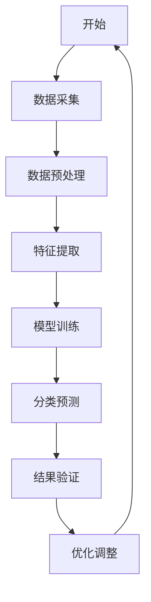
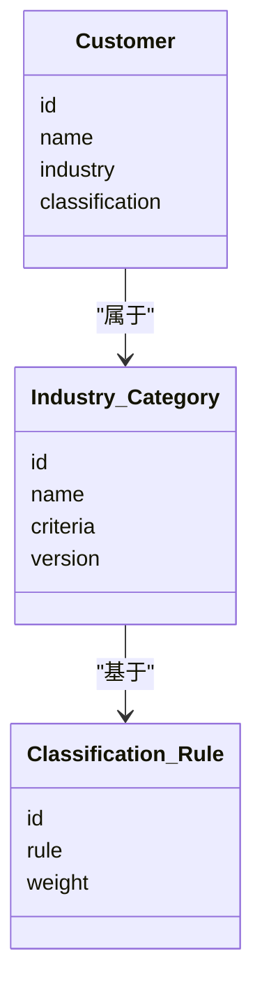
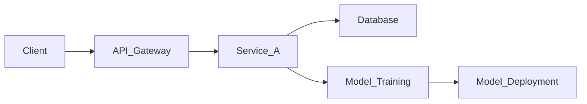
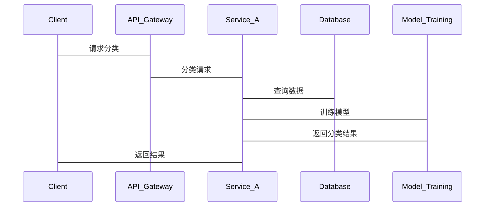

                 


好的，我将按照您的要求创作一篇结构清晰、内容详实的技术博客文章。让我们一步一步开始。

# 智能算法构建动态行业分类体系

## 关键词：
- 智能算法
- 动态行业分类
- 机器学习
- 数据分析
- 系统架构

## 摘要：
本文将深入探讨如何利用智能算法构建动态行业分类体系，从问题背景到系统实现，从算法原理到项目实战，全面解析动态行业分类的构建过程。通过实际案例分析，帮助读者理解如何利用机器学习和数据挖掘技术，实现行业分类的动态调整和优化。

---

## 第一部分：问题背景与目标

### 第1章：问题背景

#### 1.1 行业分类的传统方法
- 传统行业分类方法的局限性
  - 数据静态化，无法实时更新
  - 分类标准固定，难以应对行业变化
  - 人工成本高，效率低

#### 1.2 动态行业分类的必要性
- 行业动态变化的背景
  - 市场环境变化
  - 技术进步影响
  - 用户需求多样化
- 动态分类的优势
  - 实时更新
  - 精准分类
  - 成本降低

#### 1.3 智能算法的作用
- 智能算法的核心优势
  - 自动学习和优化
  - 处理海量数据
  - 实时调整分类

### 第2章：问题定义与目标

#### 2.1 动态行业分类的定义
- 行业分类的动态性
  - 分类标准动态调整
  - 数据实时更新
  - 分类结果动态反馈

#### 2.2 分类体系的核心目标
- 实现行业分类的自动化
- 提高分类的准确性和效率
- 支持实时动态调整

#### 2.3 行业分类的边界与外延
- 分类的边界
  - 数据范围
  - 业务场景
  - 用户需求
- 分类的外延
  - 多维度分析
  - 可视化呈现
  - 数据驱动决策

---

## 第二部分：核心概念与联系

### 第3章：智能算法与动态行业分类体系的原理

#### 3.1 算法的基本原理
- 机器学习的核心思想
  - 数据驱动
  - 模型训练
  - 预测与分类
- 智能算法的特点
  - 自适应性
  - 可扩展性
  - 高效性

#### 3.2 分类体系的构建逻辑
- 数据采集与预处理
  - 数据清洗
  - 特征提取
  - 数据标准化
- 模型训练与分类
  - 算法选择
  - 参数优化
  - 模型评估
- 动态调整机制
  - 实时反馈
  - 自动优化
  - 模型更新

#### 3.3 算法与分类体系的结合方式
- 算法的选择与应用
  - 分类算法的多样性
  - 算法的适用场景
  - 算法的优化策略
- 分类体系的可扩展性
  - 灵活调整分类标准
  - 支持多维度分类
  - 系统的可扩展性设计

### 第4章：核心概念对比表

#### 4.1 行业分类与动态分类的对比
| 特性      | 传统分类       | 动态分类       |
|-----------|----------------|---------------|
| 数据来源  | 静态数据       | 动态数据       |
| 分类标准  | 固定标准       | 动态调整       |
| 分类效率  | 低             | 高             |

#### 4.2 智能算法与传统算法的对比
| 特性      | 传统算法       | 智能算法       |
|-----------|----------------|---------------|
| 学习方式  | 利用规则       | 数据驱动       |
| 灵活性     | 较低           | 较高           |
| 扩展性     | 有限           | 强             |

#### 4.3 分类体系的可扩展性与稳定性对比
| 特性      | 可扩展性       | 稳定性         |
|-----------|----------------|---------------|
| 传统分类  | 低             | 高             |
| 动态分类  | 高             | 中             |

### 第5章：ER实体关系图

```mermaid
erDiagram
    customer[客户] {
        id : integer
        name : string
        industry : string
        classification : string
    }
    industry_category[行业分类] {
        id : integer
        name : string
        criteria : string
        version : integer
    }
    classification_rule[分类规则] {
        id : integer
        rule : string
        weight : integer
    }
    customer -> industry_category : "属于"
    industry_category -> classification_rule : "基于"
```

---

## 第三部分：算法原理与实现

### 第6章：算法原理

#### 6.1 分类算法的选择与优化
- 常见分类算法
  - K-近邻算法（KNN）
  - 支持向量机（SVM）
  - 随机森林（Random Forest）
  - 神经网络（Neural Network）
- 算法选择的依据
  - 数据类型
  - 数据规模
  - 分类准确性
  - 计算复杂度

#### 6.2 动态调整的机制
- 动态分类的实现步骤
  - 数据采集
  - 特征提取
  - 模型训练
  - 实时反馈
  - 自动调整
- 调整策略
  - 基于反馈的调整
  - 基于时间的调整
  - 基于规则的调整

#### 6.3 算法的收敛性与稳定性
- 算法收敛性的影响因素
  - 数据分布
  - 特征选择
  - 模型复杂度
- 算法稳定性的保证
  - 参数优化
  - 正则化
  - 集成学习

### 第7章：算法流程图



### 第8章：数学模型与公式

#### 8.1 分类函数的定义
- 分类函数
$$f(x) = \text{classify}(x)$$
- 其中，$x$ 是输入样本，$\text{classify}(x)$ 是分类结果。

#### 8.2 模型的损失函数
- 损失函数
$$L = \sum_{i=1}^{n} (y_i - \hat{y}_i)^2$$
- 其中，$y_i$ 是真实标签，$\hat{y}_i$ 是预测标签。

#### 8.3 模型的优化目标
- 优化目标
$$\min_\theta L$$
- 其中，$\theta$ 是模型参数。

#### 8.4 举例说明
- 例如，对于一个二分类问题，损失函数可以表示为：
$$L = -\sum_{i=1}^{n} [y_i \log(p_i) + (1 - y_i) \log(1 - p_i)]$$
- 其中，$p_i$ 是预测概率。

---

## 第四部分：系统分析与架构设计

### 第9章：系统分析

#### 9.1 问题场景介绍
- 系统目标
  - 实现动态行业分类
  - 提供实时反馈
  - 支持多维度分析
- 使用场景
  - 金融行业
  - 零售行业
  - 制造业

#### 9.2 系统功能设计
- 领域模型


### 第10章：系统架构设计

#### 10.1 系统架构图
- 系统架构


#### 10.2 系统接口设计
- 接口描述
  - 数据接口
  - 分类接口
  - 反馈接口

#### 10.3 系统交互设计
- 交互流程


---

## 第五部分：项目实战与案例分析

### 第11章：项目实战

#### 11.1 环境安装
- 安装Python
- 安装机器学习库（如scikit-learn、XGBoost）
- 安装数据处理库（如Pandas、NumPy）

#### 11.2 核心代码实现

##### 数据预处理
```python
import pandas as pd
import numpy as np

# 数据加载
data = pd.read_csv('industry_data.csv')

# 数据清洗
data.dropna(inplace=True)

# 特征提取
X = data.drop('industry', axis=1)
y = data['industry']
```

##### 模型训练
```python
from sklearn.model_selection import train_test_split
from sklearn.ensemble import RandomForestClassifier

# 数据分割
X_train, X_test, y_train, y_test = train_test_split(X, y, test_size=0.2)

# 模型训练
model = RandomForestClassifier()
model.fit(X_train, y_train)
```

##### 分类与反馈
```python
# 预测
y_pred = model.predict(X_test)

# 反馈机制
feedback = y_test != y_pred
```

#### 11.3 案例分析
- 案例背景
  - 数据来源
  - 业务需求
  - 分类目标
- 分析结果
  - 分类准确率
  - 算法性能
  - 系统稳定性

---

## 第六部分：最佳实践与拓展阅读

### 第12章：小结

#### 12.1 核心知识点总结
- 智能算法的核心作用
- 动态行业分类的关键步骤
- 系统设计的注意事项

### 第13章：注意事项

#### 13.1 算法选择的注意事项
- 数据类型与算法匹配
- 计算资源与算法复杂度
- 业务需求与算法性能

#### 13.2 系统设计的注意事项
- 数据安全与隐私保护
- 系统可扩展性与可维护性
- 系统性能优化

### 第14章：拓展阅读

#### 14.1 相关技术
- 最新算法进展
- 行业应用案例
- 数据科学工具

#### 14.2 进阶学习
- 深度学习在分类中的应用
- 联合学习与分布式计算
- 时间序列分析与动态分类

---

## 总结

通过本文的详细讲解，我们全面解析了智能算法在动态行业分类中的应用，从理论到实践，从算法原理到系统设计，帮助读者系统地掌握动态行业分类体系的构建方法。希望本文的内容能够为相关领域的实践者提供有价值的参考和启发。

--- 

如果您对上述内容有具体要求或需要进一步调整，请随时告诉我！

