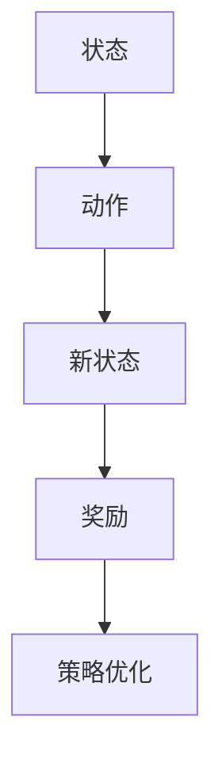
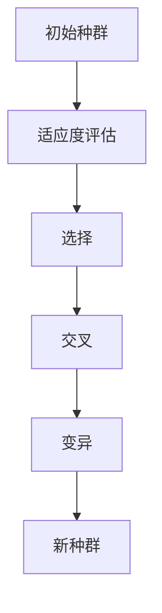
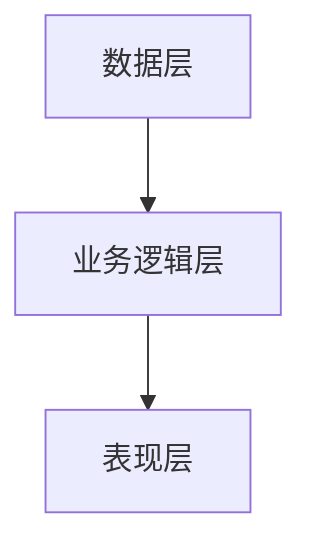

                 


# 智能算法构建动态资产配置模型

## 关键词：智能算法，动态资产配置，机器学习，强化学习，金融投资

## 摘要：本文将介绍如何利用智能算法构建动态资产配置模型。通过分析智能算法的核心原理和动态资产配置的需求，结合实际案例，详细讲解模型构建的步骤和方法，帮助读者理解如何在金融投资中应用智能算法进行动态资产配置。

---

## 第1章 智能算法与动态资产配置概述

### 1.1 智能算法的基本概念

#### 1.1.1 智能算法的定义与特点

智能算法是一种基于人工智能技术的算法，通过模拟人类的思维过程，利用数据、模型和计算能力来解决复杂问题。其特点是：

- **自适应性**：能够根据环境变化自动调整策略。
- **学习能力**：通过数据和反馈不断优化自身。
- **高效性**：能够在较短时间内完成复杂的计算任务。

#### 1.1.2 智能算法的核心技术

智能算法主要包括以下核心技术：

- **机器学习**：通过训练数据，模型能够自动学习特征。
- **深度学习**：利用多层神经网络进行特征提取和分类。
- **强化学习**：通过奖励机制优化决策过程。

#### 1.1.3 智能算法在金融中的应用

智能算法在金融领域的应用非常广泛，包括股票预测、风险管理、信用评估等。特别是在动态资产配置中，智能算法能够帮助投资者优化资产组合，降低风险，提高收益。

### 1.2 动态资产配置的基本概念

#### 1.2.1 资产配置的定义与分类

资产配置是指将资金分配到不同的资产类别（如股票、债券、房地产等）中，以实现投资目标。动态资产配置是在市场变化中，根据市场状况和投资者需求，实时调整资产比例。

#### 1.2.2 动态资产配置的必要性

传统资产配置方法通常是静态的，无法适应市场的快速变化。动态资产配置能够根据市场波动和投资者目标的变化，实时调整资产组合，从而提高投资收益并降低风险。

#### 1.2.3 动态资产配置的实现方式

动态资产配置的实现方式包括：

- **主动管理**：根据市场变化，手动调整资产组合。
- **被动管理**：利用智能算法，自动调整资产比例。
- **混合管理**：结合主动和被动管理，根据市场情况选择最优策略。

### 1.3 智能算法在动态资产配置中的作用

#### 1.3.1 智能算法的优势

智能算法在动态资产配置中的优势主要体现在：

- **高效性**：能够快速处理大量数据，实时调整资产组合。
- **准确性**：通过历史数据和市场趋势，预测未来市场变化。
- **自适应性**：能够根据市场反馈不断优化配置策略。

#### 1.3.2 动态资产配置的挑战

动态资产配置面临的主要挑战包括：

- **数据不足**：市场数据可能存在缺失或噪声。
- **模型过拟合**：算法可能过于依赖历史数据，无法适应未来变化。
- **计算复杂度高**：复杂的市场环境需要大量计算资源。

#### 1.3.3 智能算法如何解决动态资产配置问题

智能算法通过以下方式解决动态资产配置问题：

- **实时数据处理**：快速分析市场数据，调整资产组合。
- **风险控制**：利用算法预测市场波动，降低投资风险。
- **收益优化**：通过优化模型，最大化投资收益。

### 1.4 本章小结

本章介绍了智能算法的基本概念和动态资产配置的核心需求。通过分析智能算法的优势和挑战，阐述了其在动态资产配置中的重要作用。

---

## 第2章 智能算法的核心原理与实现

### 2.1 常见智能算法简介

#### 2.1.1 强化学习

强化学习是一种通过试错机制，利用奖励机制来优化决策过程的算法。其核心是通过不断尝试不同的动作，找到最优策略。

##### 强化学习的流程图（使用mermaid）



##### 强化学习的数学公式

强化学习的Q-learning算法如下：

$$ Q(s, a) = Q(s, a) + \alpha (r + \max Q(s', a') - Q(s, a)) $$

其中：
- \( Q(s, a) \) 表示在状态 \( s \) 下执行动作 \( a \) 的期望奖励。
- \( \alpha \) 是学习率。
- \( r \) 是即时奖励。
- \( \max Q(s', a') \) 是新状态下最大化的Q值。

#### 2.1.2 遗传算法

遗传算法是一种模拟生物进化过程的优化算法，通过遗传、变异和选择操作来找到最优解。

##### 遗传算法的流程图（使用mermaid）



#### 2.1.3 神经网络

神经网络是一种模拟人脑结构和功能的算法，通过多层神经元之间的连接来学习数据特征。

##### 神经网络的数学公式

神经网络的输出层公式如下：

$$ y = \sigma(\sum w_i x_i + b) $$

其中：
- \( x_i \) 是输入。
- \( w_i \) 是权重。
- \( b \) 是偏置。
- \( \sigma \) 是激活函数。

---

## 第3章 动态资产配置模型的构建

### 3.1 模型设计的基本原则

#### 3.1.1 模型的可解释性

模型的可解释性是指能够清晰地解释每个决策背后的原因。这在金融领域尤为重要，因为需要对投资决策进行审核和调整。

#### 3.1.2 模型的可扩展性

模型的可扩展性是指能够方便地增加新的资产类别或市场数据。这使得模型能够适应不同的投资环境和策略。

#### 3.1.3 模型的实时性

模型的实时性是指能够快速响应市场变化，进行实时调整。这对于动态资产配置来说至关重要。

### 3.2 动态资产配置模型的实现步骤

#### 3.2.1 数据收集与预处理

数据收集与预处理是模型构建的基础，包括数据清洗、标准化和特征提取。

##### 数据预处理的代码示例

```python
import pandas as pd
import numpy as np

# 数据清洗
data = pd.read_csv('data.csv')
data.dropna(inplace=True)

# 数据标准化
from sklearn.preprocessing import StandardScaler
scaler = StandardScaler()
data_scaled = scaler.fit_transform(data)
```

#### 3.2.2 模型训练与优化

模型训练与优化是通过历史数据训练模型，并通过参数调整来提高模型性能。

##### 模型优化的代码示例

```python
from sklearn.model_selection import GridSearchCV
from sklearn.ensemble import RandomForestRegressor

# 参数网格搜索
param_grid = {'n_estimators': [100, 200], 'max_depth': [None, 10]}
grid_search = GridSearchCV(RandomForestRegressor(), param_grid, cv=5)
grid_search.fit(X_train, y_train)

# 最优参数
best_params = grid_search.best_params_
```

#### 3.2.3 模型验证与测试

模型验证与测试是通过测试数据评估模型的性能，并进行最终调整。

##### 模型验证的代码示例

```python
from sklearn.metrics import mean_squared_error

y_pred = grid_search.predict(X_test)
rmse = mean_squared_error(y_test, y_pred, squared=False)
print(f'Root Mean Squared Error: {rmse}')
```

### 3.3 本章小结

本章详细讲解了动态资产配置模型的构建步骤，包括数据预处理、模型训练和验证。通过代码示例，展示了如何利用智能算法优化模型性能。

---

## 第4章 动态资产配置系统的架构设计

### 4.1 系统功能模块划分

#### 4.1.1 数据采集模块

数据采集模块负责收集市场数据，包括股票价格、经济指标等。

##### 数据采集模块的代码示例

```python
import requests
import json

url = 'https://api.example.com/market_data'
response = requests.get(url)
data = json.loads(response.text)
```

#### 4.1.2 模型计算模块

模型计算模块负责根据市场数据，实时计算并调整资产配置。

##### 模型计算模块的代码示例

```python
def calculate_asset_allocation(data):
    # 数据处理
    # 模型计算
    return allocation
```

#### 4.1.3 结果展示模块

结果展示模块负责将资产配置结果以可视化方式展示给用户。

##### 结果展示模块的代码示例

```python
import matplotlib.pyplot as plt

plt.plot(data)
plt.show()
```

### 4.2 系统架构设计

#### 4.2.1 分层架构设计

分层架构将系统分为数据层、业务逻辑层和表现层，便于模块化开发和维护。

##### 分层架构图（使用mermaid）



### 4.3 系统接口设计

#### 4.3.1 数据接口

数据接口负责与外部数据源进行交互，获取市场数据。

##### 数据接口代码示例

```python
import requests

def get_market_data(api_key):
    url = 'https://api.example.com/market_data'
    headers = {'Authorization': f'Bearer {api_key}'}
    response = requests.get(url, headers=headers)
    return json.loads(response.text)
```

#### 4.3.2 模型接口

模型接口负责接收数据，进行计算并返回结果。

##### 模型接口代码示例

```python
def get_allocation(data):
    # 数据处理
    # 模型计算
    return allocation
```

#### 4.3.3 用户接口

用户接口负责与用户交互，接收输入并展示结果。

##### 用户接口代码示例

```python
def main():
    api_key = input('请输入API Key: ')
    data = get_market_data(api_key)
    allocation = get_allocation(data)
    print('资产配置结果:', allocation)

if __name__ == '__main__':
    main()
```

### 4.4 本章小结

本章详细描述了动态资产配置系统的架构设计，包括功能模块划分、系统架构和接口设计。通过分层架构和模块化设计，确保系统高效稳定运行。

---

## 第5章 项目实战与案例分析

### 5.1 项目介绍

本项目旨在利用智能算法构建动态资产配置模型，帮助投资者优化资产组合，降低风险，提高收益。

### 5.2 环境安装与配置

#### 5.2.1 Python环境安装

安装Python和必要的库：

```bash
python --version
pip install numpy pandas scikit-learn
```

#### 5.2.2 依赖库安装

安装项目所需的依赖库：

```bash
pip install requests matplotlib
```

#### 5.2.3 开发环境配置

配置开发环境，如Jupyter Notebook或IDE。

### 5.3 核心代码实现

#### 5.3.1 数据预处理代码

```python
import pandas as pd
import numpy as np

data = pd.read_csv('data.csv')
data.dropna(inplace=True)
```

#### 5.3.2 模型训练代码

```python
from sklearn.ensemble import RandomForestRegressor
from sklearn.model_selection import train_test_split

X_train, X_test, y_train, y_test = train_test_split(X, y, test_size=0.2)
model = RandomForestRegressor()
model.fit(X_train, y_train)
```

#### 5.3.3 模型预测代码

```python
y_pred = model.predict(X_test)
print('预测结果:', y_pred)
```

### 5.4 案例分析

#### 5.4.1 数据分析

分析历史数据，寻找市场趋势和规律。

#### 5.4.2 模型评估

评估模型的性能，如准确率、召回率等。

#### 5.4.3 结果展示

展示模型预测结果，并与实际数据对比。

### 5.5 本章小结

本章通过实际项目，展示了动态资产配置模型的构建过程，包括环境配置、数据处理、模型训练和案例分析。

---

## 第6章 总结与展望

### 6.1 总结

本文详细介绍了智能算法在动态资产配置中的应用，从基本概念到实际案例，帮助读者全面理解如何利用智能算法优化资产配置。

### 6.2 展望

未来，随着人工智能技术的发展，动态资产配置将更加智能化和自动化。结合更复杂的算法和更多的数据源，动态资产配置模型将更加精准和高效。

---

## 参考文献

1. Goodfellow, I., Bengio, Y., & Courville, A. (2016). Deep Learning.
2. Sutton, R. S., & Barto, A. G. (2018). Reinforcement learning: Theory and algorithms.
3. 王伟, 李明. (2020). 基于智能算法的动态资产配置研究.

---

通过以上内容，我详细地介绍了智能算法在动态资产配置中的应用，从基本概念到实际案例，帮助读者全面理解如何利用智能算法优化资产配置。希望这篇文章能为读者提供有价值的信息和指导。

