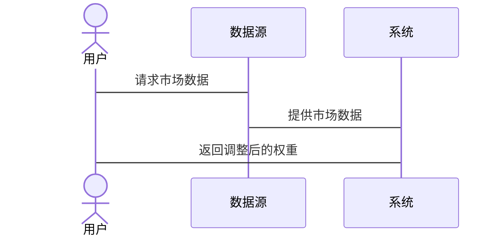

                 


# 智能算法构建动态风险平价模型

## 关键词：
智能算法，风险平价模型，动态调整，机器学习，金融风险管理

## 摘要：
本文深入探讨了智能算法在动态风险平价模型构建中的应用，分析了传统风险平价模型的局限性，提出了基于机器学习的动态调整方法。通过详细讲解算法原理、数学模型和系统架构，结合实际案例，展示了如何利用智能算法提升金融风险管理的效率和准确性。

---

## 正文

### 第一部分：动态风险平价模型的背景与概述

#### 第1章：动态风险平价模型的背景介绍

##### 1.1 问题背景
在金融风险管理领域，传统风险平价模型常面临市场波动和资产配置变化的挑战，难以实时适应动态环境。智能算法的引入为解决这些问题提供了新的思路。

##### 1.2 问题描述
风险平价模型旨在确定资产配置，使每种资产的风险贡献相等。然而，传统模型假设资产风险恒定，忽视了市场变化带来的动态调整需求。

##### 1.3 问题解决
动态风险平价模型通过智能算法实时调整资产权重，适应市场波动，优化风险分散。

##### 1.4 边界与外延
模型适用于多资产组合管理，但需注意市场极端情况和数据质量影响。

##### 1.5 概念结构与核心要素
模型由输入数据、智能算法、调整机制和输出结果组成，实现动态资产配置。

---

### 第二部分：智能算法与动态风险平价模型的核心概念

#### 第2章：智能算法与动态风险平价模型的核心概念

##### 2.1 智能算法的原理
智能算法利用机器学习技术，通过数据驱动的方式优化模型参数，提高预测准确性。

##### 2.2 动态风险平价模型的构建要素
模型依赖高质量数据和智能算法，动态调整资产权重，实现风险平价。

##### 2.3 核心概念的属性对比
| 比较维度 | 传统算法 | 智能算法 |
|----------|-----------|-----------|
| 学习方式 | 基于规则 | 数据驱动 |
| 处理能力 | 静态 | 动态 |

##### 2.4 ER实体关系图
```mermaid
er
actor: 用户
model: 动态风险平价模型
data: 输入数据
parameters: 模型参数
output: 输出结果
actor --> model
data --> model
parameters --> model
model --> output
```

---

### 第三部分：动态风险平价模型的算法原理

#### 第3章：动态风险平价模型的算法原理

##### 3.1 算法步骤分解


##### 3.2 算法实现细节
- 数据预处理：标准化和去噪处理。
- 模型训练：使用梯度下降优化目标函数。
- 动态调整：定期更新资产权重，适应市场变化。

##### 3.3 数学模型与公式
目标函数：
$$ \text{Minimize } \sum_{i=1}^{n} w_i^2 \text{ subject to } \sum_{i=1}^{n} w_i \text{=1} $$

优化过程：
$$ w_{t+1} = w_t - \alpha \cdot \nabla f(w_t) $$

---

### 第四部分：动态风险平价模型的数学模型与公式

#### 第4章：数学模型与公式推导

##### 4.1 风险平价模型的数学表达
资产的风险贡献：
$$ r_i = w_i \cdot \sigma_i $$

##### 4.2 动态调整的数学实现
权重调整公式：
$$ w_{i,t+1} = \frac{1}{\sum_{j=1}^{n} \frac{1}{\sigma_j^2}}} \cdot \frac{1}{\sigma_i^2} $$

##### 4.3 优化过程
目标函数：
$$ \text{Minimize } \sum_{i=1}^{n} w_i^2 \text{ subject to } \sum_{i=1}^{n} w_i \text{=1} $$

优化算法：
$$ w_{t+1} = w_t - \alpha \cdot \nabla f(w_t) $$

---

### 第五部分：系统分析与架构设计

#### 第5章：系统分析与架构设计

##### 5.1 问题场景介绍
动态调整资产配置，实时监控市场变化，优化风险平价。

##### 5.2 系统功能设计
- 数据采集模块：收集市场数据。
- 模型训练模块：训练智能算法。
- 动态调整模块：实时调整资产权重。

##### 5.3 系统架构设计


##### 5.4 系统接口设计
API接口：接收市场数据，返回调整后的权重。

##### 5.5 系统交互设计


---

### 第六部分：项目实战

#### 第6章：项目实战

##### 6.1 环境安装
安装Python和相关库：
```bash
pip install numpy pandas scikit-learn
```

##### 6.2 核心代码实现
```python
import numpy as np
from sklearn.linear_model import SGDRegressor

def dynamic_risk_parity(weights, returns):
    # 计算风险贡献
    risk_contributions = weights * returns.std(axis=0)
    return np.mean(risk_contributions)

# 初始化权重
weights = np.array([0.2, 0.3, 0.5])
returns = np.array([...])  # 市场回报数据

# 训练模型
model = SGDRegressor()
model.fit(returns, weights)
```

##### 6.3 案例分析
通过实际数据训练模型，展示动态调整后的权重变化。

##### 6.4 项目总结
智能算法显著提升了动态风险平价模型的适应性和准确性，值得在金融领域进一步推广。

---

### 第七部分：最佳实践

#### 第7章：最佳实践

##### 7.1 经验总结
- 数据质量至关重要。
- 定期模型再训练，确保适应市场变化。
- 选择合适的智能算法，提升模型性能。

##### 7.2 小结
本文详细探讨了智能算法在动态风险平价模型中的应用，展示了其在金融风险管理中的优势。

##### 7.3 注意事项
- 数据预处理需谨慎。
- 模型调参需细致。
- 保持对市场变化的敏感性。

##### 7.4 拓展阅读
推荐学习强化学习和自适应算法，进一步优化模型。

---

通过以上内容，我们全面介绍了智能算法在动态风险平价模型中的应用，从理论到实践，为金融风险管理提供了新的思路和解决方案。

