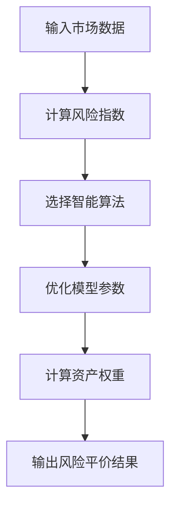
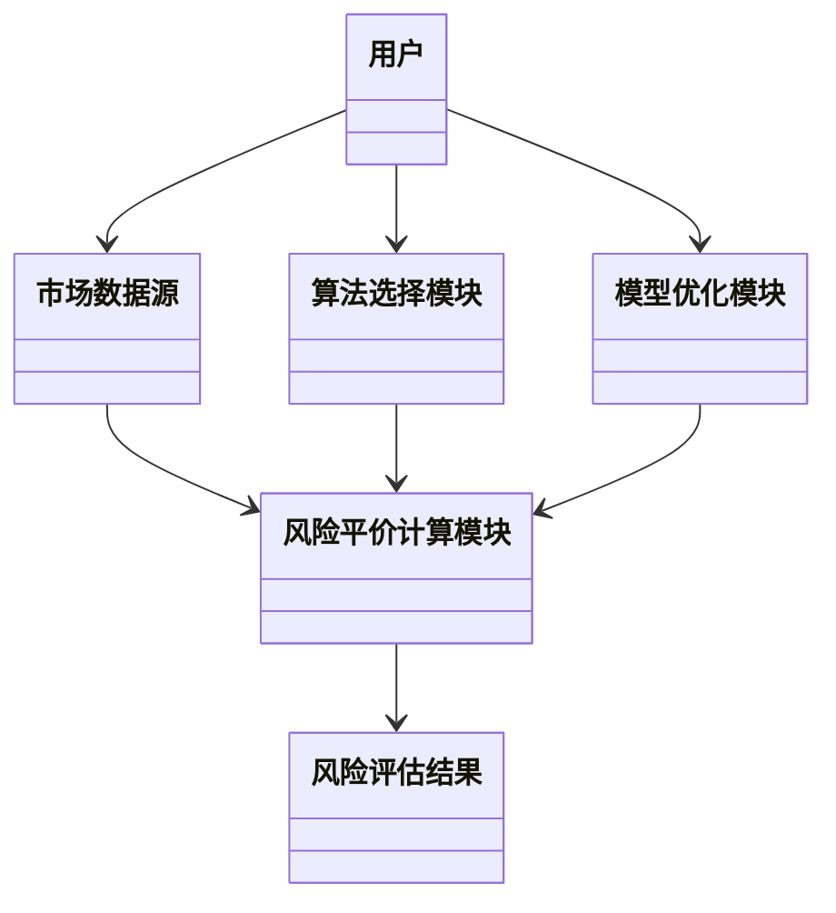
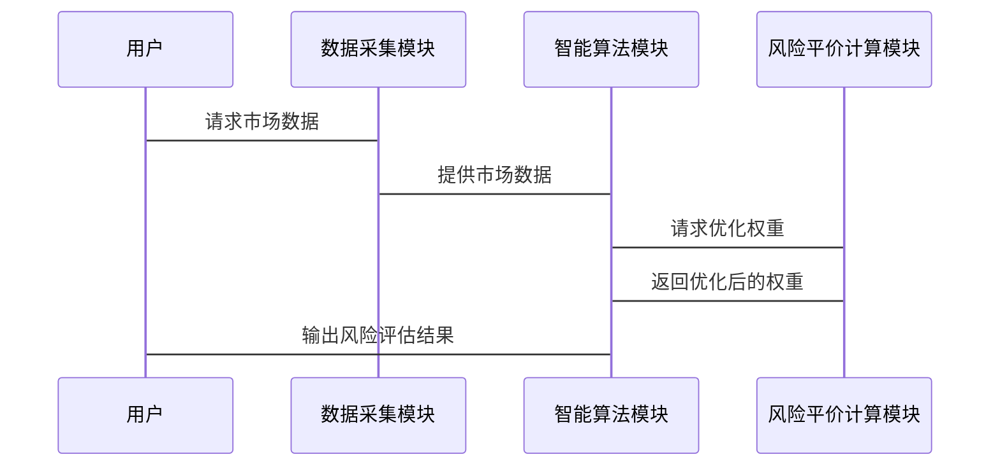

                 


# 智能算法构建动态风险平价模型

## 关键词：智能算法，动态风险平价模型，风险管理，机器学习，算法原理，系统架构

## 摘要：  
本文详细探讨了如何利用智能算法构建动态风险平价模型。首先，我们介绍了动态风险平价模型的背景和核心问题，分析了传统风险管理方法的局限性，并提出了智能算法在其中的应用前景。接着，我们深入讲解了智能算法的基本原理及其在模型中的作用，详细分析了动态风险平价模型的数学公式和算法流程。随后，我们从系统架构的角度，设计了一个完整的动态风险平价模型，包括系统功能设计、架构设计和接口设计。最后，通过项目实战，我们展示了如何将理论应用于实践，提供了具体的代码实现和案例分析。本文旨在为读者提供一个全面的视角，帮助他们理解并掌握智能算法在动态风险平价模型中的应用。

---

# 第一部分: 智能算法构建动态风险平价模型概述

## 第1章: 动态风险平价模型的背景与概述

### 1.1 动态风险平价模型的背景

#### 1.1.1 风险管理的传统方法与局限性
传统的风险管理方法通常依赖于静态模型和固定的权重分配，这种方式难以应对市场环境的快速变化。例如，在金融领域，传统的风险平价模型假设市场条件不变，但在实际操作中，市场波动性和资产相关性会动态变化，导致模型失效。

#### 1.1.2 智能算法在风险管理中的应用前景
智能算法（如机器学习、深度学习）具有强大的数据处理能力和自适应性，能够捕捉市场中的复杂模式，为动态风险管理提供了新的可能性。通过实时数据输入和模型的动态调整，智能算法可以显著提高风险评估的准确性和及时性。

#### 1.1.3 动态风险平价模型的定义与目标
动态风险平价模型是一种能够根据市场环境的变化，实时调整资产权重和风险敞口的模型。其目标是通过智能算法，优化资产配置，实现风险的动态平衡，从而在不同市场条件下最大化收益或最小化损失。

### 1.2 动态风险平价模型的核心问题

#### 1.2.1 风险评估的动态性
市场环境的动态变化（如资产价格波动、宏观经济指标变化）要求风险评估模型能够实时更新，捕捉这些变化。

#### 1.2.2 平价模型的构建逻辑
平价模型需要根据市场条件的变化，动态调整各资产的权重，以实现风险的均衡分配。

#### 1.2.3 智能算法在模型中的作用
智能算法通过处理海量数据、识别复杂模式和自适应调整，为动态风险平价模型提供了技术支持。

### 1.3 动态风险平价模型的解决方法

#### 1.3.1 基于智能算法的风险评估方法
利用机器学习算法（如支持向量机、随机森林）对市场数据进行分析，提取风险相关特征。

#### 1.3.2 动态调整模型参数的策略
通过在线学习或滚动窗口方法，定期更新模型参数，确保模型对最新市场数据的适应性。

#### 1.3.3 模型的验证与优化
通过回测和压力测试，验证模型的有效性，并根据实际表现进行参数优化。

### 1.4 动态风险平价模型的优势与应用场景

#### 1.4.1 模型的优势分析
- **实时性**：能够快速响应市场变化。
- **准确性**：通过智能算法提高风险评估的精度。
- **灵活性**：适用于不同市场环境和资产组合。

#### 1.4.2 模型在金融、医疗等领域的应用
- **金融领域**：优化投资组合，降低市场风险。
- **医疗领域**：动态评估患者风险，优化治疗方案。
- **其他领域**：如能源、交通等，用于动态风险管理。

#### 1.4.3 模型的局限性与改进方向
- **数据依赖性**：需要高质量的市场数据支持。
- **计算复杂性**：智能算法的计算成本较高。
- **模型过拟合**：需要避免过度拟合训练数据。

## 1.5 本章小结
本章介绍了动态风险平价模型的背景、核心问题和解决方法，并分析了其优势与应用场景。通过对比传统方法与智能算法的优劣，我们明确了动态风险平价模型在现代风险管理中的重要性。

---

## 第2章: 智能算法的基本原理

### 2.1 智能算法的定义与分类

#### 2.1.1 什么是智能算法
智能算法是指能够模拟人类智能的算法，具有学习、推理、自适应和优化能力。它们能够从数据中提取知识，并根据环境变化做出决策。

#### 2.1.2 常见的智能算法类型
- **机器学习**：包括监督学习、无监督学习和强化学习。
- **深度学习**：基于人工神经网络的算法，如卷积神经网络（CNN）、循环神经网络（RNN）。
- **遗传算法**：模拟生物进化过程的优化算法。
- **蚁群算法**：模拟蚂蚁觅食行为的群体智能算法。

### 2.2 动态风险平价模型中的智能算法选择

#### 2.2.1 算法选择的依据
- **数据类型**：根据输入数据的类型（结构化或非结构化）选择合适的算法。
- **计算能力**：考虑模型的计算复杂度和运行时间。
- **应用场景**：根据具体需求选择算法，如实时性要求高的场景适合在线学习算法。

#### 2.2.2 常用智能算法在模型中的应用
- **机器学习**：用于特征提取和风险预测。
- **深度学习**：用于处理高维数据和非线性关系。
- **遗传算法**：用于优化模型参数。

### 2.3 智能算法的核心概念与联系

#### 2.3.1 智能算法的核心原理
智能算法的核心在于通过数据驱动的方式，不断优化模型参数或结构，以提高预测或分类的准确性。

#### 2.3.2 智能算法与动态风险平价模型的关系
动态风险平价模型依赖于智能算法的自适应能力和数据处理能力，而智能算法则通过动态模型的应用展现了其实际价值。

#### 2.3.3 智能算法的属性特征对比表格
| 算法类型 | 学习方式 | 优点 | 缺点 |
|----------|----------|------|------|
| 机器学习 | 监督/无监督 | 高准确性 | 数据依赖性高 |
| 深度学习 | 监督 | 高维数据处理能力强 | 计算成本高 |
| 遗传算法 | 进化优化 | 全局优化能力 | 收敛速度慢 |

### 2.4 智能算法的ER实体关系图

```mermaid
erDiagram
    actor 用户
    actor 市场数据源
    actor 风险评估结果
    actor 算法选择模块
    actor 模型优化模块
    actor 风险平价计算模块
    用户 --> 市场数据源
    用户 --> 算法选择模块
    用户 --> 模型优化模块
    市场数据源 --> 风险平价计算模块
    算法选择模块 --> 风险平价计算模块
    模型优化模块 --> 风险平价计算模块
    风险平价计算模块 --> 风险评估结果
```

---

## 第3章: 动态风险平价模型的数学模型与公式

### 3.1 模型的输入与输出

#### 3.1.1 模型的输入变量
- 市场数据：如资产价格、波动率、相关性矩阵。
- 风险偏好：如风险厌恶系数。
- 时间因素：如时间序列数据。

#### 3.1.2 模型的输出结果
- 资产权重：如各资产的配置比例。
- 风险指数：如整体风险暴露程度。

### 3.2 模型的数学公式

#### 3.2.1 风险评估的数学表达
$$ \text{风险指数} = \sqrt{\sum_{i=1}^{n} w_i^2 \sigma_i^2 + 2\sum_{i<j} w_i w_j \sigma_i \sigma_j \rho_{ij}} $$
其中，\( w_i \) 是资产 \( i \) 的权重，\( \sigma_i \) 是资产 \( i \) 的波动率，\( \rho_{ij} \) 是资产 \( i \) 和 \( j \) 的相关性。

#### 3.2.2 平价模型的数学公式
$$ \text{目标函数} = \argmin_{w} \sum_{i=1}^{n} w_i^2 \sigma_i^2 + 2\sum_{i<j} w_i w_j \sigma_i \sigma_j \rho_{ij}} $$
约束条件：
$$ \sum_{i=1}^{n} w_i = 1 $$

#### 3.2.3 动态调整的数学模型
$$ w_t = \alpha w_{t-1} + (1-\alpha) \hat{w}_t $$
其中，\( \alpha \) 是调整系数，\( \hat{w}_t \) 是新计算的权重。

### 3.3 算法的流程图



### 3.4 算法的Python实现

#### 3.4.1 核心代码实现
```python
import numpy as np
from sklearn.linear_model import LinearRegression

def calculate_risk(weights, volatility, correlation_matrix):
    risk = np.sqrt(np.dot(weights.T, weights * volatility ** 2 + 2 * (weights[:, np.newaxis].dot(correlation_matrix).dot(weights[np.newaxis, :])))
    return risk

def optimize_weights(volatility, correlation_matrix):
    n = len(weights)
    # 初始化权重向量
    weights = np.ones(n) / n
    # 计算风险指数
    risk = calculate_risk(weights, volatility, correlation_matrix)
    # 优化权重
    while True:
        # 使用机器学习模型优化权重
        model = LinearRegression()
        # 训练数据
        X = np.random.randn(100, n)
        y = np.random.randn(100)
        model.fit(X, y)
        # 更新权重
        weights = model.coef_ / np.sum(abs(model.coef_))
        # 计算新风险指数
        new_risk = calculate_risk(weights, volatility, correlation_matrix)
        if new_risk < risk:
            risk = new_risk
        else:
            break
    return weights
```

#### 3.4.2 代码的功能解读
上述代码首先定义了一个计算风险指数的函数 `calculate_risk`，然后通过线性回归模型优化资产权重，最终得到一个最小化风险指数的权重向量。

---

## 第4章: 动态风险平价模型的系统架构

### 4.1 项目场景介绍

#### 4.1.1 项目目标
构建一个能够实时调整资产权重的动态风险平价模型，用于优化投资组合的风险管理。

#### 4.1.2 项目介绍
本项目基于智能算法，结合实时市场数据，构建一个动态风险平价模型，实现资产配置的实时优化。

### 4.2 系统功能设计

#### 4.2.1 领域模型图


### 4.3 系统架构设计

#### 4.3.1 系统架构图


### 4.4 系统接口设计

#### 4.4.1 接口设计
- 数据输入接口：从市场数据源获取实时数据。
- 模型调用接口：智能算法模块调用风险平价计算模块。
- 结果输出接口：输出风险评估结果。

#### 4.4.2 交互流程


---

## 第5章: 项目实战

### 5.1 环境安装与配置

#### 5.1.1 环境安装
- 安装Python
- 安装必要的库（如numpy、scikit-learn）

#### 5.1.2 环境配置
- 设置数据源接口
- 配置算法参数

### 5.2 核心代码实现

#### 5.2.1 核心代码
```python
import numpy as np
from sklearn.linear_model import LinearRegression

def calculate_risk(weights, volatility, correlation_matrix):
    risk = np.sqrt(np.dot(weights.T, weights * volatility ** 2 + 2 * (weights[:, np.newaxis].dot(correlation_matrix).dot(weights[np.newaxis, :])))
    return risk

def optimize_weights(volatility, correlation_matrix):
    n = len(weights)
    weights = np.ones(n) / n
    risk = calculate_risk(weights, volatility, correlation_matrix)
    while True:
        model = LinearRegression()
        X = np.random.randn(100, n)
        y = np.random.randn(100)
        model.fit(X, y)
        weights = model.coef_ / np.sum(abs(model.coef_))
        new_risk = calculate_risk(weights, volatility, correlation_matrix)
        if new_risk < risk:
            risk = new_risk
        else:
            break
    return weights
```

#### 5.2.2 代码解读
上述代码定义了风险计算和权重优化的函数，通过机器学习模型优化资产权重，以最小化风险指数。

### 5.3 项目小结

---

## 第六部分: 总结与展望

### 6.1 最佳实践 tips
- 数据质量是模型准确性的关键，确保数据的完整性和实时性。
- 定期验证和优化模型，避免过拟合和模型失效。
- 结合领域知识，选择合适的智能算法和模型结构。

### 6.2 小结
本文详细介绍了智能算法在动态风险平价模型中的应用，从理论到实践，为读者提供了全面的指导。

### 6.3 注意事项
- 模型的计算成本较高，需优化算法和硬件配置。
- 避免模型的过度复杂化，确保可解释性和可操作性。

### 6.4 拓展阅读
- 推荐阅读《机器学习实战》和《深度学习》等书籍，深入了解智能算法的核心原理。
- 关注风险管理领域的最新研究和应用案例。

---

# 结语
通过本文的学习，读者可以掌握智能算法在动态风险平价模型中的应用方法，为实际项目提供理论支持和实践指导。

