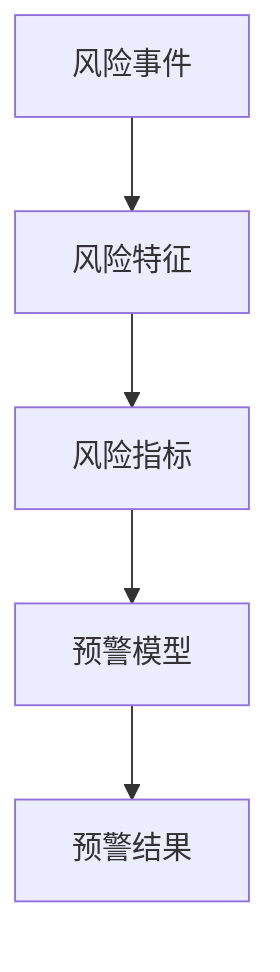
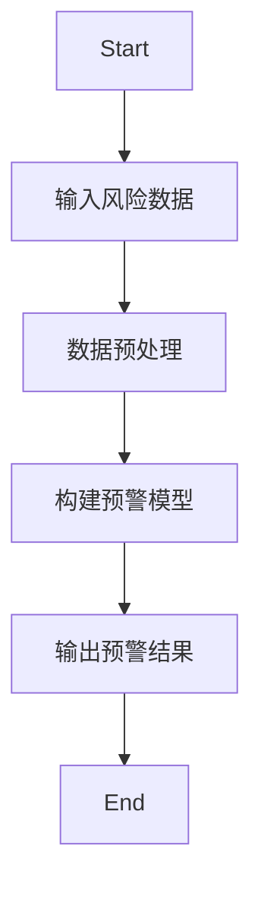
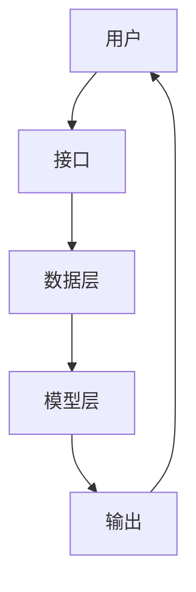
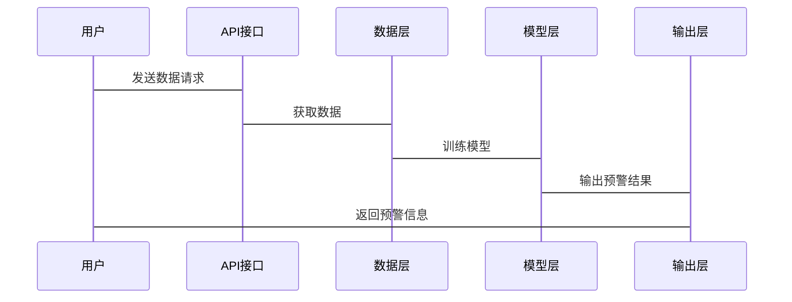

                 


# 智能算法构建动态风险预警系统

## 关键词：
- 智能算法, 动态风险预警, 机器学习, 风险分析, 数据挖掘

## 摘要：
智能算法在动态风险预警系统中的应用已成为现代风险管理的核心技术。本文详细探讨了如何利用智能算法构建动态风险预警系统，涵盖了从算法原理到系统架构设计的全过程。通过分析常见的智能算法（如时间序列分析、机器学习和深度学习算法），本文展示了如何选择合适的算法来构建实时、动态的风险预警模型。此外，文章还详细介绍了系统的架构设计、数学模型和公式，并通过实际案例展示了系统的实现与应用。最后，本文总结了智能算法在动态风险预警系统中的优势与挑战，并提出了进一步优化的方向。

---

# 第1章: 动态风险预警系统背景与目标

## 1.1 问题背景与挑战
### 1.1.1 风险预警的定义与重要性
风险预警是指通过监测和分析潜在风险因素，提前预测和警示可能发生的负面事件。在金融、医疗、交通等领域，及时的风险预警可以避免或减少损失，具有重要的现实意义。

### 1.1.2 动态风险的特性与复杂性
动态风险具有实时性、不确定性和复杂性的特点。随着环境的变化，风险因素会不断变化，传统的静态模型难以有效捕捉这些变化。

### 1.1.3 智能算法在风险预警中的作用
智能算法通过数据挖掘、机器学习和深度学习等技术，能够实时分析海量数据，发现潜在风险，从而为决策者提供及时的预警信息。

## 1.2 问题描述与目标
### 1.2.1 动态风险预警的核心问题
动态风险预警的核心问题是如何从实时数据中提取有效信息，准确预测风险事件的发生，并及时发出预警。

### 1.2.2 系统目标与功能需求
系统目标包括实时监测、风险预测、预警发布和可视化展示。功能需求则包括数据采集、特征提取、模型训练和结果输出。

### 1.2.3 边界与外延
动态风险预警系统的边界包括数据输入、模型训练和预警输出，外延则涉及数据源的多样性和模型的可扩展性。

## 1.3 核心概念与系统架构
### 1.3.1 智能算法的核心要素
智能算法的核心要素包括数据、特征、模型和评价指标。

### 1.3.2 动态风险预警系统的组成
动态风险预警系统由数据采集模块、特征提取模块、模型训练模块和预警发布模块组成。

### 1.3.3 系统架构的逻辑结构
系统架构采用分层设计，包括数据层、计算层和应用层。

## 1.4 本章小结
本章介绍了动态风险预警系统的背景和目标，分析了智能算法在其中的作用，并明确了系统的组成和架构。

---

# 第2章: 智能算法与动态风险预警系统的联系

## 2.1 智能算法的核心原理
### 2.1.1 时间序列分析的基本原理
时间序列分析通过分析数据的时序特性，预测未来的趋势和潜在风险。

### 2.1.2 机器学习算法的核心思想
机器学习算法通过训练数据，学习特征与风险之间的关系，实现风险预测。

### 2.1.3 深度学习算法的原理简介
深度学习算法通过多层神经网络，提取数据的深层特征，提高风险预测的准确性。

## 2.2 动态风险预警系统的实体关系
### 2.2.1 实体关系图


## 2.3 算法与系统的交互流程
### 2.3.1 算法实现流程


## 2.4 本章小结
本章详细讲解了智能算法的核心原理，并通过实体关系图和交互流程图展示了算法与动态风险预警系统的联系。

---

# 第3章: 智能算法原理与实现

## 3.1 算法原理概述
### 3.1.1 时间序列分析的基本原理
时间序列分析通过分析数据的自相关性和偏自相关性，预测未来的趋势。

### 3.1.2 机器学习算法的核心思想
机器学习算法通过训练数据，学习特征与风险之间的关系，实现风险预测。

### 3.1.3 深度学习算法的原理简介
深度学习算法通过多层神经网络，提取数据的深层特征，提高风险预测的准确性。

## 3.2 常见算法实现
### 3.2.1 ARIMA模型的实现
ARIMA模型的实现步骤包括数据预处理、模型参数估计和模型验证。

### 3.2.2 XGBoost算法的实现
XGBoost算法通过集成多个弱分类器，提高模型的预测能力。

### 3.2.3 LSTM网络的实现
LSTM网络通过长短期记忆单元，捕捉数据的时序特性，提高预测精度。

## 3.3 算法实现的数学模型
### 3.3.1 ARIMA模型公式
$$ ARIMA(p, d, q) = y_t = \phi_1 y_{t-1} + \dots + \phi_p y_{t-p} + \theta_1 \epsilon_{t-1} + \dots + \theta_q \epsilon_{t-q} + \epsilon_t $$

### 3.3.2 LSTM网络结构
LSTM网络由输入门、遗忘门和输出门组成，公式如下：
$$
i_t = \sigma(W_i x_t + U_i h_{t-1})
$$
$$
f_t = \sigma(W_f x_t + U_f h_{t-1})
$$
$$
o_t = \sigma(W_o x_t + U_o h_{t-1})
$$
$$
h_t = i_t \cdot \tanh(W_c x_t + U_c h_{t-1})
$$

## 3.4 本章小结
本章详细讲解了常见智能算法的原理与实现，并通过数学公式和流程图展示了算法的具体实现步骤。

---

# 第4章: 数学模型与公式

## 4.1 时间序列分析的数学模型
### 4.1.1 ARIMA模型的数学公式
$$ ARIMA(p, d, q) = y_t = \phi_1 y_{t-1} + \dots + \phi_p y_{t-p} + \theta_1 \epsilon_{t-1} + \dots + \theta_q \epsilon_{t-q} + \epsilon_t $$

## 4.2 机器学习算法的数学模型
### 4.2.1 XGBoost算法的数学公式
XGBoost通过正则化损失函数和优化目标函数，实现模型的训练。

### 4.2.2 LSTM网络的数学公式
LSTM网络通过输入门、遗忘门和输出门，实现数据的长时记忆。

## 4.3 本章小结
本章通过数学公式详细讲解了智能算法的数学模型，为系统的实现提供了理论基础。

---

# 第5章: 系统分析与架构设计

## 5.1 项目背景与目标
### 5.1.1 项目背景
本项目旨在构建一个动态风险预警系统，利用智能算法实时监测和预测风险。

### 5.1.2 项目目标
项目的最终目标是实现一个高效、准确的动态风险预警系统。

## 5.2 系统功能设计
### 5.2.1 领域模型设计


### 5.2.2 系统架构设计


### 5.2.3 系统交互设计


## 5.3 本章小结
本章详细介绍了系统的架构设计和交互流程，为系统的实现提供了清晰的指导。

---

# 第6章: 项目实战

## 6.1 环境安装与配置
### 6.1.1 安装Python
安装Python 3.8或更高版本，安装命令：`python --version`

### 6.1.2 安装依赖库
安装依赖库，包括numpy、pandas、xgboost、keras、tensorflow等。

## 6.2 系统核心实现
### 6.2.1 数据预处理
```python
import pandas as pd
data = pd.read_csv('risk_data.csv')
data['date'] = pd.to_datetime(data['date'])
data.set_index('date', inplace=True)
```

### 6.2.2 模型训练
```python
from sklearn.model_selection import train_test_split
from xgboost import XGBRegressor
X_train, X_test, y_train, y_test = train_test_split(data.drop('target', axis=1), data['target'])
model = XGBRegressor()
model.fit(X_train, y_train)
```

### 6.2.3 预警结果输出
```python
import numpy as np
y_pred = model.predict(X_test)
threshold = np.percentile(y_pred, 95)
warnings = (y_pred > threshold).astype(int)
```

## 6.3 代码应用解读
### 6.3.1 代码功能分析
代码实现数据预处理、模型训练和预警结果输出，展示了动态风险预警系统的具体实现步骤。

### 6.3.2 代码优化建议
建议在实际应用中加入实时数据流处理和模型更新机制，以提高系统的实时性和准确性。

## 6.4 实际案例分析
### 6.4.1 案例背景
以金融市场的风险预警为例，分析系统的实际应用场景。

### 6.4.2 数据分析
通过数据分析，识别潜在的风险因素，并训练模型进行预测。

### 6.4.3 案例总结
总结案例分析结果，提出改进建议。

## 6.5 本章小结
本章通过实际案例展示了系统的实现过程，并提出了优化建议。

---

# 第7章: 总结与扩展

## 7.1 系统优势
### 7.1.1 实时性
系统能够实时监测和预测风险，提供及时的预警信息。

### 7.1.2 准确性
通过智能算法的优化，系统能够提高风险预测的准确性。

## 7.2 系统局限性
### 7.2.1 数据依赖性
系统的性能依赖于数据的质量和数量。

### 7.2.2 计算资源消耗
复杂的算法需要大量的计算资源支持。

## 7.3 改进建议
### 7.3.1 数据优化
建议引入更多的数据源，提高系统的数据丰富性。

### 7.3.2 模型优化
建议采用更先进的算法，如深度学习模型，进一步提高系统的预测能力。

## 7.4 拓展阅读
推荐一些相关的书籍和论文，供读者进一步学习和研究。

## 7.5 本章小结
本章总结了系统的优缺点，并提出了改进建议，为读者进一步优化系统提供了方向。

---

# 附录: 参考文献

[此处列出参考文献，如书籍、论文、技术文档等。]

---

# 结束语

感谢您的阅读！希望这篇文章能够为您提供有价值的信息和启发。如需进一步探讨或交流，请随时联系我。

