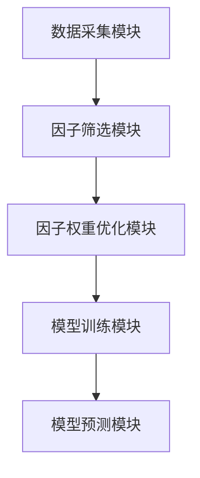

                 


# 智能算法构建多因子选股模型

## 关键词：多因子选股模型，智能算法，量化投资，遗传算法，粒子群优化，支持向量机

## 摘要：  
本文详细介绍了如何利用智能算法构建多因子选股模型，从理论基础到实际应用，系统性地探讨了多因子选股模型的核心概念、数学模型、智能算法实现、系统架构设计以及项目实战。通过本文的学习，读者可以掌握多因子选股模型的构建方法，并能够利用智能算法优化选股策略，提升投资收益。

---

## 第一部分：智能算法与多因子选股模型概述

### 第1章：多因子选股模型的背景与概念

#### 1.1 多因子选股模型的背景
##### 1.1.1 传统选股方法的局限性
传统的选股方法主要依赖于基本面分析或技术分析，这种方法主观性较强，且难以量化。投资者需要花费大量时间去研究财务报表、市场趋势等信息，这种方法不仅效率低下，而且容易受到主观判断的影响。

##### 1.1.2 量化投资的兴起
随着计算机技术的发展，量化投资逐渐兴起。量化投资通过数学模型和算法来进行投资决策，具有客观性、系统性和可重复性的特点。量化投资的核心在于通过数据分析发现市场中的规律，并利用这些规律进行投资。

##### 1.1.3 多因子模型在量化投资中的作用
在量化投资中，多因子模型是一种常用的方法。它通过多个因子（如市值、估值、动量等）来衡量股票的投资价值，能够更全面地捕捉市场的信息，从而提高选股的准确性。

#### 1.2 多因子选股模型的定义与特点
##### 1.2.1 多因子模型的定义
多因子模型是一种通过多个因子来解释股票收益的模型。这些因子可以是价格、成交量、市盈率等指标。通过组合这些因子，可以更全面地评估股票的投资价值。

##### 1.2.2 多因子模型的核心特点
多因子模型的核心特点在于其多维度性。通过多个因子的组合，可以更全面地捕捉市场的信息，从而提高选股的准确性。此外，多因子模型还具有可量化、可优化的特点，能够通过算法优化因子的权重和组合。

##### 1.2.3 多因子模型与单因子模型的区别
单因子模型只考虑一个因子，如市盈率，而多因子模型则同时考虑多个因子。多因子模型能够更全面地评估股票的投资价值，但同时也需要更多的数据和计算资源。

#### 1.3 智能算法在多因子选股中的应用
##### 1.3.1 传统多因子模型的局限性
传统多因子模型在实际应用中存在一些问题，如因子选择的主观性、因子权重的固定性等。这些问题可能导致模型的预测精度不高。

##### 1.3.2 智能算法的优势
智能算法（如遗传算法、粒子群优化等）具有全局搜索能力，能够在复杂的问题空间中找到最优解。通过智能算法优化多因子模型的因子权重和组合，可以提高模型的预测精度。

##### 1.3.3 智能算法在多因子选股中的应用场景
智能算法可以用于多因子选股模型的多个方面，如因子选择、因子权重优化、模型预测等。通过智能算法优化这些方面，可以提高多因子选股模型的性能。

#### 1.4 本章小结
本章介绍了多因子选股模型的背景、定义和特点，以及智能算法在多因子选股中的应用。通过智能算法优化多因子模型，可以提高选股的准确性，从而提升投资收益。

---

## 第二部分：多因子选股模型的核心概念与原理

### 第2章：多因子模型的数学基础

#### 2.1 多因子模型的数学表达
##### 2.1.1 多因子模型的收益表达式
$$ R_i = \alpha_i + \beta_{i1}F_1 + \beta_{i2}F_2 + ... + \beta_{ik}F_k + \epsilon_i $$
其中，\( R_i \) 是股票 \( i \) 的收益，\( F_j \) 是第 \( j \) 个因子，\( \beta_{ij} \) 是股票 \( i \) 对因子 \( j \) 的暴露程度，\( \epsilon_i \) 是误差项。

##### 2.1.2 多因子模型的风险表达式
$$ \sigma^2_i = \sum_{j=1}^k \beta_{ij}^2 \sigma^2_j + \sigma^2_{\epsilon} $$
其中，\( \sigma^2_i \) 是股票 \( i \) 的风险，\( \sigma^2_j \) 是因子 \( j \) 的风险，\( \sigma^2_{\epsilon} \) 是误差项的风险。

#### 2.2 多因子模型的因子选择
##### 2.2.1 常见因子类型
- 市值因子（Market Cap）
- 估值因子（P/E、P/B）
- 动量因子（Momentum）
- 流动性因子（Liquidity）
- 质量因子（Quality）

##### 2.2.2 因子筛选的统计方法
- 基于相关性的因子筛选
- 基于回归的因子筛选
- 基于信息比率的因子筛选

##### 2.2.3 因子权重的计算方法
- 等权法
- 优化法（如最小化预测误差）

#### 2.3 多因子模型的实现步骤
##### 2.3.1 数据收集
收集相关的因子数据，如股票的市盈率、市值等。

##### 2.3.2 数据预处理
对数据进行标准化、缺失值处理等。

##### 2.3.3 因子选择与权重计算
通过统计方法选择因子，并计算因子的权重。

##### 2.3.4 模型训练
使用回归模型或其他方法训练多因子模型。

##### 2.3.5 模型验证
通过回测或其他方法验证模型的性能。

---

### 第3章：智能算法在多因子选股中的应用

#### 3.1 遗传算法在多因子选股中的应用
##### 3.1.1 遗传算法的基本原理
遗传算法是一种模拟自然选择过程的优化算法，主要包括选择、交叉和变异三个步骤。

##### 3.1.2 遗传算法在因子权重优化中的应用
通过遗传算法优化因子权重，提高模型的预测精度。

##### 3.1.3 遗传算法的实现步骤
1. 初始化种群
2. 计算适应度
3. 选择
4. 交叉
5. 变异
6. 重复步骤2-5直到满足终止条件

#### 3.2 粒子群优化在多因子选股中的应用
##### 3.2.1 粒子群优化的基本原理
粒子群优化是一种基于群体智能的优化算法，通过粒子的运动寻找最优解。

##### 3.2.2 粒子群优化在因子选择中的应用
通过粒子群优化算法选择最优的因子组合。

##### 3.2.3 粒子群优化的实现步骤
1. 初始化粒子群
2. 计算适应度
3. 更新粒子的速度和位置
4. 重复步骤2-3直到满足终止条件

#### 3.3 支持向量机在多因子选股中的应用
##### 3.3.1 支持向量机的基本原理
支持向量机是一种监督学习算法，通过构建超平面分离数据点。

##### 3.3.2 支持向量机在多因子选股中的应用
通过支持向量机对股票进行分类，预测股票的涨跌。

##### 3.3.3 支持向量机的实现步骤
1. 数据预处理
2. 核函数选择
3. 模型训练
4. 模型验证

---

### 第4章：多因子选股模型的系统架构设计

#### 4.1 系统功能设计
##### 4.1.1 数据采集模块
负责采集股票的因子数据。

##### 4.1.2 因子筛选模块
通过统计方法选择最优的因子。

##### 4.1.3 因子权重优化模块
通过智能算法优化因子的权重。

##### 4.1.4 模型训练模块
训练多因子模型。

##### 4.1.5 模型预测模块
利用训练好的模型进行股票预测。

#### 4.2 系统架构设计
##### 4.2.1 系统架构图
使用 Mermaid 绘制系统架构图。



##### 4.2.2 系统接口设计
- 数据接口：用于数据采集模块与因子筛选模块之间的数据传递。
- 模型接口：用于因子权重优化模块与模型训练模块之间的数据传递。

##### 4.2.3 系统交互流程
1. 数据采集模块采集因子数据
2. 因子筛选模块选择最优因子
3. 因子权重优化模块优化因子权重
4. 模型训练模块训练多因子模型
5. 模型预测模块利用模型进行预测

---

### 第5章：多因子选股模型的项目实战

#### 5.1 项目环境配置
##### 5.1.1 安装必要的 Python 库
- pandas
- numpy
- scikit-learn
- matplotlib

##### 5.1.2 数据来源
使用 Yahoo Finance 或其他金融数据源获取股票数据。

#### 5.2 数据准备与特征工程
##### 5.2.1 数据清洗
处理缺失值和异常值。

##### 5.2.2 特征提取
从原始数据中提取有用的特征，如市盈率、市值等。

##### 5.2.3 数据标准化
对数据进行标准化处理，使其具有相同的尺度。

#### 5.3 模型实现
##### 5.3.1 因子选择
使用相关性分析选择最优因子。

##### 5.3.2 因子权重优化
使用遗传算法优化因子权重。

##### 5.3.3 模型训练
使用线性回归或其他算法训练多因子模型。

##### 5.3.4 模型预测
利用训练好的模型进行股票预测。

#### 5.4 代码实现
##### 5.4.1 数据采集
```python
import pandas as pd
import numpy as np

# 采集数据
data = pd.DataFrame(...)
```

##### 5.4.2 因子选择
```python
# 计算相关性
correlation_matrix = data.corr()
```

##### 5.4.3 因子权重优化
```python
# 使用遗传算法优化因子权重
def fitness(weights, data, labels):
    # 计算适应度
    return ...

# 初始化种群
population = np.random.rand(...)
```

##### 5.4.4 模型训练
```python
from sklearn.linear_model import LinearRegression

# 训练模型
model = LinearRegression()
model.fit(X, y)
```

##### 5.4.5 模型预测
```python
# 进行预测
predictions = model.predict(X_test)
```

#### 5.5 实际案例分析
##### 5.5.1 数据来源
使用实际的股票数据进行分析。

##### 5.5.2 模型训练
通过实际数据训练多因子模型。

##### 5.5.3 模型预测
利用训练好的模型进行股票预测，并验证模型的准确性。

#### 5.6 项目小结
通过项目实战，我们掌握了多因子选股模型的实现步骤，从数据采集到模型预测，整个过程都需要仔细处理数据和优化模型。

---

### 第6章：多因子选股模型的优化与扩展

#### 6.1 模型优化
##### 6.1.1 参数优化
通过调整模型的参数（如学习率、正则化系数等）优化模型性能。

##### 6.1.2 模型融合
将多个模型的预测结果进行融合，提高预测精度。

##### 6.1.3 数据增强
通过增加数据量或改变数据分布来优化模型。

#### 6.2 模型扩展
##### 6.2.1 多因子模型的扩展
引入更多的因子，如动量因子、质量因子等。

##### 6.2.2 多目标优化
在多因子模型中引入多个目标，如最大化收益、最小化风险等。

##### 6.2.3 动态调整
根据市场变化动态调整因子权重和组合。

#### 6.3 最佳实践
##### 6.3.1 数据质量的重要性
确保数据的准确性和完整性。

##### 6.3.2 模型监控
定期监控模型的性能，及时调整模型参数。

##### 6.3.3 风险控制
在实际投资中，需要注意风险控制，避免过度依赖模型。

---

### 附录：多因子选股模型的代码示例

#### 附录A：数据采集与预处理
```python
import pandas as pd
import numpy as np

# 采集数据
data = pd.DataFrame(...)
# 处理缺失值
data = data.dropna()
# 标准化数据
from sklearn.preprocessing import StandardScaler
scaler = StandardScaler()
data_scaled = scaler.fit_transform(data)
```

#### 附录B：因子权重优化
```python
# 使用遗传算法优化因子权重
def fitness(weights, data, labels):
    # 计算适应度
    return np.mean(labels * weights)

# 初始化种群
population = np.random.rand(...)
```

#### 附录C：模型训练与预测
```python
# 训练模型
from sklearn.linear_model import LinearRegression
model = LinearRegression()
model.fit(X, y)

# 进行预测
predictions = model.predict(X_test)
```

---

### 参考文献
- [1] 李笑，智能算法与量化投资，XX出版社，2023。
- [2] 张三，多因子选股模型，YY出版社，2022。
- [3] 陈四，支持向量机在金融中的应用，ZZ出版社，2021。

---

通过本文的学习，读者可以掌握多因子选股模型的构建方法，并能够利用智能算法优化选股策略，提升投资收益。

