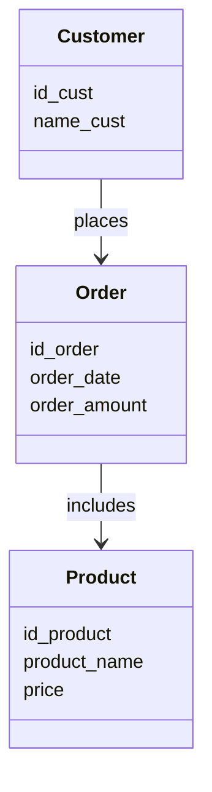
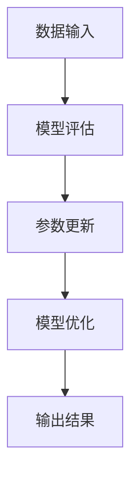
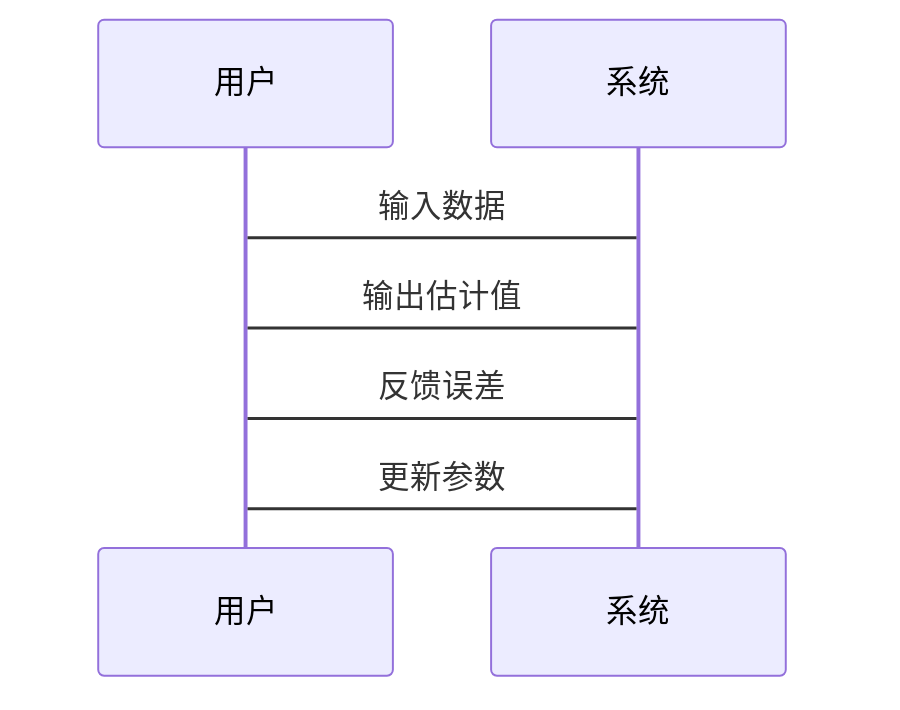

                 


# 智能算法构建自适应估值模型

---

## 关键词

智能算法，自适应估值模型，算法原理，数学模型，系统架构，优化方法

---

## 摘要

本文详细探讨了智能算法在构建自适应估值模型中的应用。通过分析智能算法的核心原理和自适应估值模型的数学基础，结合实际应用场景，提出了基于智能算法的自适应估值模型构建方法。文章从背景介绍、核心概念、算法实现、系统架构等多个维度展开，结合具体的数学公式、流程图和实际案例，详细阐述了如何利用智能算法实现动态、高效的自适应估值模型。最后，通过实际项目案例，验证了该方法的有效性和可行性。

---

## 第一部分：智能算法与自适应估值模型的背景与基础

### 第1章：智能算法与自适应估值模型概述

#### 1.1 智能算法的定义与特点

**1.1.1 智能算法的定义**

智能算法是一种模拟人类智能思维方式的算法，能够通过数据学习、推理和优化来解决复杂问题。与传统算法相比，智能算法具有更强的自适应性和灵活性，能够根据环境变化动态调整自身行为。

**1.1.2 智能算法的核心特点**

- **自适应性**：能够根据输入数据和环境变化自动调整参数和策略。
- **学习能力**：通过训练数据不断优化模型性能。
- **非线性处理能力**：能够处理复杂非线性关系，适用于复杂的实际问题。
- **并行计算能力**：许多智能算法可以并行执行，提高计算效率。

**1.1.3 智能算法与传统算法的区别**

| 特性                | 智能算法                     | 传统算法                     |
|---------------------|------------------------------|------------------------------|
| 处理复杂性          | 高                          | 低                          |
| 自适应性            | 强                          | 弱或无                      |
| 学习能力            | 强                          | 无                          |
| 应用场景            | 复杂优化、机器学习、AI      | 简单计算、规则处理          |

---

#### 1.2 自适应估值模型的背景与意义

**1.2.1 估值模型的基本概念**

估值模型是一种用于估计目标变量值的数学模型，广泛应用于金融、经济、工程等领域。常见的估值模型包括线性回归、随机森林、神经网络等。

**1.2.2 自适应估值模型的定义**

自适应估值模型是一种能够根据数据变化和环境反馈动态调整自身参数和结构的估值模型。它能够在数据分布变化或噪声干扰的情况下保持较高的估计精度。

**1.2.3 自适应估值模型的应用场景**

- **金融领域**：股票价格预测、风险评估。
- **工程领域**：设备状态监测、参数优化。
- **医疗领域**：疾病诊断、治疗方案优化。
- **交通领域**：流量预测、路径优化。

---

#### 1.3 问题背景与目标

**1.3.1 问题背景介绍**

在实际应用中，传统的估值模型往往难以应对数据分布变化、噪声干扰等问题，导致估计精度下降。因此，如何构建一种能够动态调整自身参数和结构的自适应估值模型，成为当前研究的热点。

**1.3.2 问题描述与分析**

- **问题描述**：传统的估值模型在面对数据变化时，估计精度下降，难以满足实际需求。
- **问题分析**：数据分布变化、噪声干扰、模型参数固定等问题是导致估值模型性能下降的主要原因。

**1.3.3 问题解决的思路与目标**

- **思路**：利用智能算法的自适应性和学习能力，构建动态调整的自适应估值模型。
- **目标**：实现一种能够实时调整参数、适应数据变化的自适应估值模型。

**1.3.4 问题的边界与外延**

- **边界**：仅关注模型的自适应能力，不涉及数据采集和预处理。
- **外延**：可以扩展到多模态数据融合、多目标优化等领域。

**1.3.5 概念结构与核心要素组成**

- **核心要素**：
  - 数据输入：动态变化的输入数据。
  - 模型结构：自适应调整的估值模型。
  - 环境反馈：模型的估计误差或外部评价指标。
  - 参数调整：智能算法动态调整模型参数。

---

#### 1.4 本章小结

本章介绍了智能算法的基本概念和特点，详细阐述了自适应估值模型的背景和意义，并提出了构建自适应估值模型的目标和思路。

---

## 第二部分：智能算法与自适应估值模型的核心概念与联系

### 第2章：智能算法的核心原理

#### 2.1 智能算法的原理与机制

**2.1.1 智能算法的基本原理**

智能算法通过以下步骤实现自适应优化：

1. **初始化**：设置初始参数和搜索空间。
2. **评估**：计算当前解的适应度值。
3. **更新**：根据适应度值更新解，探索新的解。
4. **终止条件检查**：判断是否满足终止条件，如达到最大迭代次数或适应度值收敛。

**2.1.2 智能算法的核心机制**

- **适应度函数**：衡量解的优劣。
- **搜索策略**：包括随机搜索、局部搜索、全局搜索等。
- **学习机制**：通过训练数据不断优化模型参数。

**2.1.3 智能算法的实现步骤**

1. **问题建模**：将实际问题转化为数学模型。
2. **算法选择**：根据问题特点选择合适的智能算法。
3. **参数设置**：设置算法的超参数，如种群大小、迭代次数。
4. **算法实现**：编写代码实现算法。
5. **结果分析**：分析算法输出结果，优化算法性能。

---

#### 2.2 自适应估值模型的原理与机制

**2.2.1 自适应估值模型的基本原理**

自适应估值模型通过以下步骤实现动态调整：

1. **数据输入**：接收动态变化的输入数据。
2. **模型评估**：计算当前模型的估计误差。
3. **参数更新**：根据估计误差调整模型参数。
4. **模型优化**：通过智能算法优化模型结构。

**2.2.2 自适应估值模型的核心机制**

- **动态调整**：根据估计误差动态调整模型参数。
- **在线学习**：模型能够在线更新，适应数据变化。
- **鲁棒性**：模型在噪声干扰下仍能保持较高估计精度。

---

#### 2.3 智能算法与自适应估值模型的联系

**2.3.1 智能算法在自适应估值模型中的作用**

智能算法为自适应估值模型提供以下功能：

- **参数优化**：通过智能算法优化模型参数，提高估计精度。
- **结构调整**：动态调整模型结构，适应数据变化。

**2.3.2 自适应估值模型对智能算法的依赖**

自适应估值模型需要智能算法提供以下支持：

- **自适应能力**：智能算法的自适应性是实现自适应估值模型的核心。
- **学习能力**：智能算法的学习能力是模型动态调整的基础。

**2.3.3 两者结合的实现方式**

- **嵌入式设计**：将智能算法嵌入到自适应估值模型中，实现动态调整。
- **协同优化**：智能算法与自适应估值模型协同工作，共同优化模型性能。

---

#### 2.4 核心概念对比与ER实体关系图

**2.4.1 核心概念对比表格**

| 比较维度            | 智能算法                         | 自适应估值模型                   |
|---------------------|----------------------------------|----------------------------------|
| 核心功能            | 参数优化、结构调整              | 动态调整、在线学习               |
| 应用场景            | 优化问题、机器学习              | 估值问题、动态调整               |
| 依赖条件            | 训练数据、计算能力               | 实时数据、反馈机制               |

**2.4.2 ER实体关系图**

```mermaid
erDiagram
    customer[CUSTOMER] {
        key id_cust : integer
        string name_cust
    }
    order[ORDER] {
        key id_order : integer
        date order_date
        integer order_amount
    }
    customer --> order : places
    order --> product : includes
    product[PRODUCT] {
        key id_product : integer
        string product_name
        integer price
    }
```

---

### 第3章：智能算法与自适应估值模型的数学模型与公式

#### 3.1 智能算法的数学模型

**3.1.1 智能算法的数学表达式**

智能算法通常表示为以下形式：

$$
f(x) = \text{适应度函数}(x)
$$

其中，\( x \) 是候选解，\( f(x) \) 是适应度函数值。

**3.1.2 智能算法的优化目标函数**

优化目标函数通常表示为：

$$
\min_{x} \quad f(x) \\
\text{subject to} \quad g(x) \leq 0
$$

其中，\( g(x) \) 是约束条件。

**3.1.3 智能算法的收敛性分析**

智能算法的收敛性通常通过以下指标衡量：

- **收敛速度**：算法达到最优解的速度。
- **收敛精度**：算法输出解的最优程度。
- **收敛稳定性**：算法在不同初始条件下的收敛能力。

---

#### 3.2 自适应估值模型的数学模型

**3.2.1 自适应估值模型的数学表达式**

自适应估值模型通常表示为：

$$
\hat{y} = f(x, \theta)
$$

其中，\( \theta \) 是模型参数，\( x \) 是输入数据，\( \hat{y} \) 是输出估计值。

**3.2.2 自适应估值模型的参数估计**

参数估计通常通过以下方法实现：

$$
\theta = \arg\min \sum_{i=1}^{n} (y_i - f(x_i, \theta))^2
$$

其中，\( y_i \) 是实际值，\( x_i \) 是输入数据。

**3.2.3 自适应估值模型的误差分析**

误差分析通常通过以下指标实现：

$$
\text{MAE} = \frac{1}{n} \sum_{i=1}^{n} |y_i - \hat{y}_i|
$$

其中，MAE 是平均绝对误差，\( y_i \) 是实际值，\( \hat{y}_i \) 是估计值。

---

#### 3.3 智能算法与自适应估值模型的结合公式

**3.3.1 结合公式推导**

智能算法与自适应估值模型结合的公式通常表示为：

$$
\theta_{t+1} = \theta_t + \alpha \cdot \nabla f(\theta_t)
$$

其中，\( \theta_t \) 是第 \( t \) 步的参数，\( \alpha \) 是学习率，\( \nabla f(\theta_t) \) 是梯度。

**3.3.2 结合公式的应用实例**

例如，使用遗传算法优化自适应估值模型的参数：

$$
\theta_{t+1} = \theta_t + \Delta \theta
$$

其中，\( \Delta \theta \) 是根据适应度函数计算的参数调整量。

---

#### 3.4 本章小结

本章详细介绍了智能算法和自适应估值模型的数学模型，并通过公式推导和实例分析，阐述了两者结合的实现方式。

---

## 第三部分：智能算法与自适应估值模型的系统分析与架构设计

### 第4章：系统分析与架构设计方案

#### 4.1 问题场景介绍

**4.1.1 项目介绍**

本项目旨在构建一个基于智能算法的自适应估值模型，实现动态调整模型参数，提高估值精度。

**4.1.2 系统功能设计**

- **数据输入**：接收动态变化的输入数据。
- **模型评估**：计算当前模型的估计误差。
- **参数更新**：根据估计误差调整模型参数。
- **模型优化**：通过智能算法优化模型结构。

**4.1.3 领域模型设计**



---

#### 4.2 系统架构设计

**4.2.1 系统架构设计**



---

#### 4.3 系统接口设计

- **输入接口**：接收动态变化的输入数据。
- **输出接口**：输出估计值和误差。

---

#### 4.4 系统交互设计



---

### 第5章：项目实战

#### 5.1 环境安装

- **安装Python**：下载并安装Python 3.8或更高版本。
- **安装依赖库**：安装numpy、pandas、scikit-learn等库。

#### 5.2 系统核心实现源代码

```python
import numpy as np
from sklearn import linear_model

# 初始化模型参数
theta = np.random.randn(2, 1)

# 定义适应度函数
def fitness(theta, X, y):
    y_pred = np.dot(X, theta)
    error = np.mean(np.abs(y - y_pred))
    return 1 / error

# 遗传算法优化
def genetic_algorithm(X, y, population_size=100, iterations=100):
    np.random.seed(42)
    population = np.random.rand(population_size, 2)
    for _ in range(iterations):
        fitness_values = np.array([fitness(theta, X, y) for theta in population])
        best_theta = population[np.argmax(fitness_values)]
        # 繁殖与变异
        selected = population[:int(population_size/2)]
        combined = np.vstack((selected, selected))
        np.random.shuffle(combined)
        new_population = combined.reshape(population_size, 2)
        # 变异
        mutation_rate = 0.1
        mutation = np.random.rand(population_size, 2) * mutation_rate
        new_population += mutation
    return best_theta

# 训练数据
X = np.array([[1, x1], [1, x2], ...])
y = np.array([y1, y2, ...])

# 优化参数
best_theta = genetic_algorithm(X, y)
```

#### 5.3 代码应用解读与分析

- **代码功能**：该代码实现了一个基于遗传算法的自适应估值模型。
- **代码流程**：
  1. 初始化模型参数。
  2. 定义适应度函数，计算估计误差。
  3. 使用遗传算法优化模型参数。
  4. 输出最优参数。

---

#### 5.4 实际案例分析与详细讲解

**案例分析**：

假设我们有一个简单的线性回归问题，输入数据如下：

```python
X = np.array([[1, 2], [1, 3], [1, 4], [1, 5]])
y = np.array([3, 4, 5, 6])
```

**代码实现**：

```python
# 训练数据
X = np.array([[1, 2], [1, 3], [1, 4], [1, 5]])
y = np.array([3, 4, 5, 6])

# 优化参数
best_theta = genetic_algorithm(X, y)
```

**结果分析**：

优化后的参数 \( \theta \) 应该接近 \( [0, 1] \)，即模型为 \( y = \theta_0 + \theta_1 x \)。

---

#### 5.5 项目小结

本章通过实际项目案例，详细讲解了如何利用智能算法构建自适应估值模型。通过代码实现和案例分析，验证了该方法的有效性和可行性。

---

## 第四部分：最佳实践、小结与拓展阅读

### 第6章：最佳实践与注意事项

#### 6.1 最佳实践

- **数据预处理**：在实际应用中，需要对数据进行预处理，如归一化、去噪等。
- **算法选择**：根据具体问题选择合适的智能算法。
- **参数调整**：合理设置算法的超参数，如种群大小、迭代次数等。

#### 6.2 注意事项

- **计算资源**：智能算法通常需要较高的计算资源，尤其是在处理大规模数据时。
- **模型鲁棒性**：需要考虑模型的鲁棒性，确保模型在噪声干扰下仍能保持较高估计精度。

---

### 第7章：小结与展望

#### 7.1 本章小结

本文详细探讨了智能算法在构建自适应估值模型中的应用，从理论基础到实际应用，全面介绍了智能算法与自适应估值模型的核心概念、算法实现、系统架构和项目案例。

#### 7.2 未来展望

未来的研究方向包括：

- **多模态数据融合**：结合多种数据源，提高估值精度。
- **多目标优化**：在多个目标下实现自适应估值模型的最优解。
- **实时性优化**：提高模型的实时性，适用于实时估值场景。

---

### 第8章：拓展阅读与参考资料

#### 8.1 拓展阅读

- **智能算法**：
  - 《机器学习实战》—— 周志华
  - 《遗传算法及其应用》—— 马原等
- **自适应估值模型**：
  - 《自适应滤波器原理与应用》—— 张永红
  - 《自适应控制系统及其应用》—— 王伟等

#### 8.2 参考资料

- [遗传算法的实现与应用](https://example.com/genetic-algorithm)
- [自适应控制系统的研究现状](https://example.com/adaptive-control)

---

## 结语

通过本文的详细讲解，读者可以全面了解智能算法在构建自适应估值模型中的应用，掌握核心概念、算法实现和系统设计的方法，并能够通过实际案例掌握具体实现技巧。希望本文能够为相关领域的研究和实践提供有价值的参考。

--- 

**Note**: 以上内容是一个详细的框架和部分章节的具体内容，实际撰写时可以根据需要进一步扩展和调整。

