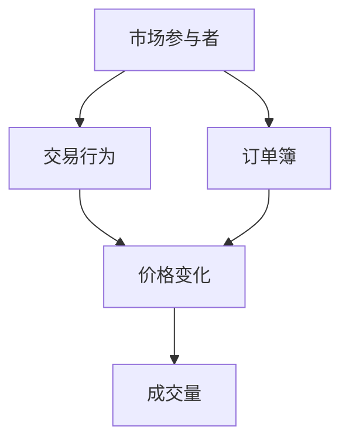
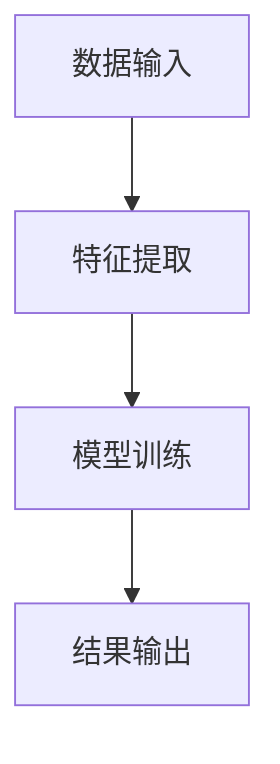
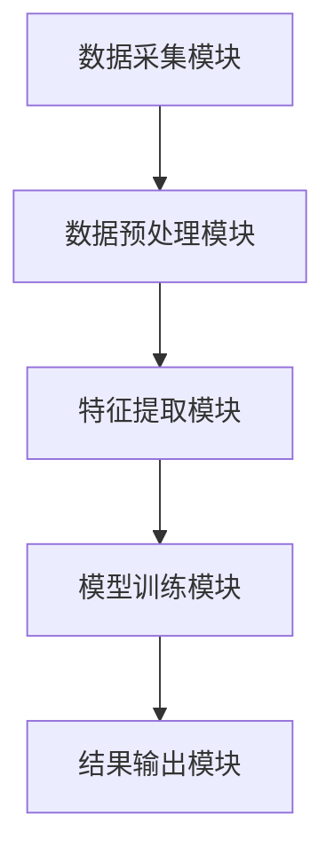
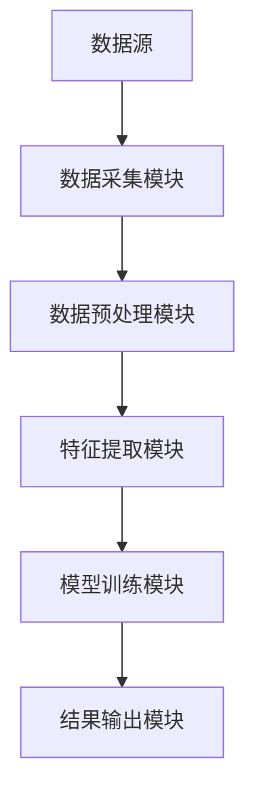
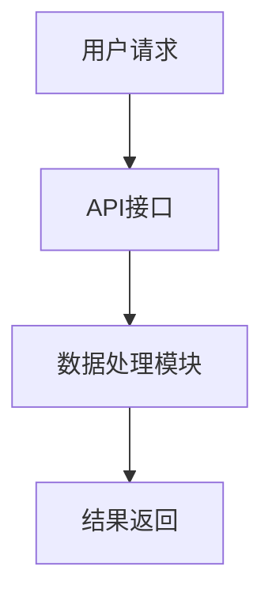

                 


# 智能算法识别市场微观结构变化

> 关键词：智能算法，市场微观结构，金融数据，时间序列分析，机器学习，深度学习，量化交易

> 摘要：本文将深入探讨如何利用智能算法来识别市场微观结构的变化。通过分析市场参与者的行为、价格波动、成交量变化等微观结构特征，结合时间序列分析、机器学习和深度学习等技术，构建高效的算法模型，以实现对金融市场微观结构变化的实时识别与预测。本文将从基础概念、算法原理、系统架构设计到实际项目实现，全面系统地阐述智能算法在识别市场微观结构变化中的应用。

---

# 第一部分: 市场微观结构与智能算法概述

## 第1章: 市场微观结构的定义与特点

### 1.1 市场微观结构的定义
金融市场微观结构是指市场的参与者（如投资者、交易商、机构等）在交易过程中的行为模式、订单簿状态、价格形成机制等细节。这些微观结构特征反映了市场的真实运行状态，例如：
- **订单簿状态**：未成交的订单数量和价格分布。
- **交易行为**：投资者的买卖行为，包括交易频率、交易量、交易时机等。
- **价格波动**：短期的价格变化，可能由市场参与者的行为引起。

市场微观结构的变化通常体现在以下几个方面：
1. **订单簿的深度变化**：买方或卖方订单的数量突然增加或减少。
2. **交易量的异常波动**：短时间内交易量激增或骤减。
3. **价格的快速变化**：价格在短时间内出现显著波动，可能是由于市场参与者的行为变化引起的。

### 1.2 智能算法的基本概念
智能算法是一种结合了人工智能、机器学习和数据挖掘技术的算法，旨在通过数据驱动的方式，自动识别数据中的模式、趋势和异常。智能算法的核心特征包括：
1. **自适应性**：能够根据数据的变化自动调整模型参数。
2. **非线性建模能力**：能够捕捉数据中的非线性关系。
3. **实时性**：能够在短时间内完成数据处理和结果输出。

智能算法与传统算法的主要区别在于，智能算法能够从海量、复杂的数据中提取隐含的规律，而传统算法通常依赖于明确的规则和逻辑。

### 1.3 市场微观结构与智能算法的结合
市场微观结构的变化可以通过智能算法进行建模和预测。智能算法的优势在于能够捕捉市场参与者行为的复杂性，并通过数据驱动的方式，识别市场微观结构中的潜在模式和异常。

例如，可以通过机器学习模型分析订单簿的状态，预测价格的变化趋势；或者通过深度学习模型捕捉交易量的异常波动，识别市场操纵行为。

---

## 第2章: 智能算法识别市场微观结构变化的核心概念

### 2.1 核心概念的原理分析
智能算法识别市场微观结构变化的核心在于以下几个方面：
1. **数据流的实时性**：金融市场中的数据通常具有很强的实时性，需要算法能够在短时间内完成数据处理和结果输出。
2. **算法的特征提取能力**：智能算法需要能够从复杂的金融数据中提取有用的特征，例如订单簿的深度、交易量的变化等。
3. **结果的可解释性**：虽然智能算法通常具有很强的预测能力，但其结果的可解释性是实际应用中的一个重要考量因素。

### 2.2 核心概念的属性特征对比
为了更好地理解市场微观结构的变化，我们需要对相关的核心概念进行属性特征对比。以下是一个简单的对比表格：

| **概念**         | **属性特征**                                                                 |
|------------------|-----------------------------------------------------------------------------|
| 市场微观结构     | 时间序列特性、参与者行为模式、订单簿状态、价格波动、交易量变化等                 |
| 智能算法         | 数据驱动、自适应性、非线性建模能力、实时性等                                   |
| 价格波动         | 短期内的价格变化，可能由市场微观结构的变化引起                                 |

### 2.3 ER实体关系图架构
为了更清晰地理解市场微观结构与智能算法之间的关系，我们可以使用ER（实体关系）图进行建模。



---

## 第3章: 智能算法的数学模型与公式

### 3.1 时间序列分析模型
时间序列分析是智能算法中常用的数学模型之一，主要用于分析市场微观结构中的时间依赖性。

#### 3.1.1 ARIMA模型
ARIMA（Autoregressive Integrated Moving Average）模型是一种广泛应用于时间序列分析的经典模型。其数学表达式为：
$$ARIMA(p, d, q)$$
其中：
- $p$ 表示自回归（AR）的阶数。
- $d$ 表示差分的阶数。
- $q$ 表示移动平均（MA）的阶数。

#### 3.1.2 LSTM模型
LSTM（Long Short-Term Memory）是一种基于循环神经网络（RNN）的深度学习模型，特别适合处理时间序列数据中的长程依赖关系。

LSTM 的核心在于其记忆单元（Cell）和门控机制（Gate）：
- **输入门控**：决定当前时刻输入的信息是否需要被存储到记忆单元中。
- **遗忘门控**：决定记忆单元中的信息是否需要被遗忘。
- **输出门控**：决定记忆单元中的信息是否需要被输出。

LSTM 的数学表达式如下：
$$
f_t = \sigma(W_f \cdot [h_{t-1}, x_t] + b_f)
$$
$$
i_t = \sigma(W_i \cdot [h_{t-1}, x_t] + b_i)
$$
$$
o_t = \sigma(W_o \cdot [h_{t-1}, x_t] + b_o)
$$
$$
c_t = f_t \cdot c_{t-1} + i_t \cdot tanh(W_c \cdot [h_{t-1}, x_t] + b_c)
$$
$$
h_t = o_t \cdot tanh(c_t)
$$
其中：
- $f_t$ 是遗忘门控。
- $i_t$ 是输入门控。
- $o_t$ 是输出门控。
- $c_t$ 是记忆单元的值。
- $h_t$ 是当前时刻的隐藏状态。

#### 3.1.3 Transformer模型
Transformer 是一种基于注意力机制的深度学习模型，近年来在时间序列分析中得到了广泛应用。

注意力机制的核心思想是，对于每个时刻的预测，关注与当前时刻相关的重要历史信息。其数学表达式为：
$$
\text{Attention}(Q, K, V) = \text{softmax}\left(\frac{QK^T}{\sqrt{d_k}}\right)V
$$
其中：
- $Q$ 是查询向量。
- $K$ 是键向量。
- $V$ 是值向量。
- $d_k$ 是键向量的维度。

---

## 第4章: 算法流程图与代码实现

### 4.1 算法流程图
以下是智能算法识别市场微观结构变化的流程图：



### 4.2 代码实现示例

#### 4.2.1 时间序列预测代码
以下是一个基于ARIMA模型的时间序列预测代码示例：

```python
import pandas as pd
import numpy as np
from statsmodels.tsa.arima.model import ARIMA

# 生成模拟数据
data = pd.Series(np.random.randn(100), index=pd.date_range('2020-01-01', periods=100))

# 模型训练
model = ARIMA(data, order=(1, 1, 1))
model_fit = model.fit()

# 预测未来5天的值
 forecast = model_fit.forecast(steps=5)
print(forecast)
```

#### 4.2.2 LSTM模型实现代码
以下是一个基于LSTM模型的时间序列预测代码示例：

```python
import numpy as np
import tensorflow as tf
from tensorflow.keras.layers import LSTM, Dense, Dropout
from tensorflow.keras.models import Sequential

# 生成模拟数据
X_train = np.random.randn(100, 1, 1)
y_train = np.random.randn(100, 1)

# 模型训练
model = Sequential()
model.add(LSTM(64, input_shape=(1, 1)))
model.add(Dropout(0.2))
model.add(Dense(1))
model.compile(loss='mean_squared_error', optimizer='adam')

model.fit(X_train, y_train, epochs=10, batch_size=1)
```

---

## 第5章: 系统分析与架构设计

### 5.1 问题场景介绍
智能算法识别市场微观结构变化的系统需要解决以下问题：
1. 如何实时采集和处理金融市场数据？
2. 如何高效提取市场微观结构中的特征？
3. 如何训练和部署智能算法模型？

### 5.2 系统功能设计
以下是系统的功能模块设计：



### 5.3 系统架构设计
以下是系统的整体架构图：



### 5.4 系统接口设计
以下是系统的接口设计：



---

## 第6章: 项目实战

### 6.1 环境安装
为了运行本文中的代码示例，您需要安装以下环境：
1. Python 3.6 或更高版本。
2. NumPy、Pandas、Scikit-learn、TensorFlow 等库。

### 6.2 核心代码实现

#### 6.2.1 时间序列分析代码
以下是一个基于ARIMA模型的时间序列分析代码：

```python
import pandas as pd
import numpy as np
from statsmodels.tsa.arima.model import ARIMA

# 生成模拟数据
data = pd.Series(np.random.randn(100), index=pd.date_range('2020-01-01', periods=100))

# 模型训练
model = ARIMA(data, order=(1, 1, 1))
model_fit = model.fit()

# 预测未来5天的值
 forecast = model_fit.forecast(steps=5)
print(forecast)
```

#### 6.2.2 LSTM模型实现代码
以下是一个基于LSTM模型的时间序列分析代码：

```python
import numpy as np
import tensorflow as tf
from tensorflow.keras.layers import LSTM, Dense, Dropout
from tensorflow.keras.models import Sequential

# 生成模拟数据
X_train = np.random.randn(100, 1, 1)
y_train = np.random.randn(100, 1)

# 模型训练
model = Sequential()
model.add(LSTM(64, input_shape=(1, 1)))
model.add(Dropout(0.2))
model.add(Dense(1))
model.compile(loss='mean_squared_error', optimizer='adam')

model.fit(X_train, y_train, epochs=10, batch_size=1)
```

### 6.3 实际案例分析
以下是一个实际案例分析：

假设我们有一个包含股票价格数据的DataFrame：

```python
import pandas as pd
import numpy as np
from statsmodels.tsa.arima.model import ARIMA

# 生成模拟数据
data = pd.Series(np.random.randn(100), index=pd.date_range('2020-01-01', periods=100))

# 模型训练
model = ARIMA(data, order=(1, 1, 1))
model_fit = model.fit()

# 预测未来5天的值
 forecast = model_fit.forecast(steps=5)
print(forecast)
```

### 6.4 项目小结
通过以上代码实现，我们可以看到智能算法在识别市场微观结构变化中的强大能力。通过时间序列分析和深度学习模型，我们可以有效地捕捉市场中的潜在模式和异常。

---

## 第7章: 最佳实践与总结

### 7.1 最佳实践
1. **数据预处理**：在进行智能算法训练之前，确保数据的完整性和准确性。
2. **模型调优**：通过交叉验证和网格搜索等方式，优化模型的参数。
3. **结果验证**：通过回测和实盘测试等方式，验证模型的稳定性和 profitability。

### 7.2 小结
本文详细介绍了智能算法在识别市场微观结构变化中的应用。通过时间序列分析、机器学习和深度学习等技术，我们可以有效地捕捉市场中的潜在模式和异常。

### 7.3 注意事项
1. **数据隐私**：在处理金融数据时，需注意数据的隐私保护。
2. **模型解释性**：在实际应用中，模型的解释性是重要的考量因素。

### 7.4 拓展阅读
1. 《深度学习》—— Ian Goodfellow
2. 《时间序列分析》—— 梁俊

---

## 总结与展望

本文从市场微观结构的定义、智能算法的基本概念，到具体的时间序列分析模型、深度学习模型，再到系统的架构设计和实际项目实现，全面系统地阐述了智能算法在识别市场微观结构变化中的应用。未来，随着人工智能技术的不断发展，智能算法在金融市场中的应用将更加广泛和深入。

