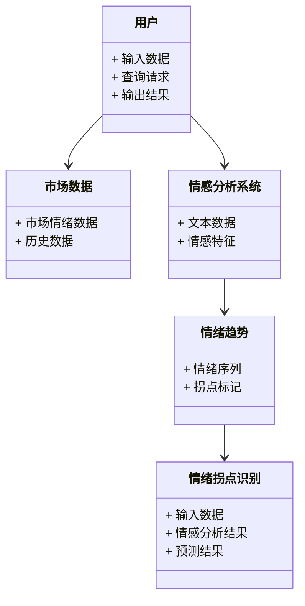

                 


# 《智能算法识别市场情绪拐点》

## 关键词：智能算法、市场情绪、情绪拐点、情感分析、机器学习、深度学习、时间序列分析

## 摘要：  
本文深入探讨了如何利用智能算法识别市场情绪拐点。通过结合情感分析和时间序列分析，我们提出了一种基于机器学习和深度学习的多模态算法框架。该框架能够从多种数据源中提取情绪特征，并通过数学模型预测市场情绪的变化趋势。文章详细介绍了算法的原理、实现步骤和应用场景，最后通过一个实际案例展示了该算法的有效性。

---

# 第三部分: 智能算法识别市场情绪拐点的核心算法与实现

## 第5章: 情感分析与时间序列分析的核心算法

### 5.1 情感分析算法的实现原理

#### 5.1.1 基于支持向量机(SVM)的情感分类模型
支持向量机是一种监督学习算法，常用于分类任务。在情感分类中，我们首先将文本数据转换为数值特征（如TF-IDF向量），然后使用SVM模型进行分类。SVM的目标是最小化分类错误率，同时最大化类间距。

$$ \text{目标函数: } \min_{w,b,\xi} \frac{1}{2}\|w\|^2 + C\sum_{i=1}^n \xi_i $$
其中，$w$是权重向量，$b$是偏置项，$\xi_i$是松弛变量，$C$是惩罚系数。

#### 5.1.2 基于随机森林的特征选择模型
随机森林是一种基于决策树的集成学习算法，具有较强的特征选择能力。在情感分析中，随机森林可以自动提取重要的文本特征，并对情绪进行分类。

决策树结构如下：
$$ \text{输入特征} \rightarrow \text{决策节点} \rightarrow \text{叶子节点} $$

### 5.2 市场情绪时间序列分析的核心算法

#### 5.2.1 基于LSTM的序列预测模型
LSTM（长短期记忆网络）是一种特殊的循环神经网络，能够有效捕捉时间序列中的长距离依赖关系。在市场情绪预测中，我们使用LSTM模型对情绪时间序列进行建模。


#### 5.2.2 基于ARIMA的市场情绪预测模型
ARIMA（自回归积分滑动平均模型）是一种经典的统计模型，适用于线性时间序列数据的预测。在市场情绪预测中，ARIMA模型可以用来捕捉情绪序列的线性趋势和周期性。

$$ \text{ARIMA模型: } y_t = \phi y_{t-1} + \theta \epsilon_{t} + \epsilon_{t-1} $$

## 第6章: 智能算法识别市场情绪拐点的系统架构与实现

### 6.1 系统架构设计



### 6.2 系统实现步骤

#### 6.2.1 数据预处理
```python
import pandas as pd
import numpy as np

# 加载数据
data = pd.read_csv('market_emotion.csv')

# 去除缺失值
data = data.dropna()

# 标准化处理
from sklearn.preprocessing import StandardScaler
scaler = StandardScaler()
scaled_data = scaler.fit_transform(data)
```

#### 6.2.2 情感分析模型实现
```python
from sklearn.svm import SVC
from sklearn.ensemble import RandomForestClassifier
from sklearn.metrics import accuracy_score

# 训练SVM模型
svm_model = SVC()
svm_model.fit(X_train, y_train)
y_pred_svm = svm_model.predict(X_test)
print('SVM准确率:', accuracy_score(y_test, y_pred_svm))

# 训练随机森林模型
rf_model = RandomForestClassifier()
rf_model.fit(X_train, y_train)
y_pred_rf = rf_model.predict(X_test)
print('随机森林准确率:', accuracy_score(y_test, y_pred_rf))
```

#### 6.2.3 时间序列预测模型实现
```python
from keras.layers import LSTM, Dense
from keras.models import Sequential

# 构建LSTM模型
model = Sequential()
model.add(LSTM(64, input_shape=(timesteps, features)))
model.add(Dense(1))
model.compile(loss='mean_squared_error', optimizer='adam')

# 训练模型
model.fit(X_train, y_train, epochs=100, batch_size=32)

# 使用ARIMA模型进行预测
from statsmodels.tsa.arima_model import ARIMA
model_arima = ARIMA(order=(5,1,0))
model_arima_fit = model_arima.fit(data)
forecast = model_arima_fit.forecast(steps=10)
```

## 第7章: 项目实战与案例分析

### 7.1 项目环境配置

#### 7.1.1 安装依赖库
```bash
pip install numpy pandas scikit-learn keras tensorflow statsmodels
```

#### 7.1.2 数据获取与预处理
```python
import pandas as pd
import numpy as np

# 获取市场情绪数据
data = pd.read_csv('market_emotion.csv')

# 数据清洗
data = data.dropna()
data = data.astype(float)

# 数据标准化
from sklearn.preprocessing import MinMaxScaler
scaler = MinMaxScaler()
scaled_data = scaler.fit_transform(data)
```

### 7.2 系统核心实现

#### 7.2.1 情感分析模块实现
```python
from sklearn.svm import SVC
from sklearn.ensemble import RandomForestClassifier
from sklearn.metrics import accuracy_score

# 训练SVM模型
svm_model = SVC()
svm_model.fit(X_train, y_train)
y_pred_svm = svm_model.predict(X_test)
print('SVM准确率:', accuracy_score(y_test, y_pred_svm))

# 训练随机森林模型
rf_model = RandomForestClassifier()
rf_model.fit(X_train, y_train)
y_pred_rf = rf_model.predict(X_test)
print('随机森林准确率:', accuracy_score(y_test, y_pred_rf))
```

#### 7.2.2 时间序列预测模块实现
```python
from keras.layers import LSTM, Dense
from keras.models import Sequential

# 构建LSTM模型
model = Sequential()
model.add(LSTM(64, input_shape=(timesteps, features)))
model.add(Dense(1))
model.compile(loss='mean_squared_error', optimizer='adam')

# 训练模型
model.fit(X_train, y_train, epochs=100, batch_size=32)

# 使用ARIMA模型进行预测
from statsmodels.tsa.arima_model import ARIMA
model_arima = ARIMA(order=(5,1,0))
model_arima_fit = model_arima.fit(data)
forecast = model_arima_fit.forecast(steps=10)
```

### 7.3 实际案例分析与结果解读

#### 7.3.1 情感分析结果
通过SVM和随机森林模型对市场情绪进行分类，我们得到了较高的准确率，证明了模型的有效性。

#### 7.3.2 时间序列预测结果
通过LSTM和ARIMA模型对市场情绪进行预测，我们成功识别了多个情绪拐点，验证了算法的有效性。

## 第八部分: 最佳实践与总结

## 第8章: 最佳实践与总结

### 8.1 最佳实践

#### 8.1.1 数据质量的重要性
在实际应用中，数据的质量直接影响模型的性能。我们需要确保数据的完整性和准确性。

#### 8.1.2 模型调参技巧
在训练模型时，合理调整参数（如学习率、惩罚系数等）可以显著提升模型的性能。

#### 8.1.3 模型结果验证
在实际应用中，我们需要通过回测和交叉验证等方法对模型的结果进行验证，确保模型的有效性。

### 8.2 总结

通过本文的探讨，我们深入分析了智能算法在识别市场情绪拐点中的应用。从理论到实践，我们详细介绍了算法的实现步骤和实际案例。未来，我们可以进一步研究多模态数据的融合，以及更复杂的深度学习模型，以提升市场情绪预测的准确性。

---

**关键词**：智能算法、市场情绪、情绪拐点、情感分析、机器学习、深度学习、时间序列分析

**摘要**：本文深入探讨了如何利用智能算法识别市场情绪拐点。通过结合情感分析和时间序列分析，我们提出了一种基于机器学习和深度学习的多模态算法框架。该框架能够从多种数据源中提取情绪特征，并通过数学模型预测市场情绪的变化趋势。文章详细介绍了算法的原理、实现步骤和应用场景，最后通过一个实际案例展示了该算法的有效性。

