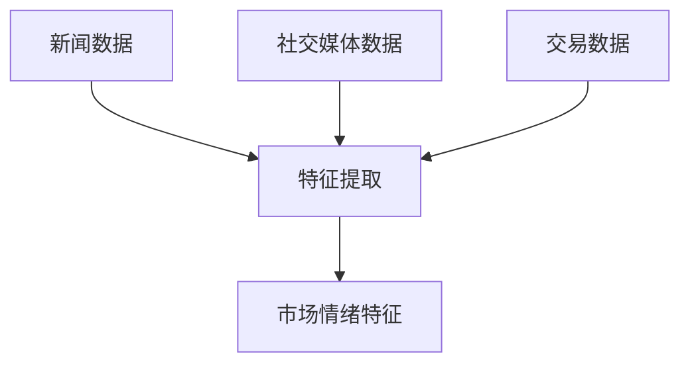
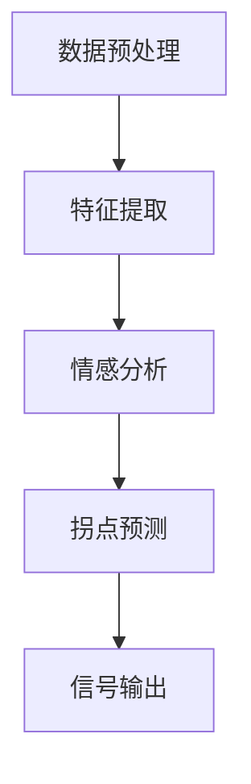

                 


# 智能算法识别市场情绪拐点信号

> 关键词：智能算法，市场情绪，拐点信号，数据分析，机器学习

> 摘要：市场情绪是影响金融市场走势的重要因素，而智能算法通过分析海量数据，能够有效识别市场情绪拐点信号。本文从市场情绪的定义与特征出发，结合智能算法的核心概念与联系，详细讲解了多种算法原理与实现，分析了系统的架构设计，并通过实际案例展示了项目实战。最后，本文总结了智能算法在识别市场情绪拐点信号中的最佳实践。

---

## 第一部分: 智能算法识别市场情绪拐点信号的背景与核心概念

### 第1章: 市场情绪与拐点信号概述

#### 1.1 市场情绪的定义与特征

##### 1.1.1 市场情绪的定义
市场情绪是指市场参与者（如投资者、交易员等）对市场走势的心理预期和行为倾向。市场情绪可以通过多种数据源进行衡量，如新闻、社交媒体、交易数据等。

##### 1.1.2 市场情绪的特征
- **波动性**：市场情绪会随着市场环境的变化而波动。
- **周期性**：市场情绪通常呈现周期性变化，如从乐观到悲观，再到乐观。
- **滞后性**：市场情绪的变化往往滞后于市场实际走势。

##### 1.1.3 市场情绪与市场走势的关系
市场情绪是影响市场走势的重要因素。例如，过度乐观的市场情绪可能导致市场泡沫，而过度悲观的市场情绪可能导致市场超跌。

#### 1.2 拐点信号的定义与重要性

##### 1.2.1 拐点信号的定义
拐点信号是指市场情绪发生显著变化的时间点。例如，从上涨趋势转为下跌趋势的转折点。

##### 1.2.2 拐点信号的重要性
- **提前预警**：识别拐点信号可以帮助投资者提前做出决策，避免重大损失。
- **优化投资策略**：通过分析拐点信号，投资者可以优化投资策略，抓住市场机会。

#### 1.3 智能算法在市场情绪分析中的作用

##### 1.3.1 智能算法的基本概念
智能算法是指利用人工智能技术（如机器学习、深度学习等）来解决复杂问题的算法。这些算法能够从海量数据中提取特征，并通过训练模型来预测市场情绪拐点。

##### 1.3.2 智能算法在市场情绪分析中的优势
- **数据处理能力强**：智能算法能够处理海量数据，提取有用特征。
- **自动化学习**：智能算法能够通过数据自动学习，不断优化模型。

##### 1.3.3 智能算法的应用场景
- **股票市场预测**：通过分析新闻、社交媒体等数据，预测市场情绪拐点。
- **风险管理**：通过识别市场情绪拐点，降低投资风险。

---

### 第2章: 市场情绪拐点信号的核心概念与联系

#### 2.1 市场情绪拐点信号的核心概念

##### 2.1.1 数据源与特征提取
市场情绪拐点信号的识别需要多源数据的支持，常见的数据源包括：
- **新闻数据**：通过分析新闻标题和正文，提取市场情绪特征。
- **社交媒体数据**：通过分析Twitter、Reddit等平台上的用户评论，提取市场情绪特征。
- **交易数据**：通过分析交易量、价格波动等数据，提取市场情绪特征。

##### 2.1.2 情感分析与情绪分类
情感分析是指对文本数据进行分析，判断其情感倾向（如积极、消极、中性）。情绪分类则是将市场情绪分为不同的类别（如乐观、悲观、中性）。

##### 2.1.3 拐点预测模型
拐点预测模型是指能够根据市场情绪特征，预测市场情绪拐点的算法模型。

#### 2.2 核心概念的属性特征对比

##### 2.2.1 数据源类型对比
| 数据源类型 | 描述 | 优缺点 |
|------------|------|--------|
| 新闻数据    | 来自新闻媒体的文本数据 | 数据权威性高，但数据量有限 |
| 社交媒体数据 | 来自社交媒体的文本数据 | 数据量大，但数据质量参差不齐 |
| 交易数据    | 来自交易系统的数据 | 数据实时性强，但数据特征有限 |

##### 2.2.2 情感分析算法对比
| 算法名称 | 描述 | 优缺点 |
|----------|------|--------|
| 传统机器学习 | 基于特征工程的分类算法 | 计算效率高，但模型表达能力有限 |
| 深度学习   | 基于神经网络的分类算法 | 模型表达能力强，但计算资源消耗大 |

##### 2.2.3 拐点预测模型对比
| 模型名称 | 描述 | 优缺点 |
|----------|------|--------|
| 支持向量机（SVM） | 基于统计学习的分类算法 | 分类性能好，但对数据特征敏感 |
| 随机森林 | 基于树结构的集成算法 | 分类性能好，且对数据特征不敏感 |
| 神经网络   | 基于深度学习的分类算法 | 模型表达能力强，但训练时间长 |

#### 2.3 实体关系图与数据流图

##### 2.3.1 数据源与特征的关系图


##### 2.3.2 情感分析与拐点预测的流程图


---

## 第二部分: 智能算法识别市场情绪拐点信号的算法原理

### 第3章: 常见算法原理与实现

#### 3.1 支持向量机（SVM）原理

##### 3.1.1 SVM的基本原理
支持向量机（Support Vector Machine，SVM）是一种监督学习算法，主要用于分类和回归问题。SVM的核心思想是通过构造一个超平面，将数据点分成两类。

##### 3.1.2 SVM的数学模型
$$ \text{目标函数}：\min_{w,b,\xi} \frac{1}{2}||w||^2 + C \sum_{i=1}^n \xi_i $$
$$ \text{约束条件}：y_i(w \cdot x_i + b) \geq 1 - \xi_i $$
$$ \xi_i \geq 0 $$

##### 3.1.3 SVM的实现代码
```python
from sklearn.svm import SVC
from sklearn.preprocessing import StandardScaler
from sklearn.pipeline import Pipeline

# 数据预处理
scaler = StandardScaler()
model = SVC(kernel='rb

