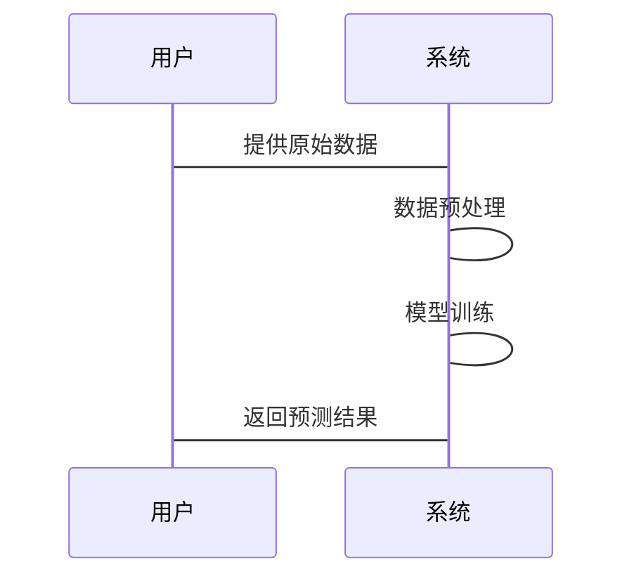

                 


# 目录大纲：《智能算法识别市场结构性变化》

---

## 第一部分：智能算法与市场结构性变化概述

### 第1章：智能算法与市场结构性变化概述

#### 1.1 智能算法的基本概念

- 1.1.1 算法的基本定义与分类
- 1.1.2 智能算法的核心特征
- 1.1.3 市场结构性变化的定义与特征

#### 1.2 智能算法在市场分析中的应用

- 1.2.1 数据驱动的市场分析方法
- 1.2.2 智能算法在市场预测中的作用
- 1.2.3 市场结构性变化的识别需求

#### 1.3 本书的核心目标与内容框架

- 1.3.1 本书的研究范围
- 1.3.2 本书的主要内容框架
- 1.3.3 本书的读者对象与学习目标

---

## 第二部分：智能算法的核心概念与数学模型

### 第2章：智能算法的核心概念与联系

#### 2.1 核心概念原理

- 2.1.1 数据预处理与特征提取
- 2.1.2 智能算法的分类与对比
- 2.1.3 算法的输入输出关系

#### 2.2 概念属性特征对比表格

| 概念       | 输入 | 输出 | 核心特征 |
|------------|------|------|----------|
| 数据预处理 | 原始数据 | 结构化数据 | 数据清洗、特征提取 |
| 智能算法   | 结构化数据 | 预测结果 | 自适应、非线性关系 |

#### 2.3 ER实体关系图（使用 Mermaid）

```mermaid
erDiagram
    customer[客户] {
        <属性>
        id : int
    }
```

---

## 第三部分：智能算法的数学模型与实现

### 第3章：智能算法的数学模型与实现

#### 3.1 算法原理概述

- 3.1.1 数据流图
- 3.1.2 算法实现步骤

#### 3.2 数据流图（使用 Mermaid）

```mermaid
graph TD
    A[输入数据] -> B[数据预处理]
    B -> C[特征提取]
    C -> D[模型训练]
    D -> E[预测结果]
```

#### 3.3 算法实现代码

```python
def preprocess_data(data):
    # 数据清洗和特征提取
    pass

def train_model(features, labels):
    # 模型训练
    pass

def predict_market_change(model, new_features):
    # 预测市场变化
    pass
```

#### 3.4 数学模型与公式

- 3.4.1 线性回归模型
  $$y = \beta_0 + \beta_1x + \epsilon$$
- 3.4.2 神经网络模型
  $$a^{(l)} = \sigma(w^{(l)}a^{(l-1)} + b^{(l)})$$

---

## 第四部分：系统分析与架构设计

### 第4章：系统分析与架构设计

#### 4.1 系统功能设计

- 4.1.1 功能模块划分
- 4.1.2 功能流程图

#### 4.2 系统架构设计

- 4.2.1 分层架构
- 4.2.2 组件交互图

#### 4.3 系统接口设计

- 4.3.1 输入接口
- 4.3.2 输出接口

#### 4.4 系统交互流程图（使用 Mermaid）



---

## 第五部分：项目实战与案例分析

### 第5章：项目实战与案例分析

#### 5.1 项目实战环境安装

- 5.1.1 安装依赖
- 5.1.2 环境配置

#### 5.2 系统核心实现源代码

```python
import numpy as np
import pandas as pd
from sklearn.model import Model

def load_data():
    # 加载数据
    pass

def main():
    data = load_data()
    processed_data = preprocess_data(data)
    model = train_model(processed_data)
    result = predict_market_change(model, processed_data)
    print(result)

if __name__ == "__main__":
    main()
```

#### 5.3 代码解读与分析

- 5.3.1 数据加载模块
- 5.3.2 数据预处理模块
- 5.3.3 模型训练模块
- 5.3.4 预测结果模块

#### 5.4 案例分析与结果解读

- 5.4.1 实际案例
- 5.4.2 结果分析
- 5.4.3 案例总结

---

## 第六部分：优化建议与总结

### 第6章：优化建议与总结

#### 6.1 优化建议

- 6.1.1 算法优化
- 6.1.2 系统优化
- 6.1.3 数据优化

#### 6.2 小结

- 6.2.1 核心内容回顾
- 6.2.2 学习要点总结

#### 6.3 注意事项

- 6.3.1 实际应用中的注意事项
- 6.3.2 系统维护建议
- 6.3.3 未来研究方向

#### 6.4 拓展阅读

- 6.4.1 推荐书籍
- 6.4.2 推荐博客
- 6.4.3 推荐在线课程

---

## 参考文献

- 人工智能领域的经典书籍
- 相关学术论文
- 开源项目文档
- 在线技术博客

---

通过以上目录大纲，读者可以系统地学习智能算法识别市场结构性变化的核心概念、算法原理、系统设计和实际应用，从而掌握这一领域的关键技术与实践方法。

