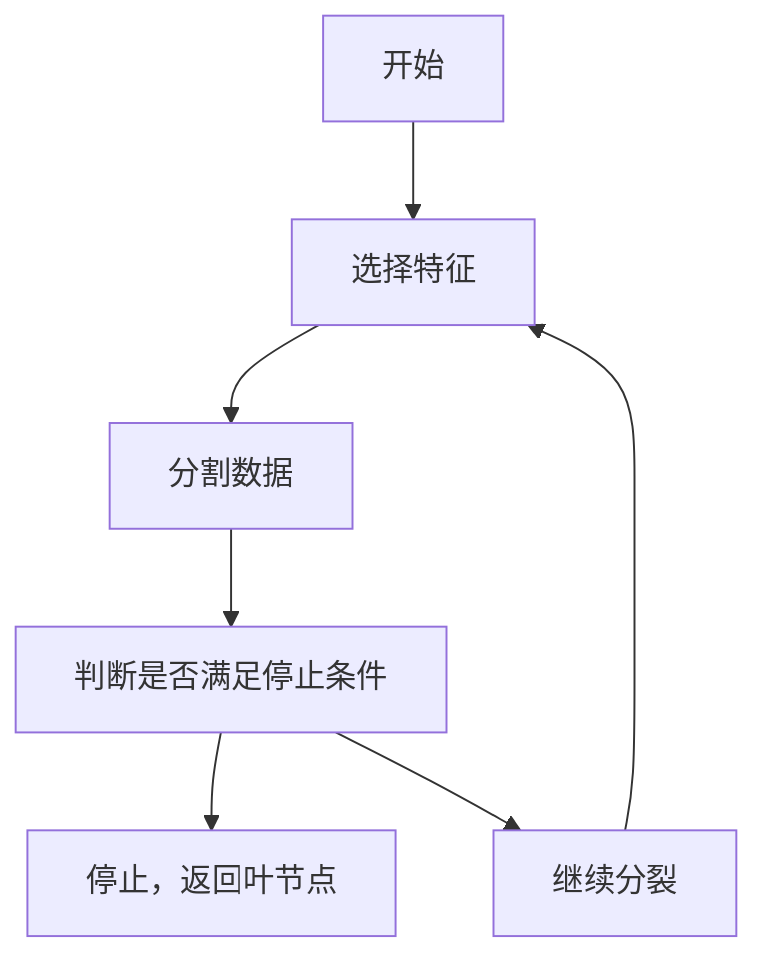
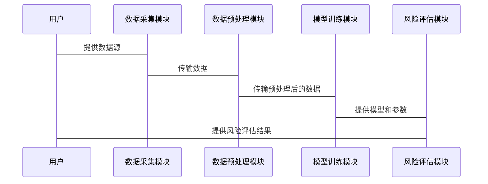

                 


# 智能算法识别隐藏的财务风险

> 关键词：智能算法，财务风险管理，隐藏风险，机器学习，深度学习，风险识别，数据挖掘

> 摘要：本文深入探讨了智能算法在识别隐藏财务风险中的应用，从传统方法的局限性出发，分析了机器学习、深度学习等智能算法的核心原理，结合实际案例，详细讲解了如何利用这些算法构建高效的风险识别系统。通过系统架构设计和项目实战，展示了智能算法在实际中的应用效果和优势。

---

## 目录

1. **背景介绍**  
   1.1 财务风险管理的定义与重要性  
   1.2 隐藏财务风险的定义与特点  
   1.3 智能算法在财务风险管理中的作用  

2. **核心概念与联系**  
   2.1 智能算法的核心原理  
   2.2 数据挖掘与财务风险识别的关系  
   2.3 常见智能算法对比分析  

3. **算法原理与数学模型**  
   3.1 机器学习算法原理  
   3.2 常用算法的数学模型与公式  
   3.3 算法流程图与实现步骤  

4. **系统架构设计与实现**  
   4.1 系统设计目标与范围  
   4.2 系统架构设计图  
   4.3 接口设计与交互流程  

5. **项目实战：智能算法在隐藏财务风险识别中的应用**  
   5.1 项目背景与目标  
   5.2 数据采集与预处理  
   5.3 算法实现与模型训练  
   5.4 模型评估与优化  

6. **总结与展望**  
   6.1 本文总结  
   6.2 智能算法在财务风险管理中的未来展望  

---

## 第1章 背景介绍

### 1.1 财务风险管理的定义与重要性

财务风险管理是指通过识别、评估和应对各种财务风险，以确保企业财务健康和稳定的过程。它涵盖了企业可能面临的所有财务风险，包括市场风险、信用风险、流动性风险等。财务风险管理的重要性体现在以下几个方面：

1. **保护企业资产**：通过及时识别和应对潜在风险，可以最大限度地减少资产损失。
2. **提高决策的准确性**：基于数据的财务风险管理能够提供更准确的决策支持。
3. **增强企业竞争力**：有效的风险管理可以提升企业的信用评级，降低融资成本。

### 1.2 隐藏财务风险的定义与特点

隐藏财务风险是指那些在常规财务报表和审计中难以发现，但可能对企业财务状况产生重大影响的风险。这些风险通常隐藏在企业内部数据、供应链、市场变化等复杂因素中。其特点包括：

- **隐蔽性**：难以通过常规方法识别。
- **复杂性**：涉及多个变量和非结构化数据。
- **潜在影响大**：一旦爆发，可能导致严重的财务损失。

### 1.3 智能算法在财务风险管理中的作用

智能算法，尤其是机器学习和深度学习技术，能够从大量数据中提取潜在的模式和关联性，帮助识别隐藏的财务风险。其作用包括：

1. **数据驱动的决策**：通过分析大量数据，智能算法能够发现传统方法难以察觉的潜在风险。
2. **实时监控**：智能算法可以实时分析数据，提供及时的风险预警。
3. **自我学习与优化**：通过不断学习新的数据，模型能够不断优化，提高识别准确率。

---

## 第2章 核心概念与联系

### 2.1 智能算法的核心原理

智能算法的核心在于其学习能力。通过训练数据，算法能够自动提取特征并建立模型，从而实现对隐藏风险的识别。常用算法包括：

- **机器学习**：基于统计学方法，从数据中学习模式。
- **深度学习**：通过多层神经网络，提取复杂的特征。

### 2.2 数据挖掘与财务风险识别的关系

数据挖掘是智能算法的重要组成部分，它通过从大量数据中提取有用信息，帮助识别隐藏的财务风险。数据挖掘的关键步骤包括：

1. **数据清洗**：去除噪声数据，确保数据质量。
2. **特征提取**：从数据中提取有用的特征，用于模型训练。
3. **模型训练**：基于特征训练模型，识别潜在风险。

### 2.3 常见智能算法对比分析

以下是几种常见智能算法的对比分析：

| 算法类型    | 优点                          | 缺点                          |
|-------------|-------------------------------|-------------------------------|
| 线性回归     | 简单，易于解释                 | 无法处理非线性关系             |
| 决策树       | 易于解释，适合分类问题         | 易受噪声数据影响               |
| 随机森林     | 抗过拟合，准确率高             | 计算复杂                     |
| 神经网络     | 能处理复杂的非线性关系         | 需要大量数据，难于解释         |

---

## 第3章 算法原理与数学模型

### 3.1 机器学习算法原理

机器学习的核心在于通过数据训练模型，使其能够自动识别模式。以下是几种常见算法的简要介绍：

#### 3.1.1 线性回归

线性回归是一种简单的回归算法，用于预测连续型变量。其数学模型为：

$$ y = \beta_0 + \beta_1x + \epsilon $$

其中，$\beta_0$ 是截距，$\beta_1$ 是回归系数，$\epsilon$ 是误差项。

#### 3.1.2 决策树

决策树是一种基于树状结构的分类算法，适用于分类和回归问题。其核心是通过特征分裂，逐步缩小数据范围，最终做出预测。

#### 3.1.3 支持向量机（SVM）

SVM 是一种监督学习算法，适用于分类和回归问题。其核心是通过寻找最优超平面，将数据分为不同的类别。

### 3.2 常用算法的数学模型与公式

以下是几种常用算法的数学模型：

#### 3.2.1 逻辑回归

逻辑回归是一种用于分类的算法，其数学模型为：

$$ P(Y=1|x) = \frac{e^{\beta_0 + \beta_1x}}{1 + e^{\beta_0 + \beta_1x}} $$

#### 3.2.2 神经网络

神经网络是一种模仿人脑结构的算法，其数学模型包括输入层、隐藏层和输出层。激活函数通常使用sigmoid、ReLU等函数。

$$ a^{(l+1)} = \sigma(w^{(l)} a^{(l)} + b^{(l)}) $$

其中，$a^{(l)}$ 是第$l$层的激活值，$w$ 是权重，$b$ 是偏置，$\sigma$ 是激活函数。

### 3.3 算法流程图与实现步骤

以下是决策树算法的流程图：



实现步骤如下：

1. **选择特征**：选择最能区分数据的特征。
2. **分割数据**：根据特征分割数据。
3. **判断停止条件**：如果满足停止条件（如数据集纯度足够高），返回叶节点。
4. **继续分裂**：否则，继续递归分割数据。

---

## 第4章 系统架构设计与实现

### 4.1 系统设计目标与范围

系统设计目标是构建一个能够实时识别隐藏财务风险的智能系统。设计范围包括数据采集、预处理、模型训练和风险评估。

### 4.2 系统架构设计图

以下是系统的架构设计图：


### 4.3 接口设计与交互流程

以下是系统的交互流程图：



---

## 第5章 项目实战：智能算法在隐藏财务风险识别中的应用

### 5.1 项目背景与目标

项目背景是通过智能算法识别隐藏的财务风险，目标是构建一个高效的风险识别系统。

### 5.2 数据采集与预处理

数据采集包括从数据库中获取财务数据、市场数据等。数据预处理包括清洗数据、处理缺失值、标准化等。

### 5.3 算法实现与模型训练

以下是基于决策树的Python实现代码：

```python
from sklearn.tree import DecisionTreeClassifier
from sklearn.model_selection import train_test_split
from sklearn.metrics import accuracy_score

# 数据预处理
X = processed_data
y = labels

# 数据分割
X_train, X_test, y_train, y_test = train_test_split(X, y, test_size=0.2)

# 模型训练
model = DecisionTreeClassifier()
model.fit(X_train, y_train)

# 模型预测
y_pred = model.predict(X_test)

# 模型评估
print("准确率:", accuracy_score(y_test, y_pred))
```

### 5.4 模型评估与优化

模型评估包括准确率、召回率、F1分数等指标。优化包括调整参数、尝试不同的算法等。

---

## 第6章 总结与展望

### 6.1 本文总结

本文详细介绍了智能算法在识别隐藏财务风险中的应用，从理论到实践，展示了如何利用这些算法构建高效的风险识别系统。

### 6.2 未来展望

未来，随着人工智能技术的不断发展，智能算法在财务风险管理中的应用将更加广泛。例如，结合自然语言处理技术，可以从非结构化数据中提取风险信号，进一步提升风险管理的准确性。

---

通过本文的介绍，读者可以全面了解智能算法在识别隐藏财务风险中的应用，并能够实际操作构建相关系统。希望本文对读者有所帮助！

