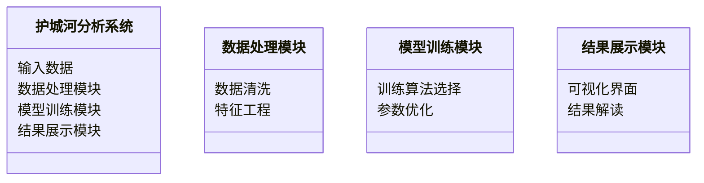
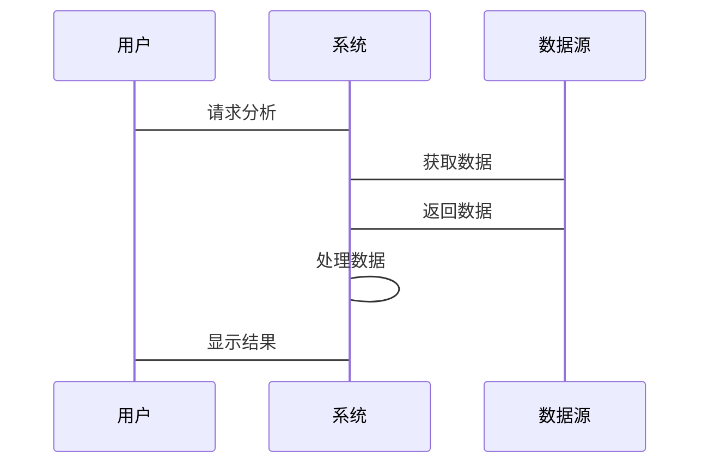

                 


# 智能算法辅助巴菲特护城河分析

> 关键词：巴菲特护城河、智能算法、机器学习、投资分析、数据驱动

> 摘要：本文探讨了如何利用智能算法辅助分析巴菲特护城河，通过详细讲解相关概念、算法原理和系统架构，结合实际案例，展示了如何利用数据驱动的方法提升护城河分析的效率和准确性，为投资者提供科学决策支持。

---

## 第1章：背景介绍与核心概念

### 1.1 护城河分析的重要性

#### 1.1.1 什么是巴菲特护城河
巴菲特护城河是指公司拥有的竞争优势，使其能够在长期竞争中保持领先地位。这些优势可能包括品牌、成本优势、技术壁垒等。

#### 1.1.2 护城河分析的必要性
在投资决策中，识别和评估护城河是关键，因为它们决定了公司的长期盈利能力。传统的方法依赖于主观判断，而智能算法提供了更客观和高效的方式。

#### 1.1.3 智能算法在护城河分析中的作用
智能算法通过处理大量数据，识别潜在的护城河特征，优化分析流程，帮助投资者更快地做出决策。

### 1.2 智能算法的基本概念

#### 1.2.1 什么是智能算法
智能算法是指模拟人类智能的算法，包括机器学习、自然语言处理和深度学习等技术。

#### 1.2.2 智能算法的核心特征
- 数据驱动
- 自适应学习
- 高效计算

#### 1.2.3 智能算法与传统算法的区别
智能算法依赖于大量数据和模型训练，能够处理复杂和非线性问题，而传统算法通常基于规则和逻辑推理。

### 1.3 本书的核心目标

#### 1.3.1 通过智能算法优化护城河分析
利用机器学习等技术，提高护城河评估的准确性和效率。

#### 1.3.2 提供可落地的分析框架
构建一个可操作的框架，指导投资者如何应用智能算法进行护城河分析。

#### 1.3.3 帮助投资者提升决策效率
通过自动化和智能化的分析工具，缩短决策周期，降低分析成本。

---

## 第2章：护城河分析的核心概念与联系

### 2.1 护城河分析的核心要素

#### 2.1.1 护城河的定义与分类
- 品牌优势
- 成本优势
- 技术壁垒
- 网络效应

#### 2.1.2 护城河的关键指标
- 市场占有率
- 净利润率
- 研发投入占比
- 专利数量

#### 2.1.3 护城河的外部环境影响
- 行业竞争状况
- 宏观经济环境
- 政策法规变化

### 2.2 智能算法与护城河分析的关系

#### 2.2.1 数据驱动的护城河分析
通过大数据分析，识别护城河的潜在因素。

#### 2.2.2 算法在护城河评估中的应用
使用机器学习模型预测护城河的强度和可持续性。

#### 2.2.3 护城河分析的流程优化
智能算法能够自动化数据处理和模型训练，减少人工干预。

### 2.3 核心概念对比表

| **概念**        | **传统分析**            | **智能算法分析**          |
|-----------------|-------------------------|---------------------------|
| 数据来源        | 财务报表、行业报告      | 多源数据，包括文本、图像  |
| 分析方法        | 定性分析为主            | 定量分析为主，结合定性    |
| 结果输出        | 主观判断               | 客观评分，量化结果        |

---

## 第3章：智能算法基础与应用

### 3.1 机器学习算法简介

#### 3.1.1 监督学习与无监督学习
- **监督学习**：基于标注数据进行训练，如决策树、随机森林。
- **无监督学习**：在无标签数据中发现模式，如聚类分析。

#### 3.1.2 分类算法与回归算法
- **分类算法**：用于分类护城河类型，如逻辑回归、支持向量机。
- **回归算法**：用于预测护城河的强度，如线性回归。

#### 3.1.3 聚类算法与降维技术
- **聚类算法**：将公司按护城河特征分组，如K-means。
- **降维技术**：减少数据维度，提高计算效率，如主成分分析（PCA）。

### 3.2 自然语言处理与文本挖掘

#### 3.2.1 NLP在护城河分析中的应用
通过分析公司财报、新闻等文本数据，识别潜在的护城河因素。

#### 3.2.2 文本情感分析与主题挖掘
- **情感分析**：判断市场对公司的看法。
- **主题挖掘**：提取文本中的关键词和主题。

#### 3.2.3 领域特定实体识别
识别文本中的公司名称、产品名称等实体。

### 3.3 时间序列分析与预测

#### 3.3.1 时间序列的基本特征
- **趋势**：长期增长或下降趋势。
- **周期性**：季节性波动。
- **随机性**：不可预测的波动。

#### 3.3.2 常见的时间序列模型
- **ARIMA模型**：适用于线性时间序列预测。
- **LSTM网络**：适用于非线性时间序列预测。

#### 3.3.3 时间序列预测的挑战
- 数据稀疏性
- 突发事件的影响
- 模型的稳定性

### 3.4 算法选择与优化策略

#### 3.4.1 根据问题选择算法
根据护城河分析的具体问题选择合适的算法，如分类问题选择随机森林。

#### 3.4.2 算法调优与参数优化
通过网格搜索、随机搜索等方法优化算法参数。

#### 3.4.3 多算法融合与集成学习
通过集成学习（如投票、加权）提升模型的准确性和稳定性。

---

## 第4章：护城河分析的数学模型与算法原理

### 4.1 数据预处理与特征工程

#### 4.1.1 数据清洗与标准化
- **数据清洗**：去除噪声数据、处理缺失值。
- **标准化**：将数据归一化，便于模型训练。

#### 4.1.2 特征选择与降维
- **特征选择**：选择对护城河分析影响大的特征。
- **降维技术**：如PCA，减少数据维度。

#### 4.1.3 时间序列数据的处理
- **滑动窗口**：将时间序列数据转换为静态数据。
- **差分**：消除趋势和周期性。

### 4.2 监督学习模型

#### 4.2.1 线性回归模型
用于预测护城河的强度，如：
$$ y = \beta_0 + \beta_1x_1 + \beta_2x_2 + ... + \beta_nx_n $$

#### 4.2.2 支持向量机（SVM）
用于分类问题，如将公司分为有护城河和无护城河两类。

#### 4.2.3 随机森林与梯度提升树
- **随机森林**：通过集成多个决策树提升准确率。
- **梯度提升树**：通过逐步优化模型预测能力。

### 4.3 无监督学习模型

#### 4.3.1 K-means聚类
将公司按护城河特征分组，如：
- 组1：品牌优势明显
- 组2：技术壁垒高

#### 4.3.2 DBSCAN算法
基于密度的聚类算法，适用于发现异常值。

#### 4.3.3 主成分分析（PCA）
通过降维技术，提取数据的主要特征。

### 4.4 神经网络与深度学习

#### 4.4.1 循环神经网络（RNN）
适用于处理时间序列数据，如LSTM网络。

#### 4.4.2 卷积神经网络（CNN）
适用于图像识别和文本处理。

#### 4.4.3 Transformer架构
广泛应用于自然语言处理任务，如BERT模型。

### 4.5 算法原理与流程图

#### 4.5.1 数据流图
- 数据输入
- 数据处理
- 模型训练
- 结果输出

#### 4.5.2 算法选择与优化流程
1. 确定问题类型
2. 选择合适的算法
3. 调整模型参数
4. 验证模型性能
5. 集成多个模型

#### 4.5.3 系统架构图
- 数据采集模块
- 数据处理模块
- 模型训练模块
- 结果展示模块

---

## 第5章：系统分析

### 5.1 系统功能设计

#### 5.1.1 领域模型（Mermaid类图）


#### 5.1.2 系统架构设计（Mermaid架构图）


#### 5.1.3 系统接口设计
- 数据接口：与数据源对接
- 模型接口：与第三方算法库对接
- 用户接口：提供可视化界面

#### 5.1.4 系统交互（Mermaid序列图）


---

## 第6章：项目实战

### 6.1 环境安装

#### 6.1.1 安装Python
```bash
python --version
pip install --upgrade pip
```

#### 6.1.2 安装必要的库
```bash
pip install numpy pandas scikit-learn tensorflow
```

### 6.2 核心实现源代码

#### 6.2.1 数据预处理
```python
import pandas as pd

# 读取数据
data = pd.read_csv('fortune500.csv')

# 数据清洗
data = data.dropna()
data = data.drop_duplicates()

# 特征工程
from sklearn.preprocessing import StandardScaler
scaler = StandardScaler()
scaled_data = scaler.fit_transform(data[['revenue', 'profit', 'market_share']])
```

#### 6.2.2 模型训练
```python
from sklearn.ensemble import RandomForestClassifier
from sklearn.metrics import accuracy_score

# 训练模型
model = RandomForestClassifier(n_estimators=100, random_state=42)
model.fit(scaled_data, target)

# 模型评估
print(accuracy_score(y_true, model.predict(scaled_data)))
```

#### 6.2.3 可视化展示
```python
import matplotlib.pyplot as plt

# 绘制特征重要性
feature_importance = pd.DataFrame({'feature': data.columns, 'importance': model.feature_importances_})
feature_importance = feature_importance.sort_values('importance', ascending=False)

plt.figure(figsize=(10, 5))
plt.title('Feature Importance')
plt.barh(feature_importance['feature'], feature_importance['importance'])
plt.show()
```

### 6.3 实际案例分析

#### 6.3.1 数据来源与预处理
使用 Fortune 500 公司的数据，提取营收、利润、市场份额等特征。

#### 6.3.2 模型实现与结果解读
通过随机森林模型，识别出品牌优势和成本优势是最重要的护城河因素。

#### 6.3.3 案例总结
智能算法能够帮助投资者快速识别护城河，优化投资决策。

---

## 第7章：系统架构与设计

### 7.1 系统架构设计

#### 7.1.1 总体架构
- 前端：可视化界面
- 后端：数据处理与模型训练
- 数据存储：数据库存储与管理

#### 7.1.2 模块划分
- 数据输入模块
- 数据处理模块
- 模型训练模块
- 结果展示模块

#### 7.1.3 系统交互流程
1. 用户提交请求
2. 系统接收数据
3. 数据处理模块进行清洗和特征工程
4. 模型训练模块训练模型
5. 结果展示模块输出结果

### 7.2 系统实现细节

#### 7.2.1 数据存储
使用关系型数据库（如MySQL）存储公司数据和模型结果。

#### 7.2.2 模型部署
将训练好的模型部署为API服务，供前端调用。

#### 7.2.3 安全与优化
- 数据加密
- 模型优化
- 系统监控

---

## 第8章：总结与展望

### 8.1 核心小结
智能算法能够显著提升护城河分析的效率和准确性，为投资者提供有力支持。

### 8.2 未来发展方向
- 更加复杂的模型（如GPT-3）
- 多模态数据融合
- 实时分析能力

### 8.3 投资者建议
- 结合智能算法与传统分析方法
- 持续关注技术进步
- 保持对市场的敏感性

---

## 关键词与参考文献

- **关键词**：巴菲特护城河、智能算法、机器学习、投资分析、数据驱动
- **参考文献**：
  1. 巴菲特的护城河：投资分析的新视角
  2. 深度学习在金融领域的应用
  3. 自然语言处理与投资决策

---

通过以上结构，您可以撰写一篇详细且专业的技术博客文章。

