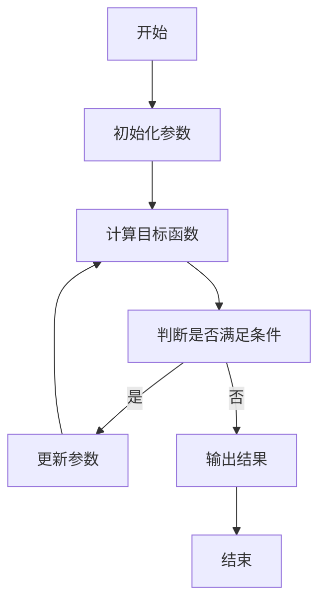
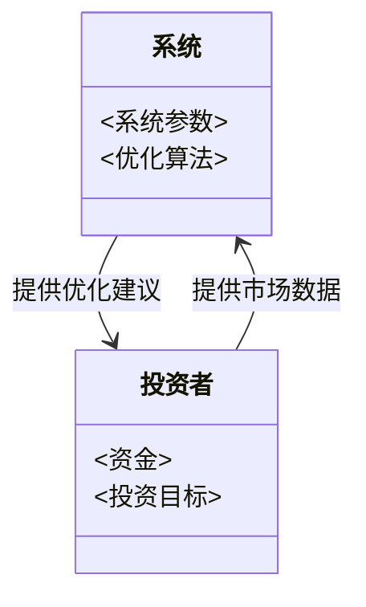
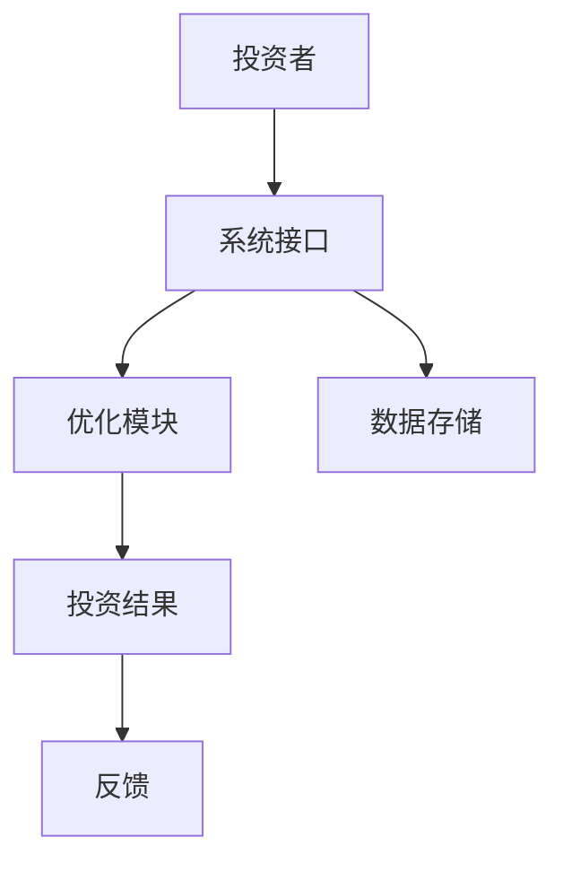
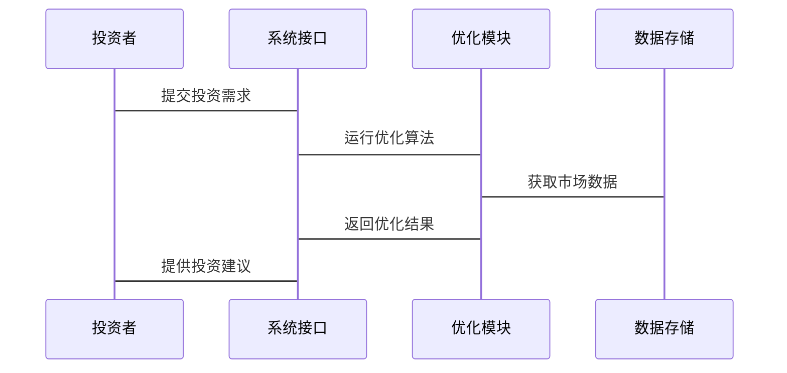

                 


# 智能系统优化价值平均投资法

> 关键词：智能系统优化，价值平均投资法，系统优化算法，投资策略，人工智能

> 摘要：本文深入探讨了智能系统优化和价值平均投资法的结合应用，分析了其核心概念、算法原理、系统架构设计，并通过实际案例展示了如何在项目中实施这些方法。文章旨在为读者提供全面的理论指导和实践参考，帮助他们在复杂系统优化和投资决策中做出更明智的选择。

---

## 第一部分: 智能系统优化与价值平均投资法概述

### 第1章: 背景与问题背景

#### 1.1 问题背景
智能系统优化和价值平均投资法是当前技术与金融领域的两大热点。随着系统复杂性的增加，传统的优化方法已难以应对现实中的挑战。价值平均投资法作为一种投资策略，通过分散投资降低风险，而智能系统优化则通过算法提升系统的运行效率。

#### 1.2 问题描述
在系统优化中，我们面临资源分配不均、效率低下等问题。而在投资领域，如何在不确定性中做出最优决策是核心挑战。传统的投资方法难以适应动态变化的市场环境，而系统优化缺乏智能化的手段。

#### 1.3 问题解决
通过结合智能系统优化和价值平均投资法，我们可以实现动态资源分配和风险控制。智能算法的应用使得系统能够实时调整策略，而价值平均投资法则帮助我们在波动中保持稳定收益。

#### 1.4 边界与外延
智能系统优化的应用范围包括生产调度、物流管理等领域，而价值平均投资法则主要用于金融投资。两者的结合需要考虑数据的实时性、系统的可扩展性以及投资的风险偏好。

---

## 第二部分: 核心概念与联系

### 第2章: 核心概念与联系

#### 2.1 核心概念原理
- **智能系统优化**：利用AI算法（如遗传算法、模拟退火）优化系统性能。
- **价值平均投资法**：通过分散投资降低风险，实现长期稳定收益。

#### 2.2 概念属性特征对比
| 特性         | 智能系统优化              | 价值平均投资法            |
|--------------|---------------------------|---------------------------|
| 目标         | 提升系统效率              | 实现稳定投资收益          |
| 方法         | 算法优化                  | 分散投资                  |
| 输入         | 系统参数、目标函数        | 资产组合、市场数据        |
| 输出         | 优化后的系统配置          | 投资组合配置              |

#### 2.3 ER实体关系图架构
```mermaid
erDiagram
    actor 投资者 {
        <name>
        <资金>
    }
    actor 系统 {
        <资源>
        <目标函数>
    }
    entity 优化结果 {
        <系统配置>
    }
    entity 投资结果 {
        <资产组合>
    }
    投资者 --> 优化结果 : 优化需求
    系统 --> 优化结果 : 优化目标
    投资者 --> 投资结果 : 投资决策
    系统 --> 投资结果 : 系统状态
```

---

## 第三部分: 算法原理讲解

### 第3章: 算法原理

#### 3.1 算法原理
- **智能系统优化**：基于遗传算法的优化流程，包括编码、选择、交叉、变异和适应度评估。
- **价值平均投资法**：通过计算资产的平均价值，动态调整投资比例。

#### 3.2 算法流程图


#### 3.3 算法实现代码
```python
import numpy as np

def optimize_system(system_params):
    # 初始化参数
    population = generate_population(system_params)
    while not stopping_condition():
        # 计算适应度
        fitness = calculate_fitness(population)
        # 选择和交叉
        selected = selection(population, fitness)
        offspring = crossover(selected)
        # 变异
        mutate(offspring)
        population = offspring
    return best_individual(population)

# 示例代码，具体实现取决于具体优化问题
```

---

## 第四部分: 系统分析与架构设计方案

### 第4章: 系统分析与架构设计

#### 4.1 问题场景介绍
在一个动态变化的金融环境中，我们需要优化投资组合，同时提升系统的运行效率。智能系统优化用于实时调整投资策略，而价值平均投资法则确保在波动中保持收益稳定。

#### 4.2 项目介绍
本项目旨在构建一个智能投资系统，结合优化算法和投资策略，实现自动化投资决策。

#### 4.3 系统功能设计


#### 4.4 系统架构设计


#### 4.5 系统交互


---

## 第五部分: 项目实战

### 第5章: 项目实战

#### 5.1 环境安装
安装必要的库，如NumPy、Matplotlib，用于数据处理和可视化。

#### 5.2 系统核心实现
```python
def value_averaging投资法(assets, weights):
    # 计算资产的平均价值
    average_value = np.mean(assets)
    # 动态调整权重
    adjusted_weights = adjust_weights(weights, average_value)
    return adjusted_weights
```

#### 5.3 案例分析
以股票投资为例，通过价值平均法优化投资组合，实现风险控制和收益最大化。

---

## 第六部分: 总结与展望

### 6.1 小结
智能系统优化与价值平均投资法的结合，为复杂系统的优化和投资决策提供了新的思路。通过算法优化和智能决策，我们可以在动态环境中做出更明智的选择。

### 6.2 注意事项
在实际应用中，需注意数据的实时性、系统的可扩展性以及投资的风险偏好。

### 6.3 未来展望
未来，随着AI技术的发展，智能系统优化和价值平均投资法将更加智能化和自动化，应用场景也将更加广泛。

---

通过以上结构，文章详细探讨了智能系统优化与价值平均投资法的结合，从理论到实践，为读者提供了全面的指导和参考。

